# ARCH-001 — Ferret Overall System Architecture

| Field | Value |
|---|---|
| **Document ID** | ARCH-001 |
| **Version** | 1.0 |
| **Status** | Draft |
| **Owner** | Ferret Project |
| **Author** | Ferret Core Team |
| **Review Status** | Pending Architecture Review |
| **Last Updated** | 2026-06-27 |
| **Supersedes** | `docs/002-Architecture/overview.md` (placeholder) |

---

## Purpose

This document defines the complete high-level architecture of the Ferret platform. It is the architectural contract for all future implementation. It defines the major structural building blocks, their responsibilities, the communication boundaries between them, the dependency rules that govern their relationships, and the principles that constrain all design decisions.

This document does not define class hierarchies, method signatures, or implementation details. Those belong in component-level design documents, ADRs, and source code.

---

## Scope

This document covers:

- The architectural goals and principles that govern all design decisions
- The system context and external interfaces
- The layered architecture and module structure
- Dependency rules and forbidden relationships
- All major architectural subsystems: plugins, workspace, knowledge, indexing, memory, specifications, reviews, configuration, storage, security, telemetry, MCP, and CLI
- Extensibility and scalability strategies
- Deployment models
- Architecture risks and pending ADR decisions

This document does not cover:

- Source code organisation within modules — see individual module architecture documents
- Implementation details of specific algorithms — see ADRs
- Operational deployment guides — see `docs/003-Workspace/`
- Plugin developer guidance — see `docs/007-SDK/`

---

## Input Documents

This document was designed in compliance with:

| Document | Reference |
|---|---|
| Vision | VISION-001, `docs/000-Overview/Vision.md` |
| Mission | MISSION-001, `docs/000-Overview/Mission.md` |
| Engineering Principles | PRINCIPLES-001, `docs/000-Overview/Principles.md` |
| Glossary | GLOSSARY-001, `docs/000-Overview/Glossary.md` |
| Product Requirements | PRD-001, `docs/001-Product/PRD-001.md` |

All architectural decisions in this document are consistent with those documents. Where a concept is fully defined there, this document references rather than duplicates.

---

## 1. Executive Summary

Ferret is a modular, layered, plugin-first platform. Its architecture is organised around a small, stable core that defines contracts and a set of engines that implement engineering workflows. All domain-specific capabilities — model providers, storage backends, file type parsers, review publishers — are delivered through plugins. The platform is deployment-topology agnostic: the same codebase serves individual developers, enterprise teams, CI pipelines, and offline environments.

The dominant structural pattern is **dependency inversion**: every engine depends on interfaces, not implementations. The plugin host binds implementations to interfaces at runtime. This makes every capability replaceable and every dependency testable without infrastructure.

The architecture is designed to remain understandable as the codebase grows. The dependency rules are strict and machine-verifiable. Every module has a single, clearly bounded responsibility. Complexity grows at the edges, in plugins; the core stays small.

The architecture supports the following user-facing operational models without architectural change: local CLI, MCP server integration with an AI host, CI/CD automation, enterprise on-premise deployment, and air-gapped offline operation.

---

## 2. Architectural Goals

These goals translate the product requirements in PRD-001 and the engineering principles in PRINCIPLES-001 into architectural concerns.

**AG-001 — Minimal Core.** The core module defines contracts and value objects only. No domain logic, no infrastructure. Every capability beyond the core is addable without modifying it.

**AG-002 — Dependency Inversion Throughout.** Engines depend on interfaces, not implementations. All external capabilities (AI models, storage, parsers) are injected. No engine hardcodes a dependency on a specific external system.

**AG-003 — Plugin Isolation.** A plugin failure must not corrupt the platform process. A malicious or poorly written plugin must not access capabilities it has not declared. Plugin loading and execution are isolated.

**AG-004 — Deterministic Behaviour.** For a given set of inputs and a given knowledge state, the platform produces identical outputs. Non-determinism is isolated to AI model invocations and is never embedded in platform logic.

**AG-005 — Incremental at Every Layer.** Index updates, context assembly, and memory loading are all designed to process changesets, not full state. Nothing should require full re-processing as the repository grows.

**AG-006 — Repository-Local State.** All platform state that is important to version-control is stored in the repository under `.ai/`. The platform has no required external state store.

**AG-007 — Topology Agnostic.** The architecture must support local CLI, server, cloud, offline, and enterprise deployment without branching the codebase.

**AG-008 — Stable Plugin Contracts.** Plugin interfaces are versioned and stable within a major version. A plugin built for version 1.0 must not require code changes to work with any 1.x release.

**AG-009 — Human Review Cannot Be Bypassed.** The review gate is structural. The Artifact Engine cannot commit an AI-generated artefact without a completed review record. This is enforced at the architecture level, not by convention.

**AG-010 — No Outbound Network by Default.** The platform makes no outbound network calls unless explicitly configured. Privacy and air-gap compatibility are architectural defaults, not configuration options.

---

## 3. Architecture Principles

These principles are the architectural expression of PRINCIPLES-001. Each translates an engineering principle into a structural constraint.

| Principle | Architectural Expression |
|---|---|
| **AI Agnostic** (PRINCIPLES-001 §1) | All AI model calls pass through `IModelProvider`. No engine references a specific model SDK. |
| **Specification Driven** (PRINCIPLES-001 §2) | The Specification Engine enforces the Draft→Approved gate before the `InDevelopment` transition. This is not configurable. |
| **Plugin First** (PRINCIPLES-001 §3) | Every domain-specific capability — parsers, model providers, storage backends, review publishers — is a plugin. Core has no concrete implementations. |
| **Repository Local Knowledge** (PRINCIPLES-001 §4) | The knowledge index lives in `.ai/index/` within the repository. No engine writes knowledge to an external service. |
| **Deterministic Behaviour** (PRINCIPLES-001 §5) | Context assembly is deterministic given identical inputs and knowledge state. All sources of non-determinism (AI model output) are isolated behind `IModelProvider`. |
| **Incremental Indexing** (PRINCIPLES-001 §6) | The Index Engine tracks content hashes. Index operations process only changed files. Full rebuild and incremental update produce identical index state. |
| **Traceability** (PRINCIPLES-001 §7) | The Artifact Engine attaches an interaction ID, model ID, user ID, knowledge state hash, and review disposition to every AI-generated committed artefact. |
| **Human Review** (PRINCIPLES-001 §8) | The Artifact Engine refuses to mark an artefact as committed unless a review record with human-approved dispositions exists. |
| **Documentation First** (PRINCIPLES-001 §9) | Module interfaces are documented in `docs/007-SDK/` before implementation begins. |
| **Testability** (PRINCIPLES-001 §10) | All engines are testable with in-process test doubles via `IModelProvider`, `IKnowledgeStore`, and `IParser`. No test requires a live AI model or external storage. |
| **Extensibility** (PRINCIPLES-001 §11) | Extension points are explicit contracts. A new capability requires only a new plugin, not a change to the core. |
| **Performance** (PRINCIPLES-001 §12) | Performance budgets from PRD-001 §11.1 are enforced as benchmark gates in CI. |
| **Security** (PRINCIPLES-001 §13) | Sensitive file exclusion is applied before any file content enters the index pipeline. Plugin permissions are enforced at the plugin host boundary, not trusted from within the plugin. |
| **Simplicity** (PRINCIPLES-001 §14) | Complexity belongs in plugins. Core APIs are narrow. A new contributor should be able to understand the core module in a single reading session. |
| **Observability** (PRINCIPLES-001 §15) | Every engine emits structured log events, trace spans, and metrics via the Telemetry module. No engine calls a logging framework directly. |
| **Module Ownership** | A type belongs to the module whose removal would make the type meaningless. A `WorkspaceNotFoundException` has no meaning without the Workspace module; it belongs there, not in Core. This rule applies to all future modules: Knowledge, Index, Memory, Plugin, CLI. Types that are cross-cutting (e.g. `ValidationException`, `CorrelationId`) belong in Core because they remain meaningful regardless of which domain module is removed. |

---

## 4. System Context

### 4.1 Purpose

This section defines the boundary of the Ferret platform and the external actors and systems that interact with it.

### 4.2 C1 — System Context Diagram

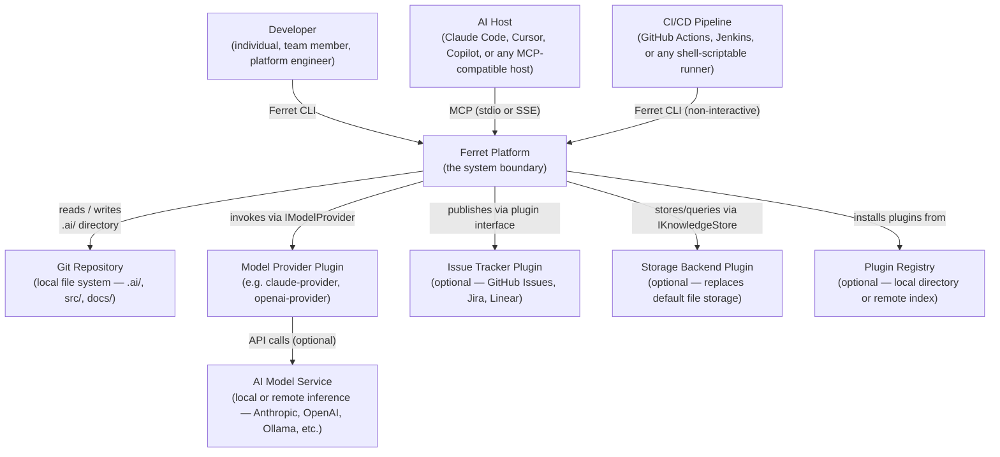

### 4.3 External Actors

| Actor | Interaction | Required |
|---|---|---|
| Developer | Invokes the CLI for all platform operations | Yes |
| AI Host | Queries the platform through the MCP server | No — AI features only |
| CI/CD Pipeline | Invokes the CLI non-interactively for index updates and review gates | No — automation only |

### 4.4 External Systems

| System | Interface | Required |
|---|---|---|
| Git Repository | Local file system read/write under `.ai/` | Yes |
| Model Provider Plugin | `IModelProvider` contract | No — AI features only |
| AI Model Service | Provider-specific (resolved by plugin) | No — AI features only |
| Issue Tracker Plugin | `IWorkItemPublisher` contract | No — optional integration |
| Storage Backend Plugin | `IKnowledgeStore` contract | No — file storage is default |
| Plugin Registry | HTTP or file-based index | No — local install is sufficient |

### 4.5 Design Rationale

The system boundary is defined to isolate the platform from all external services. The platform has no runtime dependency on any specific external system. All external interactions pass through declared interfaces that are satisfied by plugins. This achieves the Local First and AI Agnostic constraints from PRD-001 §19 without special modes or feature flags.

**Benefits:** Air-gap compatibility; complete testability without external infrastructure; ability to swap any external dependency by swapping a plugin.

**Trade-offs:** Plugin discovery and configuration adds a learning curve for new users compared to hardcoded integrations.

**Future Considerations:** A federated context model (multi-repository) would add a second kind of external system — a peer Ferret instance — which would need to be modelled at this level.

---

## 5. High-Level Architecture

### 5.1 Purpose

This section presents the platform's major structural divisions and their relationships.

### 5.2 Platform Architecture Diagram

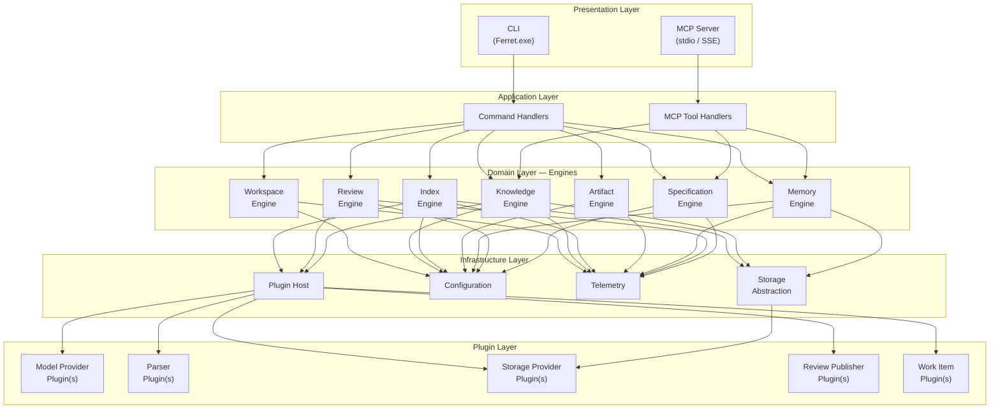

### 5.3 Structural Summary

The architecture has five layers. The dependency rule is strict: upper layers depend on lower layers; lower layers never depend on upper layers. Lateral dependencies within a layer are forbidden.

| Layer | Role | Contains |
|---|---|---|
| **Presentation** | Entry points; no business logic | CLI, MCP Server |
| **Application** | Command routing; no business logic | Command handlers, MCP tool handlers |
| **Domain** | Business logic; pure engineering policies | All engines |
| **Infrastructure** | Technical capabilities; no business logic | Plugin Host, Configuration, Telemetry, Storage Abstraction |
| **Plugin** | Capability implementations; injected at runtime | All plugin implementations |

### 5.4 Design Rationale

The layered structure enforces the separation between stable policy (Domain) and changeable detail (Infrastructure, Plugin). The Domain Layer knows nothing about how storage is implemented, which model is being used, or how telemetry is exported. This makes engines independently testable and makes the core logic portable across deployment topologies.

**Benefits:** Engines are testable in isolation; deployment topology changes require no Domain changes; plugin swaps require no Application or Domain changes.

**Trade-offs:** More indirection than a direct implementation; requires discipline to maintain layer boundaries.

**Future Considerations:** If a distributed execution model is added (e.g., remote index workers), it would live in a new Infrastructure layer component beneath the Storage Abstraction. No Domain changes would be required.

---

## 6. Architectural Layers

### 6.1 Purpose

This section defines each architectural layer in detail: its responsibility, what it contains, what it may and may not depend on.

### 6.2 Layer Definitions

#### Presentation Layer

**Responsibility:** Accept input from external actors and produce output in the appropriate format. Contains no business logic.

**Contains:** `Ferret.Cli` (command-line argument parsing, output formatting, exit code management); `Ferret.Mcp` (MCP protocol implementation, transport management, tool/resource dispatch).

**May depend on:** Application Layer.

**Must not depend on:** Domain Layer directly, Infrastructure Layer, Plugin Layer.

**Rationale:** Keeping presentation logic separate from application and domain logic allows multiple entry points (CLI, MCP, future API) to share the same application and domain logic without duplication.

---

#### Application Layer

**Responsibility:** Coordinate domain engines to fulfil a single user-facing operation. Contains orchestration logic but no domain policy. An application handler knows *what* to call but has no opinion on *how* the engines do their work.

**Contains:** Command handlers (one per CLI command group), MCP tool handlers (one per MCP tool). Each handler is a thin coordinator: validate input, invoke engines, aggregate results, return to the presentation layer.

**May depend on:** Domain Layer (engines), Infrastructure Layer (for cross-cutting concerns loaded from configuration).

**Must not depend on:** Presentation Layer.

**Rationale:** Separating orchestration from domain logic means that adding a new entry point (a REST API, a gRPC endpoint) requires only a new set of application handlers, not changes to domain engines.

---

#### Domain Layer

**Responsibility:** Implement the core business logic and policies of the Ferret platform. This is the most stable layer — it changes only when the product requirements change.

**Contains:** All engines (Workspace, Knowledge, Index, Artifact, Memory, Review, Specification). Domain events. Domain policies (e.g., the Approved-before-InDevelopment gate). Value objects (e.g., `SpecificationId`, `ContentHash`, `InteractionId`).

**May depend on:** Infrastructure Layer interfaces only (via dependency injection). Must not depend on any concrete infrastructure implementation.

**Must not depend on:** Application Layer, Presentation Layer, any specific plugin implementation.

**Rationale:** Domain logic is the core intellectual capital of the platform. Keeping it free of infrastructure concerns makes it portable, testable, and durable.

---

#### Infrastructure Layer

**Responsibility:** Provide technical capabilities that the Domain Layer needs. Implements no business logic. Translates between domain contracts and their technical fulfilment.

**Contains:** Plugin Host (manages plugin lifecycle and permission enforcement); Configuration (loads, merges, validates workspace and engine configuration); Telemetry (structured logging, tracing, metrics emission); Storage Abstraction (routes domain read/write operations to the active `IKnowledgeStore` implementation).

**May depend on:** Plugin Layer (to bind plugin implementations to interfaces).

**Must not depend on:** Application Layer, Presentation Layer.

**Rationale:** Infrastructure concerns change for operational reasons (different storage backends, different telemetry exporters) that have nothing to do with domain logic. Separating them allows operational evolution without touching the Domain Layer.

---

#### Plugin Layer

**Responsibility:** Provide concrete implementations of interfaces declared in `Ferret.Core`. Extend the platform with capabilities it could not provide without knowledge of a specific external system.

**Contains:** All plugin implementations: model providers, file type parsers, storage providers, review publishers, work item integrations, custom telemetry exporters. The Plugin SDK (`Ferret.Sdk`) used by plugin authors.

**May depend on:** `Ferret.Core` interfaces (through `Ferret.Sdk`), external SDKs and libraries.

**Must not depend on:** Any other platform module. A plugin that imports `Ferret.Runtime` or `Ferret.Cli` has violated its boundary.

**Rationale:** Plugins are the extension points. Restricting them to `Ferret.Core` interfaces ensures they remain substitutable and do not create coupling into platform internals.

---

## 7. Core Modules

### 7.1 Purpose

This section defines the responsibility of each module in the platform. It does not define class hierarchies or method signatures. Each module corresponds to a deployable .NET project.

---

### Module: Ferret.Core

**Purpose:** Define all interfaces, value objects, domain events, and shared contracts used across the platform. Contains no business logic and no infrastructure concerns.

**Responsibilities:**
- Define engine interfaces (`IWorkspaceEngine`, `IKnowledgeEngine`, `IIndexEngine`, etc.)
- Define plugin extension point interfaces (`IModelProvider`, `IParser`, `IKnowledgeStore`, `IReviewPublisher`, `IWorkItemPublisher`)
- Define domain value objects (`ContentHash`, `SpecificationId`, `InteractionId`, `WorkspaceConfig`, `KnowledgeEntry`)
- Define domain events (`SpecificationApproved`, `ReviewFindingAccepted`, `IndexUpdated`)
- Define the plugin manifest schema

**Inputs:** None — this is a foundation module.

**Outputs:** Interfaces and types used by all other modules.

**Dependencies:** None. `Ferret.Core` has zero project references. This is a hard constraint.

**Extension Points:** All interface definitions are extension points by definition. Adding a new extension point requires adding a new interface to `Ferret.Core`.

---

### Module: Ferret.Runtime

**Purpose:** Implement the domain engines that constitute the platform's business logic.

**Responsibilities:** Host all seven domain engines (described in §7 below). Enforce domain policies (e.g., review gate, specification approval gate). Raise and handle domain events. Coordinate between engines for compound operations.

**Inputs:** Configuration objects (from `Ferret.Configuration`), plugin implementations (injected by `Ferret.Plugins`), storage access (via `IKnowledgeStore`).

**Outputs:** Engine results returned to the Application Layer. Domain events broadcast to registered subscribers.

**Dependencies:** `Ferret.Core`. No concrete infrastructure dependencies.

**Extension Points:** Domain event subscribers; engine middleware (pre/post hooks on engine operations, for plugins that observe but do not replace engine behaviour).

---

### Module: Ferret.Plugins

**Purpose:** Manage the plugin lifecycle and enforce the plugin permission model.

**Responsibilities:** Discover plugins from configured sources; validate manifests; load plugins using isolated load contexts; bind plugin implementations to `Ferret.Core` interfaces; enforce permission checks at every cross-boundary call; deactivate failed plugins without terminating the platform.

**Inputs:** Plugin discovery paths (from workspace configuration), plugin manifests, plugin assemblies.

**Outputs:** Bound interface implementations injected into the Infrastructure Layer's dependency container.

**Dependencies:** `Ferret.Core`. Uses .NET `AssemblyLoadContext` for isolation.

**Extension Points:** Discovery providers (where to find plugins — local path, remote registry, embedded); activation lifecycle hooks.

---

### Module: Ferret.Configuration

**Purpose:** Load, merge, and validate all platform configuration.

**Responsibilities:** Read configuration from all sources in priority order; merge into a single validated configuration object; resolve environment variable substitutions; validate against the configuration JSON Schema; provide typed configuration objects to engines and the Plugin Host.

**Inputs:** Default configuration (compiled in); user-level configuration (`~/.Ferret/config.json`); workspace configuration (`.ai/workspace.json`); environment variables (`Ferret_*`); CLI flags.

**Outputs:** Typed, validated configuration objects consumed by all other modules.

**Dependencies:** `Ferret.Core`.

**Extension Points:** Custom configuration sources (e.g., a secret manager plugin that resolves secret references at startup).

---

### Module: Ferret.Telemetry

**Purpose:** Provide all structured observability capabilities: logging, distributed tracing, and metrics.

**Responsibilities:** Expose logging, tracing, and metrics interfaces used by all engines; configure exporters (console, file, OpenTelemetry endpoint) based on workspace configuration; enforce that all operations produce a trace span; collect and forward metrics.

**Inputs:** Engine log events, trace spans, metric values; telemetry export configuration.

**Outputs:** Structured log output, trace data, metrics — exported to configured backends.

**Dependencies:** `Ferret.Core`. Uses `Microsoft.Extensions.Logging`, `System.Diagnostics.Activity`, `System.Diagnostics.Metrics`. OpenTelemetry export is an optional plugin.

**Extension Points:** Telemetry exporter plugins (log sink, trace exporter, metrics exporter).

---

### Module: Ferret.Mcp

**Purpose:** Implement the Model Context Protocol, exposing platform capabilities to AI hosts and consuming capabilities from external MCP servers.

**Responsibilities:** Implement the MCP server role — serve tool calls, respond to resource requests, serve prompt templates; implement the MCP client role — connect to configured external MCP servers and proxy their tools to the agent runtime; manage transport lifecycle (stdio and HTTP/SSE); translate MCP requests into Application Layer handler calls.

**Inputs:** MCP messages from connected clients; MCP configuration (transport, port, authentication).

**Outputs:** MCP responses to clients; proxied tool calls to the agent runtime.

**Dependencies:** `Ferret.Core`, `Ferret.Runtime` (for handler implementations).

**Extension Points:** Custom MCP transports (via plugin); custom MCP authentication strategies.

---

### Module: Ferret.Cli

**Purpose:** Provide the developer-facing command-line interface.

**Responsibilities:** Parse command-line arguments; route to the appropriate Application Layer handler; format output in the requested format (table, JSON, plain); set exit codes; support shell completion; enforce non-interactive operation for CI compatibility.

**Inputs:** Command-line arguments; configuration (passed to handlers); standard input (for piped operations only).

**Outputs:** Standard output (formatted results); standard error (error messages, diagnostics); exit code.

**Dependencies:** `Ferret.Core`, `Ferret.Runtime`.

**Extension Points:** None — the CLI is the outermost shell and is not extended. Additional commands are delivered by updating the module itself, not by plugins.

---

### 7.2 Engine Modules (within Ferret.Runtime)

The following engines are hosted within `Ferret.Runtime`. They are not separate .NET projects but are distinct, bounded sub-modules with their own contracts within the Runtime module.

---

#### Workspace Engine

**Purpose:** Manage the lifecycle and health of the Ferret workspace.

**Responsibilities:** Initialise the `.ai/` directory structure; load and validate workspace configuration; detect repository changes since the last index run; report workspace health (index currency, plugin status, configuration validity); manage workspace version upgrades when the platform version changes.

**Inputs:** Repository root path; workspace configuration; file system change detection data.

**Outputs:** Workspace status report; validated configuration; change detection results.

**Dependencies:** `IKnowledgeStore` (to read index manifest); `IWorkspaceConfiguration`.

**Extension Points:** Workspace health checkers (plugins that contribute custom health checks to `workspace status`).

---

#### Knowledge Engine

**Purpose:** Provide the query interface over the knowledge index and assemble context for AI interactions.

**Responsibilities:** Execute natural-language and structured queries against the knowledge index; assemble context from multiple sources (symbols, specifications, ADRs, session memory) within a token budget; score and rank knowledge entries by relevance; report knowledge state hash; enforce sensitive-file exclusion on all query results.

**Inputs:** Query parameters (text query, scope, filters, token budget); knowledge state from `IKnowledgeStore`.

**Outputs:** Structured query results; assembled context objects; knowledge state hash.

**Dependencies:** `IKnowledgeStore`; `IMemoryEngine` (for session context contribution to context assembly).

**Extension Points:** Relevance scorers (plugins that customise how knowledge entries are ranked for a given query type); context formatters (plugins that produce domain-specific context representations).

---

#### Index Engine

**Purpose:** Build and maintain the knowledge index by processing repository files.

**Responsibilities:** Scan the repository for changed files (using content hashes); dispatch files to registered parser plugins; aggregate parser output; write results atomically to the knowledge store; maintain the index manifest (file-to-hash mapping); enforce atomicity so that an interrupted build leaves the index in its previous valid state; produce coverage reports.

**Inputs:** Repository file system; parser plugin implementations; index manifest (current state).

**Outputs:** Updated knowledge store; updated index manifest; index coverage report.

**Dependencies:** `IKnowledgeStore`; `IParser` (plugin-provided); `IIndexManifest`.

**Extension Points:** Parser plugins (`IParser`) — the primary extension point; index validators (plugins that verify index consistency after a build).

---

#### Artifact Engine

**Purpose:** Manage AI-generated artefacts: assign provenance metadata and enforce the human-review gate.

**Responsibilities:** Assign a unique interaction ID to every AI-assisted operation; record the model identifier, user identifier, knowledge state hash, and timestamp as artefact metadata; refuse to mark an artefact as committed without a complete review record; provide traceability queries linking artefacts to their interactions.

**Inputs:** AI interaction requests (from the Review Engine or Specification Engine); completed review records (from the Review Engine); artefact content.

**Outputs:** Artefacts with attached provenance metadata; traceability query results.

**Dependencies:** `IReviewEngine`; `IKnowledgeStore` (for metadata persistence).

**Extension Points:** Artefact publishers (plugins that post artefact metadata to external audit systems).

---

#### Memory Engine

**Purpose:** Persist and retrieve session state and repository-level memory across interactions.

**Responsibilities:** Write and read the session record (`.ai/session.md`); store decision records linked to repository artefacts; produce session summaries within a token budget; maintain working sets (named collections of files and symbols); provide memory entries to the Context Planner within the Knowledge Engine for context assembly.

**Inputs:** Session activity (active work items, decisions, modified files); retrieval queries (for context assembly).

**Outputs:** Session records; session summaries; memory entries for context assembly.

**Dependencies:** `IKnowledgeStore`; `IWorkspaceEngine` (for repository-path resolution).

**Extension Points:** Memory backends (plugins that store session memory in a format other than the default Markdown file); memory summarisers (plugins that produce custom summary formats).

---

#### Specification Engine

**Purpose:** Manage the lifecycle of specification documents and enforce the specification-first workflow.

**Responsibilities:** Create specification documents from the canonical template; validate specification completeness before review submission; manage lifecycle transitions (Draft → Review → Approved → InDevelopment → Done); enforce the Approved-before-InDevelopment gate; link specifications to external work item IDs; index approved specifications in the knowledge store.

**Inputs:** Specification content; lifecycle transition requests; work item links.

**Outputs:** Specification documents; validated lifecycle state transitions; specification knowledge entries.

**Dependencies:** `IKnowledgeStore`; `IArtifactEngine` (to record specification artefact provenance); `IWorkItemPublisher` (optional plugin, for external issue tracker links).

**Extension Points:** Specification validators (plugins that add custom validation rules on submission); lifecycle hooks (plugins that react to lifecycle transitions, e.g., notify a work item tracker on approval).

---

#### Review Engine

**Purpose:** Manage the lifecycle of review documents and AI-assisted review generation.

**Responsibilities:** Create review documents from type-appropriate templates; invoke the model provider to generate review findings for a given context; present AI-generated findings for human evaluation; track finding lifecycle (Proposed, Accepted, Resolved, Rejected, Deferred); enforce that all Critical and High findings are resolved before approval; record the human reviewer's identity and timestamp on every finding disposition.

**Inputs:** Review context (diff, specification, ADR, or source scope); model provider invocations; reviewer actions (accept, reject, defer findings).

**Outputs:** Review documents with findings and dispositions; completed review records passed to the Artifact Engine.

**Dependencies:** `IModelProvider` (plugin-provided); `IKnowledgeEngine` (for context assembly); `IArtifactEngine`; `IReviewPublisher` (optional plugin).

**Extension Points:** Review context builders (plugins that add custom context types, e.g., pull request metadata); review publishers (`IReviewPublisher`, for posting findings to external systems).

---

### 7.3 Engine Capability Matrix

This matrix provides a consolidated view of each engine's storage interactions and event participation. It is the authoritative reference for inter-engine coupling analysis. Per-engine ARCH documents expand on each row.

| Engine | Reads | Writes | Publishes Events | Consumes Events |
|---|---|---|---|---|
| **Workspace** | `.ai/workspace.json`, `.ai/state.json`, index manifest | `.ai/workspace.json`, `.ai/state.json` | `WorkspaceInitialized`, `WorkspaceUpgraded` | `PluginLoaded`, `PluginFailed` |
| **Knowledge** | Knowledge index (nodes, edges), session memory | — (read-only query engine) | `ContextAssembled` | `IndexUpdated`, `MemoryUpdated` |
| **Index** | Repository file system, index manifest | Knowledge index (staging → active), index manifest | `IndexUpdated`, `IndexBuildCompleted` | `WorkspaceInitialized` |
| **Artifact** | Artefact metadata, review records | Artefact provenance metadata, audit log | `ArtifactCommitted` | `ReviewCompleted` |
| **Memory** | `.ai/session.md`, `.ai/memory/` | `.ai/session.md`, `.ai/memory/` | `MemoryUpdated` | `WorkspaceInitialized` |
| **Specification** | Knowledge index (specification nodes), work item tracker (via plugin) | Knowledge index (specification nodes), specification documents | `SpecificationApproved`, `SpecificationTransitioned` | — |
| **Review** | Knowledge index (context), specification nodes, review documents | Review documents, finding records | `ReviewCompleted`, `FindingDispositioned` | `ContextAssembled` |

**Reading the matrix:**
- **Reads** — storage areas or external systems the engine queries during normal operation.
- **Writes** — storage areas the engine mutates. An engine should only write to areas it owns.
- **Publishes** — domain events this engine raises when its state changes. See ARCH-013 for full event schemas.
- **Consumes** — domain events this engine subscribes to. An engine reacts to these without calling the source engine directly.

**Design rule:** An engine that appears only in "Publishes" for a given storage area owns that area. No other engine writes to that area directly. Violations of ownership boundaries are forbidden dependencies (see §8.3).

---

## 8. Dependency Rules

### 8.1 Purpose

Dependency rules define which modules may reference which other modules. Violations are detectable by static analysis and must be treated as build failures.

### 8.2 Allowed Dependencies

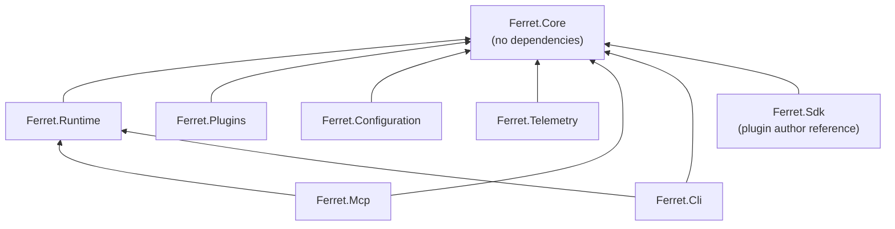

### 8.3 Forbidden Dependencies

The following relationships are forbidden and must never be introduced:

| Forbidden Dependency | Reason |
|---|---|
| `Ferret.Core` → any other platform module | Core is the foundation; it has no dependents in the platform |
| `Ferret.Runtime` → `Ferret.Cli` | Domain logic is independent of presentation |
| `Ferret.Runtime` → `Ferret.Mcp` | Domain logic is independent of transport protocol |
| `Ferret.Runtime` → `Ferret.Plugins` | Runtime depends on interfaces, not the host that manages implementations |
| Any module → a plugin implementation assembly | Plugins are injected; no module hardcodes a plugin dependency |
| Any plugin → `Ferret.Runtime`, `Ferret.Cli`, `Ferret.Mcp` | Plugins depend only on `Ferret.Core` via `Ferret.Sdk` |
| Any horizontal dependency between engines | Engines communicate through domain events, not direct references |

### 8.4 Engine-to-Engine Communication

Engines within `Ferret.Runtime` must not call each other directly through their concrete implementations. If Engine A needs a result from Engine B, it:

1. Subscribes to domain events raised by Engine B, or
2. Uses Engine B's declared interface (injected, not referenced by concrete type).

This preserves testability — each engine can be tested with a test double for its dependencies.

### 8.5 Design Rationale

Strict, machine-verifiable dependency rules prevent the architecture from degrading into an unstructured ball of mud over time. The rules are enforced by a dependency validation tool run in CI. A violation fails the build.

**Benefits:** Architecture remains coherent as the codebase grows; each module can be understood in isolation; replacement of any component is always possible.

**Trade-offs:** Engineers must occasionally write a domain event or interface instead of a direct call; slightly more ceremony for simple interactions.

**Future Considerations:** If the platform later needs to run engines in separate processes (for distributed execution), the current separation of concerns makes this feasible without re-architecting the domain layer.

### 8.6 Architecture Fitness Functions

Fitness functions are automated checks that verify the architecture's structural health as the codebase grows. Each function maps to a CI gate that fails the build on violation. They are the machine-enforced complement to the textual rules in §8.3.

| Fitness Function | Tool | Trigger | What It Checks |
|---|---|---|---|
| No circular project references | `dotnet build` (MSBuild) | Every PR | No project reference creates a dependency cycle |
| Core has zero dependencies | `dotnet list reference` + script | Every PR | `Ferret.Core.csproj` has zero `<ProjectReference>` elements |
| Plugins reference only Core | Custom Roslyn analyser | Every PR | Plugin assemblies import only `Ferret.Core` or `Ferret.Sdk`; no reference to `Ferret.Runtime`, `Ferret.Cli`, `Ferret.Mcp`, or `Ferret.Plugins` |
| No Runtime → CLI reference | `dotnet list reference` + script | Every PR | `Ferret.Runtime.csproj` has no `<ProjectReference>` to `Ferret.Cli` or `Ferret.Mcp` |
| No lateral engine dependencies | Custom Roslyn analyser | Every PR | No type in one engine namespace directly instantiates a type in another engine namespace |
| No direct plugin type references | Custom Roslyn analyser | Every PR | No platform module imports an assembly that is loaded as a plugin at runtime |

**Enforcement approach:** The first two rules are enforced by the standard .NET build system. The remaining rules require a lightweight Roslyn analyser or a build script that inspects the compiled output. The analyser is delivered as part of the `Ferret.Build` project (planned for Sprint 1). Until the analyser exists, these rules are enforced by code review.

**Adding a new fitness function:** When a new dependency rule is added to §8.3, a corresponding fitness function must be added to this table and the Roslyn analyser updated before the rule is considered enforced.

---

## 9. Architectural Constraints

### 9.1 Purpose

These constraints are non-negotiable. A proposed design that violates any constraint requires an ADR to revisit the constraint, not to bypass it.

### 9.2 Constraints

**AC-001 — Vendor Neutrality.** No module in `Ferret.Core` or `Ferret.Runtime` references any vendor-specific SDK (Anthropic, OpenAI, Azure, AWS, Google). All vendor-specific code lives in plugins.

**AC-002 — AI Agnostic.** The platform functions without any AI model. AI capabilities are additive and depend on a model provider plugin being configured. Core and Runtime modules compile and test cleanly without any model provider.

**AC-003 — Specification Driven.** The Specification Engine enforces the Draft → Approved transition gate. No implementation path in the codebase bypasses this gate. There is no `--skip-approval` flag or override mechanism.

**AC-004 — Plugin First.** No domain-specific capability is hardcoded in Core or Runtime. A new capability that cannot be expressed as a plugin requires an architecture review and an ADR before implementation.

**AC-005 — Local First.** The platform runs with full feature parity (excluding AI-model-dependent features) with no network access. No platform module connects to the network unless a plugin explicitly does so.

**AC-006 — Cross Platform.** All platform modules target `net9.0` and use only platform-portable APIs. File system operations use `Path.Combine` and forward slashes are not assumed. No module uses P/Invoke for non-portable OS APIs.

**AC-007 — Repository First.** Knowledge about a repository is stored in that repository's `.ai/` directory. No engine writes knowledge to an external service. Read-only queries against external systems are permitted through plugins.

**AC-008 — Deterministic Behaviour.** Given identical inputs and a fixed knowledge state, every engine produces identical outputs. Non-determinism is isolated to `IModelProvider`. No engine uses `DateTime.Now` or `Random` in its domain logic.

**AC-009 — Human Review Required.** The Artifact Engine will not mark an AI-generated artefact as committed without a review record containing human-approved dispositions. This is enforced in the engine logic and not configurable.

**AC-010 — Open Standards.** Where a standard exists for a capability used by the platform, the platform uses the standard. MCP for model context, OpenTelemetry for observability, JSON Schema for configuration and plugin manifests, SemVer 2.0.0 for versioning.

**AC-011 — Open Formats.** The knowledge index format, the plugin manifest format, and the workspace configuration format are documented, versioned, and readable without the platform runtime.

**AC-012 — Minimal Core.** The surface area of `Ferret.Core` is the API that all plugins and all future platform modules depend on. Every addition to Core is a long-term commitment. Additions require explicit justification; removals require a major version.

**AC-013 — Stable Plugin Contracts.** Plugin interfaces in `Ferret.Core` are versioned. Once a plugin interface reaches stable status, it is not changed in a backwards-incompatible way within a major version.

**AC-014 — Backwards Compatibility.** Public CLI commands, MCP tool schemas, plugin interfaces, and the knowledge index format are not changed in backwards-incompatible ways within a major version.

---

## 10. Cross-Cutting Concerns

### 10.1 Purpose

Cross-cutting concerns are capabilities that apply to all modules without belonging to any single module. They are provided by the Infrastructure Layer and consumed through interfaces.

### 10.2 Concerns and Provision

| Concern | Provided By | Consumed Via |
|---|---|---|
| Structured Logging | `Ferret.Telemetry` | `ILogger<T>` (injected) |
| Distributed Tracing | `Ferret.Telemetry` | `System.Diagnostics.ActivitySource` |
| Metrics | `Ferret.Telemetry` | `System.Diagnostics.Meter` |
| Configuration | `Ferret.Configuration` | Typed configuration objects (injected) |
| Exception Handling | Application Layer | Global handler per entry point |
| Sensitive File Exclusion | Index Engine + Knowledge Engine | Applied automatically; not opt-in |
| Audit Logging | Artifact Engine | Automatic on all mutating operations |
| Plugin Permission Checks | Plugin Host | Transparent to engines; enforced at host boundary |

### 10.3 Dependency Injection

All cross-cutting concerns are resolved through the platform's dependency injection container. Engines receive their dependencies through constructor injection. The container is configured in the composition root, which resides in the Presentation Layer.

Each deployment topology (CLI, MCP server, test harness) has its own composition root. This allows test harnesses to substitute test doubles without framework-level test annotations.

### 10.4 Design Rationale

Centralising cross-cutting concerns through interfaces prevents duplication and ensures consistent behaviour. An engine that needs to log does not choose a logging framework — it receives an `ILogger` and uses it. This makes the concern consistent and the engine portable.

**Benefits:** Consistent behaviour across all modules; full replaceability of any cross-cutting concern; no test requires a live infrastructure component.

**Trade-offs:** DI configuration is centralised in composition roots that must be maintained as the module set evolves.

**Future Considerations:** If the platform adds remote execution (distributed index workers), cross-cutting concerns such as distributed tracing and exception propagation will require extensions to the current model.

---

## 11. Plugin Architecture

### 11.1 Purpose

The plugin architecture defines how the platform is extended with domain-specific capabilities without modifying its core. All extension points are explicit, versioned, and enforced at the Plugin Host boundary.

### 11.2 Plugin Lifecycle

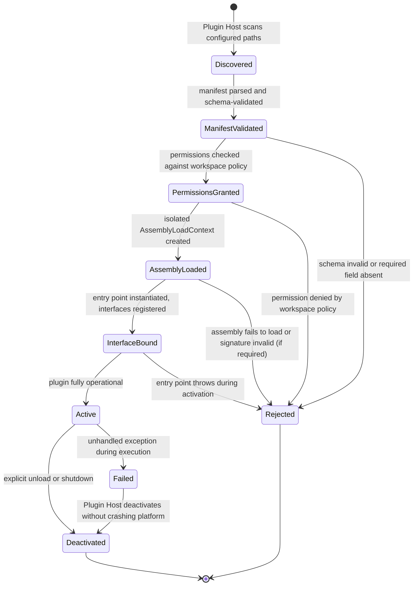

### 11.3 Plugin Discovery

The Plugin Host discovers plugins from configured sources in priority order:

1. **Embedded plugins** — bundled with the platform package (e.g., file-based storage, Markdown parser)
2. **Workspace-local plugins** — declared in `.ai/workspace.json` with a local path
3. **User-level plugins** — declared in `~/.Ferret/plugins.json` (applies to all workspaces for a user)
4. **Registry plugins** — resolved from a configured plugin registry by identifier and version

Discovery sources are resolved at startup. The resolved plugin set is stable for the lifetime of the process.

### 11.4 Plugin Isolation

Each plugin is loaded into its own `AssemblyLoadContext`. This achieves:

- **Dependency isolation:** Plugin A and Plugin B may depend on different versions of the same library without conflict.
- **Failure isolation:** An unhandled exception in a plugin execution is caught by the Plugin Host before it propagates to the platform runtime.
- **Unloading:** A plugin can be deactivated and its `AssemblyLoadContext` unloaded without restarting the process.

Direct memory access between plugins is not permitted. All inter-plugin and plugin-to-engine communication passes through `Ferret.Core` interfaces.

### 11.5 Plugin Permissions

Every plugin declares a set of permissions in its manifest. The permission model is capability-based:

| Permission Namespace | Description |
|---|---|
| `knowledge:read` | Query the knowledge index |
| `knowledge:write` | Write to the knowledge index |
| `index:read` | Read index metadata |
| `index:write` | Trigger index operations |
| `memory:read` | Read session and repository memory |
| `memory:write` | Write session and repository memory |
| `artifact:read` | Query artefact metadata |
| `artifact:write` | Record artefact provenance |
| `review:read` | Read review documents and findings |
| `review:write` | Create or update review findings |
| `spec:read` | Read specification documents |
| `spec:write` | Create or transition specifications |
| `plugin:install` | Install other plugins (restricted) |
| `network:outbound` | Make outbound network requests |
| `filesystem:read` | Read files outside `.ai/` |
| `filesystem:write` | Write files outside `.ai/` |

Permissions are enforced at the Plugin Host boundary on every call. A plugin that requests a capability it has not declared receives a `PermissionDeniedException`. Permission checks are not performed inside the plugin.

### 11.6 Plugin Manifest

Every plugin carries a `plugin.json` manifest. The schema is:

```
{
  "id": "<vendor>.<product>.<name>",          // reverse-domain identifier
  "version": "<semver>",                       // plugin version
  "compatibility": { "min": "1.0", "max": "1.*" },  // platform version range
  "entryPoint": "<assembly-qualified-type>",   // activation entry point
  "permissions": [ "<permission-id>", ... ],   // declared permissions
  "interfaces": [ "<interface-qualified-name>", ... ],  // interfaces implemented
  "dependencies": [ { "id": "...", "version": "..." } ] // other required plugins
}
```

The schema for `plugin.json` is published in `docs/007-SDK/` and is versioned independently from the platform.

### 11.7 Plugin SDK

The `Ferret.Sdk` NuGet package is the only platform package plugin authors reference. It contains:

- All extension-point interfaces from `Ferret.Core`
- The `PluginManifest` schema and deserialisation support
- Base classes for common plugin patterns (optional, to reduce boilerplate)
- Test double implementations for all interfaces (for plugin unit testing)

The Plugin SDK version follows the platform's major version. A plugin referencing `Ferret.Sdk 1.x` is compatible with any platform release in the `1.x` series.

### 11.8 Plugin Registry

The plugin registry is an index of available plugins with their manifests and download locations. The default registry is a static JSON file distributed with the platform documentation. A production registry is a versioned HTTP endpoint returning a registry manifest.

The platform supports local-only operation without a registry. A plugin installed from a local path requires no registry access.

### 11.9 Design Rationale

The plugin model is the mechanism by which the core can remain small and stable while the platform grows in capability. Every new model provider, storage backend, or language integration is addable without touching the core.

**Benefits:** Community contributions do not require core access; core stability is protected; plugin failures are isolated.

**Trade-offs:** Plugin loading adds startup overhead; capability discovery is more complex than a built-in feature.

**Future Considerations:** Plugin signing verification (NFR-SE, deferred to 1.x) will require the manifest to carry a signature and the Plugin Host to verify it.

---

## 12. Workspace Architecture

### 12.1 Purpose

The workspace is the root of all platform operations. The Workspace Engine manages the `.ai/` directory, validates configuration, detects repository state, and handles platform version upgrades.

### 12.2 Workspace Lifecycle

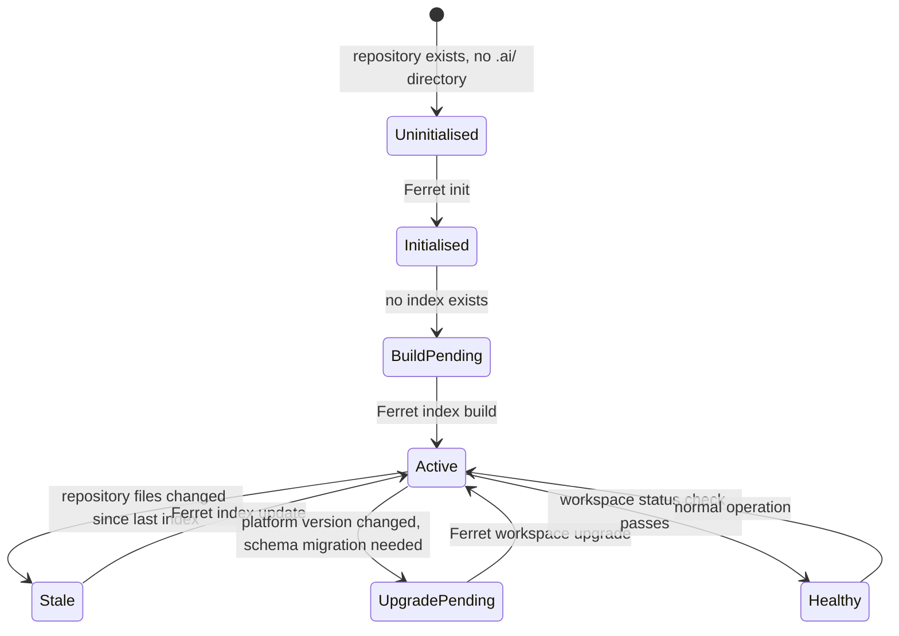

### 12.3 Workspace Metadata

The workspace is described by `.ai/workspace.json`. This file is the authoritative configuration for the workspace. It is version-controlled and defines:

- Workspace identity and version
- Plugin declarations (source and version)
- Indexing configuration (include/exclude paths, parser overrides)
- Context configuration (token budget defaults, context profile definitions)
- Security configuration (sensitive file patterns, access control policy)
- Telemetry configuration (log level, trace export endpoint, metrics endpoint)
- External integrations (work item tracker, plugin registry)

### 12.4 Workspace Versioning and Upgrade

The workspace configuration schema carries a `schemaVersion` field. When the platform loads a workspace whose `schemaVersion` is lower than the platform's current schema version, the Workspace Engine:

1. Validates that the current schema version is reachable from the workspace's schema version through the declared migration path
2. Performs the migration steps in sequence
3. Writes the upgraded `workspace.json`
4. Logs the migration steps taken

If migration fails, the workspace is left unchanged and the error is reported with the migration step that failed.

### 12.5 Health Checking

`workspace status` reports:

- Index currency (last update timestamp, files changed since last update)
- Plugin status (active, inactive, failed)
- Configuration validity (no errors, no unknown fields)
- Any pending upgrades

The health check output is available in machine-readable JSON for CI/CD integration.

### 12.6 Design Rationale

Centralising workspace management in the Workspace Engine means that all other engines receive a pre-validated, consistent view of the workspace. No engine needs to validate the workspace configuration it receives.

**Benefits:** Single point of workspace validation; consistent upgrade experience; health reporting available from a single command.

**Trade-offs:** Workspace Engine is a dependency of all other engines; its interface must be carefully designed to avoid coupling.

**Future Considerations:** Multi-workspace management (a single `Ferret` invocation managing multiple repositories) would require the Workspace Engine to support a workspace graph rather than a single active workspace.

---

## 13. Knowledge Architecture

### 13.1 Purpose

The Knowledge Architecture defines how the platform stores, organises, and queries its understanding of the repository. The knowledge graph is the platform's primary intellectual contribution — it is what distinguishes Ferret from a simple file search tool.

### 13.2 Knowledge Graph Model

The knowledge index is a directed property graph:

```
Nodes:
  SourceSymbol  (type, name, location, documentation, content hash)
  Document      (type, path, title, status, metadata)
  Specification (id, version, status, acceptance criteria)
  ADR           (id, status, decision, context)
  Interaction   (id, model, user, timestamp, knowledge state hash)
  MemoryEntry   (type, content, linked artefact)

Edges:
  REFERENCES    (SourceSymbol → SourceSymbol)
  IMPLEMENTS    (SourceSymbol → Specification acceptance criterion)
  EXTENDS       (SourceSymbol → SourceSymbol)
  COVERED_BY    (Specification → SourceSymbol)
  INFORMED_BY   (Specification → ADR)
  REVIEWED_IN   (Document → Review)
  SUPERSEDES    (ADR → ADR)
  PRODUCED_BY   (SourceSymbol → Interaction)
  RECALLS       (MemoryEntry → SourceSymbol)
```

### 13.3 Context Assembly

Context assembly is the process of selecting and packing knowledge entries into a token-bounded context for an AI interaction.

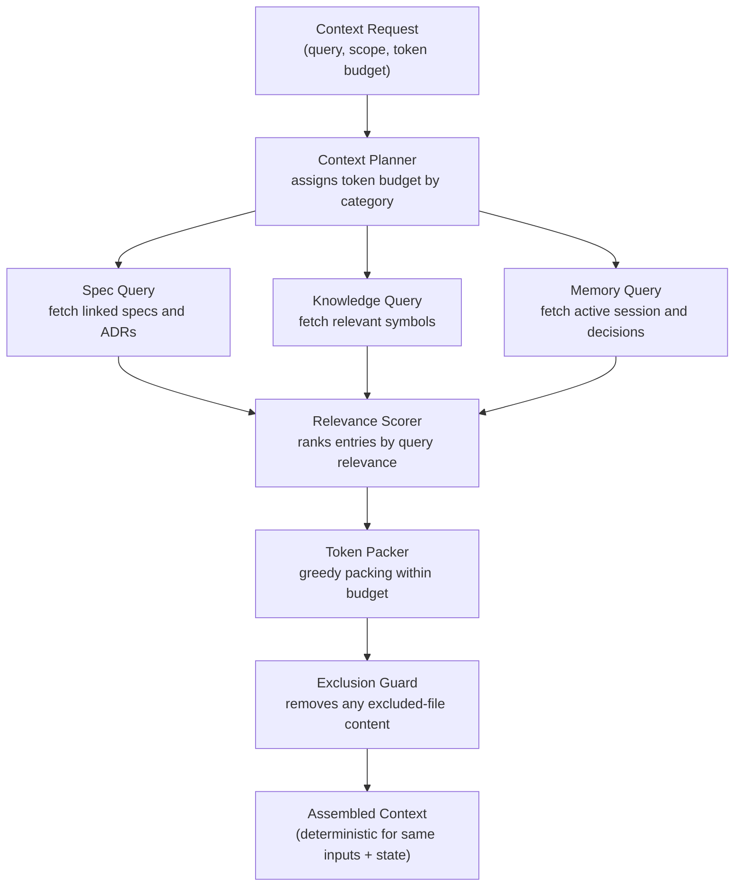

The Context Planner allocates the token budget by category. Default allocations are configurable per context profile. The Relevance Scorer uses the query text and structural relationships in the graph to rank entries. The Token Packer greedily selects the highest-scoring entries that fit within each category's budget. The Exclusion Guard is the final step and cannot be bypassed — it removes any entry whose source path matches a configured exclusion pattern.

### 13.4 Knowledge Versioning

Every index update produces a new knowledge state hash. The hash is a deterministic function of all node and edge property values in the index. Two workspaces indexing the same repository content produce the same state hash.

The state hash is:
- Stored in the index manifest
- Attached to every AI interaction record
- Available via `Ferret knowledge status`

This makes it possible to determine, at any point in the future, the exact knowledge state that was present when an AI-generated artefact was produced.

### 13.5 Query Model

The Knowledge Engine supports four query patterns:

| Pattern | Example | Returns |
|---|---|---|
| **Symbol lookup** | `IAuthenticationProvider` | Exact match by name; symbol definition and references |
| **Full-text search** | `"retry policy"` | Documents and symbols containing the phrase, ranked by relevance |
| **Graph traversal** | `refs(IAuthenticationProvider)` | All symbols that reference the target |
| **Relationship query** | `related(SP-042)` | All ADRs, symbols, and tests linked to the specification |

All queries respect the configured exclusion patterns.

### 13.6 Design Rationale

A graph model is chosen over a flat index because the relationships between nodes (symbol references, specification implementations, ADR influences) are first-class knowledge. A search that returns "all files containing this term" is less valuable than one that returns "all modules that depend on this interface."

**Benefits:** Structured queries return more relevant context; relationships are queryable directly; the graph can be extended with new node and edge types without replacing the storage format.

**Trade-offs:** Graph storage is more complex than a flat inverted index; query optimisation is non-trivial; full graph traversals can be expensive at scale.

**Future Considerations:** At very large scale (500K+ symbols), graph traversals may need depth limits and caching strategies. The abstract `IKnowledgeStore` interface allows the underlying graph database to be replaced without changing the query model.

---

## 14. Index Architecture

### 14.1 Purpose

The Index Engine is responsible for keeping the knowledge index current. Its architecture is designed to be fast for incremental updates, correct under failure, and extensible through parser plugins.

### 14.2 Index Pipeline

```mermaid
flowchart LR
    FS["Repository\nFile System"]
    Scanner["File Scanner\n(change detection\nby content hash)"]
    ManifestCheck["Manifest Check\n(unchanged files skipped)"]
    Queue["Change Queue\n(changed / added / deleted)"]
    Dispatcher["Parser Dispatcher\n(routes by file type)"]
    Parsers["Parser Plugins\n(parallel execution)"]
    Aggregator["Result Aggregator\n(merge node/edge sets)"]
    StagingWriter["Staging Writer\n(writes to staging area)"]
    AtomicSwap["Atomic Swap\n(staging → active)"]
    ManifestUpdate["Manifest Update\n(new content hashes)"]
    KnowledgeStore["Knowledge Store"]

    FS --> Scanner
    Scanner --> ManifestCheck
    ManifestCheck --> Queue
    Queue --> Dispatcher
    Dispatcher --> Parsers
    Parsers --> Aggregator
    Aggregator --> StagingWriter
    StagingWriter --> AtomicSwap
    AtomicSwap --> KnowledgeStore
    AtomicSwap --> ManifestUpdate
```

### 14.3 Content Hashing

Every file processed by the indexer is assigned a content hash (SHA-256 of the file content after normalisation for line endings). The hash is stored in the index manifest (`.ai/index/manifest.json`), which maps each indexed file path to its content hash and last-indexed timestamp.

On every incremental update, the scanner compares the current content hash of each file in the changeset against the manifest. Files whose content hash is unchanged are skipped even if their filesystem modification time has changed. This makes index updates correct under copy operations, filesystem timestamp modifications, and build tool interference.

### 14.4 Atomicity

Index writes are never performed in-place. The Index Engine writes results to a staging area (`.ai/index/staging/`) and performs an atomic rename to the active area (`.ai/index/active/`) when the write is complete.

If the platform is interrupted during a staging write:
- The staging area may be incomplete
- The active area is unaffected
- On the next startup, the Workspace Engine detects the incomplete staging area and cleans it up
- The next `index update` re-processes the interrupted changeset

This guarantees that the knowledge index is always in a consistent state after any failure.

### 14.5 Parser Pipeline

Parsers are plugins implementing `IParser`. The Parser Dispatcher resolves the appropriate parser for each file by matching the file extension against the manifests of all loaded parser plugins. If multiple parser plugins declare the same extension, the highest-priority plugin (by declaration order in workspace configuration) wins.

Parser execution is parallel. The platform dispatches all files in the changeset to their respective parsers concurrently. Parser results are aggregated by the Result Aggregator into a consistent node/edge set before writing.

Parser plugins that fail are logged and their files are marked in the coverage report. A parser failure does not abort the index build.

### 14.6 Index Maintenance

`Ferret index compact` performs periodic maintenance:
- Removes index entries for files that no longer exist in the repository
- Removes orphaned edges (edges whose source or target node no longer exists)
- Consolidates index segments if the storage backend uses a segmented format

Compaction is non-destructive: it reads the current active index, computes the cleaned version, writes to staging, and performs an atomic swap.

### 14.7 Index Migration

When a new platform version introduces a change to the index schema, the `workspace upgrade` operation migrates the existing index. Migration steps are applied sequentially, with each step validated before the next begins. A failed migration leaves the index in the previous schema version with an error recorded in the workspace health report.

### 14.8 Design Rationale

The staged, hash-based, atomic pipeline is the heart of the incremental indexing guarantee from PRD-001. Every design decision in the pipeline (content hashes over timestamps, staging area over in-place writes, parallel parser execution) serves one of the performance or correctness requirements.

**Benefits:** Incremental updates are O(changeset); atomicity survives any failure; extensibility through parser plugins.

**Trade-offs:** Two-phase write (staging + swap) requires approximately 2x storage for the active index during an update; parallel parser execution requires thread-safe aggregation.

**Future Considerations:** Distributed index workers (for very large monorepos) would replace the Parser Dispatcher with a work queue. The parser plugin interface would remain unchanged.

---

## 15. Memory Architecture

### 15.1 Purpose

The Memory Architecture defines how the platform persists knowledge across sessions. It distinguishes between volatile session memory and durable repository memory.

### 15.2 Memory Types

| Type | Scope | Location | Lifecycle |
|---|---|---|---|
| **Session Memory** | Current interaction | `.ai/session.md` | Created at session start; updated continuously; persists across restarts |
| **Repository Memory** | Decisions and summaries | `.ai/memory/` | Durable, version-controlled; survives indefinitely |
| **Context Snapshots** | Specific AI interaction | `.ai/memory/snapshots/` | Retained per interaction ID; queryable for traceability |
| **Working Sets** | Named file/symbol collections | `.ai/memory/workingsets/` | Created and deleted explicitly; shared across sessions |

### 15.3 Memory Lifecycle

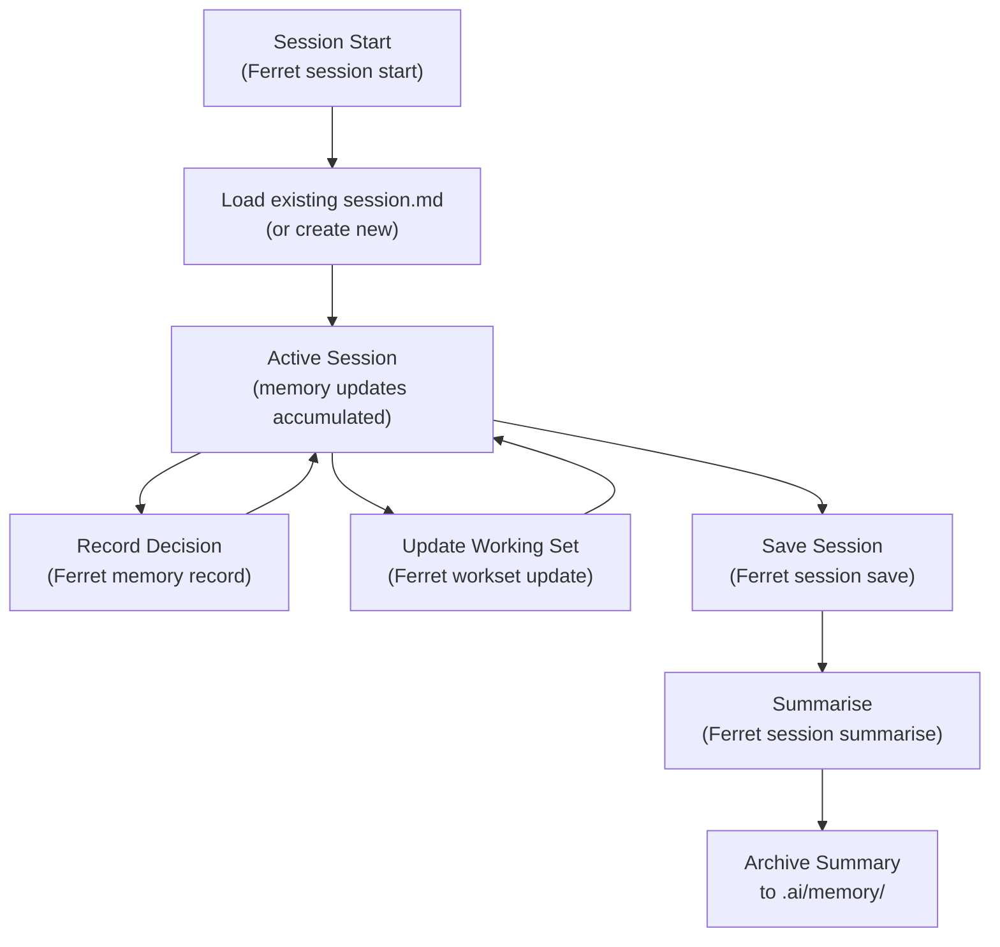

### 15.4 Context Contribution

The Memory Engine contributes to Knowledge Engine context assembly. When a context request includes session scope, the Memory Engine returns:

- The current session summary (recent decisions, active work items)
- Relevant repository memory entries (matched by scope — file paths, specification IDs, symbol names)
- Named working set contents if a working set is specified in the context request

Memory contributions are subject to the same token budget as other context sources.

### 15.5 Design Rationale

The two-tier model (volatile session + durable repository) reflects the different durability requirements. Session state is overwritten on every save; repository memory is append-only from the user's perspective and is version-controlled.

**Benefits:** Session state is always current; repository memory is auditable; working sets make large-repository navigation efficient.

**Trade-offs:** Two storage areas require two read paths in context assembly; session files can grow large if not summarised periodically.

**Future Considerations:** Automatic session summarisation (triggered when session.md exceeds a configurable size) would address the growth concern without requiring user action.

---

## 16. Specification Architecture

### 16.1 Purpose

The Specification Architecture defines the lifecycle and relationships of all engineering specification types used in the platform.

### 16.2 Specification Lifecycle

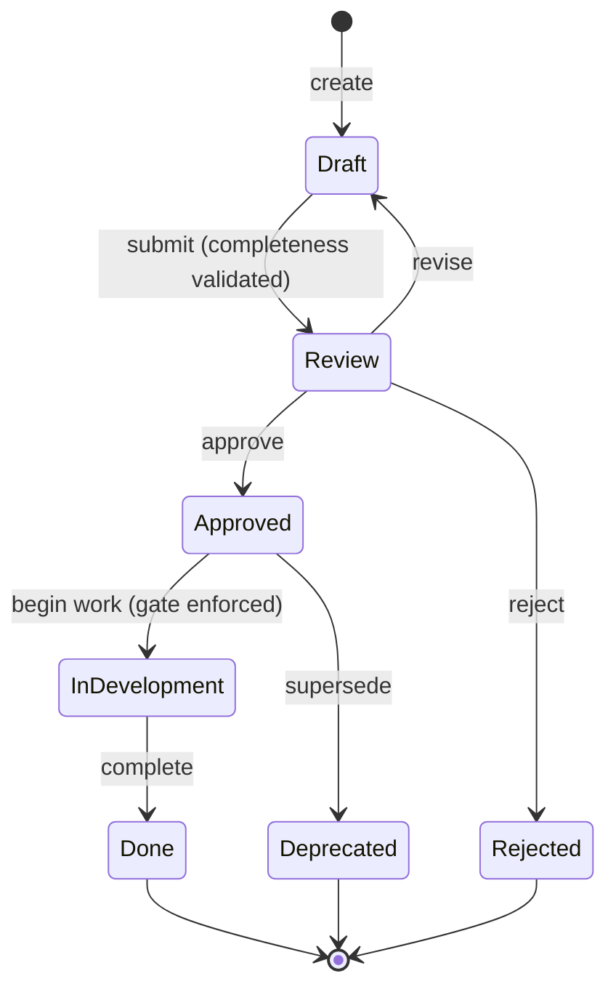

### 16.3 Specification Types and Relationships

| Type | Location | Identifier | Relationship to Other Types |
|---|---|---|---|
| **Vision** | `docs/000-Overview/Vision.md` | VISION-001 | Root — all others derive from it |
| **Mission** | `docs/000-Overview/Mission.md` | MISSION-001 | Operationalises VISION-001 |
| **Principles** | `docs/000-Overview/Principles.md` | PRINCIPLES-001 | Constrains all design decisions |
| **Glossary** | `docs/000-Overview/Glossary.md` | GLOSSARY-001 | Terms used in all other documents |
| **PRD** | `docs/001-Product/PRD-NNN.md` | PRD-NNN | Defines what the product does |
| **Architecture** | `docs/002-Architecture/ARCH-NNN.md` | ARCH-NNN | Defines how it is structured |
| **ADR** | `docs/adr/NNNN-kebab-title.md` | ADR-NNNN | Records specific design decisions |
| **Sprint Spec** | `docs/001-Product/sprint-N-title.md` | — | Sprint-scoped acceptance criteria |
| **API Spec** | `docs/005-API/API-NNN.md` | API-NNN | External interface contracts |
| **Review** | `docs/Reviews/AR-NNN.md` | AR-NNN | Formal evaluations of designs |

### 16.4 Approval Gate

The Specification Engine enforces a hard gate: no specification may transition from `Approved` to `InDevelopment` without the `Approved` state having been set by a human reviewer through the platform's approval workflow. The gate is enforced in the engine state machine, not in the CLI. A direct modification of the specification file's status field does not bypass the gate — the platform reads the approved state from the engine's state store, not from the document file.

### 16.5 Knowledge Integration

When a specification is approved, the Specification Engine writes a `Specification` node to the knowledge graph with the specification's acceptance criteria as structured metadata. This makes acceptance criteria queryable during context assembly for code review (the Review Engine can retrieve relevant criteria for the files being reviewed).

### 16.6 Design Rationale

Treating specifications as first-class knowledge graph nodes — not just document files — allows the platform to understand the relationship between requirements, implementations, and tests. This is the foundation of the traceability model.

**Benefits:** Acceptance criteria are queryable; specification coverage is measurable; AI-assisted review can reference specific criteria.

**Trade-offs:** Specification Engine state must be kept consistent with document file state; a document edited outside the platform may diverge from engine state.

**Future Considerations:** An integrity check command (`Ferret spec verify`) could detect and resolve divergences between document file state and engine state.

---

## 17. Review Architecture

### 17.1 Purpose

The Review Architecture defines the types of reviews the platform supports, how findings are generated and tracked, and how human approval is enforced.

### 17.2 Review Types

| Type | Identifier | Context | Trigger |
|---|---|---|---|
| **Architecture Review** | AR-NNN | ADR or architecture document | New architectural proposal |
| **Specification Review** | SR-NNN | Specification document | Specification submission |
| **Code Review** | CR-NNN | Diff + linked specification | Pull request or commit |
| **AI Review** | (embedded in above) | Any AI-generated content | Any AI-assisted operation |

### 17.3 Review Lifecycle

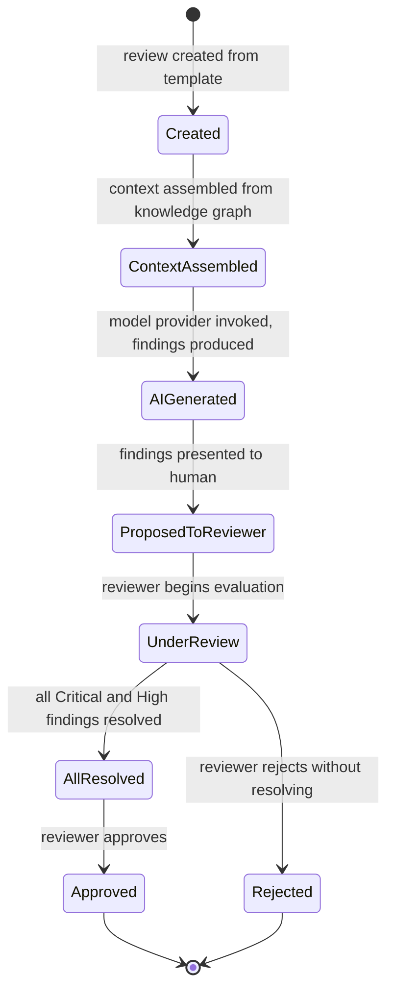

### 17.4 Finding Lifecycle

Each finding in a review has an independent lifecycle:

| State | Description |
|---|---|
| `Proposed` | AI-generated, not yet evaluated by a human |
| `Accepted` | Human confirmed the finding is valid |
| `Resolved` | The issue identified has been addressed |
| `Rejected` | Human determined the finding is not valid |
| `Deferred` | Finding is valid but will not be addressed now |

Critical and High findings must reach `Resolved` before the review can be approved. Medium, Low, and Observation findings may be `Deferred`.

### 17.5 Traceability Chain

Every review produces a traceable chain:

```
Artefact (committed file)
  └─ Review record (AR/CR/SR identifier)
       └─ Finding (severity, location, description)
            └─ Disposition (accepted/resolved/rejected, reviewer ID, timestamp)
                 └─ Interaction (model ID, knowledge state hash, timestamp)
```

This chain satisfies the audit requirements in PRD-001 §8.4 and NFR-CM-001.

### 17.6 AI Review Generation

When the Review Engine invokes a model provider for review generation:

1. The Knowledge Engine assembles context (diff, linked specification, relevant ADRs, related symbols)
2. The context is passed to `IModelProvider.InvokeAsync(context)`
3. The model returns a list of proposed findings (structured via the Artifact Engine's interaction record)
4. The Artifact Engine records the interaction ID and knowledge state hash
5. Findings are stored as `Proposed` in the review record

No finding produced by AI is stored as `Accepted` without a human transition. The finding state machine enforces this.

### 17.7 Design Rationale

The finding lifecycle model is modelled on formal code review systems rather than on ad-hoc comment threads. Every finding has a tracked state, a tracked disposition, and a tracked approver. This makes the review process auditable.

**Benefits:** Full traceability from finding to disposition; human review cannot be bypassed; deferred findings are tracked and not lost.

**Trade-offs:** The structured finding model is more complex than a free-text comment; requires more effort from reviewers than informal review tools.

**Future Considerations:** Finding templates (pre-defined finding types for common issues) would reduce the overhead of structured review creation.

---

## 18. Configuration Architecture

### 18.1 Summary

This section provides an overview of the configuration model. The full schema definition, merge semantics, secret resolution model, and extension points are defined in **ARCH-011 — Configuration Architecture**, which is the canonical reference. Module-level ARCH documents reference ARCH-011 directly.

### 18.2 Configuration Sources and Precedence

Configuration is assembled from five layers at every platform startup. Higher-numbered layers override lower-numbered layers for any given field:

| Layer | Source | Scope |
|---|---|---|
| 1 | Compiled defaults | All workspaces, all users |
| 2 | `~/.Ferret/config.json` | All workspaces for this user |
| 3 | `.ai/workspace.json` | This workspace, all users (version-controlled) |
| 4 | `Ferret_*` environment variables | This invocation |
| 5 | CLI flags | This invocation |

### 18.3 Key Constraints

**Secret resolution:** Configuration values that reference credentials must use `"${ENV_VAR_NAME}"` syntax. Literal secrets in version-controlled files are forbidden.

**Validation is fatal:** The platform does not start if configuration validation fails. Every configuration error surfaces as a structured diagnostic identifying the field, the constraint, and the source layer.

**Extension:** Secret provider plugins (`ISecretProvider`) resolve secret references from sources other than environment variables (e.g., secret managers). See ARCH-011 §5 for extension points.

### 18.4 Design Rationale

See **ARCH-011 §6** for the full rationale. The five-layer model allows the team to share workspace defaults through version control while individuals and CI pipelines override specific values without touching shared files.

---

## 19. Storage Strategy

### 19.1 Purpose

The Storage Strategy defines how the platform persists its state, how the storage abstraction works, and where each category of data lives.

### 19.2 Storage Areas

| Area | Location | Version Controlled | Default Implementation |
|---|---|---|---|
| **Knowledge Index** | `.ai/index/` | Yes | File-based graph store |
| **Index Manifest** | `.ai/index/manifest.json` | Yes | JSON file |
| **Session Memory** | `.ai/session.md` | Yes | Markdown file |
| **Repository Memory** | `.ai/memory/` | Yes | Markdown files + JSON metadata |
| **Workspace Config** | `.ai/workspace.json` | Yes | JSON file |
| **Cache** | `.ai/cache/` | No (gitignored) | File-based |
| **Summaries** | `.ai/summaries/` | No (gitignored by default) | Markdown files |
| **Plugin Data** | `.ai/plugins/{id}/` | Conditional (plugin declares) | Defined by plugin |

### 19.3 Storage Abstraction

The `IKnowledgeStore` interface is the single point through which engines read and write knowledge. The interface is defined in `Ferret.Core` and is deliberately narrow:

| Operation | Description |
|---|---|
| `GetNode(id)` | Retrieve a single node by identifier |
| `QueryNodes(filter)` | Retrieve nodes matching a structured filter |
| `QueryRelated(id, edgeType, depth)` | Traverse edges from a node |
| `FullTextSearch(query, filter)` | Search node properties by text |
| `WriteNodes(nodes)` | Write a set of nodes (batch) |
| `WriteEdges(edges)` | Write a set of edges (batch) |
| `Delete(ids)` | Remove nodes and their incident edges |
| `GetStateHash()` | Return the current state hash |

The narrow interface ensures that any compliant backend — file-based, SQLite, LMDB, a graph database — can serve as a storage provider.

### 19.4 Default Storage Implementation

The default storage implementation is file-based, storing the knowledge graph as a set of JSON files under `.ai/index/`. It requires no external process, no database server, and no dependencies beyond the .NET standard library. It is appropriate for repositories up to approximately 100,000 source files.

### 19.5 Storage Provider Plugins

For larger repositories or deployments requiring different performance characteristics, a storage provider plugin implements `IKnowledgeStore` and replaces the default implementation. The workspace configuration selects the active storage provider by plugin ID.

Switching storage providers requires re-running `Ferret index build`. The index format is not portable between providers.

### 19.6 Design Rationale

The storage abstraction is the most critical extensibility point for scalability. A platform that hardcoded its storage layer would be limited to the performance characteristics of that layer indefinitely. The abstraction makes the storage tier independently evolvable.

**Benefits:** Storage can be scaled horizontally without changing engine logic; community can contribute optimised storage backends for specific use cases.

**Trade-offs:** The narrow interface limits expressive power — complex graph operations must be expressed as combinations of the defined primitives; some operations that would be efficient as native graph queries must be computed client-side.

**Future Considerations:** The interface may need `StreamNodes` and `StreamEdges` operations for large result sets. These would be additive changes within the 1.x interface.

---

## 20. Security Architecture

### 20.1 Purpose

The Security Architecture defines the trust model, the boundaries between trust levels, and the mechanisms by which each boundary is enforced.

### 20.2 Trust Boundaries

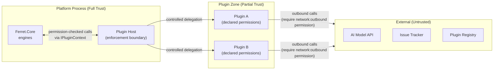

### 20.3 Sensitive File Exclusion

Sensitive file exclusion is applied at the earliest point in the data pipeline — before any file content enters the index pipeline. The Workspace Engine maintains the exclusion list. The File Scanner in the Index Engine checks every file path against the exclusion list before dispatching it to a parser.

Default exclusions (non-configurable, always applied):

```
*.pem  *.key  *.p12  *.pfx  *.ppk
.env   .env.*
*secret*  *credential*  *password*  *token*
*id_rsa*  *id_dsa*  *id_ecdsa*  *id_ed25519*
```

Workspace-level exclusions are additive. There is no mechanism to remove a default exclusion.

Exclusion is also applied in the Knowledge Engine on every query result and in the Context Planner on every context assembly. A path that was excluded at index time cannot appear in any query result. A path added to the exclusion list after indexing will be absent from future query results even if it remains in the index — queries filter results against the current exclusion list.

### 20.4 Plugin Sandbox

The Plugin Host enforces permissions at the `IPluginContext` boundary. Every operation a plugin performs against platform capabilities passes through an `IPluginContext` method. The `IPluginContext` implementation in the Plugin Host:

1. Identifies the calling plugin from the `AssemblyLoadContext`
2. Looks up the plugin's declared permissions
3. Checks that the requested capability is covered by a declared permission
4. Raises `PermissionDeniedException` if not; otherwise delegates to the platform capability

This enforcement happens in the platform process, not in the plugin. A plugin cannot bypass it by catching exceptions or using reflection.

### 20.5 Audit Logging

The Artifact Engine maintains an append-only audit log at `.ai/index/audit.log`. Every mutating operation records:

- Timestamp (ISO-8601 UTC)
- Operation type
- User identifier (resolved from `Ferret_USER` or `git config user.email`)
- Artefact identifier (if applicable)
- Plugin identifier (if a plugin initiated the operation)
- Result (success or failure with error type)

The audit log is committed to the repository as part of normal index updates and is therefore version-controlled.

### 20.6 Authentication and Authorisation

Version 1.0 does not implement a platform-level authentication system. User identity is resolved from the environment (git config, Ferret_USER environment variable). Access control is configured in workspace.json as a list of user/group → permission mappings. The Configuration module enforces these at engine entry points.

A full authentication system (token-based, OAuth2, or enterprise identity provider integration) is deferred to a future version and will be delivered through an authentication plugin.

### 20.7 No Outbound Network Default

The platform makes no outbound network calls unless:

1. A plugin with the `network:outbound` permission is active, and
2. That plugin is configured with a specific endpoint.

The plugin host checks the `network:outbound` permission before allowing any plugin to initiate a network connection. Without a configured model provider plugin, all AI features are unavailable but all non-AI features operate normally.

### 20.8 Design Rationale

The defence-in-depth approach (exclusion at pipeline entry, filtering at query time, permission enforcement at plugin boundary, audit logging at mutation points) ensures that no single failure of one defence allows sensitive data exposure or privilege escalation.

**Benefits:** Air-gap compatibility is an architectural default; sensitive data exclusion cannot be accidentally bypassed; plugin permissions are auditable.

**Trade-offs:** Multiple enforcement points add complexity; audit log growth requires periodic maintenance.

**Future Considerations:** Plugin signature verification (deferred per PRD-001 §13.4) will add a manifest-level security check before the permission model is consulted.

---

## 21. Telemetry Architecture

### 21.1 Purpose

The Telemetry Architecture ensures that all platform operations are observable, diagnosable, and exportable to external monitoring systems.

### 21.2 Telemetry Model

The platform implements three telemetry pillars:

**Structured Logging** — Every significant operation emits a structured log event with named properties (not interpolated strings). Log levels: Trace, Debug, Information, Warning, Error, Critical. Default level is Warning in production and Information in development. All log output goes through `ILogger<T>` — no direct writes to stdout or stderr from engines.

**Distributed Tracing** — Every CLI invocation and every MCP tool call starts a root `Activity` span. Child spans are created for each engine operation. Spans carry: operation name, outcome (success/failure), duration, and correlation identifiers. The interaction ID from the Artifact Engine is propagated as a trace attribute.

**Metrics** — Named metrics are emitted for all performance-sensitive operations. Key metrics: `index.build.duration`, `index.update.duration`, `knowledge.query.duration`, `context.assemble.duration`, `plugin.activate.count`, `model.invoke.duration`, `model.invoke.tokens`.

### 21.3 Telemetry Pipeline

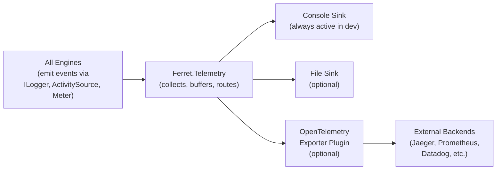

### 21.4 Health and Diagnostics

`Ferret diagnostics` produces a structured health report:

- Platform version and runtime version
- Active plugins (identifier, version, status)
- Workspace configuration summary (no secrets)
- Index status (state hash, last update, file count)
- Known issues (detected by the Workspace Engine health checker)
- Pending ADR decisions

The report is available in table and JSON formats.

### 21.5 Design Rationale

Using the .NET SDK's built-in telemetry abstractions (`ILogger`, `ActivitySource`, `Meter`) rather than a specific observability framework means the platform itself has no dependency on any observability vendor. Export to specific backends is handled by the OpenTelemetry exporter plugin.

**Benefits:** Vendor-neutral observability; telemetry export is swappable via plugin; all three pillars are available from the first stable release.

**Trade-offs:** The abstraction layer adds minor overhead; configuring the full export pipeline requires an OpenTelemetry exporter plugin.

**Future Considerations:** Continuous profiling and memory dump capture (for diagnosing performance issues in production) would require additional telemetry capabilities beyond the current three pillars.

---

## 22. MCP Integration

### 22.1 Purpose

The MCP integration defines how Ferret participates in the Model Context Protocol ecosystem — as a server providing knowledge and tools to AI hosts, and as a client consuming capabilities from external MCP servers.

### 22.2 MCP Server Architecture

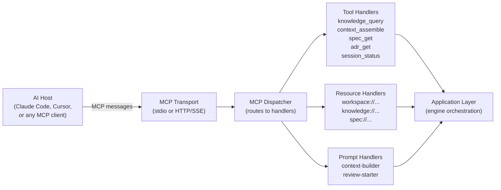

### 22.3 MCP Tools

| Tool Name | Description | Required Permissions |
|---|---|---|
| `knowledge_query` | Execute a natural-language or structured query against the knowledge index | `knowledge:read` |
| `context_assemble` | Assemble a token-budgeted context for an AI interaction | `knowledge:read`, `memory:read` |
| `spec_get` | Retrieve a specification document by ID | `spec:read` |
| `adr_get` | Retrieve an ADR by identifier | `knowledge:read` |
| `session_status` | Return the current session summary | `memory:read` |
| `workspace_status` | Return workspace health | (none — public) |
| `review_create` | Create a review document and return its ID | `review:write` |
| `review_finding_accept` | Accept a proposed review finding | `review:write` |

### 22.4 MCP Resources

| Resource URI Pattern | Description |
|---|---|
| `workspace://status` | Current workspace health report |
| `knowledge://symbols/{id}` | Single symbol node by ID |
| `knowledge://state` | Current knowledge state hash |
| `spec://list` | List of specifications by status |
| `spec://{id}` | Single specification by ID |
| `adr://list` | List of ADRs by status |
| `adr://{id}` | Single ADR by identifier |

### 22.5 MCP Client Architecture

When configured with external MCP server endpoints, the MCP Client:

1. Connects to each configured endpoint at platform startup
2. Calls `tools/list` to discover available tools
3. Registers the discovered tools in the agent runtime's tool registry
4. Proxies agent runtime tool calls to the appropriate external MCP server

The MCP Client is optional. Without any configured external servers, the client is a no-op. The agent runtime is not aware of whether a tool is provided by the platform or by an external MCP server.

### 22.6 Transport

The MCP Server supports two transports:

| Transport | Mode | Use Case |
|---|---|---|
| `stdio` | Process lifetime | AI host starts the platform as a subprocess; messages over stdin/stdout |
| `HTTP/SSE` | Server lifetime | Platform runs as a persistent server; AI host connects over HTTP |

The `stdio` transport is the primary transport for IDE integrations. The `HTTP/SSE` transport is appropriate for team servers and CI environments.

### 22.7 Protocol Versioning

The platform pins to a specific MCP protocol version at each platform release. An MCP version adapter layer handles protocol-level differences if the platform supports multiple MCP versions simultaneously. This layer lives in `Ferret.Mcp` and is transparent to the Application Layer.

### 22.8 Design Rationale

MCP is chosen as the external integration standard because it is an open, published protocol with growing adoption among AI hosts. Using MCP rather than a proprietary API means the platform integrates with any MCP-compatible host without that host needing to implement platform-specific code.

**Benefits:** Compatibility with any MCP-compatible AI host; protocol is versioned and evolving independently of the platform; the same MCP interface serves both CLI-adjacent and server-adjacent deployments.

**Trade-offs:** The platform is coupled to the MCP specification's evolution; breaking changes in MCP require a platform update.

**Future Considerations:** MCP resource subscriptions (push notifications when knowledge changes) would allow AI hosts to maintain a live view of the knowledge state without polling.

---

## 23. CLI Architecture

### 23.1 Purpose

The CLI is the primary interface for human developers. Its architecture prioritises consistency, automation-friendliness, and discoverability.

### 23.2 Command Hierarchy

Commands are organised into groups corresponding to platform subsystems. Each group has consistent sub-command patterns:

```
Ferret
├── workspace     init | status | validate | repair | upgrade | health
├── index         build | update | verify | compact | coverage | health
├── knowledge     query | status
├── context       assemble
├── memory        record | workset | session
├── spec          create | submit | approve | status | validate | coverage
├── adr           create | status | link | coverage
├── review        create | generate | finding | status | approve
├── plugin        list | install | remove | validate | scaffold | pack
├── mcp           serve
├── audit         log
├── diagnostics
└── completion    bash | zsh | pwsh
```

### 23.3 Output Formats

Every command supports three output formats, selectable via `--output`:

| Format | Flag | Description |
|---|---|---|
| **Table** | `--output table` (default) | Human-readable, aligned columns, coloured headers |
| **JSON** | `--output json` | Machine-readable, complete data, stable schema |
| **Plain** | `--output plain` | Minimal text, no control characters, screen-reader compatible |

JSON output follows a consistent envelope schema:

```json
{
  "command": "workspace status",
  "exitCode": 0,
  "timestamp": "2026-06-27T10:00:00Z",
  "data": { ... }
}
```

The `data` schema for each command is published in `docs/006-CLI/`.

### 23.4 Exit Codes

| Code | Meaning |
|---|---|
| 0 | Success |
| 1 | General error |
| 2 | Usage error (invalid arguments) |
| 3 | Configuration error |
| 4 | Authentication/permission error |
| 5 | Resource not found |
| 6 | Validation error (e.g., spec not approved) |

### 23.5 Non-Interactive Operation

All CLI commands that take required input accept it as:
- Command-line arguments (preferred for simple values)
- Environment variables (for values that vary between CI environments)
- File path arguments with `--file` (for structured inputs)

No command blocks on stdin in non-interactive environments. Commands that would normally prompt for confirmation accept a `--yes` flag for CI use.

### 23.6 Design Rationale

The consistent command hierarchy and output format design follows the conventions established by widely-adopted developer CLIs (git, kubectl, gh, docker). Consistency reduces the learning curve and makes the CLI predictable.

**Benefits:** Predictable command patterns; full automation support; JSON output enables scripting and CI integration.

**Trade-offs:** Rigid consistency may occasionally feel verbose for simple operations; `--output json` adds overhead for commands where it is rarely used.

**Future Considerations:** A TUI (terminal user interface) mode for commands that benefit from interactive navigation (e.g., reviewing findings interactively) is a natural extension without breaking existing behaviour.

---

## 24. Extensibility Strategy

### 24.1 Purpose

Extensibility is a first-class architectural property. The platform must accommodate new capabilities — model providers, storage backends, language parsers, review workflows, integration targets — without requiring changes to the core.

### 24.2 Extension Points

| Extension Point | Interface | Delivery |
|---|---|---|
| AI Model Provider | `IModelProvider` | Plugin |
| File Type Parser | `IParser` | Plugin |
| Knowledge Storage Backend | `IKnowledgeStore` | Plugin |
| Review Publisher | `IReviewPublisher` | Plugin |
| Work Item Publisher | `IWorkItemPublisher` | Plugin |
| Telemetry Exporter | `ITelemetryExporter` | Plugin |
| Secret Provider | `ISecretProvider` | Plugin |
| Context Relevance Scorer | `IRelevanceScorer` | Plugin |
| Workspace Health Checker | `IWorkspaceHealthChecker` | Plugin |
| Artefact Publisher | `IArtifactPublisher` | Plugin |
| MCP Transport | `IMcpTransport` | Plugin |
| Configuration Source | `IConfigurationSource` | Plugin |

### 24.3 Versioning of Extension Points

Extension point interfaces carry a stability classification:

| Classification | Meaning |
|---|---|
| **Stable** | Will not change in backwards-incompatible ways within a major version |
| **Preview** | API shape is final but edge cases may be refined; breaking changes allowed with deprecation notice |
| **Experimental** | Subject to change without notice; not recommended for production plugins |

All interfaces in version 1.0 will be classified as Stable or Preview. No interface releases as Experimental after version 1.0 GA.

### 24.4 Adding a New Extension Point

Adding a new extension point requires:

1. An ADR proposing the extension point, its interface contract, and its permission requirements
2. Architecture review approval
3. Interface definition added to `Ferret.Core`
4. SDK documentation added to `docs/007-SDK/`
5. At least one reference implementation (first-party or community plugin)

This process prevents the extension surface from growing uncontrolled.

### 24.5 Design Rationale

Making extensibility structural (through formal interfaces, versioned contracts, and a defined addition process) rather than informal (through monkey-patching, code modification, or undocumented hooks) creates a stable foundation for community plugin development.

**Benefits:** Plugin authors have a reliable interface to build against; the platform can evolve without breaking plugins; the extension surface is discoverable and documented.

**Trade-offs:** Formal process for new extension points is slower than ad-hoc extension; every new extension point adds to the long-term maintenance surface.

**Future Considerations:** An extension point registry (discoverable metadata about all extension points, their versions, and reference implementations) would improve plugin author discoverability.

---

## 25. Scalability Strategy

### 25.1 Purpose

The platform must function correctly and within performance budgets from single-developer repositories to large monorepos without architectural change. Scalability is addressed through design, not through separate deployment modes.

### 25.2 Scalability Dimensions

| Dimension | Target | Mechanism |
|---|---|---|
| **Repository size** | 500,000+ source files | Incremental indexing (O(changeset)); pluggable storage backend |
| **Knowledge graph size** | 5M+ nodes | Pluggable `IKnowledgeStore`; query result streaming |
| **Concurrent MCP clients** | 10+ simultaneous | MCP server handles each connection in an independent async pipeline |
| **Index build parallelism** | N parsers in parallel | Parser dispatcher uses `Task.WhenAll` over the changeset |
| **Context assembly** | Sub-2s for 50K tokens | Pre-scored working sets; budget-driven early termination |

### 25.3 Incremental Design

Every operation that reads or writes the index is designed to work on a changeset, not the full repository. This is the primary scalability mechanism:

- Index update: processes only changed files (determined by content hash)
- Context assembly: scores and packs from a pre-filtered working set, not the full graph
- Memory loading: loads only memory entries with matching scope, not the full memory store
- Knowledge query: uses the storage backend's index structure to avoid full scans

### 25.4 Storage Backend Scaling

The default file-based storage is not suitable for very large repositories. For repositories exceeding the performance threshold of the file-based backend, a storage provider plugin provides an alternative backend with appropriate indexing and query optimisation.

The performance threshold is documented for each storage backend. The default backend's threshold is approximately 100,000 source files for query performance; for incremental updates, the default backend scales to 500,000 files within the performance budgets in PRD-001.

### 25.5 Design Rationale

The scalability strategy defers backend scaling decisions to the storage provider plugin rather than baking a specific database into the core. This means the platform can scale from local file storage to a high-performance graph database by changing configuration, not architecture.

**Benefits:** No architecture change required as repositories grow; each team can choose a backend appropriate to their scale.

**Trade-offs:** Large repository users must select, configure, and maintain a non-default storage backend.

**Future Considerations:** Distributed index workers (a coordinator process dispatching parsing work to a pool of worker processes) would allow index build parallelism to scale beyond a single machine's thread count.

---

## 26. Deployment Models

### 26.1 Purpose

The platform supports multiple deployment topologies. All topology-specific behaviour is encapsulated in the Presentation Layer and the Infrastructure Layer. The Domain Layer is topology-agnostic.

### 26.2 Topology: Local CLI

The most common deployment. A single developer runs the CLI locally. The process starts, executes one command, and exits.

```
Developer → Ferret CLI → (engines) → .ai/ directory → exit
```

- No persistent process
- All state in the repository's `.ai/` directory
- Model provider plugin makes outbound calls if configured
- MCP server is not running (separate invocation for MCP mode)

### 26.3 Topology: CLI + MCP Server

The developer runs `Ferret mcp serve --transport stdio` as a subprocess of their AI host. The process runs for the duration of the AI host session.

```
AI Host → [spawns] Ferret mcp serve → MCP messages over stdio → (engines) → .ai/ directory
Developer also runs: Ferret CLI commands (separate process)
```

- Two processes share access to `.ai/`; write operations coordinate through the Index Engine's atomic write protocol
- MCP server and CLI processes read the same index concurrently (safe; index is read-mostly)

### 26.4 Topology: Team Server

A single Ferret instance runs as a persistent server on a shared host. Multiple developers connect via the MCP HTTP/SSE transport.

```
Developer A → MCP (HTTP/SSE) → Ferret Server → shared .ai/ directory
Developer B → MCP (HTTP/SSE) → Ferret Server
CI Pipeline → Ferret CLI → Ferret Server
```

- Access control enforced by workspace configuration
- Index updates are serialised by the Index Engine's write lock
- Multiple concurrent reads are served from the stable (non-staging) index

### 26.5 Topology: CI/CD Integration

Ferret runs as a step in a CI/CD pipeline, invoked by the CI runner.

```
CI Runner → Ferret index update → (engines) → .ai/ directory → commit
CI Runner → Ferret review generate → (engines) → review record
```

- All inputs provided as CLI arguments or environment variables (non-interactive)
- Exit code drives pipeline success/failure
- No MCP server; no persistent process

### 26.6 Topology: Air-Gapped / Offline

All external calls are routed to locally hosted services through plugins configured with local endpoints.

```
Developer → Ferret CLI → Model Provider Plugin (Ollama endpoint) → local model
                        → Storage Provider Plugin (local SQLite) → local database
```

- No internet access required
- All features available (including AI features, via local model)
- Plugin registry not consulted after initial install

### 26.7 Design Rationale

Supporting all topologies without branching the codebase requires that topology-specific concerns (process management, concurrent access, network exposure) be handled entirely in the Infrastructure and Presentation layers. The Domain Layer's engines are identical in all topologies.

**Benefits:** Feature parity across topologies; no "enterprise edition" vs "community edition" split; no topology-specific debugging.

**Trade-offs:** Infrastructure layer must handle topology-specific concerns (e.g., concurrent access patterns differ between local and team-server topologies).

**Future Considerations:** A managed cloud deployment (where Ferret manages the server infrastructure) would add a new topology that requires only Infrastructure changes, not Domain changes.

---

## 27. Future Architecture

### 27.1 Purpose

This section identifies architectural directions that are not in scope for version 1.0 but are consistent with the long-term vision in VISION-001 and would not require architectural redesign.

### 27.2 Multi-Repository Federation

A federated workspace that allows queries to span multiple repositories. Architecturally, this requires:

- A new `IFederatedKnowledgeStore` interface that aggregates results from multiple `IKnowledgeStore` instances
- A workspace graph (a workspace whose `.ai/workspace.json` references other workspaces as dependencies)
- Cross-repository edge types in the knowledge graph schema

The Domain Layer and Plugin Architecture are already compatible with this extension; only the Knowledge Engine and storage abstraction need new interfaces.

### 27.3 Distributed Index Workers

For very large monorepos (millions of files), index build parallelism may need to exceed a single machine's thread pool. Distributed workers would:

- Replace the Parser Dispatcher with a work queue (e.g., an in-process channel or an external message queue plugin)
- Allow parsers to run in separate processes or on separate machines
- Require the Aggregator to handle out-of-order results

The `IParser` interface remains unchanged; the distribution infrastructure is in the Index Engine.

### 27.4 Read-Only Hosted Knowledge Mirror

A read-only hosted copy of a project's knowledge index that external contributors can query without cloning the repository. Architecturally:

- The `IKnowledgeStore` is augmented with a serialisation/deserialisation capability
- The MCP server is deployed without write-capable plugins
- Authentication is added to the MCP server layer

The Domain Layer is unchanged; the deployment topology changes.

### 27.5 Real-Time Collaborative Specification Authoring

Multiple authors editing a specification simultaneously. Requires an operational transformation or CRDT-based approach to the specification document storage. This would be a new storage backend (implementing `IKnowledgeStore` with CRDT semantics) rather than a change to the Specification Engine.

---

## 28. Architecture Risks

### 28.1 Purpose

This section identifies risks that are architectural in nature — risks that, if not addressed, would require significant redesign rather than incremental change.

### 28.2 Risk Register

| ID | Risk | Likelihood | Impact | Mitigation |
|---|---|---|---|---|
| AR-001 | Knowledge graph query performance degrades at scale; file-based store cannot serve 100K-node graphs within latency budgets | Medium | High | Performance benchmarks from Sprint 1; `IKnowledgeStore` abstraction allows backend replacement without architecture change |
| AR-002 | Plugin isolation model based on `AssemblyLoadContext` has unresolved edge cases (e.g., shared native libraries, finaliser interactions) | Low | High | Evaluate isolation model in Sprint 6 ADR before implementation; consider process-based isolation as fallback |
| AR-003 | MCP protocol evolves in a backwards-incompatible way before version 1.0 stabilises | Low | Medium | Pin to specific MCP version; MCP adapter layer in `Ferret.Mcp` handles version differences |
| AR-004 | The knowledge graph schema becomes a bottleneck; adding new node or edge types breaks existing storage backends | Medium | Medium | Schema versioning built in from day one; migration tooling required before first stable release |
| AR-005 | Concurrent write access in the team-server topology causes index corruption under load | Low | Critical | Index Engine uses a write serialisation lock; validated by concurrent-access integration tests in Sprint 3 |
| AR-006 | Plugin permission model is too coarse-grained; a plugin requires broad permissions to perform a narrow operation | Medium | Low | Permission model reviewed in Sprint 6 ADR; fine-grained permissions can be additive within 1.x |
| AR-007 | The Domain Layer accumulates hidden dependencies on specific plugin implementations through non-obvious coupling | Medium | High | Dependency validation tool run in CI; any direct reference from Domain to Plugin Layer fails the build |
| AR-008 | The specification approval gate can be bypassed by direct file modification, undermining the human-review requirement | Low | High | Engine stores approved state in `IKnowledgeStore`, not in the document file; file and engine state reconciled by `spec verify` |

---

## 29. Architecture Decisions Requiring ADRs

### 29.1 Purpose

The following architectural decisions have been made at a structural level in this document but require formal ADRs before implementation begins. Each ADR must be approved before the sprint that implements the relevant module.

| Decision | Affected Sprint | Complexity | Description |
|---|---|---|---|
| ADR-0002: Plugin isolation model | Sprint 6 | High | Process-based vs `AssemblyLoadContext`-based isolation; trade-offs for failure isolation, performance, and IPC overhead |
| ADR-0003: Knowledge graph storage format | Sprint 2 | High | File-based JSON graph vs SQLite vs LMDB for the default storage backend; schema design for nodes, edges, and state hash |
| ADR-0004: MCP transport implementation | Sprint 11 | Medium | Library selection for MCP protocol implementation; stdio vs SSE differences; protocol version pinning |
| ADR-0005: Context scoring and packing algorithm | Sprint 3 | Medium | Relevance scoring function design; token packing algorithm; budget allocation by category |
| ADR-0006: Index atomicity mechanism | Sprint 6 | Medium | Staging-area swap vs journal-based atomicity; behaviour under crash during swap |
| ADR-0007: Configuration secret resolution | Sprint 1 | Medium | Environment variable reference syntax; secret provider plugin interface; failure behaviour when variable is unset |
| ADR-0008: Plugin manifest schema and versioning | Sprint 6 | Medium | Manifest JSON Schema design; version compatibility range semantics; backwards-compatibility guarantees |
| ADR-0009: Knowledge state hash algorithm | Sprint 2 | Low | Hash function selection; normalisation before hashing; determinism across platforms |
| ADR-0010: Audit log format | Sprint 8 | Low | Log file format (structured JSON vs newline-delimited JSON); rotation policy; integrity verification |

---

## 30. Domain Architecture

### 30.1 Purpose

The preceding sections describe the platform's architecture in terms of modules and layers. This section provides a complementary view: the same components grouped by **domain**. The domain view is the right lens for understanding platform evolution, for planning a potential multi-repository deployment, and for ensuring that module boundaries do not inadvertently cross domain boundaries.

### 30.2 Domain Map

The platform is organised into six domains. Each domain has a clear owner, a stable set of responsibilities, and a set of modules that belong to it. A module belongs to exactly one domain.

| Domain | Modules | Core Responsibility |
|---|---|---|
| **Workspace Domain** | `WorkspaceEngine` (within Runtime), `Ferret.Configuration` | Repository lifecycle, configuration assembly, health reporting, upgrade management |
| **Knowledge Domain** | `KnowledgeEngine`, `IndexEngine` (within Runtime), `Ferret.Plugins` (parser plugins) | Building, maintaining, and querying the knowledge graph |
| **Memory Domain** | `MemoryEngine` (within Runtime) | Session state, repository memory, working sets, context snapshots |
| **Specification Domain** | `SpecificationEngine`, `ReviewEngine`, `ArtifactEngine` (within Runtime) | Specification lifecycle, review workflow, artefact provenance, human review gate |
| **Plugin Domain** | `Ferret.Plugins`, `Ferret.Sdk` | Plugin host, lifecycle, permissions, SDK for plugin authors |
| **Infrastructure Domain** | `Ferret.Core`, `Ferret.Telemetry`, `Ferret.Mcp`, `Ferret.Cli` | Shared contracts, observability, entry points |

### 30.3 Domain Dependency Rules

In addition to the module-level dependency rules in §8, the following domain-level rules apply:

| Rule | Rationale |
|---|---|
| Workspace Domain must not depend on Specification Domain | Workspace management is independent of the specification workflow |
| Knowledge Domain must not depend on Memory Domain directly | Knowledge queries use the event bus to receive memory contributions, not direct calls |
| Specification Domain consumes Knowledge Domain via events | Specification approval writes to the knowledge graph; it does not call Knowledge Engine directly |
| Plugin Domain provides capabilities; it does not orchestrate | Plugin Domain modules are consumed by other domains through injected interfaces; they do not initiate workflows |

### 30.4 Domain Diagram

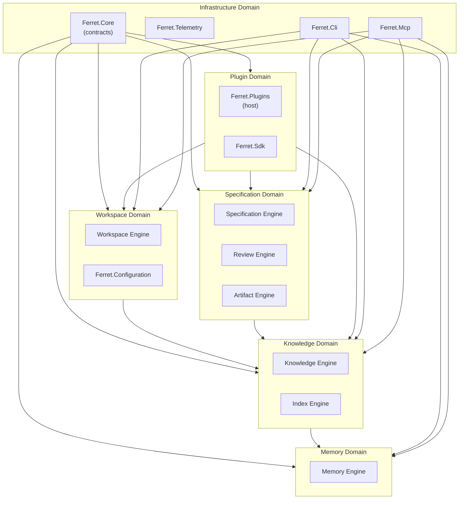

### 30.5 Scaling Across Repositories

If Ferret is later deployed as a multi-repository platform, the domain groupings become natural service or process boundaries:

- **Workspace + Knowledge + Memory** → a repository-scoped service (one instance per repository)
- **Specification Domain** → a team-scoped service (shared across repositories)
- **Plugin Domain** → a shared plugin host that serves all repository-scoped instances
- **Infrastructure Domain** → cross-cutting (deployed alongside every service)

This factoring requires no module changes — only new composition roots and transport adapters in the Infrastructure Domain. All domain logic remains unchanged because it depends only on interfaces, not on deployment topology.

### 30.6 Design Rationale

The domain view complements the module view by making long-term evolution explicit. A module-only view makes it easy to miss cross-domain coupling early, when it is cheap to fix. The domain diagram surfaces coupling that does not yet violate module rules but would create friction in a distributed deployment.

**Benefits:** Domain boundaries create natural team ownership boundaries; potential multi-repository deployment is visible as an architectural intent rather than a surprise migration; new modules are easier to place correctly.

**Trade-offs:** Maintaining two views (module and domain) requires discipline to keep them consistent.

---

## 31. Cross References

| Document | Relationship |
|---|---|
| Vision (VISION-001) | Long-term context for all architectural decisions in this document |
| Mission (MISSION-001) | Success criteria and deployment goals this architecture must satisfy |
| Engineering Principles (PRINCIPLES-001) | Constraints that produced the architectural decisions in §9 |
| Glossary (GLOSSARY-001) | Canonical definitions for all terms used in this document |
| PRD-001 | Product requirements that drove module design, extensibility strategy, and scalability targets |
| ADR-0001 | Establishes the ADR process used for decisions in §29 |
| AR-001 | Sprint 0 architecture review; findings L-001 and L-002 are addressed by this document |
| `docs/002-Architecture/overview.md` | Superseded placeholder; this document is the authoritative architecture reference |
| `docs/007-SDK/` | Plugin SDK documentation derived from the extension points defined in §24 |
| `docs/006-CLI/` | CLI reference documentation derived from the command hierarchy in §23 |

---

## 32. Revision History

| Version | Date | Author | Summary |
|---|---|---|---|
| 1.0 | 2026-06-27 | Ferret Core Team | Initial draft — complete system architecture for Ferret v1.0. Supersedes overview.md placeholder. Pending architecture review. |
