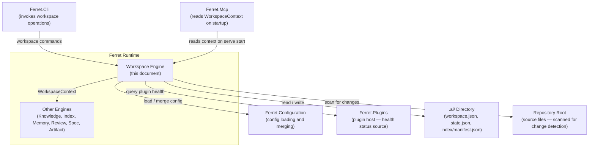
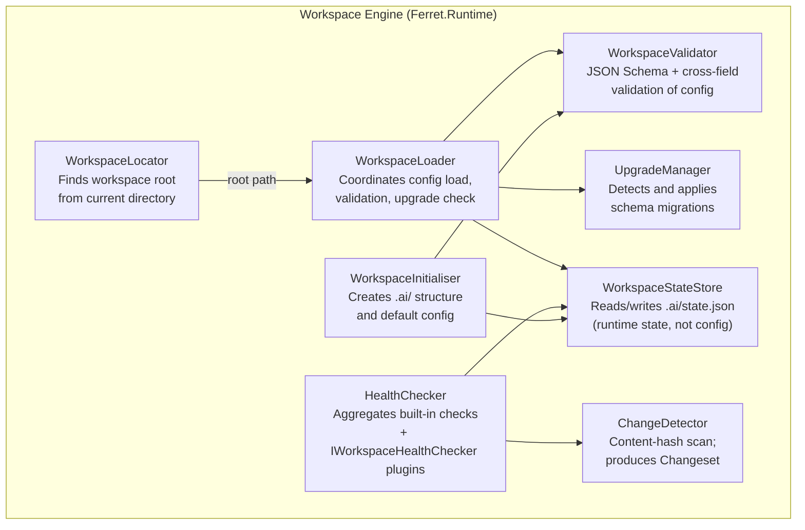
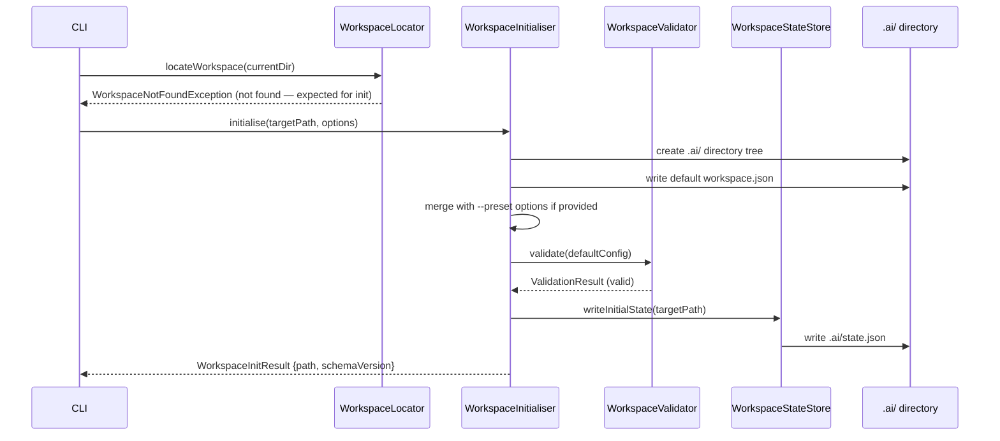
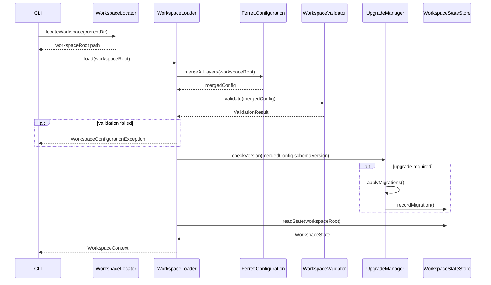
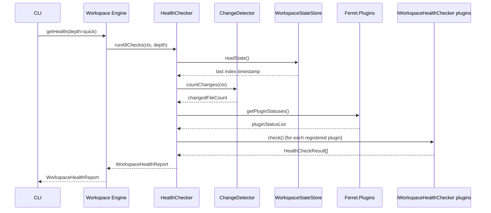
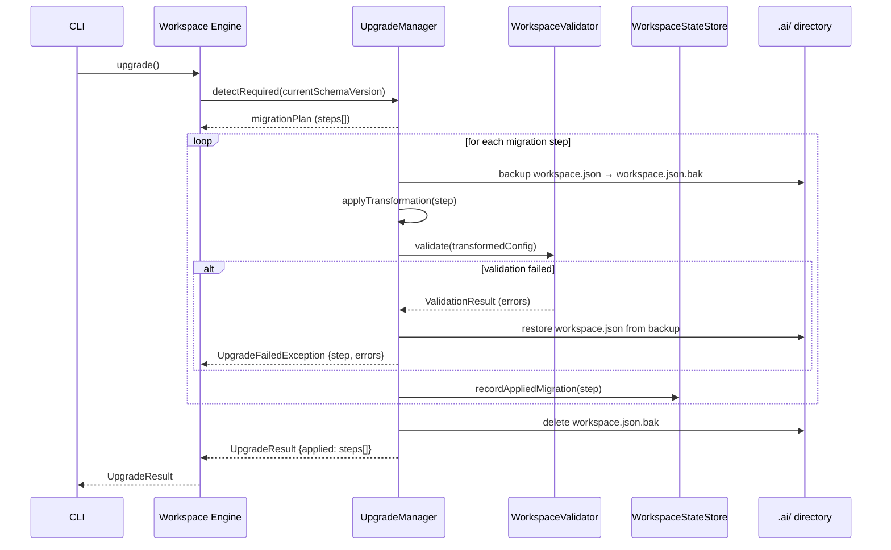
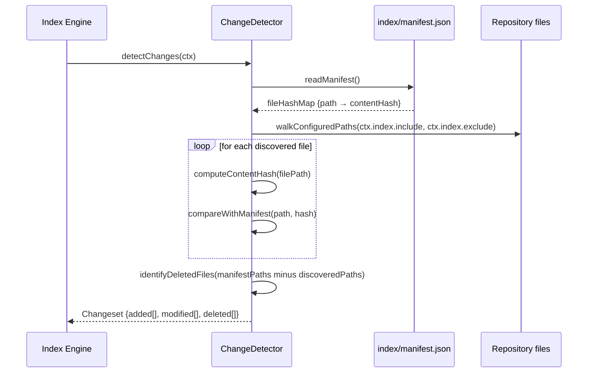

# ARCH-003 — Workspace Architecture

| Field | Value |
|---|---|
| **Document ID** | ARCH-003 |
| **Version** | 1.0 |
| **Status** | Draft |
| **Owner** | Ferret Project |
| **Author** | Ferret Core Team |
| **Review Status** | Pending Architecture Review |
| **Date** | 2026-06-27 |
| **Last Updated** | 2026-06-27 |
| **Related ADRs** | ADR-0007 (Configuration secret resolution), ADR-0008 (Plugin manifest schema) — pending |
| **Related Spec** | PRD-001 §10.1 (FR-WS-001 – FR-WS-006) |
| **Parent Architecture** | ARCH-001 §12 — Workspace Architecture (high-level) |

---

## Overview

The Workspace Engine is the entry point for every platform operation. Before any other engine receives control, the Workspace Engine locates the workspace root, loads and validates configuration from all sources, detects repository changes since the last index run, and provides a consistent `WorkspaceContext` to the rest of the platform. It also owns the workspace lifecycle (initialisation, versioning, upgrade) and produces the health report used by developers and CI pipelines to assess workspace state.

The Workspace Engine is the only engine that directly touches the `.ai/` directory structure. All other engines interact with workspace state through the `WorkspaceContext` it provides.

The high-level lifecycle and workspace metadata model are defined in ARCH-001 §12. This document defines the internal component structure (C3), the data flows for each workspace operation, the interface contracts, the full configuration schema, error handling, and observability signals.

---

## C2 — Container Diagram

The Workspace Engine lives inside `Ferret.Runtime`. This view shows how it interacts with the surrounding containers at the C2 level.



---

## C3 — Component Diagram

The Workspace Engine is decomposed into seven internal components. Each has a single responsibility and communicates with the others through the engine's internal coordination layer.



### Component Responsibilities

**WorkspaceLocator** — Traverses parent directories from the current working directory until `.ai/workspace.json` is found or the filesystem root is reached. Accepts an explicit `--workspace` override path. Raises `WorkspaceNotFoundException` if no workspace is found. The search is bounded to prevent infinite traversal.

**WorkspaceInitialiser** — Executes `Ferret init`. Creates the `.ai/` directory tree, copies the default `workspace.json` template, creates all required subdirectories (`index/`, `memory/`, `cache/`, `summaries/`, `plugins/`), and writes the initial `state.json`. Is a no-op if called on a directory that already contains a valid workspace.

**WorkspaceLoader** — Coordinates the startup sequence for any command that requires an active workspace. Delegates config loading to `Ferret.Configuration`, calls the Validator, checks the schema version with the UpgradeManager, and constructs the `WorkspaceContext` returned to calling engines.

**WorkspaceValidator** — Validates the merged configuration object in two passes. Pass 1: JSON Schema structural validation. Pass 2: cross-field semantic validation (e.g., a local plugin path that does not exist; a referenced context profile that has no sources; a budget below the minimum useful threshold). Reports all violations as a structured list, not just the first one.

**ChangeDetector** — Reads the current index manifest (`.ai/index/manifest.json`) and scans the configured include paths for file changes. For each file in scope: computes the content hash and compares with the manifest. Builds a `Changeset` of added, modified, and deleted paths. Does not write to the index; its output is consumed by the Index Engine.

**HealthChecker** — Runs all health checks and aggregates results into a `WorkspaceHealthReport`. Built-in checks: index currency (via manifest), plugin health (via `Ferret.Plugins`), configuration validity (via Validator). Extension checks: any registered `IWorkspaceHealthChecker` plugin. Supports a `depth` parameter: `quick` (manifest-only for index check) and `deep` (full index verification, slower).

**UpgradeManager** — Reads `schemaVersion` from the loaded `workspace.json`. Looks up the migration graph for a path from the workspace version to the current platform version. For each step: creates a backup of `workspace.json`, applies the transformation, validates the result, and proceeds or rolls back. The applied schema version is written directly into `workspace.json`'s `schemaVersion` field — no separate state file is needed for upgrade tracking.

**WorkspaceStateStore** — Manages `.ai/state.json`, a file that tracks volatile runtime state: last index timestamp and active session ID. `state.json` is **gitignored**. It is local to the developer's working copy and is never committed. Index reproducibility across clones is provided by `manifest.json` (which is committed); `state.json` exists only to avoid re-scanning on every command invocation.

---

## Data Flow

### Flow 1 — `Ferret init`



### Flow 2 — Platform startup (every command)



### Flow 3 — `Ferret workspace status`



### Flow 4 — `Ferret workspace upgrade`



### Flow 5 — `Ferret index update` (change detection phase)



---

## Key Design Decisions

| Decision | Rationale | ADR |
|---|---|---|
| Workspace root is always the repository root | Eliminates ambiguity about relative paths; ensures `.ai/` is always version-controlled at the top level | — |
| `workspace.json` is version-controlled | Workspace configuration must be reproducible; a `git clone` should produce a functional workspace after `Ferret init` on top of a cloned `.ai/` | — |
| `state.json` is gitignored | It contains volatile, per-developer runtime state (last index timestamp, active session ID). Committing it would create git noise on every `index update` and cause frequent merge conflicts on shared branches. Reproducibility across clones comes from `manifest.json`, not `state.json`. | — |
| `.ai/cache/` and `.ai/summaries/` are gitignored | Transient and derivable data should not pollute repository history | See `.gitignore` |
| Upgrade is always explicit (`Ferret workspace upgrade`) | Auto-upgrading on startup creates CI surprises; an explicit command makes migrations auditable and reversible | — |
| Upgrade rolls back to previous `workspace.json` on failure | A failed migration must not leave the workspace in an unconfigured or inconsistent state | — |
| Content-hash change detection (not filesystem mtime) | mtime is unreliable: it changes on `git checkout`, build tool touches, and filesystem copies without content changes | ARCH-001 §14.3 |
| Health check is shallow by default | The `quick` depth is suitable for CI gates and is O(manifest read); the `deep` depth is for explicit diagnostics | — |
| Configuration secret resolution uses env-var references | Credentials must never be committed to the repository; `${ENV_VAR}` syntax is resolved by `Ferret.Configuration` at runtime | ADR-0007 (pending) |

---

## Interfaces and Contracts

### Public API Surface

The following contracts are declared in `Ferret.Core`. They are the stable interfaces through which the rest of the platform interacts with the Workspace Engine.

**`IWorkspaceEngine`**

| Operation | Parameters | Returns | Description |
|---|---|---|---|
| `InitialiseAsync` | `rootPath`, `InitOptions` | `WorkspaceInitResult` | Create a new workspace at the given path |
| `LoadAsync` | `rootPath` | `WorkspaceContext` | Load, validate, and upgrade an existing workspace |
| `GetHealthAsync` | `WorkspaceContext`, `HealthCheckDepth` | `WorkspaceHealthReport` | Report current workspace health |
| `GetChangesetAsync` | `WorkspaceContext` | `Changeset` | Detect file changes since last index run |
| `UpgradeAsync` | `WorkspaceContext` | `UpgradeResult` | Apply all pending schema migrations |
| `ValidateAsync` | `WorkspaceContext` | `ValidationResult` | Validate workspace configuration |

**`IWorkspaceHealthChecker`** *(plugin extension point)*

| Operation | Parameters | Returns | Description |
|---|---|---|---|
| `CheckAsync` | `WorkspaceContext` | `HealthCheckResult` | Return a single named health check result |
| `Name` | — | `string` | Display name for this check in status output |
| `Depth` | — | `HealthCheckDepth` | Minimum depth at which this check runs (`quick` or `deep`) |

**`WorkspaceContext`** *(value object)*

| Field | Type | Description |
|---|---|---|
| `RootPath` | path | Absolute path to the workspace root |
| `AiPath` | path | Absolute path to `.ai/` directory |
| `Configuration` | `WorkspaceConfiguration` | Fully merged, validated configuration |
| `SchemaVersion` | semver string | Current workspace schema version |
| `IndexManifestPath` | path | Path to `.ai/index/manifest.json` |
| `IsFirstRun` | bool | True if workspace has never been indexed |
| `State` | `WorkspaceState` | Runtime state read from `state.json` |

**`Changeset`** *(value object)*

| Field | Type | Description |
|---|---|---|
| `Added` | string[] | Paths of files added since last index |
| `Modified` | string[] | Paths of files modified since last index |
| `Deleted` | string[] | Paths of files deleted since last index |
| `Total` | int | Total count of changes |
| `AsOfTimestamp` | datetime | UTC time when the changeset was computed |

**`WorkspaceHealthReport`** *(value object)*

| Field | Type | Description |
|---|---|---|
| `IsHealthy` | bool | True if no Critical findings |
| `IndexHealth` | `IndexHealthInfo` | `{lastUpdated, stalenessSeconds, fileCount, changeCount}` |
| `PluginHealth` | `PluginHealthInfo` | `{active, inactive, failed, failedPlugins[]}` |
| `ConfigurationHealth` | `ConfigHealthInfo` | `{isValid, errors[]}` |
| `PendingUpgrade` | `UpgradeInfo?` | `{required, fromVersion, toVersion}` — null if no upgrade pending |
| `CustomChecks` | `HealthCheckResult[]` | Results from all `IWorkspaceHealthChecker` plugins |
| `GeneratedAt` | datetime | UTC time this report was generated |

### Dependencies

| Dependency | Module | Purpose |
|---|---|---|
| `Ferret.Configuration` | Infrastructure | Configuration loading and merging across all layers |
| `Ferret.Plugins` | Infrastructure | Plugin health status for the health report |
| `IKnowledgeStore` | `Ferret.Core` | Reading the index manifest for change detection and health checks |
| File system abstraction | `Ferret.Core` | All `.ai/` directory reads and writes (mockable in tests) |

---

## Configuration

> **Configuration details:** The full configuration schema, merge semantics, and secret resolution model are defined in **ARCH-011 — Configuration Architecture**. This document focuses on how the Workspace Engine participates in configuration loading, not on the configuration model itself.

The workspace configuration is stored in `.ai/workspace.json`. The schema is versioned independently from the platform. Below is the conceptual structure of a version 1.0 workspace configuration.

### `workspace.json` Schema (v1.0)

```json
{
  "$schema": "https://Ferret.dev/schemas/workspace/1.0.json",
  "schemaVersion": "1.0",
  "name": "my-project",
  "description": "Optional human-readable description of this workspace",

  "index": {
    "include": ["src/**", "docs/**", "tests/**"],
    "exclude": ["**/obj/**", "**/bin/**", "**/*.generated.*"],
    "parsers": {
      ".custom": "vendor.product.custom-parser@^1.0"
    }
  },

  "context": {
    "defaultBudget": 50000,
    "profiles": {
      "code-review": {
        "budget": 60000,
        "sources": ["diff", "spec", "adrs", "session"]
      },
      "spec-authoring": {
        "budget": 40000,
        "sources": ["adrs", "principles", "glossary"]
      }
    }
  },

  "plugins": [
    {
      "id": "Ferret.anthropic.claude-provider",
      "version": "^1.0",
      "source": "registry"
    },
    {
      "id": "my-team.internal-parser",
      "version": "1.2.0",
      "source": "local",
      "path": "./tools/internal-parser"
    }
  ],

  "security": {
    "sensitivePatterns": ["**/internal-secrets/**", "**/.env.local"],
    "access": [
      {
        "identity": "ci-runner",
        "permissions": ["index:write", "knowledge:read", "review:read"]
      }
    ]
  },

  "telemetry": {
    "logLevel": "Warning",
    "tracing": {
      "enabled": false,
      "endpoint": "${Ferret_TRACE_ENDPOINT}"
    },
    "metrics": {
      "enabled": false,
      "endpoint": "${Ferret_METRICS_ENDPOINT}"
    }
  },

  "integrations": {
    "workItems": {
      "plugin": "Ferret.github.issues@^1.0",
      "config": {
        "owner": "${GITHUB_ORG}",
        "repo": "${GITHUB_REPO}"
      }
    },
    "registry": {
      "url": "${Ferret_REGISTRY_URL}"
    }
  }
}
```

### `state.json` Schema (v1.0)

`state.json` is **gitignored** — it is never committed to version control. It is written and read exclusively by the Workspace Engine. On a fresh clone, `state.json` does not exist; the Workspace Engine creates it on first run.

```json
{
  "schemaVersion": "1.0",
  "lastIndexTimestamp": "2026-06-27T10:00:00Z",
  "lastAppliedMigration": "1.0",
  "activeSessionId": "sess_abc123",
  "indexManifestHash": "sha256:abc123..."
}
```

### Configuration Field Reference

| Section | Field | Default | Description |
|---|---|---|---|
| root | `schemaVersion` | — | Required. Version of the workspace schema. |
| root | `name` | directory name | Display name used in health reports and diagnostics. |
| `index` | `include` | `["**/*"]` | Glob patterns for files to index. |
| `index` | `exclude` | (default list) | Additive exclusions. Combined with compiled-in sensitive-file patterns. |
| `index` | `parsers` | `{}` | Extension-to-plugin-ID overrides for parser selection. |
| `context` | `defaultBudget` | `50000` | Default token budget for context assembly. Min: 1000. Max: 200000. |
| `context` | `profiles` | `{}` | Named context profiles with custom budgets and source configurations. |
| `plugins` | `id` | — | Required per plugin. Reverse-domain plugin identifier. |
| `plugins` | `version` | — | Required per plugin. SemVer range constraint. |
| `plugins` | `source` | `"registry"` | `"registry"` or `"local"`. |
| `plugins` | `path` | — | Required when `source` is `"local"`. Relative to workspace root. |
| `security` | `sensitivePatterns` | `[]` | Additional exclusion patterns. Combined with compiled-in defaults. |
| `security` | `access` | `[]` | Per-identity permission assignments. |
| `telemetry` | `logLevel` | `"Warning"` | `Trace` / `Debug` / `Information` / `Warning` / `Error` / `Critical`. |
| `telemetry.tracing` | `enabled` | `false` | Enable OpenTelemetry trace export. |
| `telemetry.metrics` | `enabled` | `false` | Enable OpenTelemetry metrics export. |

---

## Error Handling

### Error Types

| Error | Trigger | Platform Behaviour | User-Facing Message |
|---|---|---|---|
| `WorkspaceNotFoundException` | No `.ai/workspace.json` found traversing to FS root | Exit code 5 | "No workspace found in `{path}` or any parent directory. Run `Ferret init` to create one." |
| `WorkspaceAlreadyExistsException` | `Ferret init` called on a directory with a valid workspace | Exit code 6 | "Workspace already initialised at `{path}`. Run `Ferret workspace status` to check its health." |
| `WorkspaceConfigurationException` | `workspace.json` fails JSON Schema or semantic validation | Exit code 3 | Structured list of validation errors with field paths and suggested corrections. |
| `WorkspaceSchemaVersionException` | `workspace.json` schema version is newer than the platform supports | Exit code 3 | "Workspace schema version `{v}` requires platform version `{min}` or later. Current: `{current}`." |
| `WorkspaceUpgradeRequiredException` | `workspace.json` schema version is older and auto-upgrade is disabled | Exit code 6 | "Workspace schema `{v}` is out of date. Run `Ferret workspace upgrade` to migrate." |
| `WorkspaceUpgradeFailedException` | A migration step fails validation | Exit code 1 | "Upgrade failed at step `{step}`: `{errors}`. Previous `workspace.json` has been restored." |
| `WorkspacePathTraversalException` | A configured path resolves outside the workspace root | Exit code 3 | "Path `{path}` in configuration resolves outside the workspace root. All configured paths must be within `{root}`." |

### Failure Isolation

- A validation failure during platform startup returns `WorkspaceConfigurationException` before any engine is activated. No partial state is written.
- A failed upgrade restores the backup `workspace.json` before returning the error. The workspace is in exactly its pre-upgrade state.
- A failed `Ferret init` removes any partially created `.ai/` directory. The target directory is in exactly its pre-init state.

---

## Observability

### Logs

| Event | Level | Message |
|---|---|---|
| Workspace located | Debug | `Workspace found at {rootPath}` |
| Config layers merged | Debug | `Configuration merged from {layerCount} sources` |
| Validation passed | Information | `Workspace configuration valid (schemaVersion={v})` |
| Validation failed | Warning | `Workspace configuration invalid: {errorCount} error(s)` |
| Upgrade started | Information | `Upgrading workspace schema from {from} to {to}` |
| Upgrade step applied | Debug | `Applied migration step {step} (from {from} to {step.to})` |
| Upgrade completed | Information | `Workspace schema upgraded to {to}` |
| Upgrade failed | Error | `Workspace upgrade failed at step {step}: {errors}` |
| Health check completed | Information | `Workspace health: {status} ({changeCount} changes pending, {pluginCount} plugins active)` |
| Change detection completed | Debug | `Changeset computed: +{added} ~{modified} -{deleted} ({total} total)` |

### Metrics

| Metric Name | Type | Description |
|---|---|---|
| `Ferret.workspace.startup.duration` | Histogram (ms) | Time from `LoadAsync` call to `WorkspaceContext` returned |
| `Ferret.workspace.health.staleness_seconds` | Gauge | Seconds since last index update (from `state.json`) |
| `Ferret.workspace.index.file_count` | Gauge | Total files in the current index manifest |
| `Ferret.workspace.index.change_count` | Gauge | Files changed since last index (from last ChangeDetector run) |
| `Ferret.workspace.upgrade.duration` | Histogram (ms) | Time to complete a schema upgrade |
| `Ferret.workspace.plugin.active_count` | Gauge | Number of currently active plugins |

### Traces

Every call to a public `IWorkspaceEngine` method creates a root `Activity` span named `workspace.<operation>` (e.g., `workspace.load`, `workspace.get_health`, `workspace.upgrade`). Child spans are created for each internal component call (e.g., `workspace.locate`, `workspace.validate`, `workspace.change_detect`).

Span attributes on all workspace spans:

| Attribute | Description |
|---|---|
| `workspace.root` | Absolute path of the workspace root |
| `workspace.schema_version` | Schema version from `workspace.json` |
| `workspace.operation` | Operation name |
| `workspace.outcome` | `success` or `failure` |

---

## Security Considerations

### Path Traversal Prevention

All paths read from `workspace.json` (plugin paths, include/exclude patterns, integration config paths) are resolved relative to the workspace root and validated to remain within it. Any path resolving outside the workspace root raises `WorkspacePathTraversalException` and prevents startup. Symlinks are not followed beyond the workspace root boundary.

### Sensitive File Exclusion Enforcement

The compiled-in sensitive-file exclusion list (defined in ARCH-001 §20.3) is applied during the `ChangeDetector` scan before any file path enters the Index Engine pipeline. It is not configurable. The workspace-level `security.sensitivePatterns` list is additive. There is no mechanism to remove a compiled-in exclusion.

### Configuration File Integrity

`workspace.json` is read once at startup and the resulting `WorkspaceContext` is treated as immutable for the lifetime of the command. If `workspace.json` is modified mid-run (e.g., by a concurrent process or a plugin), the change is not visible to the current invocation. A subsequent command will pick up the new configuration.

Plugins do not have write access to `workspace.json`. The `filesystem:write` permission does not grant access to files under `.ai/` unless specifically declared.

### Secrets in Configuration

All configuration values that may contain credentials must use environment variable references (`${ENV_VAR_NAME}`). The `WorkspaceValidator` detects patterns consistent with embedded secrets (API key patterns, private key headers, bearer token formats) and warns if they appear as literal values. It does not block startup on a warning but logs the warning at the `Warning` level.

---

## Scalability and Performance

| Operation | Complexity | Notes |
|---|---|---|
| `WorkspaceLocator` traversal | O(d) where d = directory depth from cwd to root | Bounded to d ≤ 50; stops at filesystem root |
| Configuration loading | O(1) | No repository traversal; only `.ai/workspace.json` and user-level config |
| Schema validation | O(c) where c = number of configuration fields | Effectively constant for any realistic config |
| Change detection (quick) | O(n) where n = files in configured include paths | Content hash computed per file; no I/O beyond reading file content |
| Health check (`quick`) | O(p + 1) where p = plugin count | One manifest read + one status query per plugin |
| Health check (`deep`) | O(n + p) | Adds full index traversal for consistency check |
| Workspace upgrade | O(s) where s = number of migration steps | Typically 1–3 steps; each step transforms a small JSON file |

For repositories with 500,000+ files and broad include patterns, change detection can be slow on cold OS file cache. This is mitigated by:

1. Scoping `index.include` patterns tightly (e.g., `src/**` rather than `**/*`)
2. Using `.gitignore`-style exclusion to skip build outputs before hashing
3. Future work: OS filesystem event watcher integration for persistent-process topologies (see Open Questions)

---

## Open Questions

| # | Question | Owner | Impact |
|---|---|---|---|
| 1 | ~~Should `state.json` be committed?~~ **Resolved:** `state.json` is gitignored. Reproducibility across clones is provided by the committed `manifest.json`. | — | Closed |
| 2 | Should `workspace.json` support inheritance — a base configuration that team-level workspaces extend? Enables shared team defaults without duplicating configuration across repositories. | Architecture Review | Configuration schema complexity; ADR-0007 scope |
| 3 | Should `Ferret init` support presets (`--preset ci`, `--preset individual`, `--preset team`) to generate context-appropriate initial configurations? | Product | Onboarding experience |
| 4 | Should the ChangeDetector support OS filesystem event watchers in the persistent MCP server topology? Would eliminate repeated hash scanning for live-reload scenarios. | Architecture Review | Topology-specific complexity; performance |
| 5 | How should the UpgradeManager handle a plugin that is incompatible with the target schema version? Block the upgrade, deactivate the plugin, or allow a forced upgrade? | Architecture Review | Plugin compatibility model; ADR-0008 scope |

---

## Cross References

| Document | Relationship |
|---|---|
| ARCH-001 §12 | Parent — defines the high-level workspace lifecycle and metadata model |
| ARCH-001 §9 | Architectural constraints applied in this document (AC-003, AC-006, AC-007) |
| ARCH-001 §18 | Configuration Architecture — the layering model implemented by `Ferret.Configuration` |
| ARCH-001 §20 | Security Architecture — sensitive file exclusion and path validation |
| PRD-001 §10.1 | FR-WS-001 through FR-WS-006 — functional requirements implemented by this architecture |
| ADR-0007 | Configuration secret resolution (pending) — governs `${ENV_VAR}` syntax and secret provider interface |
| ADR-0008 | Plugin manifest schema (pending) — governs plugin declaration format in `workspace.json` |
| `docs/007-SDK/` | Plugin SDK documentation for `IWorkspaceHealthChecker` implementors |
| `docs/006-CLI/` | CLI reference for all `Ferret workspace *` commands |

---

## Revision History

| Version | Date | Author | Summary |
|---|---|---|---|
| 1.0 | 2026-06-27 | Ferret Core Team | Initial draft — workspace component architecture. Pending architecture review. |
| 1.1 | 2026-06-27 | Ferret Core Team | Corrected `state.json` classification from version-controlled to gitignored. Updated Key Design Decisions, WorkspaceStateStore description, and `state.json` schema section accordingly. Open Question #1 closed. |
