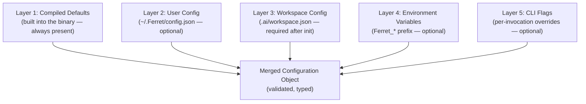

# ARCH-011 — Configuration Architecture

| Field | Value |
|---|---|
| **Document ID** | ARCH-011 |
| **Version** | 1.0 |
| **Status** | Draft |
| **Owner** | Ferret Project |
| **Author** | Ferret Core Team |
| **Review Status** | Pending Architecture Review |
| **Last Updated** | 2026-06-27 |
| **Parent Architecture** | ARCH-001 §18 — Configuration Architecture (summary) |

---

## Overview

This document is the canonical source for the Ferret configuration model. It defines every configuration source, the merge precedence rules, the full workspace configuration schema, secret resolution, validation behaviour, and the configuration module's extension points.

All other ARCH documents reference this document for configuration details. They do not re-define configuration concepts; they reference the relevant sections here.

---

## 1. Configuration Sources and Precedence

Configuration is assembled from five layers at every platform startup. Higher-numbered layers override lower-numbered layers for any given field. A field absent in a higher layer retains the value from the highest lower layer where it appears.



### 1.1 Layer Definitions

| Layer | Location | Scope | Owner |
|---|---|---|---|
| Compiled Defaults | Binary | All workspaces, all users | Platform team |
| User Config | `~/.Ferret/config.json` | All workspaces for this user | Individual developer |
| Workspace Config | `.ai/workspace.json` | This workspace, all users | Team (version-controlled) |
| Environment Variables | Process environment | This invocation | CI/CD pipeline or shell |
| CLI Flags | Command arguments | This invocation | Developer (ad-hoc) |

### 1.2 Merge Semantics

- **Scalar fields** (string, number, boolean): higher-layer value replaces lower-layer value entirely.
- **Object fields** (nested config sections): merged recursively. A sub-field in a lower layer that is absent in a higher layer is preserved.
- **Array fields** (include/exclude lists, plugin lists): higher-layer value replaces the entire array. Arrays are not merged element-by-element.
- **Null in higher layer**: treated as "absent" — the lower-layer value is kept. To explicitly clear an array, use an empty array `[]`.

### 1.3 Environment Variable Mapping

Environment variables with the `Ferret_` prefix map to configuration fields using `__` as the hierarchy separator:

| Environment Variable | Mapped Field |
|---|---|
| `Ferret_LOG__LEVEL` | `log.level` |
| `Ferret_INDEX__THREADS` | `index.threads` |
| `Ferret_MODEL__PROVIDER` | `model.provider` |
| `Ferret_TELEMETRY__ENDPOINT` | `telemetry.endpoint` |

Environment variable names are case-insensitive on Windows and case-sensitive on Linux/macOS.

---

## 2. Workspace Configuration Schema

The workspace configuration schema is versioned JSON Schema (Draft 7+). The schema file is distributed at `schemas/workspace-config.v1.json` and is referenced from `workspace.json` via a `$schema` field.

### 2.1 Top-Level Structure

```json
{
  "$schema": "https://Ferret.dev/schemas/workspace-config.v1.json",
  "schemaVersion": "1.0",
  "workspace": { ... },
  "index": { ... },
  "knowledge": { ... },
  "memory": { ... },
  "plugins": [ ... ],
  "model": { ... },
  "security": { ... },
  "telemetry": { ... },
  "integrations": { ... }
}
```

### 2.2 workspace Section

| Field | Type | Default | Description |
|---|---|---|---|
| `id` | string | (git remote URL hash) | Unique workspace identifier |
| `name` | string | (directory name) | Human-readable workspace name |
| `version` | string | "1.0" | Workspace schema version |
| `description` | string | "" | Optional description for team documentation |

### 2.3 index Section

| Field | Type | Default | Description |
|---|---|---|---|
| `threads` | int | (CPU count / 2) | Parser thread pool size |
| `include` | string[] | `["**/*"]` | Glob patterns for files to index |
| `exclude` | string[] | (see §3 defaults) | Glob patterns for files to exclude |
| `maxFileSizeKb` | int | 512 | Files larger than this are skipped |
| `compactAfterBuilds` | int | 10 | Trigger compaction after N full builds |

### 2.4 knowledge Section

| Field | Type | Default | Description |
|---|---|---|---|
| `defaultTokenBudget` | int | 32000 | Default token budget for context assembly |
| `contextProfiles` | object | `{}` | Named context profiles with per-category budgets |
| `storageProvider` | string | (embedded file store) | Plugin ID of the active storage provider |

### 2.5 memory Section

| Field | Type | Default | Description |
|---|---|---|---|
| `sessionAutoSave` | bool | true | Automatically save session on every operation |
| `sessionMaxSizeKb` | int | 50 | Trigger auto-summarisation when session exceeds this |
| `keepSnapshotDays` | int | 30 | Retain context snapshots for this many days |

### 2.6 plugins Array

Each entry in the `plugins` array declares a plugin to load:

```json
{
  "id": "com.example.my-parser",
  "version": "^1.2",
  "source": "local",
  "path": "./plugins/my-parser",
  "config": { ... }
}
```

| Field | Type | Required | Description |
|---|---|---|---|
| `id` | string | Yes | Reverse-domain plugin identifier (matches manifest) |
| `version` | string | Yes | SemVer range (e.g. `"^1.2"`, `"1.2.3"`) |
| `source` | enum | Yes | `"local"` \| `"registry"` \| `"embedded"` |
| `path` | string | If local | Relative or absolute path to plugin directory |
| `config` | object | No | Plugin-specific configuration object (passed to plugin on activation) |

### 2.7 security Section

| Field | Type | Default | Description |
|---|---|---|---|
| `sensitivePatterns` | string[] | `[]` | Additional glob patterns for sensitive file exclusion (additive to built-in defaults) |
| `accessControl` | object | `{}` | User/group → permission mappings |
| `requirePluginSignature` | bool | false | Reject plugins without a valid signature (deferred — not enforced in 1.0) |

### 2.8 telemetry Section

| Field | Type | Default | Description |
|---|---|---|---|
| `logLevel` | enum | `"Warning"` | Minimum log level: `Trace` \| `Debug` \| `Information` \| `Warning` \| `Error` \| `Critical` |
| `fileLogPath` | string | null | Path for file log output (null = disabled) |
| `otlpEndpoint` | string | null | OpenTelemetry collector endpoint (null = disabled) |
| `metricsEnabled` | bool | true | Enable metrics emission |

---

## 3. Secret Resolution

Configuration values that reference secrets must use environment variable syntax: `"${ENV_VAR_NAME}"`. The Configuration module resolves these at startup before validation.

**Resolution order:**
1. Check the active `ISecretProvider` plugins (if any are configured).
2. Fall back to the process environment variable named by the reference.
3. If neither resolves the reference, configuration validation fails with a diagnostic naming the unresolved field.

**Forbidden:** Storing credentials, API keys, or tokens as literal values in `workspace.json`, `config.json`, or any configuration file that is version-controlled.

**Example:**
```json
{
  "model": {
    "provider": "com.anthropic.claude",
    "config": {
      "apiKey": "${ANTHROPIC_API_KEY}"
    }
  }
}
```

---

## 4. Validation

After merging all layers and resolving secrets, the Configuration module validates the merged object against the JSON Schema. Validation runs once at startup and is not repeated unless configuration is reloaded.

**Validation errors** surface as structured diagnostics:

```
Configuration error: index.threads must be >= 1 (received: 0)
  → .ai/workspace.json, field "index.threads"
```

Each diagnostic includes: the constraint violated, the field path, the source layer where the value was set.

**Validation failures are fatal.** The platform does not start if configuration validation fails. This is intentional — an invalid configuration is a configuration that may produce unpredictable behaviour.

---

## 5. Extension Points

### 5.1 Secret Provider Plugins

`ISecretProvider` plugins resolve `"${REFERENCE}"` values from sources other than environment variables. Examples: HashiCorp Vault, AWS Secrets Manager, Azure Key Vault.

Secret providers are activated before the remainder of configuration is validated, so their resolved values participate in schema validation normally.

### 5.2 Configuration Source Plugins

A future extension point (`IConfigurationSource`) would allow a plugin to contribute a new configuration layer (e.g., a remote configuration server). This is not part of version 1.0.

---

## 6. Design Rationale

The five-layer model follows the de facto standard for developer tools operating in multiple contexts. The team controls the workspace layer (version-controlled); the individual controls the user layer; CI controls environment variables; nothing needs code changes to adapt the platform to a new deployment context.

**Why not a single config file?** A single file cannot serve both "team-shared defaults" (workspace.json) and "user-local overrides" (config.json) without one overwriting the other in version control.

**Why strict validation on startup?** A platform that starts with invalid configuration silently produces wrong results. Failing fast with a clear diagnostic is always preferable to debugging mysterious behaviour later.

**Trade-offs:** Debugging unexpected values requires checking all five layers. The `Ferret diagnostics` command shows the resolved configuration (with secrets redacted) to help with this.

---

## Traceability

| Input Document | Role |
|---|---|
| ARCH-001 §18 | Summary of this document's content at the system architecture level |
| PRINCIPLES-001 §4 | Repository Local Knowledge — drives workspace.json being version-controlled |
| PRINCIPLES-001 §13 | Security — drives secret resolution model |
| PRD-001 §10 | Workspace requirements that shape the configuration schema |
