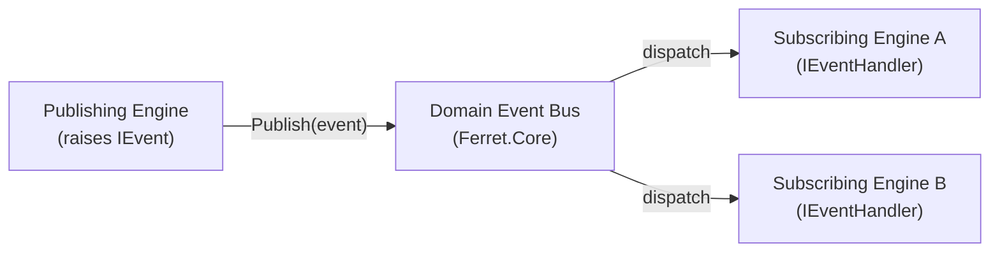

# ARCH-013 — Event Architecture

| Field | Value |
|---|---|
| **Document ID** | ARCH-013 |
| **Version** | 1.0 |
| **Status** | Draft |
| **Owner** | Ferret Project |
| **Author** | Ferret Core Team |
| **Review Status** | Pending Architecture Review |
| **Last Updated** | 2026-06-27 |
| **Parent Architecture** | ARCH-001 §7.3 — Engine Capability Matrix |

---

## Overview

Domain events are the mechanism by which engines communicate state changes without calling each other directly. Every engine that changes state publishes a domain event. Every engine that reacts to another engine's state change subscribes to that event. No engine calls another engine's concrete implementation.

This document is the canonical catalogue of all platform domain events. It defines the event schema, the publisher, the intended consumers, and the delivery guarantee for each event. Individual engine architecture documents (ARCH-003 through ARCH-010) reference events defined here.

---

## 1. Event Delivery Model

### 1.1 In-Process Event Bus

Domain events are delivered in-process through a typed event bus defined in `Ferret.Core`. The event bus is synchronous within a single engine operation and does not guarantee ordering across concurrent operations.



### 1.2 Delivery Guarantees

| Guarantee | Value |
|---|---|
| **Ordering** | Events from a single publisher are delivered in publish order. Cross-publisher ordering is undefined. |
| **Durability** | Events are in-memory only. A process restart does not replay events. State reconstruction is performed by reading the knowledge store, not by replaying events. |
| **Isolation** | A handler exception does not prevent other handlers from receiving the event. The exception is caught, logged, and does not propagate to the publisher. |
| **Transactionality** | Events are not transactional with storage writes. An event may be raised before its associated write is durable. Handlers that depend on storage consistency must re-read from the store. |

### 1.3 Event Base Schema

Every domain event carries these base fields, defined in `Ferret.Core.Events.DomainEvent`:

| Field | Type | Description |
|---|---|---|
| `EventId` | `Guid` | Unique identifier for this event occurrence |
| `OccurredAt` | `DateTimeOffset` | UTC timestamp when the event was raised |
| `CorrelationId` | `string` | Propagated from the triggering CLI invocation or MCP call |
| `Source` | `string` | Engine or component that raised the event (e.g., `"WorkspaceEngine"`) |

---

## 2. Event Catalogue

### 2.1 Workspace Events

---

#### WorkspaceInitialized

**Publisher:** Workspace Engine
**Consumers:** Index Engine (triggers initial manifest creation), Memory Engine (creates initial session record)

**Raised when:** `Ferret init` completes successfully and the `.ai/` directory structure has been created for the first time.

**Schema:**
```
WorkspaceInitialized : DomainEvent {
    WorkspaceRoot   : string        // absolute path to the repository root
    SchemaVersion   : string        // workspace schema version written (e.g. "1.0")
    ConfigPath      : string        // path to the workspace.json created
}
```

**Not raised when:** `Ferret init` is run on an already-initialised workspace (use `WorkspaceRepaired` instead, once defined).

---

#### WorkspaceUpgraded

**Publisher:** Workspace Engine
**Consumers:** Index Engine (triggers index migration if schema changed)

**Raised when:** `Ferret workspace upgrade` completes a schema migration from a prior workspace version to the current version.

**Schema:**
```
WorkspaceUpgraded : DomainEvent {
    WorkspaceRoot       : string    // absolute path to the repository root
    PreviousVersion     : string    // schema version before upgrade
    CurrentVersion      : string    // schema version after upgrade
    MigrationSteps      : string[]  // ordered list of migration step identifiers applied
}
```

---

### 2.2 Index Events

---

#### IndexBuildCompleted

**Publisher:** Index Engine
**Consumers:** Knowledge Engine (refreshes state hash), Workspace Engine (updates health status)

**Raised when:** A full `Ferret index build` operation completes, whether all files were processed or some files failed parsing.

**Schema:**
```
IndexBuildCompleted : DomainEvent {
    WorkspaceRoot       : string    // absolute path to the repository root
    FilesProcessed      : int       // count of files successfully indexed
    FilesFailed         : int       // count of files that failed during parsing
    DurationMs          : long      // elapsed time in milliseconds
    NewStateHash        : string    // knowledge state hash after the build
}
```

---

#### IndexUpdated

**Publisher:** Index Engine
**Consumers:** Knowledge Engine (refreshes state hash and cached query results)

**Raised when:** An incremental `Ferret index update` operation completes with at least one file changed.

**Not raised when:** The incremental update detects no file changes (nothing to report).

**Schema:**
```
IndexUpdated : DomainEvent {
    WorkspaceRoot       : string    // absolute path to the repository root
    FilesAdded          : int       // count of newly indexed files
    FilesModified       : int       // count of re-indexed files
    FilesRemoved        : int       // count of files removed from the index
    NewStateHash        : string    // knowledge state hash after the update
}
```

---

#### RepositoryIndexed

**Publisher:** Index Engine
**Consumers:** Knowledge Engine (signals context is ready for assembly)

**Raised when:** Any index operation (build or update) results in a consistent, queryable index state. This is the "index is ready" signal consumed by context assembly.

**Schema:**
```
RepositoryIndexed : DomainEvent {
    WorkspaceRoot   : string        // absolute path to the repository root
    StateHash       : string        // current knowledge state hash
    IndexedAt       : DateTimeOffset // timestamp the index reached this state
}
```

---

### 2.3 Knowledge Events

---

#### ContextAssembled

**Publisher:** Knowledge Engine
**Consumers:** Review Engine (uses assembled context to generate findings)

**Raised when:** A context assembly request completes and a token-bounded context is ready for an AI interaction.

**Schema:**
```
ContextAssembled : DomainEvent {
    RequestId           : string    // correlation ID for the context request
    TokensUsed          : int       // total tokens in the assembled context
    TokenBudget         : int       // original token budget for the request
    SourcesIncluded     : string[]  // categories included (e.g. "symbols", "specs", "memory")
    KnowledgeStateHash  : string    // knowledge state hash at assembly time
}
```

---

#### KnowledgeUpdated

**Publisher:** Knowledge Engine
**Consumers:** Memory Engine (updates session record to reflect knowledge state change)

**Raised when:** The Knowledge Engine detects that the underlying knowledge state hash has changed (typically after receiving `IndexUpdated`).

**Schema:**
```
KnowledgeUpdated : DomainEvent {
    WorkspaceRoot   : string        // absolute path to the repository root
    PreviousHash    : string        // state hash before the change
    CurrentHash     : string        // state hash after the change
}
```

---

### 2.4 Memory Events

---

#### MemoryUpdated

**Publisher:** Memory Engine
**Consumers:** Knowledge Engine (invalidates cached session contributions to context assembly)

**Raised when:** The session record or repository memory is written (decision recorded, working set updated, session saved).

**Schema:**
```
MemoryUpdated : DomainEvent {
    WorkspaceRoot   : string        // absolute path to the repository root
    UpdateType      : string        // "Session" | "RepositoryMemory" | "WorkingSet"
    EntryId         : string?       // identifier of the specific entry updated (if applicable)
}
```

---

### 2.5 Plugin Events

---

#### PluginLoaded

**Publisher:** Plugin Host (`Ferret.Plugins`)
**Consumers:** Workspace Engine (updates plugin health status in workspace health report)

**Raised when:** A plugin transitions to the `Active` state (see ARCH-007 §Plugin Lifecycle).

**Schema:**
```
PluginLoaded : DomainEvent {
    PluginId        : string        // reverse-domain plugin identifier from manifest
    PluginVersion   : string        // SemVer version from manifest
    Interfaces      : string[]      // interface qualified names this plugin implements
}
```

---

#### PluginFailed

**Publisher:** Plugin Host (`Ferret.Plugins`)
**Consumers:** Workspace Engine (marks plugin as Failed in health report), Telemetry (emits error metric)

**Raised when:** A plugin transitions to the `Failed` state due to an unhandled exception during execution. Not raised for a plugin that fails activation (which results in `Rejected` state, not `Failed`).

**Schema:**
```
PluginFailed : DomainEvent {
    PluginId        : string        // reverse-domain plugin identifier
    PluginVersion   : string        // SemVer version
    FailureReason   : string        // exception type name
    OperationName   : string        // the plugin operation that threw (e.g. "IParser.ParseAsync")
}
```

---

### 2.6 Specification Events

---

#### SpecificationApproved

**Publisher:** Specification Engine
**Consumers:** Knowledge Engine (writes `Specification` node to the knowledge graph), Review Engine (gates on approval before certain review types)

**Raised when:** A specification transitions to the `Approved` state through the platform's approval workflow.

**Schema:**
```
SpecificationApproved : DomainEvent {
    SpecificationId     : string    // e.g. "SP-042"
    SpecificationTitle  : string    // human-readable title
    ApproverId          : string    // user identity of the approver
    ApprovedAt          : DateTimeOffset
}
```

---

#### SpecificationTransitioned

**Publisher:** Specification Engine
**Consumers:** Work Item Publisher plugins (notify external trackers of state changes)

**Raised when:** A specification transitions between any lifecycle states (Draft → Review, Review → Approved, Approved → InDevelopment, etc.).

**Schema:**
```
SpecificationTransitioned : DomainEvent {
    SpecificationId     : string    // e.g. "SP-042"
    FromState           : string    // previous state name
    ToState             : string    // new state name
    ActorId             : string    // user identity that triggered the transition
}
```

---

### 2.7 Review Events

---

#### ReviewCompleted

**Publisher:** Review Engine
**Consumers:** Artifact Engine (signals that an artefact may be committed)

**Raised when:** A review reaches the `Approved` state — all Critical and High findings are `Resolved` and the reviewer has explicitly approved.

**Schema:**
```
ReviewCompleted : DomainEvent {
    ReviewId            : string    // e.g. "AR-001", "CR-042"
    ReviewType          : string    // "Architecture" | "Specification" | "Code" | "AI"
    ReviewerId          : string    // user identity of the approving reviewer
    FindingsTotal       : int       // total number of findings in the review
    FindingsResolved    : int       // count of findings in Resolved state
    FindingsDeferred    : int       // count of findings in Deferred state
}
```

---

#### FindingDispositioned

**Publisher:** Review Engine
**Consumers:** Artifact Engine (tracks finding history for traceability)

**Raised when:** A human reviewer transitions a finding from `Proposed` to any of `Accepted`, `Resolved`, `Rejected`, or `Deferred`.

**Schema:**
```
FindingDispositioned : DomainEvent {
    ReviewId        : string        // parent review identifier
    FindingId       : string        // unique finding identifier within the review
    Severity        : string        // "Critical" | "High" | "Medium" | "Low" | "Observation"
    FromState       : string        // previous finding state
    ToState         : string        // new finding state
    ReviewerId      : string        // user identity of the reviewer
}
```

---

### 2.8 Artifact Events

---

#### ArtifactCommitted

**Publisher:** Artifact Engine
**Consumers:** Audit log (append-only write), Review Engine (confirms artefact lifecycle complete)

**Raised when:** An AI-generated artefact is marked as committed — it has a complete review record and its provenance metadata has been written to the knowledge store.

**Schema:**
```
ArtifactCommitted : DomainEvent {
    ArtifactId          : string    // unique artefact identifier
    InteractionId       : string    // interaction ID linking to AI invocation
    ModelId             : string    // model identifier used to generate the artefact
    UserId              : string    // user identity that accepted the artefact
    KnowledgeStateHash  : string    // knowledge state at the time of generation
    ReviewId            : string    // completed review that approved this artefact
}
```

---

## 3. Event Registration

Engines register event handlers in the composition root (the DI registration phase). Event handler registration follows this pattern:

```
services.AddEventHandler<WorkspaceInitialized, IndexEngine>();
services.AddEventHandler<IndexUpdated, KnowledgeEngine>();
services.AddEventHandler<ReviewCompleted, ArtifactEngine>();
// ...
```

No engine registers its own event handlers. The composition root owns the wiring. This makes the full event subscription graph visible in one place.

---

## 4. Adding New Events

When a new engine capability produces a state change that other engines react to:

1. Define the event in `Ferret.Core.Events` with the schema following the pattern in §2.
2. Add the event to §2 of this document with publisher, consumers, trigger, and full schema.
3. Update the Capability Matrix in ARCH-001 §7.3.
4. Update the per-engine ARCH document to reference the new event in its Publishes / Consumes sections.
5. Register the handler in the composition root.

New events must not carry mutable objects or references to engine state. All event fields are value types or immutable records.

---

## 5. Design Rationale

The in-process event bus model was chosen over direct engine-to-engine calls and over a durable message queue.

**Why not direct calls?** Direct calls between engines create compile-time coupling and make testing require real engine instances. The event bus allows any engine to be tested with a test double for its event subscriptions.

**Why not a durable message queue?** The platform's primary deployment is a local CLI process. A durable queue adds infrastructure (persistence, ordering guarantees) that is unnecessary for local use and would make the default deployment significantly more complex. If the platform later supports distributed deployment, the event bus interface can be backed by a durable queue without changing the engine code.

**Trade-offs:** The in-process model loses events on process restart. This is acceptable because the platform reconstructs its view of state from the knowledge store on startup, not from event replay.

---

## Traceability

| Input Document | Role |
|---|---|
| ARCH-001 §7.3 | Engine Capability Matrix — source for publisher/consumer columns |
| ARCH-001 §8.4 | Engine-to-engine communication rules that this document formalises |
| PRINCIPLES-001 §5 | Deterministic Behaviour principle — drives the in-process delivery model |
