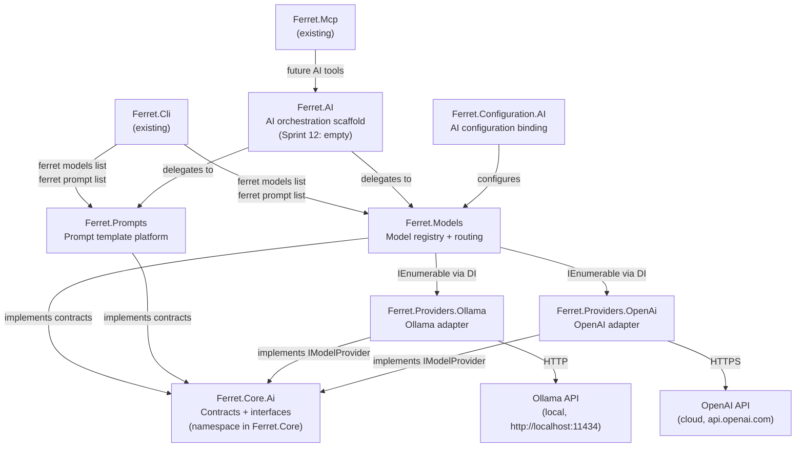
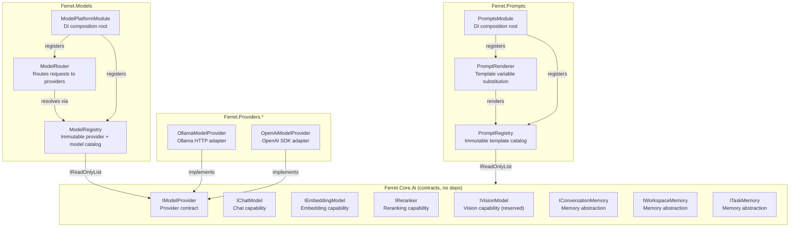
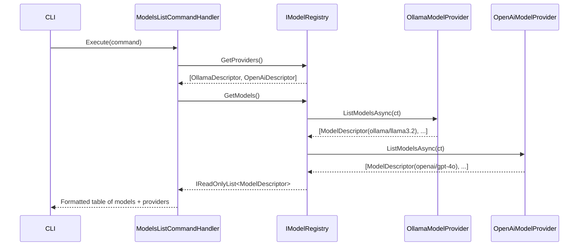
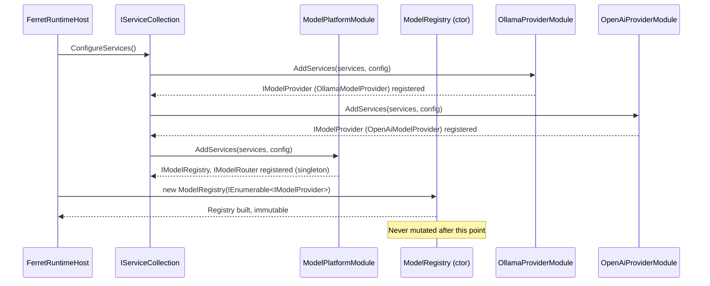
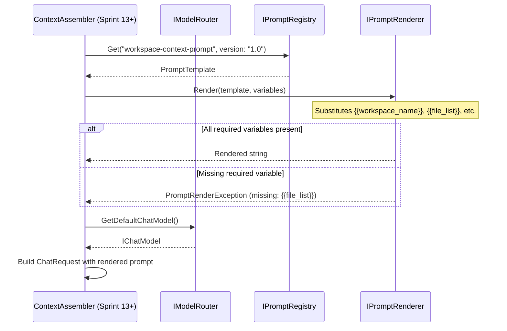

# ARCH-021 — AI Platform Architecture

| Field | Value |
|---|---|
| **Document ID** | ARCH-021 |
| **Version** | 1.0 |
| **Status** | Draft |
| **Owner** | Ferret Project |
| **Author** | Ferret Core Team |
| **Review Status** | Pending Architecture Review |
| **Date** | 2026-06-29 |
| **Last Updated** | 2026-06-29 |
| **Related ADRs** | ADR-0019 (pending) — AI Platform Architecture; ADR-0020 (pending) — Prompt Platform Architecture |
| **Related Spec** | `docs/superpowers/specs/2026-06-29-sprint-12-ai-platform-design.md` |
| **Parent Architecture** | ARCH-001 §AI Platform Layer |

---

## Purpose

This document defines the architecture of Ferret's AI Platform — the substrate on which all AI-powered features are built. It covers the provider abstraction, model registry and routing, prompt platform, and memory abstractions introduced in Sprint 12.

This document describes *structure and contracts*, not feature implementation. It does not cover context assembly (`ContextPackage`), AI chat (`ferret ask`), knowledge graph, hybrid search, or semantic search. Those features are specified in their own documents and depend on the foundation defined here.

---

## Scope

**Covers:**
- AI provider abstraction and lifecycle (Identity → Descriptor → Instance → Status)
- Core AI contracts: chat, embedding, reranking, and vision interfaces
- Model registry and routing
- Prompt platform: template, registry, renderer, variables
- Memory abstractions (interfaces and null implementations only)
- AI configuration schema
- SDK isolation boundary rules
- Architecture tests that enforce the isolation boundary

**Does not cover:**
- Any concrete feature built on top of the AI Platform (context assembly, chat, ask, summarisation)
- Conversation history storage implementation (Sprint 15)
- Semantic or hybrid search (Sprint 15)
- Knowledge graph (Sprint 16)
- REST, HTTP, or WebSocket hosts for AI endpoints

---

## 1. Overview

The Ferret AI Platform is the fourth major platform layer added to ContextOS, following the Connector Platform (Sprint 8), the Content Ingestion Platform (Sprint 9), and the Information Retrieval Platform (Sprint 10). Like each of its predecessors, it establishes a set of stable contracts, a provider registry, and a composition layer — so that all downstream AI features can be built without depending on any specific AI vendor.

Before Sprint 12, Ferret is a complete knowledge platform: it discovers, ingests, indexes, and retrieves content, and it exposes those capabilities to AI hosts through the MCP Runtime (Sprint 11). What it lacks is the ability to *reason* about content — to send a prompt to a model, embed a document for vector search, or rerank results by relevance. The AI Platform provides these capabilities as first-class platform services with the same architectural discipline applied to every previous platform.

The AI Platform occupies a new layer in the Ferret stack, sitting above Platform Services and below AI-powered features. It is host-independent: neither `Ferret.Cli` nor `Ferret.Mcp` knows which provider is active. The CLI commands introduced in Sprint 12 (`ferret models list`, `ferret prompt list`) exercise the platform registry — not any specific provider.

The central architectural insight is the same one established in ADR-0013 (Capability-Based Platform Architecture): capabilities attach to components via interfaces, not class hierarchies. An AI model is not a class that inherits from `BaseModel`; it is a component that implements `IChatModel`, `IEmbeddingModel`, or `IReranker` — the capabilities it actually possesses. A provider that supports only chat but not embeddings is first-class; it does not need to stub out a base class.

---

## 2. C2 — Container Diagram

The diagram below shows the AI Platform containers and their interactions. `Ferret.Core.Ai` is a namespace addition to the existing `Ferret.Core` package, not a new project — it follows the same pattern as `Ferret.Core.Search` and `Ferret.Core.Connectors`. All other boxes are new packages.



---

## 3. C3 — Component Diagram

The diagram shows the internal components of the AI Platform layer. `Ferret.Models` is the central runtime; `Ferret.Prompts` is independent. Both depend on `Ferret.Core.Ai` contracts but not on each other.



### Component Responsibilities

**ModelRegistry** — Built once at startup from all `IModelProvider` instances registered in DI. Immutable after construction. Provides catalog queries: list providers, list models, look up a model by ID. Never mutated at runtime.

**ModelRouter** — Resolves the correct `IChatModel` or `IEmbeddingModel` for a given request. Reads default model IDs from `AiOptions` and delegates to the registry. Stateless after startup.

**ModelPlatformModule** — DI composition root for `Ferret.Models`. Registers `IModelRegistry` as a singleton and `IModelRouter` as a singleton. Consumes `IEnumerable<IModelProvider>` from DI — provider packages register their `IModelProvider` implementations.

**PromptRegistry** — Built once at startup from registered `PromptTemplate` instances. Provides lookup by name and version. Supports listing all registered templates.

**PromptRenderer** — Stateless. Takes a `PromptTemplate` and `PromptVariables` and produces a rendered string. Uses `{{variable}}` substitution; unknown variables produce a validation error.

**OllamaModelProvider / OpenAiModelProvider** — Thin adapters. Each implements `IModelProvider` and returns `IChatModel` / `IEmbeddingModel` instances backed by the respective vendor SDK. Vendor SDK types are completely confined to these packages.

---

## 4. Data Flow

### Flow 1 — `ferret models list` (primary happy path)

A developer runs `ferret models list`. The CLI handler queries the model registry and renders the result.



### Flow 2 — AI Platform startup (initialisation flow)

On `ferret serve` or `ferret models list`, the DI container is built and the AI Platform initialises.



### Flow 3 — Provider unavailable (error path)

A provider is configured but its backend is unreachable. The error is isolated; other providers continue to serve.

```mermaid
sequenceDiagram
    participant Handler as ModelsListCommandHandler
    participant Registry as IModelRegistry
    participant Ollama as OllamaModelProvider
    participant OpenAI as OpenAiModelProvider

    Handler->>Registry: GetModels()
    Registry->>Ollama: ListModelsAsync(ct)
    Ollama-->>Registry: ProviderUnavailableException (Ollama offline)
    Note over Registry: Partial failure — log warning, continue
    Registry->>OpenAI: ListModelsAsync(ct)
    OpenAI-->>Registry: [ModelDescriptor(openai/gpt-4o)]
    Registry-->>Handler: Partial result + [ProviderError(ollama, "Connection refused")]
    Handler-->>CLI: Table shows OpenAI models; Ollama listed as unavailable
```

### Flow 4 — Prompt render (prompt platform)

A component (Sprint 13+) renders a prompt template with variables.



---

## 5. Key Design Decisions

| Decision | Rationale | ADR |
|---|---|---|
| Ferret owns all AI contracts; vendor SDK types are confined to provider packages | The same isolation principle applied to MCP (ADR-0017) prevents provider churn from cascading through the platform. If Ollama changes its API or a provider is replaced, only the adapter package changes. | ADR-0019 (pending) |
| `IModelProvider` is the registration unit; `IChatModel`/`IEmbeddingModel`/`IReranker` are independent capabilities | Following ADR-0013 (capability composition over inheritance), a provider that supports only chat is not forced to stub out embedding. This prevents false capability claims and simplifies testing. | ADR-0013 |
| `ModelRegistry` is immutable after startup | Mutable registries require locking and introduce race conditions. The connector and MCP registries (Sprints 8 and 11) both adopted this pattern. Providers that come online after startup require a platform restart — this is acceptable for Sprint 12. | — |
| Model routing is configuration-driven (`AiOptions.DefaultChatModel`) | Hardcoding a default model in code creates a build-time coupling to a specific provider. Configuration-driven routing means the same binary works with Ollama locally and OpenAI in production. | ADR-0019 (pending) |
| Prompt templates use `{{variable}}` substitution; a missing required variable is a render error | Prompt correctness is critical for model behaviour. Silent variable omission (producing a partial prompt) is worse than a loud failure. Required variables are declared on the template at registration time. | ADR-0020 (pending) |
| Memory abstractions are interfaces-only in Sprint 12; null implementations serve as stand-ins | Building memory storage before the features that use it (Sprint 14 chat, Sprint 15 full memory) risks over-engineering. Null implementations let the interfaces stabilise before any implementation commits to a storage strategy. | — |
| `Ferret.AI` is scaffolded but empty in Sprint 12 | Context assembly, the first real feature requiring AI, lands in Sprint 13. Scaffolding the package now gives Sprint 13 a clear home for orchestration code without placing it in `Ferret.Models` (a registry, not an orchestrator). | — |

---

## 6. Interfaces and Contracts

### Public API Surface

| Operation | Parameters | Returns | Description |
|---|---|---|---|
| **IModelProvider** | | | |
| Describe provider | — | Provider descriptor (name, capabilities, version) | Returns the static identity of this provider. Does not require network access. |
| Get chat model | Model identifier | Chat model instance, or nothing if not supported | Resolves a chat-capable model by ID. Returns nothing if the model ID is unknown to this provider. |
| Get embedding model | Model identifier | Embedding model instance, or nothing | Resolves an embedding-capable model by ID. |
| Get reranker | Model identifier | Reranker instance, or nothing | Resolves a reranking-capable model by ID. |
| List models | Cancellation token | List of model descriptors | Enumerates all models this provider can serve. May require a network call (e.g., Ollama's `/api/tags`). |
| **IChatModel** | | | |
| Describe model | — | Model descriptor (ID, capabilities, context window) | Returns static metadata without network access. |
| Chat | Message list, options, cancellation | Single chat response | Sends a complete message list and returns one response. |
| Chat (streaming) | Message list, options, cancellation | Async stream of response chunks | Sends a complete message list and streams partial responses as they arrive. |
| **IEmbeddingModel** | | | |
| Describe model | — | Model descriptor | Returns static metadata. |
| Embed single | Text, options, cancellation | Embedding result (vector + token count) | Embeds a single text string. |
| Embed batch | List of texts, options, cancellation | List of embedding results | Embeds multiple texts in one call. Implementations may batch internally. |
| **IReranker** | | | |
| Describe model | — | Model descriptor | Returns static metadata. |
| Rerank | Query, document list, cancellation | Ranked document list with scores | Scores each document against the query and returns documents in descending relevance order. |
| **IModelRegistry** | | | |
| Get all providers | — | List of provider descriptors | Returns descriptors for all registered providers. |
| Get provider | Provider identifier | Provider instance, or nothing | Looks up a specific provider by ID. |
| Get all models | — | List of model descriptors | Returns descriptors for all models across all providers. May call `ListModelsAsync` on each provider. |
| Get model | Model identifier | Model descriptor, or nothing | Looks up a specific model descriptor. |
| **IModelRouter** | | | |
| Get default chat model | — | Chat model instance | Returns the chat model identified by `AiOptions.DefaultChatModel`. Throws if no default is configured or the model is unavailable. |
| Get chat model by ID | Model identifier | Chat model instance, or nothing | Resolves a specific model by fully-qualified ID. |
| Get default embedding model | — | Embedding model instance | Returns the embedding model identified by `AiOptions.DefaultEmbeddingModel`. |
| Get embedding model by ID | Model identifier | Embedding model instance, or nothing | Resolves a specific embedding model by fully-qualified ID. |
| **IPromptRegistry** | | | |
| Register | Template | — | Registers a prompt template. Templates are registered at startup; duplicate names+versions are an error. |
| Get | Name, version | Template, or nothing | Retrieves a prompt template by name and version. |
| Get latest | Name | Template, or nothing | Retrieves the highest version of a named template. |
| Get all | — | List of templates | Returns all registered templates. |
| **IPromptRenderer** | | | |
| Render | Template, variables | Rendered string | Substitutes all `{{variable}}` placeholders. Throws `PromptRenderException` if any required variable is absent from the provided variables. |
| Validate | Template, variables | Validation result | Non-throwing check: returns the set of missing required variables without rendering. |
| **IConversationMemory** | | | |
| Add turn | Conversation turn | — | Records one exchange (user message + assistant response). |
| Get recent | Count, cancellation | List of recent turns | Returns the most recent N turns, newest first. |
| Clear | Cancellation | — | Clears all stored turns. |

### Dependencies

| Dependency | Module | Purpose |
|---|---|---|
| `IConfiguration` | `Ferret.Core` | Reads `AiOptions` from the host configuration |
| `IEnumerable<IModelProvider>` | DI (registered by provider packages) | All active AI providers, injected into `ModelRegistry` |
| `IEnumerable<PromptTemplate>` | DI (registered by feature packages) | All prompt templates, injected into `PromptRegistry` |
| `ILogger<T>` | Microsoft.Extensions.Logging | Structured logging for provider calls and routing decisions |

---

## 7. Configuration

The AI Platform reads from the `Ferret:Ai` section of the host configuration (typically `appsettings.json` or `.ferret/config.json`). API keys must be supplied via environment variables; they must never be committed to disk.

```json
{
  "Ferret": {
    "Ai": {
      "DefaultChatModel": "ollama/llama3.2",
      "DefaultEmbeddingModel": "ollama/nomic-embed-text",
      "DefaultReranker": null,
      "Providers": {
        "Ollama": {
          "Enabled": true,
          "BaseUrl": "http://localhost:11434",
          "TimeoutSeconds": 120
        },
        "OpenAi": {
          "Enabled": false,
          "ApiKey": "${OPENAI_API_KEY}",
          "BaseUrl": "https://api.openai.com/v1",
          "TimeoutSeconds": 60
        }
      }
    }
  }
}
```

### Field Reference

| Section.Field | Default | Description | Constraints |
|---|---|---|---|
| `Ai.DefaultChatModel` | `"ollama/llama3.2"` | Fully-qualified model ID used by `IModelRouter.GetDefaultChatModel()` | Format: `{provider}/{model-name}`; provider must be enabled |
| `Ai.DefaultEmbeddingModel` | `"ollama/nomic-embed-text"` | Fully-qualified model ID for default embeddings | Same format constraints as DefaultChatModel |
| `Ai.DefaultReranker` | `null` | Fully-qualified model ID for default reranking, or null to disable | Optional; format: `{provider}/{model-name}` |
| `Ai.Providers.Ollama.Enabled` | `true` | Whether the Ollama provider is registered | Boolean |
| `Ai.Providers.Ollama.BaseUrl` | `"http://localhost:11434"` | Ollama server base URL | Valid HTTP(S) URI |
| `Ai.Providers.Ollama.TimeoutSeconds` | `120` | Request timeout for Ollama API calls | Integer ≥ 1 |
| `Ai.Providers.OpenAi.Enabled` | `false` | Whether the OpenAI provider is registered | Boolean |
| `Ai.Providers.OpenAi.ApiKey` | — | OpenAI API key (Required when Enabled) | Non-empty string; use `${ENV_VAR}` form |
| `Ai.Providers.OpenAi.BaseUrl` | `"https://api.openai.com/v1"` | OpenAI API base URL (override for Azure or proxies) | Valid HTTPS URI |
| `Ai.Providers.OpenAi.TimeoutSeconds` | `60` | Request timeout for OpenAI API calls | Integer ≥ 1 |

Environment variable overrides follow the pattern `FERRET_AI_{SECTION}_{FIELD}`. Example: `FERRET_AI_PROVIDERS_OPENAI_APIKEY`.

---

## 8. Error Handling

### Error Types

| Error | Trigger | Platform Behaviour | User-Facing Message |
|---|---|---|---|
| `ModelNotFoundException` | `IModelRouter` cannot find the configured default model | Startup warning; CLI returns exit code 1 for model commands | "Model '{id}' is not available. Run `ferret models list` to see available models." |
| `ProviderUnavailableException` | Network connection to provider backend fails | `ListModelsAsync` returns partial results; provider marked unavailable in registry | "Provider '{name}' is unreachable ({reason}). Check that the service is running." |
| `PromptRenderException` | Required template variable absent from `PromptVariables` | Render aborted; exception propagates to caller | "Prompt '{name}' requires variable '{{variable}}' which was not provided." |
| `ProviderConfigurationException` | Required field missing (e.g., `ApiKey` absent when `Enabled: true`) | Startup failure; affected provider is not registered | "Provider '{name}' is enabled but has invalid configuration: {field} is required." |
| `ModelCapabilityException` | Caller requests a capability the model does not support (e.g., embeddings from a chat-only model) | Exception propagates; no state change | "Model '{id}' does not support {capability}. Use an embedding model instead." |

### Failure Isolation

Provider failures are isolated to the provider that failed. If Ollama is offline, the OpenAI provider continues to serve normally; `ModelRegistry.ListModelsAsync` returns results from all reachable providers and records errors for unreachable ones. A failed `IPromptRenderer.Render` call leaves the prompt registry unchanged; no partial state is written. The workspace is never modified by AI Platform operations.

---

## 9. Observability

### Logs

| Event | Level | Message |
|---|---|---|
| Provider registered | Information | `"AI provider '{ProviderId}' registered with {ModelCount} models"` |
| Provider unavailable at startup | Warning | `"AI provider '{ProviderId}' is unreachable: {Reason}. Provider will be excluded."` |
| Model registry built | Information | `"Model registry built: {ProviderCount} providers, {ModelCount} models total"` |
| Chat request sent | Debug | `"Chat request to '{ModelId}': {MessageCount} messages, temperature={Temperature}"` |
| Chat response received | Debug | `"Chat response from '{ModelId}': {FinishReason}, usage={InputTokens}/{OutputTokens} tokens"` |
| Prompt rendered | Debug | `"Prompt '{TemplateName}@{Version}' rendered: {CharCount} characters"` |
| Routing resolved | Debug | `"Routing '{Capability}' to model '{ModelId}' via provider '{ProviderId}'"` |
| API key loaded from environment | Information | `"AI provider '{ProviderId}' API key loaded from environment variable '{EnvVar}'"` |

### Metrics

| Metric Name | Type | Description |
|---|---|---|
| `Ferret.ai.chat.duration` | Histogram (ms) | End-to-end duration of a `IChatModel.ChatAsync` call, by model ID and provider |
| `Ferret.ai.chat.tokens.input` | Counter | Total input tokens consumed across all chat calls, by model ID |
| `Ferret.ai.chat.tokens.output` | Counter | Total output tokens produced across all chat calls, by model ID |
| `Ferret.ai.embedding.duration` | Histogram (ms) | Duration of `IEmbeddingModel.EmbedAsync`, by model ID |
| `Ferret.ai.embedding.batch_size` | Histogram (count) | Batch size distribution for `EmbedBatchAsync` |
| `Ferret.ai.provider.errors` | Counter | Total provider errors by provider ID and error type |
| `Ferret.ai.prompt.render.duration` | Histogram (ms) | Duration of `IPromptRenderer.Render`, by template name |
| `Ferret.ai.registry.providers` | Gauge | Number of registered, reachable providers |
| `Ferret.ai.registry.models` | Gauge | Number of registered models across all providers |

### Traces

Root span: `ai.<operation>` (e.g., `ai.chat`, `ai.embed`, `ai.rerank`, `ai.prompt.render`)

| Attribute | Description |
|---|---|
| `ai.model.id` | Fully-qualified model identifier (e.g., `ollama/llama3.2`) |
| `ai.provider.id` | Provider identifier (e.g., `ollama`, `openai`) |
| `ai.model.capability` | Capability used: `chat`, `embedding`, `reranking` |
| `ai.tokens.input` | Input token count (available after response) |
| `ai.tokens.output` | Output token count (available after response) |
| `ai.prompt.name` | Template name (for prompt.render spans) |
| `ai.prompt.version` | Template version (for prompt.render spans) |
| `ai.finish_reason` | Model finish reason: `stop`, `length`, `tool_calls`, `error` |

---

## 10. Security Considerations

**Trust interactions.** The AI Platform operates at the same trust level as other platform services — below the CLI and MCP presentation layers, above external provider APIs. `Ferret.Core.Ai` contracts have no trust boundary; they are pure interfaces. Provider packages that call external APIs operate at a lower trust level and must treat all API responses as potentially untrusted.

**API key handling.** API keys for cloud providers (OpenAI, Anthropic, Azure) are sensitive credentials. The AI Configuration module reads keys only from environment variables or secrets providers — never from committed files. The `AiOptions.Providers.{Name}.ApiKey` field must use `${ENV_VAR}` interpolation in any committed configuration file. Keys must not appear in logs, traces, or diagnostic output; the logging events defined in §9 explicitly avoid logging credential values.

**Prompt injection.** Prompt templates combined with user-controlled content create a prompt injection risk. `IPromptRenderer` performs variable substitution only; it does not execute template logic, evaluate expressions, or allow template control flow. Content injected via `PromptVariables` is treated as opaque text. Callers that embed user input in prompts are responsible for sanitising that input before passing it to `PromptRenderer`.

**Permission requirements.** No plugin or connector interacts with the AI Platform in Sprint 12. Future plugin access will require an explicit `AiCapability` permission (reserved, not yet defined).

**Attack surface.** The primary attack surfaces are: (1) credential exfiltration via logs — mitigated by the logging rules in §9; (2) SSRF via a maliciously configured `BaseUrl` — mitigated by validating `BaseUrl` against an allow-list of URI schemes (`http`, `https`) at configuration bind time; (3) prompt injection via unvalidated user content passed to `PromptRenderer` — responsibility lies with the caller.

---

## 11. Scalability and Performance

| Operation | Complexity | Notes |
|---|---|---|
| `ModelRegistry.GetProviders()` | O(1) | Returns a pre-built immutable list |
| `ModelRegistry.GetModels()` | O(P) | P = number of providers; calls `ListModelsAsync` on each |
| `ModelRegistry.GetModel(id)` | O(1) | Dictionary lookup after initial `ListModelsAsync` cache is built |
| `ModelRouter.GetDefaultChatModel()` | O(1) | Single dictionary lookup against the registry cache |
| `IPromptRegistry.Get(name, version)` | O(1) | Dictionary lookup on a pre-built immutable map |
| `IPromptRenderer.Render(template, vars)` | O(V + C) | V = variable count, C = template character count |
| `IChatModel.ChatAsync` | O(T) network-bound | T = response token count; latency dominated by provider API round-trip |
| `IEmbeddingModel.EmbedBatchAsync` | O(N × D) network-bound | N = document count, D = embedding dimension; implementations may parallelize |

**Performance targets from PRD-001 §11.1:** No PRD-001 performance targets have been defined for AI operations as of Sprint 12. The AI Platform is subject to external API latency which is inherently variable. Token budget constraints for context assembly (Sprint 13) will establish practical limits on prompt length and model call frequency.

---

## 12. Open Questions

| # | Question | Owner | Impact |
|---|---|---|---|
| 1 | Should `ModelRegistry` eagerly call `ListModelsAsync` on all providers at startup, or lazily on first query? Eager startup catches misconfiguration early but increases boot time. | Architecture Review | Affects startup latency and the provider failure isolation model |
| 2 | Should `PromptTemplate.Version` use semantic versioning or monotonic integers? Semver is expressive but adds parsing complexity; integers are simpler but less descriptive. | Architecture Review | Affects template upgrade paths and the `GetLatest` API |
| 3 | Should `IConversationMemory` be scoped per-session or per-workspace? Session scope is simpler; workspace scope allows history to persist across CLI invocations. | Product | Drives the Sprint 15 memory implementation |
| 4 | How should the `ModelDescriptor` advertise context window size? Ollama provides this at the model level; OpenAI documents it externally. A missing value vs a stale value are both problematic. | Architecture Review | Affects token budget calculations in Sprint 13 |

---

## Cross References

| Document | Relationship |
|---|---|
| ARCH-001 | Parent — overall Ferret system architecture |
| ARCH-019 | Connector Platform — established the platform pattern and ADR-0013 principles applied here |
| ARCH-020 | Workspace Architecture — AI Platform reads workspace configuration |
| ADR-0013 | Capability-Based Platform Architecture — governing principle for interface composition |
| ADR-0016 | Integration Platform Architecture — Host Architecture Pattern extended by AI Platform |
| ADR-0018 | Application Layer Reserved — `Ferret.Application` activation trigger includes AI orchestration in Sprint 13+ |
| ADR-0019 (pending) | AI Platform Architecture — formalises provider isolation and registry decisions |
| ADR-0020 (pending) | Prompt Platform Architecture — formalises template, registry, and rendering decisions |
| `docs/superpowers/specs/2026-06-29-sprint-12-ai-platform-design.md` | Sprint 12 authoritative design specification |
| `docs/006-CLI/` | CLI commands introduced: `ferret models`, `ferret prompt` |

---

## Revision History

| Version | Date | Author | Summary |
|---|---|---|---|
| 1.0 | 2026-06-29 | Ferret Core Team | Initial draft — Sprint 12 AI Platform Foundation. |
