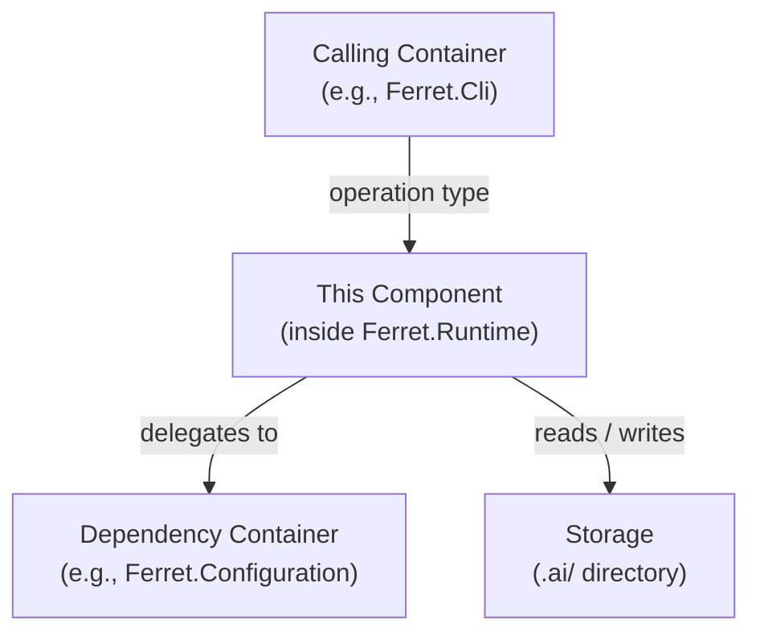
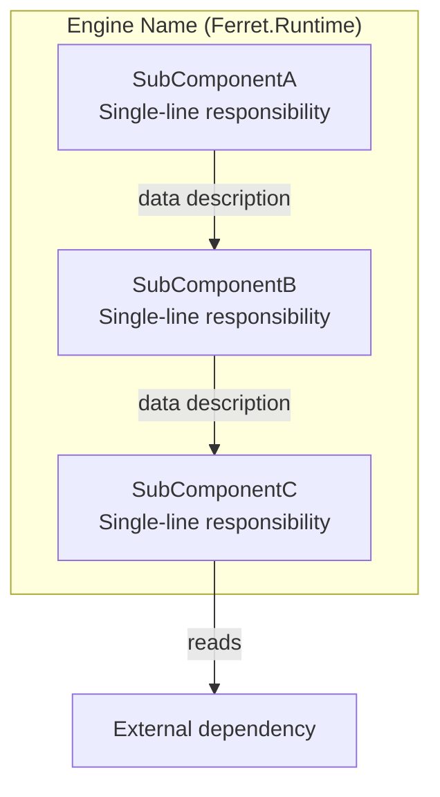
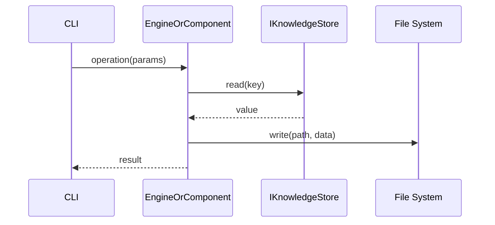
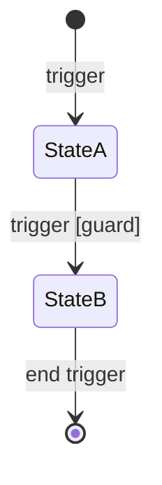

# ARCH-TEMPLATE-001 — Architecture Document Standard

| Field | Value |
|---|---|
| **Document ID** | ARCH-TEMPLATE-001 |
| **Version** | 1.0 |
| **Status** | Accepted |
| **Owner** | Ferret Project |
| **Author** | Ferret Core Team |
| **Review Status** | Accepted |
| **Last Updated** | 2026-06-27 |

---

## Purpose

This document defines the standard that all Ferret architecture documents (ARCH-NNN) must follow. It specifies required sections, metadata fields, diagram conventions, traceability requirements, quality gates, and review criteria.

When instructed to create an architecture document, use this standard as the complete specification. A prompt of the form `"Create ARCH-005 using ARCH-TEMPLATE-001"` means: produce a document that fully satisfies every requirement in this file.

---

## Scope

This standard applies to:

- All documents with identifier format `ARCH-NNN`
- Two document types: **System-Level** and **Component-Level** (defined in §1)

It does not apply to ADRs, specifications, PRDs, or reviews. Those have their own templates.

---

## 1. Document Types

### Type A — System-Level

A system-level document describes the platform as a whole or a major cross-cutting architectural concern. It operates at C1 (context) and C2 (container) level.

**Examples:** ARCH-001 (Overall System Architecture), ARCH-012 (Security Architecture)

**Distinguishing characteristic:** Its audience is architects and technical leads who need to understand the structure of the entire platform or one of its overarching concerns.

---

### Type B — Component-Level

A component-level document describes a single engine, module, or subsystem. It operates at C2 (container context) and C3 (component) level.

**Examples:** ARCH-002 (Ferret.Core), ARCH-003 (Workspace), ARCH-007 (Plugin Architecture)

**Distinguishing characteristic:** Its audience is engineers who will implement or integrate with that specific component. It includes interface contracts, data flows, configuration schemas, and error handling.

---

## 2. Required Metadata

Every ARCH-NNN document opens with this metadata table immediately after the H1 heading. All fields are required. Use `—` for fields that do not apply; never leave a field blank.

```markdown
| Field | Value |
|---|---|
| **Document ID** | ARCH-NNN |
| **Version** | 1.0 |
| **Status** | Draft |
| **Owner** | Ferret Project |
| **Author** | [Author name or team] |
| **Review Status** | Pending Architecture Review |
| **Date** | YYYY-MM-DD |
| **Last Updated** | YYYY-MM-DD |
| **Related ADRs** | ADR-NNNN (title) — or "None" — or "ADR-NNNN (pending)" |
| **Related Spec** | PRD-001 §section, or ARCH-001 §section |
| **Parent Architecture** | ARCH-001 §N — [section title] — Component-Level only; omit for System-Level |
```

### Status Values

| Value | Meaning |
|---|---|
| `Draft` | Being written; not ready for review |
| `Review` | Submitted for architecture review; no further edits without reviewer approval |
| `Accepted` | Architecture review completed; all findings resolved |
| `Deprecated` | Superseded by a later document; retained for history |
| `Superseded` | Replaced; links to the replacement document |

### Version Rules

- Begin at `1.0`.
- Increment the minor version (`1.1`, `1.2`) for changes that do not alter the architectural decisions.
- Increment the major version (`2.0`) for changes that revise an accepted architectural decision.
- A major version change requires a new ADR.

---

## 3. Required Sections — Component-Level (Type B)

These sections are required for every Type B document, in this order. Section names and H2 headings must match exactly (content adapts to the component being described).

| # | Heading | Required | Minimum Content |
|---|---|---|---|
| — | Metadata table | Yes | All fields populated |
| — | Purpose | Yes | 1–3 paragraphs; see §3.1 |
| — | Scope | Yes | Bulleted: what is covered, what is not |
| 1 | Overview | Yes | See §3.2 |
| 2 | C2 — Container Diagram | Yes | See §4.2 |
| 3 | C3 — Component Diagram | Yes | See §4.3 |
| 4 | Data Flow | Yes | ≥ 3 sequence diagrams; see §4.4 |
| 5 | Key Design Decisions | Yes | ≥ 3 decisions in table format; see §3.5 |
| 6 | Interfaces and Contracts | Yes | Public API Surface + Dependencies; see §3.6 |
| 7 | Configuration | Yes | Example schema + field reference table; see §3.7 |
| 8 | Error Handling | Yes | Error type table + failure isolation; see §3.8 |
| 9 | Observability | Yes | Logs + Metrics + Traces tables; see §3.9 |
| 10 | Security Considerations | Yes | Trust, data sensitivity, permissions; see §3.10 |
| 11 | Scalability and Performance | Yes | Complexity table + performance targets; see §3.11 |
| 12 | Open Questions | Yes | Table; "None at this time" if empty; see §3.12 |
| — | Cross References | Yes | Table; see §5 |
| — | Revision History | Yes | Table; ≥ 1 entry |

### 3.1 Purpose and Scope (Header block)

Write two blocks immediately after the metadata table and before §1 Overview:

**Purpose** (1–2 paragraphs): What this document covers and why it exists. State explicitly what it does *not* cover and where those concerns are documented.

**Scope** (bulleted): A covers/does-not-cover list. This is not the same as the Overview — it describes the document, not the component.

---

### 3.2 Overview

**What it must contain:**
1. What the component is and what problem it solves — stated in one sentence.
2. Its role in the platform architecture: which layer it belongs to, which module it is in.
3. What this document adds beyond the parent architecture document (reference the parent section explicitly).

**Length:** 3–5 paragraphs. Not a list.

**What would fail review:** A single paragraph that only restates the component name; no mention of the parent architecture reference; undefined jargon.

---

### 3.3 C2 — Container Diagram

See §4.2 for diagram conventions. The diagram must show:

- The component's containing module/package
- All modules and external systems that it interacts with
- Every connection labelled with the interaction type (reads/writes, invokes, emits, subscribes)
- At minimum: the Presentation Layer entry point, the domain engine, and the storage boundary

**What would fail review:** Diagram with unlabelled arrows; diagram that shows only the component in isolation; diagram that misrepresents the dependency direction defined in ARCH-001 §8.

---

### 3.4 C3 — Component Diagram

See §4.3 for diagram conventions. The diagram must show:

- All internal sub-components with their single-line responsibility label
- All data and control flows between sub-components, labelled
- External dependencies that internal components reach (e.g., file system, `IKnowledgeStore`)
- Use `subgraph` to group the internal components within the containing engine/module

**What would fail review:** All internal logic collapsed into a single box; sub-components without responsibility labels; arrows without labels.

---

### 3.5 Key Design Decisions

A table with columns: **Decision** | **Rationale** | **ADR**.

**Requirements:**
- At minimum 3 decisions.
- Every significant non-obvious design choice must have a row.
- The Rationale column must explain *why*, not restate *what*.
- The ADR column must reference an existing accepted ADR, a pending ADR identifier (e.g., `ADR-0007 (pending)`), or `—` if no ADR is warranted (justify in a note below the table).

**What would fail review:** Fewer than 3 decisions; rationale that only restates the decision; missing ADR references for decisions that warrant formalisation.

---

### 3.6 Interfaces and Contracts

Two subsections:

**Public API Surface**

A table of all operations on the component's primary interface (`IXxxEngine` or equivalent). Columns: **Operation** | **Parameters** | **Returns** | **Description**.

Rules:
- Describe operations at concept level. No method signatures, no type names from implementation libraries.
- Use plain-English parameter names: `rootPath`, `options`, `depth` — not `string path`, `InitOptions opts`.
- Every operation in the primary `IXxxEngine` interface must appear here.

**Dependencies**

A table: **Dependency** | **Module** | **Purpose**.

Rules:
- List every interface or type from `Ferret.Core` that the component depends on.
- List every other platform module the component references.
- Do not list third-party libraries (those belong in ADRs and project files).

**What would fail review:** Operations missing from the table; code snippets or type annotations; a dependency omitted from the table.

---

### 3.7 Configuration

Two parts:

**Example Schema** — A fenced JSON block showing a realistic, populated example of the configuration section relevant to this component. Values must be realistic, not placeholder strings like `"value"` or `"TODO"`.

**Field Reference Table** — Columns: **Section.Field** | **Default** | **Description** | **Constraints**.

Rules:
- Include every user-facing configuration field.
- Defaults must be actual values, not `—` unless there is genuinely no default (in which case mark the field as Required).
- Constraints column: state type, range, allowed values, or pattern.
- Environment variable override names follow the pattern `Ferret_SECTION_FIELD` (all caps, underscores).

**What would fail review:** Placeholder values in the example; missing defaults; constraints left blank for constrained fields.

---

### 3.8 Error Handling

Two parts:

**Error Type Table** — Columns: **Error** | **Trigger** | **Platform Behaviour** | **User-Facing Message**.

Rules:
- Every exception type the component raises must have a row.
- Platform Behaviour: exit code + what state the system is in after the error.
- User-Facing Message: the exact message the CLI will display (or the pattern for it). Must be actionable.

**Failure Isolation** — A prose description (1 paragraph) explaining what guarantees hold when this component fails. At minimum: is the workspace left in a valid state? Is any written data rolled back?

**What would fail review:** Error types without user-facing messages; no failure isolation description; vague messages ("An error occurred").

---

### 3.9 Observability

Three subsections in a single table-per-pillar format:

**Logs** — Columns: **Event** | **Level** | **Message pattern** (include `{variable}` placeholders).

**Metrics** — Columns: **Metric Name** | **Type** | **Description**. Names follow `Ferret.component.operation.unit` convention.

**Traces** — Define the root span name pattern (e.g., `workspace.<operation>`), child span patterns, and required span attributes. A table is appropriate: **Attribute** | **Description**.

Rules:
- Every public operation must emit at minimum one Information log event and one root trace span.
- Metrics must cover duration (Histogram) for all significant operations, and Gauge for relevant state values.
- Metric names must not conflict with metric names defined in other ARCH documents.

**What would fail review:** Missing metrics for performance-sensitive operations; log messages that expose secrets or credentials; no trace span definition.

---

### 3.10 Security Considerations

Must address at minimum:

1. **Trust interactions** — Which trust level does this component operate at? What trust level are its callers? What trust level are its dependencies? Reference ARCH-001 §20 (or ARCH-012 when available).
2. **Sensitive data** — Does this component handle file paths, user identities, or configuration values that may contain credentials? How are they protected?
3. **Permission requirements** — If plugins interact with this component, which permissions do they require?
4. **Attack surface** — What is the primary attack surface? Path traversal, injection, privilege escalation, data exfiltration? What mitigations are in place?

**What would fail review:** A single sentence; no mention of trust level; no consideration of plugin interactions if the component has a plugin extension point.

---

### 3.11 Scalability and Performance

Two parts:

**Complexity Table** — Columns: **Operation** | **Complexity** | **Notes**. Use standard Big-O notation. Where the variable is non-obvious, define it in the Notes column.

**Performance Targets** — Where PRD-001 §11.1 defines a target for this component's operations, restate the target and note how the design achieves it. If no PRD-001 target applies, note it explicitly.

**What would fail review:** Operations with no complexity estimate; no reference to PRD-001 performance targets; complexity stated as "fast" or "slow" without notation.

---

### 3.12 Open Questions

A table: **#** | **Question** | **Owner** | **Impact**.

Rules:
- Every unresolved design question must appear here.
- If none exist, write "None at this time." Do not omit the section.
- Owner must be a role (Architecture Review, Product, Security) not an individual name.
- Impact must describe what changes if the question is answered differently.
- Resolved open questions are removed and, if they required an ADR, the ADR is cited in the relevant section.

---

## 4. Diagram Conventions

### 4.1 General Rules

- All diagrams use Mermaid syntax enclosed in a fenced block with the `mermaid` language tag.
- Every diagram has a prose paragraph immediately before or after it describing what it shows and what to look for.
- Diagrams must render correctly. Verify by checking Mermaid syntax before submission.
- Node labels may use `\n` for multi-line text. Maximum 3 lines per node.
- No diagram uses raw ASCII art (`┌`, `─`, `└`, etc.). All diagrams are Mermaid.

### 4.2 C2 — Container Context Diagram

Use `graph TD` (top-down) or `graph LR` (left-right). Choose `LR` if there are more than 6 nodes; otherwise `TD` is preferred.



**Required elements:**
- The component's containing package (shown with a `subgraph` or label if space allows)
- All external callers
- All modules the component depends on
- All storage it accesses
- All connections labelled

### 4.3 C3 — Internal Component Diagram

Use `graph TD`. Group internal sub-components in a `subgraph` block.



**Required elements:**
- Every internal sub-component with a single-line responsibility label
- All data flows between sub-components, labelled
- External dependencies that sub-components reach directly

### 4.4 Data Flow — Sequence Diagrams

Use `sequenceDiagram`. Participants are named by component or interface, not by layer name ("Domain", "Infrastructure").



**Required sequence diagrams for every Type B document:**
1. **Primary happy path** — The most common successful operation.
2. **Startup / initialisation flow** — How the component is initialised when the platform starts.
3. **Error / failure path** — What happens when the primary operation fails.
4. Additional flows for each distinct CLI command or MCP tool that directly exercises this component.

**Rules:**
- Every participant is identified by component name or interface name, never as "System" or "Service".
- Responses use `-->>` (dashed); requests use `->>` (solid).
- `alt` and `loop` blocks must be labelled.
- No diagram should exceed 10 participants.

### 4.5 State Diagrams

Use `stateDiagram-v2` for any component with a formal lifecycle.



**Required when:** The component has a lifecycle (created, active, failed, deactivated) with defined transition triggers and guards.

### 4.6 Flowcharts

Use `flowchart LR` or `flowchart TD` for processing pipelines (e.g., the index pipeline).

**Required when:** The component processes a sequence of steps where each step conditionally routes to different sub-components.

---

## 5. Cross-Reference Rules

### 5.1 Required Cross References

Every Type B document must include a Cross References table with at minimum:

| Mandatory Reference | Relationship to Include |
|---|---|
| ARCH-001 §N (parent section) | "Parent — defines the high-level model this document details" |
| ARCH-001 §8 | "Dependency rules that constrain this component's module references" |
| ARCH-001 §9 (constraints) | "Architectural constraints applied in this document" |
| PRD-001 §10.N (FR-XXX requirements) | "Functional requirements implemented by this architecture" |
| PRD-001 §11.N (NFR-XXX requirements) | "Non-functional requirements this document addresses" |
| All pending ADRs cited in the document | "Design decision formalised in this ADR" |
| `docs/007-SDK/` | If the component exposes a plugin extension point |
| `docs/006-CLI/` | If the component implements CLI commands |

### 5.2 Link Format

Within the repository, use relative Markdown links:

```markdown
[ARCH-001 §12](ARCH-001.md)
```

When referencing a specific section, use the section number and title in prose, even if the anchor is not explicitly linked:

```
See ARCH-001 §20 (Security Architecture) for the overall trust model.
```

### 5.3 Forbidden Cross-References

- Do not link to files outside the `docs/` directory tree from architecture documents.
- Do not link to source code files. Architecture documents describe structure; they do not reference implementation.
- Do not duplicate content from referenced documents. If the content exists in PRD-001 or ARCH-001, reference it — do not restate it.

---

## 6. Traceability Requirements

### 6.1 Requirement Traceability

Every architectural decision in a Type B document must trace to at least one of:

| Source | How to Cite |
|---|---|
| PRD-001 functional requirement | `FR-WS-001` inline, or in Cross References table |
| PRD-001 non-functional requirement | `NFR-PE-001` inline, or in Cross References table |
| ARCH-001 architectural constraint | `AC-001` or "ARCH-001 §9 — AC-NNN" inline |
| PRINCIPLES-001 engineering principle | "PRINCIPLES-001 §N (Principle Name)" inline |

### 6.2 Interface Traceability

Every interface operation in §Interfaces and Contracts must trace to at least one PRD-001 functional requirement. Cite the requirement in the Description column of the Public API Surface table, or in a note below the table.

### 6.3 ADR Traceability

Every significant architectural decision that is not already covered by an existing ADR must either:

1. Reference an existing ADR (preferred), or
2. Be listed in the Open Questions table with `Owner: Architecture Review` and a note that it will produce an ADR, or
3. Be listed in ARCH-001 §29 (Architecture Decisions Requiring ADRs).

A decision made in the body of an architecture document that should have an ADR but does not is a review finding.

---

## 7. Quality Gates

A document must pass all gates for its current status before transitioning to the next.

### Gate 1: Draft → Review

| Check | Pass Criterion |
|---|---|
| All required sections present | No section in §3 (Type B) or §required (Type A) is absent |
| No placeholder text | No occurrence of `TODO`, `TBD`, `[to be defined]`, `[placeholder]`, `[fill in]` |
| All diagrams use Mermaid | No ASCII art diagrams; all fenced blocks use `mermaid` language tag |
| Metadata complete | All metadata fields populated; no blank values |
| Cross references complete | All mandatory cross references in §5.1 are present |
| Revision history present | At minimum one entry |
| No code | No method signatures, class definitions, or implementation code |

### Gate 2: Review → Accepted

| Check | Pass Criterion |
|---|---|
| All review findings addressed | Every Architecture Review finding is Resolved or formally Deferred with a recorded reason |
| All pending ADRs tracked | Every `(pending)` ADR reference either has a real ADR number or is in the Open Questions table |
| No open questions without owner | Every open question has an Owner assigned |
| Traceability complete | All interfaces trace to at least one PRD-001 requirement |
| Consistent with ARCH-001 | Dependency rules, constraints, and naming are consistent with ARCH-001 |
| No duplicate content | No section duplicates content from PRD-001, VISION-001 through GLOSSARY-001, or ARCH-001 |

---

## 8. Review Checklist

Use this checklist when preparing a document for Architecture Review submission. Every item must be checked before changing Status to `Review`.

**Structure**

- [ ] Document identifier matches filename (`ARCH-NNN.md`)
- [ ] Title in H1 matches Document ID and description in metadata table
- [ ] All required sections present in correct order
- [ ] Section headings match required names exactly

**Content**

- [ ] Overview identifies the component's layer and module (references ARCH-001)
- [ ] C2 diagram shows all external interactions, all labelled
- [ ] C3 diagram shows all internal sub-components with responsibility labels
- [ ] At least 3 sequence diagrams, covering happy path, startup, and error path
- [ ] Key Design Decisions has at least 3 entries with non-trivial rationale
- [ ] Every interface operation in Public API Surface traces to a PRD-001 requirement
- [ ] Configuration example contains realistic values (not `"value"`, `"TODO"`)
- [ ] Every error type has a user-facing message that is actionable
- [ ] Observability covers all three pillars: logs, metrics, traces
- [ ] Security Considerations addresses trust level and attack surface
- [ ] Scalability table uses Big-O notation for all operations

**Diagrams**

- [ ] All diagrams use `mermaid` fenced blocks
- [ ] No diagram uses ASCII art
- [ ] Every diagram has a descriptive prose paragraph accompanying it
- [ ] No diagram has unlabelled arrows
- [ ] Sequence diagrams use `->>` for requests and `-->>` for responses

**Traceability**

- [ ] All mandatory cross references present (§5.1)
- [ ] All significant decisions have ADR references or are in Open Questions
- [ ] No content duplicated from referenced documents

**Compliance**

- [ ] No code, method signatures, or class hierarchies
- [ ] No placeholder text
- [ ] No ASCII art
- [ ] Dependency directions are consistent with ARCH-001 §8
- [ ] Constraint references are consistent with ARCH-001 §9

---

## 9. ADR Reference Rules

### 9.1 When to Cite an ADR

Cite an ADR in an architecture document when the decision:

- Selects a specific technology, library, or algorithm over alternatives
- Establishes a backwards-incompatible interface contract
- Deviates from a pattern used elsewhere in the platform
- Has non-obvious trade-offs that future maintainers need to understand

### 9.2 Citation Format

| Situation | Format |
|---|---|
| ADR is accepted | `ADR-NNNN — Title` with a link: `[ADR-NNNN](../adr/NNNN-title.md)` |
| ADR is pending (not yet written) | `ADR-NNNN (pending) — brief description` |
| Decision does not warrant an ADR | `—` with a one-sentence justification in a table note |

### 9.3 Superseding an ADR

If a decision in a new architecture document contradicts an accepted ADR, the document must not be merged until a new ADR is written and accepted that supersedes the original. The new ADR must explicitly reference the superseded ADR.

---

## 10. Naming and Identifier Conventions

### Document Identifiers

| Identifier | Format | Example |
|---|---|---|
| Architecture document | `ARCH-NNN` (3 digits) | `ARCH-007` |
| Architecture template | `ARCH-TEMPLATE-NNN` | `ARCH-TEMPLATE-001` |
| Error type | `[Component][ConditionName]Exception` | `WorkspaceNotFoundException` |
| Metric name | `Ferret.<component>.<operation>.<unit>` | `Ferret.workspace.startup.duration` |
| Trace span | `<component>.<operation>` | `workspace.load` |
| Span attribute | `<component>.<attribute>` | `workspace.root`, `workspace.schema_version` |
| Log correlation | `{interactionId}` in structured log properties | `{interactionId: "int_abc123"}` |

### File Naming

Architecture documents are stored at `docs/002-Architecture/ARCH-NNN.md`. The filename is lowercase: `ARCH-001.md`, `ARCH-TEMPLATE-001.md`.

---

## 11. What ARCH Documents Must Not Contain

The following content is forbidden in ARCH-NNN documents. Its presence is a blocking review finding.

| Forbidden | Where it belongs instead |
|---|---|
| Source code, method signatures, class definitions | Source files, linked from ADRs |
| Class inheritance diagrams (C4 level) | Sprint-level design documents |
| Configuration values that contain secrets | Never committed; use `${ENV_VAR}` |
| Statements about *how* code is written (style, patterns, naming) | `CONTRIBUTING.md`, `.editorconfig` |
| Restatement of PRD-001 requirements | Reference `FR-XXX` inline; do not copy the requirement text |
| Restatement of PRINCIPLES-001 principles | Reference `Principle N` or `PRINCIPLES-001 §N`; do not copy the principle |
| ASCII art diagrams | Mermaid diagrams only |
| Vendor-specific implementation recommendations | ADRs where technology choice is the decision |

---

## Appendix A — Component-Level Document Template

Copy this template to create a new Type B (component-level) architecture document. Replace all `[PLACEHOLDER]` tokens. Do not leave any placeholder in the submitted document.

---

```markdown
# ARCH-NNN — [Component Name] Architecture

| Field | Value |
|---|---|
| **Document ID** | ARCH-NNN |
| **Version** | 1.0 |
| **Status** | Draft |
| **Owner** | Ferret Project |
| **Author** | Ferret Core Team |
| **Review Status** | Pending Architecture Review |
| **Date** | YYYY-MM-DD |
| **Last Updated** | YYYY-MM-DD |
| **Related ADRs** | [ADR references or "None"] |
| **Related Spec** | [PRD-001 §section] |
| **Parent Architecture** | ARCH-001 §N — [section title] |

---

## Purpose

[1–2 paragraphs: what this document covers; what it does NOT cover and where those concerns live.]

---

## Scope

Covers:
- [bullet]

Does not cover:
- [bullet]

---

## 1. Overview

[3–5 paragraphs: what the component is; its role in the platform; what this document adds beyond the parent architecture section.]

---

## 2. C2 — Container Diagram

[Prose: describe what the diagram shows.]

\`\`\`mermaid
graph TD
    [diagram]
\`\`\`

---

## 3. C3 — Component Diagram

[Prose: describe what the diagram shows.]

\`\`\`mermaid
graph TD
    subgraph Engine["[Engine Name] (Ferret.Runtime)"]
        [internal components]
    end
\`\`\`

### Component Responsibilities

[One paragraph per sub-component.]

---

## 4. Data Flow

### Flow 1 — [Primary happy path name]

\`\`\`mermaid
sequenceDiagram
    [participants and messages]
\`\`\`

### Flow 2 — [Startup / initialisation]

\`\`\`mermaid
sequenceDiagram
    [participants and messages]
\`\`\`

### Flow 3 — [Error / failure path]

\`\`\`mermaid
sequenceDiagram
    [participants and messages]
\`\`\`

---

## 5. Key Design Decisions

| Decision | Rationale | ADR |
|---|---|---|
| [decision] | [why, not what] | [ADR-NNNN or —] |
| [decision] | [why, not what] | [ADR-NNNN or —] |
| [decision] | [why, not what] | [ADR-NNNN or —] |

---

## 6. Interfaces and Contracts

### Public API Surface

| Operation | Parameters | Returns | Description |
|---|---|---|---|
| [OperationName] | [params] | [type] | [description — cite FR-XXX] |

### Dependencies

| Dependency | Module | Purpose |
|---|---|---|
| [IInterfaceName] | Ferret.Core | [purpose] |

---

## 7. Configuration

[Prose: introduce the configuration section.]

\`\`\`json
{
  "$schema": "...",
  "schemaVersion": "1.0",
  [realistic populated example]
}
\`\`\`

### Field Reference

| Section.Field | Default | Description | Constraints |
|---|---|---|---|
| [field] | [value] | [description] | [type, range, pattern] |

---

## 8. Error Handling

### Error Types

| Error | Trigger | Platform Behaviour | User-Facing Message |
|---|---|---|---|
| [ErrorType] | [trigger] | Exit [N]; [state after error] | "[actionable message]" |

### Failure Isolation

[1 paragraph: what guarantees hold when this component fails.]

---

## 9. Observability

### Logs

| Event | Level | Message |
|---|---|---|
| [event] | [level] | `[message with {variables}]` |

### Metrics

| Metric Name | Type | Description |
|---|---|---|
| `Ferret.[component].[operation].[unit]` | [Histogram/Gauge/Counter] | [description] |

### Traces

| Attribute | Description |
|---|---|
| `[component].[attribute]` | [description] |

Root span: `[component].<operation>`

---

## 10. Security Considerations

[Required sub-topics: trust interactions, sensitive data, permission requirements, attack surface and mitigations.]

---

## 11. Scalability and Performance

| Operation | Complexity | Notes |
|---|---|---|
| [operation] | O([n]) | [define variable] |

Performance targets from PRD-001 §11.1:
- [target name]: [value] — [how the design achieves it]

---

## 12. Open Questions

| # | Question | Owner | Impact |
|---|---|---|---|
| 1 | [question] | [role] | [what changes if answered differently] |

---

## Cross References

| Document | Relationship |
|---|---|
| ARCH-001 §N | Parent — [section title] |
| PRD-001 §10.N | Functional requirements: FR-XXX through FR-XXX |
| PRD-001 §11.N | Non-functional requirements: NFR-XXX |
| ADR-NNNN | [decision described in this ADR] |

---

## Revision History

| Version | Date | Author | Summary |
|---|---|---|---|
| 1.0 | YYYY-MM-DD | Ferret Core Team | Initial draft. |
```

---

## Appendix B — Type A (System-Level) Section Requirements

System-level documents such as ARCH-001 follow a larger structure. The minimum required sections are:

| Required Section | Description |
|---|---|
| Purpose | Document scope and what is out of scope |
| Input Documents | Table of all governing documents consulted |
| Executive Summary | 2–4 paragraphs; audience is executive stakeholders |
| Architectural Goals | Numbered list; each goal is an "AG-NNN" identifier |
| Architecture Principles | One row per principle; maps to PRINCIPLES-001; states structural expression |
| System Context (C1) | `graph TD` diagram; all external actors and systems |
| High-Level Architecture | Layer diagram or container diagram |
| Module/Component Summary | Purpose, responsibilities, inputs, outputs, dependencies, extension points per component |
| Dependency Rules | Allowed and forbidden; machine-verifiable |
| Architectural Constraints | Numbered `AC-NNN`; non-negotiable |
| Cross-Cutting Concerns | Logging, tracing, metrics, DI, security |
| Relevant domain sections | One section per major architectural subsystem |
| Architecture Risks | Risk register: ID, risk, likelihood, impact, mitigation |
| Architecture Decisions Requiring ADRs | Table: decision, sprint, complexity, description |
| Cross References | Mandatory cross-references to all input documents |
| Revision History | Version table |

Existing ARCH-001 satisfies this structure and serves as the reference implementation for Type A documents.

---

## Revision History

| Version | Date | Author | Summary |
|---|---|---|---|
| 1.0 | 2026-06-27 | Ferret Core Team | Initial accepted version — standard for all ARCH-NNN documents. |
