# SDK-001 — Ferret Plugin SDK Specification

| Field | Value |
|---|---|
| **Document ID** | SDK-001 |
| **Version** | 1.0 |
| **Status** | Draft |
| **Owner** | Ferret Project |
| **Author** | Ferret Core Team |
| **Review Status** | Pending Architecture Review |
| **Last Updated** | 2026-06-27 |
| **Applies To** | Ferret SDK 1.x (all 1.x platform releases) |

---

## 1. Executive Summary

This document is the official contract between the Ferret platform and all plugin developers — first-party, third-party, community, and enterprise. It defines everything required to build a plugin that integrates correctly, safely, and durably with the Ferret platform.

**Who this document is for:**

- Engineers building plugins for internal use within their organisation
- Independent developers publishing plugins to the community registry
- Enterprise teams extending the platform for proprietary integrations
- SDK maintainers and platform architects assessing the impact of platform changes

**What this document specifies:**

- The philosophical foundations that govern all SDK design decisions
- The full catalogue of supported extension types and their contracts
- The plugin lifecycle, manifest format, and packaging requirements
- The permission model that governs all plugin capability access
- The security model, isolation guarantees, and developer obligations
- Versioning, compatibility, and deprecation rules that govern the SDK's evolution
- Testing, certification, and publishing requirements

**What this document does not cover:**

- Implementation details, class hierarchies, or method signatures — these belong in source code and API reference documentation
- Platform-internal architecture — see ARCH-001 for the system architecture from the platform's perspective
- Deployment and operational guidance — see `docs/003-Workspace/`

**Compatibility scope:** All content in this document applies to the Ferret SDK 1.x series. A plugin built to the contracts in this document is guaranteed to work with any 1.x platform release without recompilation. Breaking changes require a major version increment and are preceded by a documented deprecation period.

---

## 2. SDK Philosophy

The SDK is designed around nine principles. These principles govern every SDK design decision and every compatibility commitment. When two design options are in tension, these principles — in the order listed — determine which takes precedence.

### 2.1 Stable Contracts

Plugin interfaces are the most important stability commitment the platform makes. Once a plugin interface reaches stable status, it is not modified in a backwards-incompatible way within a major SDK version. Plugin authors invest time and effort in building against these interfaces; that investment must be protected.

A stable contract means: a plugin compiled against SDK 1.0 must function correctly on any platform release with SDK 1.x, without source changes and without recompilation.

### 2.2 Small Surface Area

The SDK exposes the minimum surface area required to build capable plugins. Every interface added to the SDK is a long-term commitment. Every addition expands the surface that must be tested, documented, versioned, and maintained across the lifetime of the major version. Additions are therefore deliberate and justified.

Plugins that need capabilities not present in the SDK surface area must request that the SDK be extended through the formal extension proposal process. They must not work around the SDK boundary.

### 2.3 Explicit Extension Points

Extension points are documented contracts, not undocumented internal hooks. A plugin extending the platform uses a named, versioned interface with a documented contract. There are no supported mechanisms for a plugin to extend the platform through reflection, monkey-patching, or internal type access.

This makes the extension surface auditable: every plugin's capabilities are fully described by the interfaces it implements and the permissions it declares.

### 2.4 Backward Compatibility

Backward compatibility is a first-class engineering requirement, not a best-effort aspiration. The platform team treats a compatibility regression as a critical defect. Compatibility is verified automatically through a compatibility test suite run on every platform release.

The compatibility commitment applies to: compiled plugin binaries, manifest schemas, permission names, plugin configuration schemas, and the format of all data the platform passes to plugins.

### 2.5 Security First

Plugins operate in a capability-based security model. Every capability a plugin uses must be declared in the manifest; undeclared capabilities are denied at enforcement time, not at configuration time. This means a plugin cannot gain access to capabilities it does not declare, even if the platform is misconfigured or the plugin uses indirect access patterns.

Plugin authors are responsible for declaring the minimum set of permissions their plugin requires. Over-declared permissions are grounds for rejection from the official registry and may be flagged by the platform's permission audit tool.

### 2.6 Versioned Interfaces

Every plugin interface carries a version designation. The version allows the platform to support multiple versions of an interface simultaneously during transition periods, and allows plugin authors to target specific interface versions with stable guarantees.

Interface versions follow the form `v1`, `v2`, etc. Interface versions within the same SDK major version are additive. A new interface version is introduced only when a change cannot be expressed additively — when fields are removed, semantics change, or the lifecycle alters.

### 2.7 AI Agnostic

The SDK does not expose a preference for any specific AI model or provider. Plugin authors who need to invoke AI models must do so through the `IModelProvider` extension point, not by importing a model vendor's SDK directly. This ensures that plugins remain portable across AI model deployments and do not create implicit dependencies on specific models.

### 2.8 Platform Agnostic

The SDK supports plugins that run on all platforms supported by the Ferret runtime: Windows, macOS, and Linux. Plugin authors must not use platform-specific APIs unless their manifest explicitly declares the supported operating systems and architectures, and the plugin gracefully declines activation on unsupported platforms.

### 2.9 Minimal Dependencies

A plugin that depends on many external libraries increases its attack surface, its compatibility risk, and its maintenance burden. The SDK is designed so that a capable plugin can be built with minimal external dependencies. Utility types, base classes, and test doubles for all SDK interfaces are provided in the SDK package. Plugin authors should prefer these over equivalent third-party packages.

---

## 3. SDK Design Goals

The following goals translate the SDK philosophy into measurable design outcomes. Each goal is observable — platform and SDK decisions are evaluated against these goals.

| Goal | Measure |
|---|---|
| **G-001 Stability** | Zero unintended breaking changes in any minor SDK version, verified by the compatibility test suite |
| **G-002 Discoverability** | A developer new to the SDK can locate the correct extension point for their use case within 15 minutes using only SDK reference documentation |
| **G-003 Time to First Plugin** | A developer can produce a functioning minimal plugin within 2 hours of reading the Getting Started guide |
| **G-004 Testability** | Every plugin can be fully unit-tested without a running platform instance, using only SDK-provided test doubles |
| **G-005 Security Auditability** | The permission audit tool reports a complete and accurate description of every capability used by a plugin within 30 seconds |
| **G-006 Cross-Platform** | A plugin with no platform-specific declarations activates correctly on Windows, macOS (ARM and x64), and Linux |
| **G-007 Minimal Startup Cost** | Plugin activation time (from discovery to `Running` state) is under 500 ms for a plugin with no external dependencies |
| **G-008 Error Transparency** | A plugin activation failure produces a structured diagnostic that identifies the failed step and a remediation action |
| **G-009 Compatibility Verification** | A plugin can verify its compatibility with a target platform version before deployment, using the platform's compatibility check tool |

---

## 4. Supported Extension Types

The platform defines a catalogue of supported extension types. Each type corresponds to one or more extension point interfaces in the SDK. A plugin may implement multiple extension types within a single package.

### 4.1 Model Provider

**Purpose:** Connects the platform to an AI inference service or locally running model. The Model Provider is the sole mechanism by which the platform invokes AI model capabilities.

**Responsibilities:**
- Accept a structured prompt and options from the platform
- Submit the request to the configured inference endpoint
- Return a structured response conforming to the platform's response schema
- Report model capabilities (context window size, structured output support, vision support, tool-use support) when queried
- Handle rate limiting, retries, and transient errors within the plugin boundary

**Lifecycle:** Activated at platform startup when configured. Remains active for the lifetime of the platform process. Must deactivate gracefully when the platform shuts down.

**Typical Use Cases:** Integrating commercial cloud models; integrating locally running open-weight models via inference servers; providing a deterministic test model for development workflows.

**Restrictions:** Must not cache model responses in a way that makes identical prompts produce different results without the caller's knowledge. Must not modify prompt content. Must not invoke AI capabilities outside the declared endpoint.

---

### 4.2 Parser

**Purpose:** Extracts structured knowledge from a specific file type or content format and contributes the results to the knowledge index.

**Responsibilities:**
- Declare the file extensions or MIME types it handles
- Accept file content as a byte stream or string
- Return a set of knowledge graph nodes and edges representing the content's structure and relationships
- Handle malformed content gracefully (return a partial result, not an exception)

**Lifecycle:** Activated at platform startup. Called in parallel with other parsers during index builds and updates. Must be stateless between invocations.

**Typical Use Cases:** C# source parser; Markdown documentation parser; OpenAPI specification parser; proprietary format parser; binary format parser (with text extraction).

**Restrictions:** Must not read files from the file system directly — the platform provides the file content. Must not invoke AI models (parsing is a structural operation, not an AI operation). Must be thread-safe.

---

### 4.3 Knowledge Provider

**Purpose:** Contributes knowledge from an external system to the knowledge index, augmenting repository-local knowledge with authorised external context.

**Responsibilities:**
- Fetch structured knowledge from a configured external source
- Transform it into knowledge graph nodes and edges conforming to the platform's knowledge schema
- Respect the read-only constraint: a Knowledge Provider contributes; it does not write to the knowledge index itself

**Lifecycle:** Invoked during index builds and updates. May be invoked on a schedule or on demand.

**Typical Use Cases:** Fetching Confluence pages; importing Jira issue metadata; importing API documentation from an external registry; fetching architecture documents from a shared documentation system.

**Restrictions:** Requires `network:outbound` permission. External knowledge is marked with its source and timestamp. External knowledge does not override repository-local knowledge for the same concept.

---

### 4.4 Storage Provider

**Purpose:** Provides an alternative backing store for the knowledge index. Replaces the default file-based store with a storage backend optimised for scale, performance, or specific deployment requirements.

**Responsibilities:**
- Implement the full `IKnowledgeStore` interface contract (see §18)
- Support all read and write operations defined by the interface
- Provide ACID guarantees for write operations
- Support the state hash operation required for deterministic knowledge versioning

**Lifecycle:** Selected at platform startup based on workspace configuration. Active for the lifetime of the platform process.

**Typical Use Cases:** SQLite-backed store for repositories up to 500,000 files; LMDB-backed store for high-write-throughput environments; PostgreSQL-backed store for multi-user team deployments; cloud-backed store for distributed deployments.

**Restrictions:** Must produce the same state hash as the file-based store for equivalent data. Cannot be swapped without re-running `Ferret index build`. Storage format migration is the plugin's responsibility.

---

### 4.5 Memory Provider

**Purpose:** Provides an alternative storage backend for session and repository memory.

**Responsibilities:**
- Implement the memory read and write operations for session memory, repository memory, working sets, and context snapshots
- Preserve the durability semantics of each memory type (see ARCH-001 §15)
- Support the memory contribution API used during context assembly

**Lifecycle:** Selected at platform startup. Active for the lifetime of the platform process.

**Typical Use Cases:** Shared team memory in a database; cloud-synchronised memory across developer machines; encrypted memory store for compliance environments.

**Restrictions:** Session memory updates must be durable within the same process lifetime — a write must not be lost if the platform exits unexpectedly.

---

### 4.6 Review Publisher

**Purpose:** Publishes completed review findings and dispositions to an external system.

**Responsibilities:**
- Accept a completed review record from the platform
- Transform it into the external system's format
- Submit the transformed record to the configured destination
- Report success or failure with structured error detail

**Lifecycle:** Invoked when a review reaches a publishable state (completed or approved). Not invoked continuously.

**Typical Use Cases:** Publishing review findings to a pull request as inline comments; creating issues in a project management system from review findings; posting review summaries to a chat system; archiving reviews to a compliance audit store.

**Restrictions:** Must not modify the review record's content — publish only. Must not block the review workflow on publication failure — log and continue.

---

### 4.7 Telemetry Exporter

**Purpose:** Routes platform telemetry (structured logs, distributed traces, metrics) to an external observability system.

**Responsibilities:**
- Accept telemetry events from the platform's telemetry pipeline
- Transform and forward them to the configured backend
- Handle backpressure gracefully without blocking the platform

**Lifecycle:** Activated at platform startup. Receives telemetry continuously throughout the platform process lifetime.

**Typical Use Cases:** Exporting to OpenTelemetry-compatible collectors; routing to cloud-native observability services; writing to enterprise log aggregation systems; custom metrics export to monitoring dashboards.

**Restrictions:** Must not throw unhandled exceptions that escape the telemetry pipeline. Telemetry export failures must be silently discarded or logged locally — they must never crash or slow the platform.

---

### 4.8 Configuration Provider

**Purpose:** Contributes an additional configuration source or resolves secret references from a source other than environment variables.

**Responsibilities:**
- Either contribute a configuration layer (resolved before validation) or resolve `"${REFERENCE}"` values from a secret store
- Surface configuration errors as structured diagnostics

**Lifecycle:** Activated during the configuration loading phase, before other plugins. This is the only plugin type that is activated before configuration validation completes.

**Typical Use Cases:** HashiCorp Vault secret resolution; AWS Secrets Manager integration; Azure Key Vault integration; remote configuration server for enterprise fleet management.

**Restrictions:** Secret Provider plugins are activated with minimal permissions before the full permission model is evaluated. They must not depend on any other plugin type.

---

### 4.9 Authentication Provider

**Purpose:** Provides the user identity and session authentication model for the platform.

**Responsibilities:**
- Resolve the current user's identity from a configured identity source
- Return a structured user identity record consumed by the platform for audit logging and access control

**Lifecycle:** Invoked at platform startup and on each CLI invocation or MCP session establishment.

**Typical Use Cases:** Active Directory / LDAP identity resolution; OAuth2 token validation; enterprise SSO integration; certificate-based identity.

**Restrictions:** Must not persist credentials or tokens beyond the plugin's process boundary without the user's explicit consent. Version 1.0 does not support interactive authentication flows through the plugin — identity must be derivable from the process environment or configured credentials.

---

### 4.10 Authorization Provider

**Purpose:** Evaluates access control policies beyond the default workspace configuration model.

**Responsibilities:**
- Accept an identity and a requested capability
- Return an allow or deny decision with an explanation

**Lifecycle:** Invoked on capability checks throughout the platform process lifetime.

**Typical Use Cases:** RBAC integration with enterprise identity providers; attribute-based access control; policy-as-code (Open Policy Agent) integration.

**Restrictions:** Must be synchronous and fast — authorization checks are in the hot path of every platform operation. Must not make network calls on each check; policies must be cached and refreshed asynchronously.

---

### 4.11 CLI Extension

**Purpose:** Adds new commands or command groups to the Ferret CLI.

**Responsibilities:**
- Register one or more command definitions with the CLI command registry
- Implement the command handler that is invoked when the user runs the command
- Produce output in the platform's standard output formats (table, JSON, plain)
- Respect the CLI's non-interactive mode for CI compatibility

**Lifecycle:** Commands are registered at platform startup. Command handlers are invoked when the user runs the corresponding command.

**Typical Use Cases:** Domain-specific workflow commands; integration commands that bridge Ferret to external tools; administrative commands for enterprise deployments.

**Restrictions:** CLI extensions must not add commands in the reserved namespaces (`workspace`, `index`, `knowledge`, `spec`, `review`, `memory`, `artifact`, `plugin`, `diagnostics`). Extensions must follow the platform's command naming and output conventions.

---

### 4.12 MCP Tool

**Purpose:** Adds new tools to the platform's MCP server, making additional capabilities available to AI hosts.

**Responsibilities:**
- Register one or more tool definitions with the MCP tool registry
- Implement the tool handler invoked when an AI host calls the tool
- Return responses in the MCP tool response schema

**Lifecycle:** Tools are registered at MCP server startup. Tool handlers are invoked on each MCP tool call.

**Typical Use Cases:** Domain-specific context retrieval tools for AI hosts; workflow trigger tools; custom search tools over proprietary data.

**Restrictions:** MCP tools must not duplicate existing platform tools (`knowledge_query`, `context_assemble`, `spec_get`, etc.). Tool names must be namespaced to avoid collision with future platform tools: `<vendor>.<tool-name>`.

---

### 4.13 Workspace Validator

**Purpose:** Adds custom validation rules to the workspace initialisation and validation workflow.

**Responsibilities:**
- Accept the workspace configuration and root path
- Apply the custom validation rule
- Return a structured validation result (pass or fail with diagnostic detail)

**Lifecycle:** Invoked during `Ferret workspace validate` and during `Ferret init`.

**Typical Use Cases:** Enforcing organisation-specific naming conventions; validating that required plugins are declared; checking that sensitive file exclusion patterns cover organisation-specific secrets.

**Restrictions:** Must not modify the workspace configuration. Must complete in under 2 seconds.

---

### 4.14 Workspace Health Checker

**Purpose:** Contributes additional health checks to `Ferret workspace status`.

**Responsibilities:**
- Inspect workspace state relevant to the plugin's domain
- Return a structured health check result with status (Healthy, Warning, Degraded, Unhealthy) and a diagnostic message

**Lifecycle:** Invoked on `Ferret workspace status` and on `Ferret diagnostics`.

**Typical Use Cases:** Checking connectivity to a required external service; verifying that required environment variables are set; checking plugin-managed files for consistency.

**Restrictions:** Must complete in under 5 seconds. Must not make changes to the workspace. Must return a structured result even when the check fails with an exception.

---

### 4.15 Artifact Publisher

**Purpose:** Posts artefact provenance records to an external audit or compliance system when an artefact is committed.

**Responsibilities:**
- Accept an `ArtifactCommitted` event payload (see ARCH-013 §2.8)
- Publish the provenance record to the configured external system
- Return success or log a structured error without blocking the commit workflow

**Lifecycle:** Invoked asynchronously after each `ArtifactCommitted` event.

**Typical Use Cases:** Posting to a compliance audit ledger; notifying a change management system; recording AI provenance in an enterprise audit store.

**Restrictions:** Publication is fire-and-forget from the platform's perspective. Publication failures must not prevent the artefact from being committed.

---

### 4.16 Work Item Provider

**Purpose:** Integrates the platform's specification and review workflows with an external work item or issue tracking system.

**Responsibilities:**
- Publish specification lifecycle transitions to the external tracker
- Optionally create, update, or link work items to platform specifications
- Resolve work item identifiers from the external system when referenced in specifications

**Lifecycle:** Invoked on specification lifecycle transitions.

**Typical Use Cases:** Jira integration; GitHub Issues integration; Linear integration; Azure DevOps work items.

**Restrictions:** Requires `network:outbound` permission. Must handle external system unavailability gracefully — the specification lifecycle must continue even when the work item provider is offline.

---

### 4.17 Template Provider

**Purpose:** Provides document templates used when the platform creates new specifications, reviews, or other artefacts.

**Responsibilities:**
- Register one or more named templates with the template registry
- Return the template content when requested by name and type
- Support token substitution in templates (e.g., `{{specification.id}}`, `{{date}}`)

**Lifecycle:** Templates are registered at platform startup and are available for the lifetime of the process.

**Typical Use Cases:** Organisation-specific specification templates; language-specific code review templates; domain-specific ADR templates.

**Restrictions:** Templates must not execute code — they are text with token substitution only. Template names must be namespaced to the plugin's vendor prefix.

---

### 4.18 Document Generator

**Purpose:** Generates structured documents from platform knowledge, triggered by a platform command or workflow step.

**Responsibilities:**
- Accept a generation context (query parameters, scope, token budget)
- Retrieve relevant knowledge from the platform via the `IKnowledgeStore` interface
- Produce a structured document in a declared output format (Markdown, JSON, etc.)

**Lifecycle:** Invoked on demand by a CLI command or MCP tool call.

**Typical Use Cases:** Generating API documentation from indexed source code; generating changelog drafts from commit history; generating onboarding guides from repository structure.

**Restrictions:** If the generator invokes AI models, it must do so through `IModelProvider`. Generated content must be presented for human review before being committed.

---

### 4.19 Specification Validator

**Purpose:** Adds custom validation rules applied when a specification is submitted for review.

**Responsibilities:**
- Accept a specification document's content and metadata
- Apply the validation rule
- Return a list of validation failures (zero failures = pass)

**Lifecycle:** Invoked during `Ferret spec submit` before the specification transitions to the Review state.

**Typical Use Cases:** Enforcing organisation-specific specification completeness requirements; validating that referenced work item IDs exist in the external tracker; checking that acceptance criteria follow a specific format.

**Restrictions:** Must complete in under 5 seconds. Must not modify the specification document.

---

### 4.20 Future Extension Types

The following extension types are anticipated for future SDK versions and are not available in SDK 1.0. They are documented here to inform plugin architectural decisions that may need to accommodate them:

| Anticipated Type | Description |
|---|---|
| **Agent Extension** | Extends the agent runtime with custom reasoning strategies or tool sequences |
| **Context Scorer** | Provides custom relevance scoring for knowledge context assembly |
| **Index Validator** | Validates index consistency after build or update operations |
| **Multi-Repository Provider** | Contributes knowledge from other repositories in a multi-repo deployment |
| **Output Formatter** | Adds custom output formats to CLI commands |
| **Notification Provider** | Routes platform notifications to channels beyond the terminal |

---

## 5. Plugin Lifecycle

Every plugin passes through a defined lifecycle. The platform manages transitions between states. Plugin authors implement lifecycle hooks for specific transitions.

### 5.1 Lifecycle State Diagram

```mermaid
stateDiagram-v2
    [*] --> Installed : plugin package placed in a configured discovery path

    Installed --> Discovered : Plugin Host scans discovery paths at startup
    Discovered --> Validated : manifest parsed; JSON Schema applied
    Validated --> DependenciesResolved : declared plugin dependencies located
    DependenciesResolved --> Loaded : AssemblyLoadContext created; assembly loaded
    Loaded --> Initialized : entry point instantiated; OnInitializeAsync called
    Initialized --> Running : all dependencies activated; plugin operational
    Running --> Paused : platform operation suspended (e.g. hot-reload pending)
    Paused --> Running : resume signal received
    Running --> Updating : in-process update detected
    Updating --> Running : update applied successfully
    Running --> Unloaded : explicit unload or platform shutdown
    Unloaded --> Removed : plugin package removed from discovery path
    Unloaded --> [*]
    Removed --> [*]

    Discovered --> Rejected : manifest invalid or required field absent
    Validated --> Rejected : permission denied by workspace policy
    DependenciesResolved --> Rejected : required dependency unavailable or incompatible
    Loaded --> Rejected : assembly fails to load or signature check fails
    Initialized --> Rejected : OnInitializeAsync throws
    Running --> Failed : unhandled exception during execution
    Failed --> Unloaded : Plugin Host deactivates; PluginFailed event raised
    Rejected --> [*]
```



### 5.2 Lifecycle State Descriptions

| State | Description | Platform Responsibility | Plugin Responsibility |
|---|---|---|---|
| `Installed` | Package is present in a discovery path | None | None |
| `Discovered` | Plugin Host has found the package | Locate manifest | None |
| `Validated` | Manifest passes schema and policy validation | Schema validation; permission policy check | Provide a valid manifest |
| `DependenciesResolved` | All declared plugin dependencies are available | Locate and verify dependency plugins | Declare dependencies accurately |
| `Loaded` | Assembly is in memory in an isolated context | Create AssemblyLoadContext; load assembly | None |
| `Initialized` | Entry point has been instantiated and initialised | Invoke entry point; inject IPluginContext | Implement OnInitializeAsync |
| `Running` | Plugin is operational | Route capability calls to plugin | Implement declared interfaces |
| `Paused` | Plugin is temporarily suspended | Invoke OnPauseAsync | Implement OnPauseAsync; hold state |
| `Updating` | In-process update in progress | Coordinate update sequence | Implement OnUpdateAsync |
| `Unloaded` | Plugin is deactivated and unloadable | Invoke OnShutdownAsync; unload context | Implement OnShutdownAsync; release resources |
| `Removed` | Package is removed | Clear registry entry | None |
| `Rejected` | Plugin could not be activated | Log rejection reason; raise diagnostic | N/A |
| `Failed` | Plugin failed during operation | Catch exception; deactivate; raise PluginFailed event | Must not let infrastructure exceptions escape |

### 5.3 Lifecycle Hooks

Plugin authors implement lifecycle hooks by overriding methods on the base entry point type provided in the SDK. All hooks are optional except where noted.

| Hook | When Called | Required |
|---|---|---|
| `OnInitializeAsync(IPluginContext)` | During transition to `Initialized` | Yes |
| `OnStartAsync()` | During transition to `Running` | No |
| `OnPauseAsync()` | During transition to `Paused` | No |
| `OnResumeAsync()` | During transition from `Paused` to `Running` | No |
| `OnUpdateAsync(version)` | During in-process update | No |
| `OnShutdownAsync()` | During transition to `Unloaded` | No |

All lifecycle hooks are invoked with a cancellation token. Hooks that do not complete within the configured timeout are cancelled, and the transition proceeds with the platform logging a warning.

---

## 6. Plugin Manifest Specification

Every plugin package must include a `plugin.json` manifest file at the root of the package. The manifest is the primary means by which the platform discovers the plugin's identity, capabilities, permissions, and compatibility requirements.

The manifest schema is defined in JSON Schema Draft 7 and published at the platform's documentation site. The `$schema` field must be present and must reference the current schema version.

### 6.1 Manifest Fields

#### Identity Fields

| Field | Type | Required | Description |
|---|---|---|---|
| `$schema` | string (URI) | Yes | Schema URI identifying the manifest schema version |
| `id` | string | Yes | Globally unique reverse-domain identifier (e.g. `com.example.my-parser`). Lowercase letters, digits, hyphens, and dots only. Must not begin or end with a dot or hyphen. |
| `name` | string | Yes | Human-readable display name (max 64 characters) |
| `publisher` | string | Yes | Organisation or individual responsible for the plugin (e.g. `Example Corp`) |
| `version` | string | Yes | Plugin version in SemVer 2.0.0 format (e.g. `1.2.3`) |
| `description` | string | Yes | One-sentence description of the plugin's purpose (max 200 characters) |
| `longDescription` | string | No | Full description in Markdown format (displayed on the registry) |

#### Compatibility Fields

| Field | Type | Required | Description |
|---|---|---|---|
| `sdkVersion` | string | Yes | SDK version range this plugin targets (e.g. `"^1.0"`, `"1.0.x"`) |
| `platformVersion` | string | Yes | Platform version range this plugin is compatible with (e.g. `">=1.0.0 <2.0.0"`) |
| `supportedOS` | string[] | No | Operating systems supported: `"windows"`, `"macos"`, `"linux"`. Omit for all platforms. |
| `supportedArchitectures` | string[] | No | CPU architectures: `"x64"`, `"arm64"`. Omit for all architectures. |
| `netVersion` | string | No | Minimum .NET version required (e.g. `"net9.0"`). Default: the platform's runtime version. |

#### Capability Fields

| Field | Type | Required | Description |
|---|---|---|---|
| `extensionTypes` | string[] | Yes | List of extension types this plugin implements (see §4 for valid values) |
| `interfaces` | string[] | Yes | Fully qualified interface names implemented, e.g. `"Ferret.Core.IParser"` |
| `entryPoint` | string | Yes | Assembly-qualified type name of the plugin's entry point class |
| `permissions` | string[] | Yes | Declared permissions (see §12 for the full list). Empty array if no permissions required. |
| `capabilities` | object | No | Extension-type-specific capability declarations (e.g. file extensions for a Parser plugin) |

The `capabilities` object is extension-type-specific. Each extension type defines the shape of its capabilities declaration:

- **Parser**: `{ "fileExtensions": [".cs", ".csx"], "mimeTypes": ["text/x-csharp"] }`
- **Model Provider**: `{ "contextWindowTokens": 200000, "supportsStructuredOutput": true, "supportsVision": false }`
- **CLI Extension**: `{ "commands": [{ "name": "my-tool", "namespace": "com.example" }] }`
- **MCP Tool**: `{ "tools": [{ "name": "com.example.my-tool", "description": "..." }] }`

#### Dependency Fields

| Field | Type | Required | Description |
|---|---|---|---|
| `dependencies` | object[] | No | Plugin dependencies required before this plugin activates |
| `dependencies[].id` | string | Yes | Identifier of the required plugin |
| `dependencies[].version` | string | Yes | SemVer range for the required plugin version |
| `dependencies[].optional` | bool | No | If true, the plugin activates even if this dependency is absent (default: false) |

#### Trust and Distribution Fields

| Field | Type | Required | Description |
|---|---|---|---|
| `signature` | string | No (required for registry publication) | Base64-encoded digital signature over the manifest content, excluding this field |
| `signingCertificate` | string | No | Base64-encoded signing certificate (DER format) |
| `license` | string | Yes | SPDX licence identifier (e.g. `"MIT"`, `"Apache-2.0"`, `"LicenseRef-Proprietary"`) |
| `licenseUrl` | string | No | URL to the full licence text |
| `homepage` | string | No | URL to the plugin's homepage or documentation |
| `repository` | string | No | URL to the plugin's source repository |
| `support` | string | No | URL or email address for support inquiries |

#### Configuration Fields

| Field | Type | Required | Description |
|---|---|---|---|
| `configSchema` | object | No | JSON Schema object describing the plugin's configuration structure. Used to validate the `config` block in `workspace.json` at platform startup. |
| `configDefaults` | object | No | Default values for configuration fields. Applied before workspace configuration. |

#### Documentation Fields

| Field | Type | Required | Description |
|---|---|---|---|
| `documentation` | string | No | URL or relative path to the plugin's documentation |
| `changelog` | string | No | URL to the plugin's changelog |
| `keywords` | string[] | No | Search terms for registry discovery (max 10, each max 32 characters) |
| `categories` | string[] | No | Registry categories from the official category list |

### 6.2 Manifest Example

The following example illustrates a complete manifest for a hypothetical C# parser plugin:

```json
{
  "$schema": "https://schemas.Ferret.dev/plugin/v1/manifest.json",
  "id": "com.example.csharp-parser",
  "name": "Example C# Parser",
  "publisher": "Example Organisation",
  "version": "1.0.3",
  "description": "Parses C# source files and contributes symbols, references, and documentation to the knowledge index.",
  "sdkVersion": "^1.0",
  "platformVersion": ">=1.0.0 <2.0.0",
  "extensionTypes": ["Parser"],
  "interfaces": ["Ferret.Core.IParser"],
  "entryPoint": "ExampleOrg.CSharpParser.CSharpParserPlugin, ExampleOrg.CSharpParser",
  "permissions": ["knowledge:write"],
  "capabilities": {
    "fileExtensions": [".cs", ".csx", ".razor"],
    "mimeTypes": ["text/x-csharp"]
  },
  "configSchema": {
    "type": "object",
    "properties": {
      "includeXmlDocumentation": { "type": "boolean", "default": true },
      "maxFileSizeKb": { "type": "integer", "minimum": 1, "default": 512 }
    }
  },
  "license": "Apache-2.0",
  "repository": "https://github.com/example/Ferret-csharp-parser",
  "support": "https://github.com/example/Ferret-csharp-parser/issues",
  "keywords": ["csharp", "dotnet", "parser", "roslyn"]
}
```

---

## 7. Plugin Packaging

A plugin is distributed as a directory containing all required files. The directory structure is defined by this specification and must be followed exactly. Non-conforming packages are rejected during validation.

### 7.1 Package Layout

```
<plugin-id>-<version>/
├── plugin.json                  (required) manifest file
├── <assembly-name>.dll          (required) primary plugin assembly
├── <assembly-name>.pdb          (recommended) debug symbols
├── libs/                        (optional) dependency assemblies not provided by the platform
│   └── <dependency>.dll
├── resources/                   (optional) non-code assets (templates, schema files, static data)
│   ├── templates/
│   └── schemas/
├── localization/                (optional) localised string resources
│   ├── en/
│   │   └── strings.json
│   └── fr/
│       └── strings.json
├── docs/                        (optional) plugin-specific documentation
│   └── getting-started.md
├── LICENSE                      (required) licence file
└── CHANGELOG.md                 (recommended) version history
```

### 7.2 Asset Requirements

**Primary Assembly:** The assembly named in the `entryPoint` manifest field must be present at the package root. Its filename must match the assembly name in the qualified type name.

**Dependency Libraries:** Libraries not provided by the .NET runtime or the Ferret SDK must be placed in the `libs/` subdirectory. The plugin's `AssemblyLoadContext` resolves dependencies from this directory before falling back to the shared runtime context. Dependencies already provided by the SDK (including the SDK package itself) must not be bundled — doing so creates version conflicts.

**Resources:** Non-code assets (templates, embedded schemas, static data files) belong in `resources/`. Plugin code references these assets by relative path from the package root.

**Localisation:** Localised strings must follow the `localization/<culture-code>/strings.json` pattern. The SDK provides a helper for loading localised strings from this structure.

**Symbols:** Including the `.pdb` symbol file alongside the assembly is strongly recommended. Symbols enable useful stack traces in exception reports and are required for registry certification.

### 7.3 Package Distribution Formats

For distribution, a plugin package is compressed as a single file using one of the following formats:

| Format | Extension | Recommended For |
|---|---|---|
| ZIP archive | `.aiplugin` | Standard distribution format |
| NuGet package | `.nupkg` | .NET ecosystem tooling compatibility |

The `.aiplugin` extension signals to the platform's package management tooling that the archive is an Ferret plugin package.

### 7.4 Package Signing

Packages submitted to the official registry must be signed. The signing operation:
1. Computes a SHA-256 hash of the plugin archive contents (excluding the signature itself)
2. Signs the hash using the publisher's private key (RSA-2048 or ECDSA P-256 minimum)
3. Embeds the Base64-encoded signature and the signing certificate in `plugin.json`

Local and workspace-local plugins are not required to be signed. Workspace configuration may require plugin signing for all plugins by setting `security.requirePluginSignature: true`.

---

## 8. Plugin Discovery

The platform discovers plugins from four sources, evaluated in priority order. Higher-priority sources take precedence over lower-priority sources for plugins with the same ID.

### 8.1 Discovery Sources

| Priority | Source | Location | Notes |
|---|---|---|---|
| 1 (highest) | Embedded | Bundled with the platform binary | Reserved for essential built-in plugins |
| 2 | Workspace-local | Declared in `.ai/workspace.json` under `plugins` array | Version-controlled; applies to all users of this workspace |
| 3 | User-level | Declared in `~/.Ferret/plugins.json` | Applies to all workspaces for this user |
| 4 (lowest) | Registry | Resolved from the configured plugin registry by ID and version | Requires network access (unless cached) |

### 8.2 Conflict Resolution

If two discovery sources declare a plugin with the same `id`:
- The higher-priority source wins
- The lower-priority version is not loaded
- A diagnostic is emitted identifying which declaration was superseded

If the same discovery source declares a plugin with the same `id` twice:
- Validation fails with an error identifying the duplicate
- No plugin from that source is loaded until the duplicate is resolved

### 8.3 Duplicate Extension Handling

If two plugins declare the same file extension (for Parser plugins) or the same permission namespace:
- The plugin declared at higher priority wins for that extension
- The lower-priority plugin still activates but its declared extension/capability is not used
- A warning is emitted identifying the shadowed capability

For conflict resolution in extension types that support multiple concurrent implementations (e.g. multiple Review Publishers), all activated plugins receive calls. For extension types where only one plugin may be active (e.g. Storage Provider), the highest-priority declaration wins and others are not used for that capability.

### 8.4 Discovery Scan

The Plugin Host scans all configured discovery paths at platform startup. Discovery is not re-run during a platform process lifetime. Adding a new plugin requires restarting the platform.

---

## 9. Plugin Loading

Loading is the process of making the plugin's assembly available to the platform runtime. It follows validation.

### 9.1 Loading Sequence

1. **Signature verification** (if required): The plugin archive signature is verified against the declared signing certificate. If verification fails, loading is aborted.
2. **Dependency resolution**: All declared plugin dependencies are located among the already-loaded plugins. If a required dependency is not available or not yet loaded, loading is deferred until the dependency is available or fails if the dependency cannot be resolved.
3. **Load context creation**: A new `AssemblyLoadContext` is created for this plugin. The context is configured to resolve assemblies from the plugin's `libs/` directory before the shared runtime context.
4. **Assembly loading**: The primary plugin assembly is loaded into the context.
5. **Entry point location**: The type named in the `entryPoint` manifest field is located in the loaded assembly. If the type cannot be found, loading fails with a `PluginActivationException`.

### 9.2 Load Order

Plugins are loaded in dependency order. A plugin's dependencies are loaded before it. If a circular dependency is detected, all plugins in the cycle are rejected.

### 9.3 Failure Recovery

A loading failure affects only the failing plugin. Other plugins that do not depend on the failing plugin continue to load normally. The workspace health report reflects the failed plugin's status.

### 9.4 Unload Behaviour

When a plugin is unloaded, its `AssemblyLoadContext` is released for garbage collection. The .NET runtime unloads the context when no live references to its assemblies remain. Plugin authors must release all managed resources in `OnShutdownAsync` to allow unloading to complete.

---

## 10. Plugin Activation

Activation is the process of instantiating the plugin's entry point and preparing it for operation.

### 10.1 Activation Sequence

1. The platform instantiates the entry point type using its parameterless constructor. Entry points must have a public parameterless constructor.
2. The platform calls `OnInitializeAsync(IPluginContext)`, passing an `IPluginContext` that provides access to all permitted platform capabilities.
3. The plugin performs its initialisation: registers its interface implementations, reads its configuration, establishes any required connections.
4. If `OnInitializeAsync` completes without throwing, the plugin transitions to `Initialized`.
5. The platform calls `OnStartAsync()`. When this returns, the plugin transitions to `Running`.

### 10.2 IPluginContext

`IPluginContext` is the gateway through which an activated plugin accesses platform capabilities. It is the enforcement point for the permission model. All capability access is mediated through `IPluginContext`; direct access to platform internals is not permitted.

`IPluginContext` provides:

| Accessor | Capability | Permission Required |
|---|---|---|
| `KnowledgeStore` | Read/write the knowledge index | `knowledge:read` or `knowledge:write` |
| `Configuration` | Read this plugin's configuration | None (own config only) |
| `Logger` | Emit structured log events | None (telemetry is always permitted) |
| `Tracer` | Emit distributed trace spans | None |
| `Metrics` | Record metrics | None |
| `WorkspaceInfo` | Read workspace root and basic metadata | `workspace:read` |
| `ModelProvider` | Invoke the configured AI model | `model:invoke` |
| `SecretProvider` | Resolve secret references | `secrets:read` |

Attempting to access a capability not granted by the plugin's declared permissions raises `PermissionDeniedException` (see ARCH-014).

### 10.3 Activation Timeout

By default, `OnInitializeAsync` and `OnStartAsync` must complete within 30 seconds. If either hook exceeds this timeout, the platform cancels the activation and transitions the plugin to `Rejected`. The timeout is configurable in workspace configuration.

---

## 11. Plugin Configuration

Plugins receive their configuration through the platform's configuration system, not through direct file access.

### 11.1 Configuration Flow

1. Plugin declares its configuration schema in `plugin.json` under `configSchema` (JSON Schema).
2. Platform user declares plugin-specific configuration in the `config` block of the plugin's entry in `workspace.json`.
3. At startup, the Configuration module validates the plugin's declared config against its schema.
4. If validation passes, the typed configuration object is available to the plugin via `IPluginContext.Configuration`.

### 11.2 Configuration Access

Plugins access their own configuration only through `IPluginContext.Configuration`. Plugins must not:
- Read their own configuration files from disk
- Access environment variables directly
- Read other plugins' configurations
- Modify configuration at runtime

### 11.3 Secret References in Configuration

Plugin configuration values may reference secrets using the `"${ENV_VAR_NAME}"` syntax. The Configuration module resolves these before passing the configuration to the plugin. The plugin receives the resolved value; it never sees the reference syntax. See ARCH-011 §3 for the full secret resolution model.

### 11.4 Configuration Schema Requirements

Plugin configuration schemas must:
- Declare all configuration fields with their types
- Include human-readable `description` fields for each property
- Specify defaults for optional fields
- Mark required fields with `"required": [...]`
- Not use `additionalProperties: true` (open configuration schemas are rejected by the validator)

---

## 12. Plugin Permissions

The permission model governs every capability a plugin may access. Permissions are capability-based: a plugin may only use capabilities it has declared, regardless of which capabilities exist.

### 12.1 Permission Declaration

Permissions are declared in the `permissions` array in `plugin.json`. The platform validates the declaration at activation time. An undeclared permission is denied at enforcement time — no configuration option grants undeclared permissions.

### 12.2 Permission Catalogue

The following permissions are defined for SDK 1.0:

---

#### `knowledge:read`

**Purpose:** Query the knowledge index — symbol lookup, full-text search, graph traversal, relationship queries.

**Risk:** Access to all indexed repository content (subject to configured exclusion patterns). Sensitive files excluded from the index are not accessible even with this permission.

**Approval Model:** Granted without additional review. All knowledge queries respect the workspace's sensitive file exclusion configuration.

---

#### `knowledge:write`

**Purpose:** Write nodes and edges to the knowledge index. Required for Parser, Knowledge Provider, and Storage Provider plugins.

**Risk:** Can modify the knowledge graph. Incorrect writes can corrupt the index or introduce incorrect knowledge. Mitigated by the platform's staging-and-atomic-swap write model.

**Approval Model:** Requires explicit workspace administrator approval in multi-user deployments. Automatically approved in single-developer workspaces.

---

#### `memory:read`

**Purpose:** Read session memory, repository memory, working sets, and context snapshots.

**Risk:** Access to session state including recent decisions, active work items, and context history.

**Approval Model:** Granted without additional review.

---

#### `memory:write`

**Purpose:** Write to session memory or repository memory.

**Risk:** Can modify or corrupt session state.

**Approval Model:** Requires explicit workspace administrator approval in multi-user deployments.

---

#### `workspace:read`

**Purpose:** Read workspace root path, workspace identity, and health status.

**Risk:** Low. Exposes the workspace path and basic metadata.

**Approval Model:** Granted without additional review.

---

#### `workspace:write`

**Purpose:** Modify workspace configuration or state.

**Risk:** High. Can alter workspace-wide configuration affecting all users.

**Approval Model:** Requires explicit workspace administrator approval.

---

#### `spec:read`

**Purpose:** Read specification documents and their lifecycle state.

**Risk:** Access to all specification content, including drafts.

**Approval Model:** Granted without additional review.

---

#### `spec:write`

**Purpose:** Create or transition specification documents.

**Risk:** Can create specifications or advance lifecycle state.

**Approval Model:** Requires workspace administrator approval.

---

#### `review:read`

**Purpose:** Read review documents and finding records.

**Risk:** Access to all review content, including rejected findings.

**Approval Model:** Granted without additional review.

---

#### `review:write`

**Purpose:** Create or update review findings.

**Risk:** Can create findings or update their state.

**Approval Model:** Requires workspace administrator approval.

---

#### `artifact:read`

**Purpose:** Query artefact provenance records and the audit log.

**Risk:** Access to artefact metadata and audit history.

**Approval Model:** Granted without additional review.

---

#### `artifact:write`

**Purpose:** Record artefact provenance metadata.

**Risk:** Can create provenance records associated with artefacts.

**Approval Model:** Requires workspace administrator approval.

---

#### `model:invoke`

**Purpose:** Invoke the configured AI model provider.

**Risk:** High. Sends data to the AI model, which may be a remote service. Incurs cost with commercial models. Content sent to the model leaves the local environment.

**Approval Model:** Requires explicit workspace administrator approval and is disclosed in the plugin registry listing.

---

#### `network:outbound`

**Purpose:** Make outbound network requests.

**Risk:** High. Data may leave the local environment. The platform makes no guarantees about what data the plugin sends over the network.

**Approval Model:** Requires explicit workspace administrator approval. Registry-listed plugins with this permission are subject to additional security review. The specific endpoints the plugin connects to must be documented in the manifest.

---

#### `filesystem:read`

**Purpose:** Read files from the repository file system outside of the `.ai/` directory.

**Risk:** Access to source files and other repository content beyond the knowledge index.

**Approval Model:** Granted without additional review. Sensitive file exclusion patterns still apply.

---

#### `filesystem:write`

**Purpose:** Write files to the repository file system outside of the `.ai/` directory.

**Risk:** High. Can modify source files.

**Approval Model:** Requires explicit workspace administrator approval.

---

#### `environment:read`

**Purpose:** Read process environment variables.

**Risk:** Potential access to secrets stored in environment variables.

**Approval Model:** Requires explicit workspace administrator approval. Plugins with this permission are reviewed for secret handling practices.

---

#### `process:execute`

**Purpose:** Execute external processes.

**Risk:** High. Can run arbitrary commands on the host system.

**Approval Model:** Requires explicit workspace administrator approval and is subject to enhanced registry security review.

---

#### `secrets:read`

**Purpose:** Resolve secret references through the platform's secret resolution mechanism.

**Risk:** Access to configured secrets through the platform's sanctioned resolution path (not raw environment variable access).

**Approval Model:** Granted without additional review (secret resolution is safer than direct environment access).

---

#### `telemetry:emit`

**Purpose:** Emit custom metrics, log events, and trace spans through the platform's telemetry pipeline.

**Risk:** Low. Adds observability data to the platform's telemetry output.

**Approval Model:** Granted without additional review.

---

### 12.3 Permission Enforcement

Permission enforcement occurs at the `IPluginContext` boundary on every capability call. The Plugin Host:
1. Identifies the calling plugin from the `AssemblyLoadContext`
2. Retrieves the plugin's declared permission set
3. Checks that the requested capability is covered by a declared permission
4. Raises `PermissionDeniedException` if not; delegates to the platform capability if granted

Permission checks happen inside the platform process, not inside the plugin. A plugin cannot bypass enforcement using reflection, COM interop, or any other mechanism.

---

## 13. Security Model

The platform's security model for plugins follows defence-in-depth: multiple independent security controls, each providing a partial guarantee, combine to provide a strong overall guarantee.

### 13.1 Trust Hierarchy

| Trust Level | Scope | Granted To |
|---|---|---|
| **Platform Trust** | Full capability access | Platform runtime and core modules |
| **Declared Partial Trust** | Capabilities matching declared permissions | Activated plugins |
| **No Trust** | No capability access | Unactivated, rejected, or failed plugins |

Plugins cannot escalate their trust level at runtime.

### 13.2 Isolation Boundary

Each plugin operates within its own `AssemblyLoadContext`. The isolation boundary guarantees:
- A plugin's assembly dependencies do not conflict with other plugins or the platform
- An unhandled exception in a plugin is caught by the Plugin Host before propagating
- A plugin can be unloaded without affecting other plugins

The isolation boundary does not prevent a plugin from making system calls, accessing the file system, or making network connections — these are governed by the permission model and enforced at the `IPluginContext` boundary.

### 13.3 Data Access Controls

- **Knowledge index**: All queries through `IPluginContext.KnowledgeStore` respect the workspace's sensitive file exclusion configuration. A plugin cannot retrieve indexed content for files that match exclusion patterns, even with `knowledge:read` permission.
- **Secret references**: Plugins with `secrets:read` receive resolved secret values through `IPluginContext`. They do not receive access to the raw environment or the secret store.
- **User identity**: Plugins cannot read the authenticated user's credentials. They may receive the user's display identity string if `workspace:read` is granted.

### 13.4 Network Controls

A plugin with `network:outbound` permission may make network connections. The platform does not proxy or filter network traffic — it trusts the plugin's declared intent. Users are responsible for reviewing the declared endpoints in a plugin's documentation before granting this permission.

Enterprise deployments may impose network egress controls at the infrastructure level (firewall, proxy) to enforce which endpoints plugins can reach regardless of their declared permissions.

### 13.5 Supply Chain Security

- **Manifest signature**: The `plugin.json` signature is verified before the assembly is loaded
- **Assembly signature**: Enterprise workspaces may require Authenticode or similar code signing on plugin assemblies
- **Dependency review**: Plugin authors are responsible for the security of their bundled dependencies. Registry submissions are subject to automated dependency vulnerability scanning.
- **Reproducible builds**: Registry-submitted plugins are encouraged to provide a reproducible build configuration, enabling the registry to verify that the submitted binary matches the declared source.

---

## 14. Plugin Isolation

### 14.1 Assembly Isolation

Each plugin loads into its own `AssemblyLoadContext`. This isolates:
- **Dependency versions**: Plugin A requiring `Newtonsoft.Json 12.x` and Plugin B requiring `13.x` can coexist without conflict
- **Static state**: Static fields and caches in plugin A's dependencies are separate from plugin B's even if they use the same library

Shared types (those in `Ferret.Core` and `Ferret.Sdk`) are loaded into the shared context and are the same type object across all plugin contexts. This enables interface-based communication between the platform and plugins.

### 14.2 Failure Isolation

An unhandled exception in a plugin's interface implementation is caught by the Plugin Host. The Plugin Host:
1. Logs the exception at Error level with the plugin ID and the operation that threw
2. Transitions the plugin to the `Failed` state
3. Raises the `PluginFailed` domain event (see ARCH-013 §2.5)
4. The operation that invoked the plugin receives a `PluginException` (see ARCH-014)

The platform process does not crash. Other plugins and platform modules continue operating normally.

### 14.3 Version Isolation

Each plugin is pinned to the SDK and platform version at the time it was built. The compatibility compatibility test suite verifies that the declared compatibility range is correct. Two plugins may target different SDK minor versions simultaneously; the platform resolves each against its declared range.

### 14.4 Configuration Isolation

A plugin receives only its own configuration through `IPluginContext.Configuration`. It cannot read the global workspace configuration, other plugins' configurations, or user-level configuration.

### 14.5 Workspace Isolation

In future multi-workspace deployments, a plugin instance is scoped to the workspace that loaded it. A plugin with `workspace:read` access to Workspace A cannot access Workspace B's knowledge index or session memory.

### 14.6 Memory Isolation

Plugin objects live in the managed heap within the plugin's `AssemblyLoadContext`. Memory cannot be passed directly between plugins. Data exchange between plugins must go through the platform's `IPluginContext` interfaces. This prevents plugins from reading each other's internal state through shared references.

---

## 15. Versioning Strategy

### 15.1 SDK Version

The SDK version follows the platform's major version. SDK 1.x is compatible with all 1.x platform releases. SDK 2.x is required for the 2.x platform series. The SDK version is expressed in the plugin manifest's `sdkVersion` field as a SemVer range.

| SDK Version | Compatible Platform Versions |
|---|---|
| `1.0.x` | `1.0.0` and above within 1.x |
| `^1.0` | Any 1.x SDK version (recommended range for most plugins) |
| `~1.2` | 1.2.x only (use for compatibility with specific minor features) |

### 15.2 Plugin Version

Plugin versions are independent of the SDK and platform versions. Plugin authors version their plugins using SemVer 2.0.0:
- **Major version**: Breaking changes to the plugin's behaviour or its own published interfaces
- **Minor version**: New features, new configuration options (backwards-compatible)
- **Patch version**: Bug fixes, performance improvements (no new behaviour)

### 15.3 Platform Version

The platform version is exposed to plugins as a read-only property on `IPluginContext`. Plugins may use this to activate version-specific behaviour or to report compatibility warnings.

### 15.4 Interface Version

SDK interfaces carry a version annotation: `[InterfaceVersion("v1")]`. The current version is the authoritative interface. When an interface is revised in a non-backward-compatible way, both the old and new versions are available with different version annotations during the transition period. The old version is deprecated (see §27) and eventually removed at the next major version.

---

## 16. Compatibility Rules

This section defines precisely what constitutes a breaking change and what does not. Platform maintainers must not introduce breaking changes without incrementing the major version. Plugin authors must document breaking changes in their own major version increments.

### 16.1 Non-Breaking Changes (Platform Commits To)

The following changes are considered non-breaking and may occur in any minor or patch platform release:

| Change Type | Example |
|---|---|
| Adding a new optional interface method with a default implementation | Adding `GetCapabilitiesAsync()` with a default that returns empty |
| Adding a new permission namespace | Adding `analytics:read` as a new optional permission |
| Adding new fields to manifest schema (optional, with defaults) | Adding optional `keywords` field |
| Adding a new extension type | Adding `DocumentGenerator` as a new supported type |
| Adding new parameters to existing methods (optional, with defaults) | Adding optional `cancellationToken` parameter |
| Adding new event types to the domain event bus | Adding `PluginWarning` event |
| Adding new entries to existing enumerations | Adding `Deferred` to review finding states |
| Widening an existing type (accepting more values) | Extending `fileExtensions` to accept glob patterns |

### 16.2 Breaking Changes (Major Version Only)

The following changes are breaking and require a major version increment:

| Change Type | Example |
|---|---|
| Removing a method from a stable interface | Removing `ParseAsync` from `IParser` |
| Changing a method's signature | Changing `ParseAsync(string)` to `ParseAsync(Stream)` |
| Changing the semantics of an existing method | Changing the return type or the meaning of a field |
| Removing a permission | Removing `knowledge:read` |
| Removing a manifest field | Removing the `publisher` field |
| Changing the manifest schema in a non-backward-compatible way | Making a previously optional field required |
| Removing a lifecycle hook | Removing `OnInitializeAsync` |
| Changing the isolation model in a way that breaks existing plugins | Moving from per-plugin contexts to shared contexts |

### 16.3 Deprecation Before Breaking Change

Any element scheduled for removal in the next major version must be deprecated (marked with `[Deprecated]` annotation and documented) in the final minor version of the current major series. Deprecation provides at least one minor version of advance notice before removal.

---

## 17. Dependency Rules

### 17.1 Plugin-to-Platform Dependencies

Plugins may only take a compile-time dependency on `Ferret.Sdk`. All platform capabilities are accessed through interfaces in this package. Plugins must not reference:
- `Ferret.Core` directly (use `Ferret.Sdk` instead, which re-exports the relevant interfaces)
- `Ferret.Runtime` (plugin code must not access engine implementations)
- `Ferret.Cli` or `Ferret.Mcp` (presentation layer is off-limits to plugins)
- `Ferret.Plugins` (the Plugin Host is not accessible from within a plugin)

### 17.2 Plugin-to-Plugin Dependencies

Plugin A may declare a dependency on Plugin B in its manifest. This creates a load-order dependency: Plugin B is loaded before Plugin A. At runtime, Plugin A communicates with Plugin B only through `IPluginContext` — it does not reference Plugin B's types directly.

Circular dependencies between plugins are forbidden and are detected during dependency resolution.

### 17.3 External Dependencies

Plugins may depend on external NuGet packages. All external dependencies must be:
- Bundled in the plugin's `libs/` directory (not assumed to be present on the host)
- Listed in the plugin's documentation with their versions and licences
- Free of known security vulnerabilities at the time of publication (the registry runs automated scanning)
- Compatible with the platform's target runtime (net9.0 or later)

### 17.4 SDK Dependency Version

The plugin must declare a dependency on exactly one version of `Ferret.Sdk` in its project file. The version declared must fall within the range declared in the manifest's `sdkVersion` field. A mismatch between the project reference and the manifest range is treated as a manifest error.

---

## 18. Extension Point Catalog

This section provides the full catalogue of extension point interfaces available in SDK 1.0. For each interface, this section describes the purpose, the inputs and outputs, the lifecycle (when the platform calls it and what it expects), and the constraints plugin authors must respect.

Implementation details (method signatures, parameter types) are defined in the SDK API reference. This section describes the contracts and the expectations.

---

### `IModelProvider`

**Purpose:** Connects the platform to an AI inference service.

**Input:** A structured prompt object (query text, context, options including temperature, token limits, and capability requirements).

**Output:** A structured completion result (generated text, token usage, model identifier, stop reason).

**Lifecycle:** Instantiated once at activation. May be called concurrently for parallel AI operations. Must be stateless between calls.

**Constraints:**
- Must not modify the prompt content
- Must report `CapabilityUnavailable` rather than silently ignore capability requirements it cannot fulfil
- Must propagate the cancellation token to the underlying inference call
- Must include token usage statistics in every response

---

### `IParser`

**Purpose:** Extracts knowledge graph nodes and edges from a source file.

**Input:** File content (as a byte stream), file path, file extension, and a parser options object.

**Output:** A collection of `KnowledgeNode` and `KnowledgeEdge` objects conforming to the platform's knowledge graph schema.

**Lifecycle:** Instantiated once at activation. Called concurrently for all files in an index changeset. Must be stateless between calls.

**Constraints:**
- Must not read from the file system (content is provided by the platform)
- Must handle malformed content by returning a partial result with a diagnostic, not by throwing
- Must be thread-safe
- Output node and edge identifiers must be deterministic for identical input content

---

### `IKnowledgeStore`

**Purpose:** Provides a backing store for the knowledge graph.

**Input (reads):** Node identifier, structured filter, edge type and depth, or full-text search query.

**Output (reads):** Node collections, edge collections, state hash.

**Input (writes):** Batches of nodes or edges to write; node identifiers to delete.

**Lifecycle:** Instantiated once at activation. Used throughout the platform process lifetime.

**Constraints:**
- Write operations must be atomic — a partial write must not be observable
- `GetStateHash()` must return a deterministic hash of all current node and edge content
- Must support concurrent reads
- Must serialise writes to prevent corruption under concurrent write access
- Must not cache state in a way that makes reads stale relative to recent writes

---

### `IMemoryProvider`

**Purpose:** Provides alternative storage for session and repository memory.

**Input:** Session records, decision records, working set definitions, context snapshot data.

**Output:** Stored records retrieved by scope, type, or identifier.

**Lifecycle:** Instantiated once at activation. Used throughout the platform process lifetime.

**Constraints:**
- Session memory writes must be durable within the process lifetime (persist across in-process restarts)
- Repository memory reads must be consistent across concurrent readers
- Working set operations must be atomic

---

### `IReviewPublisher`

**Purpose:** Publishes completed review records to an external system.

**Input:** A completed `ReviewRecord` object including all findings and their dispositions.

**Output:** A publication result indicating success, failure, or partial success with a structured diagnostic.

**Lifecycle:** Called when a review reaches a publishable state.

**Constraints:**
- Must not modify the review record
- A publication failure must not prevent the review from completing
- Must be idempotent — publishing the same review twice must not create duplicates in the target system

---

### `IWorkspaceHealthChecker`

**Purpose:** Contributes a custom health check to `Ferret workspace status`.

**Input:** A workspace context object (root path, configuration summary, current health state).

**Output:** A `HealthCheckResult` with status (`Healthy`, `Warning`, `Degraded`, `Unhealthy`), a human-readable message, and optional structured detail.

**Lifecycle:** Called on every `Ferret workspace status` invocation.

**Constraints:**
- Must complete within 5 seconds (enforced by cancellation token)
- Must not modify workspace state
- Must return a `HealthCheckResult` even when the check encounters an exception (catch internally and return `Unhealthy` with the exception detail)

---

### `IArtifactPublisher`

**Purpose:** Publishes artefact provenance records to an external audit system.

**Input:** An `ArtifactCommitted` event payload (see ARCH-013 §2.8).

**Output:** None (fire-and-forget).

**Lifecycle:** Called asynchronously after each `ArtifactCommitted` event.

**Constraints:**
- Runs asynchronously — must not block the commit workflow
- Must not throw unhandled exceptions — catch internally and log

---

### `ISpecificationValidator`

**Purpose:** Applies custom validation rules when a specification is submitted for review.

**Input:** A specification document object (content, metadata, lifecycle state).

**Output:** A list of `ValidationFailure` objects (empty list = pass).

**Lifecycle:** Called during `Ferret spec submit`.

**Constraints:**
- Must complete within 5 seconds
- Must not modify the specification
- `ValidationFailure` messages must be actionable — they are shown directly to the developer

---

### `ITemplateProvider`

**Purpose:** Provides document templates for the platform's template registry.

**Input:** A template name and type request.

**Output:** Template content as a string with token substitution placeholders (`{{token.name}}`).

**Lifecycle:** Template list is registered at activation. Templates are retrieved on demand.

**Constraints:**
- Template names must be namespaced: `<vendor-prefix>.<template-name>`
- Templates must not execute code — they are text with placeholder substitution only
- Templates must handle unknown substitution tokens gracefully (leave the placeholder or substitute an empty string)

---

### `IConfigurationProvider` (Secret Provider variant)

**Purpose:** Resolves `"${REFERENCE}"` values from a secret store during configuration loading.

**Input:** A secret reference name (the content within `${}` delimiters).

**Output:** The resolved secret value, or `null` to indicate the reference is not handled by this provider.

**Lifecycle:** Called during configuration loading before the main plugin set is activated. Activated with minimal platform context.

**Constraints:**
- Must be fast — configuration loading blocks platform startup
- Must not depend on other plugins (activated before the full plugin set)
- Must never log or expose the resolved secret value

---

## 19. SDK Contracts

The SDK makes the following guarantees to plugin authors. These are the obligations the platform team commits to maintaining across all 1.x releases.

| Contract | Guarantee |
|---|---|
| **Binary compatibility** | A plugin compiled against SDK 1.0 loads and operates correctly on any platform with SDK 1.x, without recompilation |
| **Interface stability** | No stable interface method is removed or changed in its signature within SDK 1.x |
| **Permission stability** | No existing permission name is renamed or removed within SDK 1.x |
| **Manifest schema stability** | No existing manifest field is renamed, removed, or made more restrictive within SDK 1.x |
| **Lifecycle stability** | The plugin lifecycle state machine is not changed in a way that breaks existing `OnInitializeAsync` / `OnShutdownAsync` implementations within SDK 1.x |
| **Failure isolation** | A plugin exception does not crash the platform process |
| **Test double availability** | Every SDK interface has a test double implementation in the SDK package that can be used without a running platform |
| **Deprecation notice** | Any element scheduled for removal is deprecated for at least one minor version before removal |

---

## 20. Error Handling

### 20.1 Platform Error Types

Plugin exceptions must conform to the platform's error model (ARCH-014). Plugins must not define custom exception hierarchies that escape the plugin boundary. Exceptions that leave the plugin boundary must be one of the types in ARCH-014, or must be caught and wrapped by the Plugin Host.

### 20.2 Validation Failures

When a plugin detects a validation failure (invalid input, configuration error, precondition not met), it must throw `ValidationException` or a specific subclass. The `ValidationException` must include the `Field` path, the `Constraint` description, and an actionable `Guidance` message.

### 20.3 Load Failures

A plugin that cannot initialise (missing dependency, configuration error, connectivity failure) must throw from `OnInitializeAsync`. The platform logs the exception, transitions the plugin to `Rejected`, and surfaces a diagnostic in `Ferret workspace status`. The exception message must identify the failure precisely and suggest a remediation.

### 20.4 Dependency Failures

If a plugin dependency is unavailable, the Plugin Host transitions the plugin to `Rejected` before `OnInitializeAsync` is called. The plugin does not receive a load failure event — it simply does not activate.

### 20.5 Permission Failures

`PermissionDeniedException` is raised by `IPluginContext` when the plugin calls a capability it did not declare. Plugin code must not catch `PermissionDeniedException` and retry with a different approach. Permission failures indicate a manifest declaration error that must be corrected.

### 20.6 Runtime Failures

An unhandled exception during a plugin's operation is caught by the Plugin Host. The plugin transitions to `Failed` and the `PluginFailed` event is raised. The platform continues operating. A failed plugin is reflected in the workspace health report and must be restarted (by restarting the platform process) before it operates again.

### 20.7 Recovery Patterns

Plugins that call external services should implement the following patterns internally (not exposing them to the platform boundary):
- Retry with exponential backoff for transient failures
- Circuit breaker to prevent repeated calls to an unresponsive service
- Fallback behaviour when the external service is unavailable (e.g., returning an empty result rather than throwing)

The platform boundary sees a successful return or a specific exception — never a hung call.

---

## 21. Observability

Plugins contribute to the platform's observability model through `IPluginContext`. Plugin authors should use these mechanisms to make their plugins diagnosable.

### 21.1 Structured Logging

`IPluginContext.Logger` provides an `ILogger`-compatible interface. Plugin log events appear in the platform's log output alongside platform events. Plugin log events are automatically tagged with the plugin ID.

Log level guidance for plugins:
- `Debug`: Detailed diagnostic information useful during development
- `Information`: Significant operational events (activation, successful external calls)
- `Warning`: Recoverable issues or conditions that may require attention
- `Error`: Failures that prevented an operation from completing

Plugin log events must not include secret values, AI prompt content, or full file content.

### 21.2 Distributed Tracing

`IPluginContext.Tracer` provides an `ActivitySource`-compatible interface. Every significant plugin operation should create a span. Spans are automatically parented to the platform's current span, creating a coherent trace across platform and plugin operations.

Span naming convention: `<plugin-id>.<operation-name>` (e.g. `com.example.my-parser.parse`).

### 21.3 Metrics

`IPluginContext.Metrics` provides a `Meter`-compatible interface. Plugins should record metrics for operations that affect performance:
- Counters: operation counts, success counts, failure counts
- Histograms: operation durations, sizes
- Gauges: current connection pool size, cache size

Metric naming convention: `<plugin-id>.<metric-name>` (e.g. `com.example.my-parser.parse.duration`).

### 21.4 Plugin Diagnostics

`Ferret diagnostics` includes a section for each active plugin reporting: version, activation timestamp, and any logged warnings or errors since activation. Plugin authors should ensure their warnings and errors provide enough context to diagnose problems without access to the plugin's source code.

### 21.5 Health Contribution

Plugins implementing `IWorkspaceHealthChecker` contribute to `Ferret workspace status`. All other plugins may log warnings that surface in the workspace health report through the platform's automatic warning aggregation.

---

## 22. Testing Requirements

### 22.1 Unit Testing

Every plugin must have unit tests that:
- Test each implemented interface method with valid inputs and expected outputs
- Test error conditions (invalid input, external service unavailable, permission denied)
- Use only SDK-provided test doubles — no real platform instance, no real external services
- Run in under 30 seconds on a developer workstation

SDK-provided test doubles are available for all interfaces in `Ferret.Sdk.Testing`. These doubles allow plugin tests to simulate specific platform behaviours (e.g., simulating a `PermissionDeniedException` on a specific capability call).

### 22.2 Compatibility Testing

Before publishing a plugin, authors must run the SDK's compatibility test suite:
- `Ferret plugin verify --package <path>` validates the manifest schema and permission declarations
- `Ferret plugin test-compat --package <path> --platform-version <version>` runs the plugin's entry point against a test harness that simulates the target platform version

The compatibility test suite is part of the SDK distribution and runs without a real platform instance.

### 22.3 Integration Testing

Integration tests that connect to real external services must be:
- Clearly tagged as integration tests (excluded from the standard test run)
- Runnable with the command: `dotnet test --filter Category=Integration`
- Documented with the prerequisites they require (environment variables, running services)

Integration tests must not be required to pass for the plugin to be submitted to the registry. Unit tests and compatibility tests are the submission gate.

### 22.4 Performance Testing

Plugins whose implementations affect the hot path (parsers, model providers, storage providers) should include benchmark tests demonstrating:
- Throughput under concurrent load
- Memory allocation per operation
- Startup time (time from `OnInitializeAsync` call to return)

Registry certification (§23) requires benchmark results for performance-sensitive plugin types.

### 22.5 Security Testing

Plugins must undergo static analysis for:
- Use of undeclared file system access patterns (detected by `Ferret plugin verify`)
- Undeclared network access patterns
- Logging of sensitive values

The registry's automated pipeline runs static analysis on all submitted plugins. Plugins with detected violations are rejected with a diagnostic identifying the issue.

### 22.6 Regression Testing

Plugin authors should maintain a test suite that runs against every new platform and SDK release within their declared compatibility range. The SDK provides a test matrix configuration that the CI system can use to run tests against each platform version in the declared range.

---

## 23. Certification Guidelines

Certification is optional. Uncertified plugins may be distributed and used without restriction. Certification provides a verified quality and security signal for users evaluating registry plugins.

### 23.1 Certification Levels

| Level | Name | Requirements |
|---|---|---|
| **Level 1** | Verified | Manifest valid; unit tests pass; compatibility verified; no static analysis violations |
| **Level 2** | Certified | Level 1 + documentation complete; performance benchmarks published; security questionnaire submitted |
| **Level 3** | Enterprise Certified | Level 2 + source code review by platform team; reproducible build; signed binary |

### 23.2 Level 1 — Verified (Registry Submission Requirement)

Level 1 is the minimum for registry listing. Requirements:
- `plugin.json` passes schema validation
- All declared permissions are within the published permission catalogue
- Unit tests pass (as documented in the plugin's test instructions)
- `Ferret plugin verify` reports no violations
- Compatibility test suite passes for the declared platform version range
- `LICENSE` file is present and identifies a recognised licence

### 23.3 Level 2 — Certified

Requirements beyond Level 1:
- Documentation site with: Getting Started guide, configuration reference, permission justification, known limitations
- BenchmarkDotNet results published for performance-sensitive operations
- Security questionnaire submitted and reviewed (documents network endpoints, secret handling, and file access patterns)
- No open Critical or High vulnerabilities in declared dependencies at time of submission

### 23.4 Level 3 — Enterprise Certified

Requirements beyond Level 2:
- Source code reviewed by the platform team for security and compliance
- Reproducible build configuration provided (build produces byte-for-byte identical output from source)
- Plugin binary signed with a certificate issued by the platform's trusted CA
- Enterprise support SLA declared
- Compatibility commitment: author commits to maintaining the plugin for the full 1.x SDK lifecycle

---

## 24. Publishing Plugins

### 24.1 Local Distribution

A plugin distributed as a file path or directory requires no registry. Users reference the local path in their `workspace.json`:

```json
{
  "plugins": [
    {
      "id": "com.example.my-plugin",
      "version": "1.0.0",
      "source": "local",
      "path": "./plugins/my-plugin"
    }
  ]
}
```

Local plugins are not signed and do not require a manifest signature.

### 24.2 Registry Submission

To publish to the official registry:

1. **Build and package**: Create the `.aiplugin` archive following §7.
2. **Sign the package**: Sign the manifest using the publisher's registered certificate.
3. **Run verification**: Execute `Ferret plugin verify --package <path>` and resolve all violations.
4. **Submit**: Upload the package to the registry using the `Ferret plugin publish` command. Requires authentication with a registered publisher account.
5. **Automated review**: The registry pipeline runs schema validation, static analysis, and dependency vulnerability scanning. Results are returned within 24 hours.
6. **Manual review** (for plugins requesting `network:outbound`, `process:execute`, or `filesystem:write`): Registry team reviews the security questionnaire and endpoint documentation.
7. **Listing**: Approved plugins are listed in the registry search index within 48 hours of approval.

### 24.3 Version Updates

Publishing a new version of an existing plugin requires:
- The same `id` as the existing listing
- A higher SemVer version
- A signature from the same publisher certificate used for the original submission

Breaking changes in a major version increment require a new certification review if the plugin is certified.

### 24.4 Unlisting

A plugin may be unlisted from the registry (removed from search) without being deleted. Unlisted plugins remain accessible to workspaces that have already declared them by ID and version. Complete deletion is irreversible and requires evidence that no active workspaces reference the plugin.

---

## 25. Marketplace / Registry Design

This section describes the design of the official plugin registry. The registry is a future capability — the initial SDK 1.0 release uses a static registry distributed with the platform. This section documents the intended target design.

### 25.1 Registry Structure

The registry is an HTTP service providing:
- **Search**: Full-text search over plugin names, descriptions, and keywords with filtering by extension type, permission level, certification level, and compatibility range
- **Metadata**: Full manifest content and documentation for each listed plugin
- **Download**: Authenticated download of signed plugin packages
- **Publisher API**: Authenticated submission and version management for publishers

### 25.2 Publisher Accounts

Publishers register with a verified organisational or individual identity. Publisher accounts:
- Are associated with a signing certificate used to verify plugin packages
- Have a verified display name shown on all plugin listings
- May be associated with a registry-assigned trust level (Community, Verified Publisher, Enterprise)

### 25.3 Trust Signals

Registry listings display:
- Publisher identity and trust level
- Certification level (§23)
- Download count and active workspace count
- Version history and deprecation notices
- Dependency graph and transitive permission summary

### 25.4 Automated Updates

The registry supports declaring a version range for automatic update notifications. Workspaces that subscribe to update notifications receive alerts when a new compatible version is published. Automatic update application is not supported — version changes require an explicit configuration update.

### 25.5 Verification

The registry re-validates all hosted packages against the current vulnerability database on a rolling schedule. Packages found to contain critical vulnerabilities are quarantined and their publishers notified. Quarantined packages are not served to new installations.

---

## 26. Backward Compatibility

This section is the canonical statement of the SDK's backward compatibility guarantees. It supplements and takes precedence over any other compatibility statement in this document.

### 26.1 Core Guarantee

> **A plugin compiled against Ferret SDK 1.0 is guaranteed to load, activate, and operate correctly on any platform release in the 1.x series, without source code changes, without recompilation, and without changes to the plugin manifest.**

This guarantee holds for all elements covered in §16.1 (non-breaking changes). It does not apply to elements a plugin accesses outside of the declared `Ferret.Sdk` package boundary.

### 26.2 What the Guarantee Covers

- All interfaces in `Ferret.Sdk` that are not marked `[Experimental]`
- All manifest fields that are not marked as `deprecated`
- All permission names in the permission catalogue
- The plugin lifecycle state machine and all lifecycle hook signatures
- The `IPluginContext` capability accessors
- The format of all data objects passed into and returned from plugin interfaces

### 26.3 What the Guarantee Does Not Cover

- Interfaces or methods marked `[Experimental]` — these may change without notice
- Plugin behaviour that depends on undocumented platform internals
- Third-party libraries bundled in the plugin's `libs/` directory — the plugin author is responsible for these
- The behaviour of `PluginFailed` events and diagnostics produced when the plugin throws an exception — these may be enriched without notice

### 26.4 Compatibility Verification

The platform provides a compatibility test tool:

```
Ferret plugin test-compat --package <path> --platform-version <version>
```

This tool runs the plugin's activation lifecycle against a compatibility harness that simulates the specified platform version. It reports any compatibility failures before deployment. Plugin authors are encouraged to run this against every published platform version in their declared range.

### 26.5 Compatibility Matrix (SDK 1.0)

| Plugin compiled against | Runs on Platform 1.0 | Runs on Platform 1.1 | Runs on Platform 1.2 |
|---|---|---|---|
| SDK 1.0 | Yes | Yes | Yes |
| SDK 1.1 | No (SDK not available) | Yes | Yes |
| SDK 1.2 | No | No | Yes |

A plugin compiled against a higher SDK minor version will not activate on a platform with a lower SDK minor version. The `platformVersion` manifest field must be set to reflect this.

---

## 27. Deprecation Policy

### 27.1 Deprecation Notice Period

Any SDK element scheduled for removal or incompatible change must be deprecated for at least one minor version of the current major SDK series before removal. Deprecation is announced through:
- A `[Deprecated("reason", version="1.x")]` annotation on the deprecated element
- A documentation notice on the affected interface or method
- A changelog entry in the SDK package
- A deprecation notice in the platform's release notes

### 27.2 Deprecation Categories

| Category | What Is Deprecated | Removal Timeline |
|---|---|---|
| **Interface Method** | An optional method on an SDK interface | Removed at the next major version (at least 12 months after deprecation) |
| **Extension Type** | An entire supported extension type | Removed at the next major version (at least 24 months after deprecation) |
| **Permission** | A named permission | Renamed or consolidated at the next major version; old name accepted but triggers warning |
| **Manifest Field** | A manifest field | Removed at the next major version; warnings issued for manifests that use it |
| **Lifecycle Hook** | A plugin lifecycle hook | Replaced by an equivalent hook; old hook removed at the next major version |

### 27.3 Migration Support

For every deprecation, the platform team provides:
- A documented migration path from the deprecated element to its replacement
- A migration tool (`Ferret plugin migrate`) where the migration can be automated
- A transitional period where both the old and new approaches work simultaneously

### 27.4 Emergency Deprecation

In cases of critical security vulnerabilities, an element may be deprecated and removed without the standard notice period. Emergency deprecations are communicated through:
- A security advisory published on the platform's documentation site
- Direct notification to publishers of affected registry-listed plugins
- A platform release that marks the element as non-operational (returns `SecurityException`) before it is removed

---

## 28. Future SDK Evolution

This section documents anticipated SDK evolution to inform architectural decisions by plugin authors today.

### 28.1 Agent Runtime Extension

A future SDK version will expose extension points for the agent runtime, allowing plugins to contribute custom reasoning steps, tool sequences, and agent strategies. Plugin authors building complex workflow extensions should design their current plugins so the workflow logic can be extracted into agent extensions without restructuring the plugin boundary.

### 28.2 Multi-Repository Support

A future SDK version will introduce extension points for multi-repository deployments. Plugins that contribute cross-repository knowledge will implement a new `IKnowledgeProvider` variant with a repository scope parameter. Current `IParser` implementations will not require changes.

### 28.3 Streaming Interface Support

A future SDK version will extend `IModelProvider` with a streaming variant for real-time token delivery. Plugins that implement `IModelProvider` today should design their interface implementation to be extractable into a streaming implementation without architectural changes.

### 28.4 Plugin Composition

A future SDK version will introduce a plugin composition mechanism allowing multiple plugins to contribute to the same capability cooperatively (e.g., a chain of context scorers, each contributing a scoring signal that is aggregated). Current single-implementation extension types will gain multi-implementation support.

### 28.5 Declarative Configuration

A future SDK version will support declarative configuration schemas with automatic UI generation in the platform's configuration tools. Plugin authors who define their `configSchema` correctly today will benefit automatically from this capability when it is introduced.

---

## 29. Open Questions

The following questions are outstanding and will be resolved before this document reaches `Approved` status:

| ID | Question | Owner | Target Resolution |
|---|---|---|---|
| OQ-001 | Should the `process:execute` permission be available in SDK 1.0, or deferred to a later version given the security implications? | Security Working Group | Sprint 1 |
| OQ-002 | What is the correct isolation model for Configuration Provider plugins — should they run in the main context or in their own AssemblyLoadContext? | Platform Architecture | Sprint 1 |
| OQ-003 | Should the registry support private namespaces for enterprise publishers, or should enterprise distribution rely entirely on local plugin paths? | Registry Design Team | Sprint 2 |
| OQ-004 | What is the minimum set of interfaces that should have test doubles available at SDK 1.0 launch? Is the full set feasible for Sprint 0 completion? | SDK Team | Sprint 0 completion |
| OQ-005 | Should `IParser` support streaming file content for large file types, or is a full byte-array read acceptable for SDK 1.0? | Performance Working Group | Sprint 1 |
| OQ-006 | What is the maximum number of plugins the platform is designed to support simultaneously in a single workspace? This affects the design of the discovery and activation phases. | Platform Architecture | Sprint 1 |

---

## 30. Cross References

| Document | Relationship |
|---|---|
| VISION-001 (`docs/000-Overview/Vision.md`) | Vision from which the SDK's plugin-first philosophy derives |
| MISSION-001 (`docs/000-Overview/Mission.md`) | Mission and sustainability model that shapes the registry and certification design |
| PRINCIPLES-001 (`docs/000-Overview/Principles.md`) | Engineering principles applied in this document, particularly §3 (Plugin First), §8 (Human Review), §13 (Security) |
| GLOSSARY-001 (`docs/000-Overview/Glossary.md`) | Canonical definitions for terms used in this document |
| PRD-001 (`docs/001-Product/PRD-001.md`) | Product requirements that define the user-facing plugin experience |
| ARCH-001 (`docs/002-Architecture/ARCH-001.md`) | System architecture — particularly §11 (Plugin Architecture), §8 (Dependency Rules), §7.3 (Capability Matrix) |
| ARCH-011 (`docs/002-Architecture/ARCH-011.md`) | Configuration Architecture — source of plugin configuration model |
| ARCH-013 (`docs/002-Architecture/ARCH-013.md`) | Event Architecture — domain events that plugins may observe or trigger |
| ARCH-014 (`docs/002-Architecture/ARCH-014.md`) | Platform Error Model — exception types plugins must use at boundaries |
| `docs/007-SDK/README.md` | SDK documentation index |

---

## 31. Revision History

| Version | Date | Author | Summary |
|---|---|---|---|
| 1.0 | 2026-06-27 | Ferret Core Team | Initial draft — complete SDK specification covering all 31 sections |
