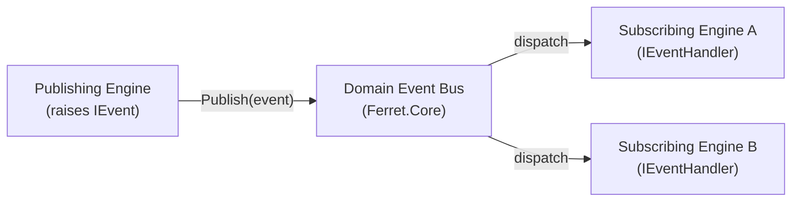
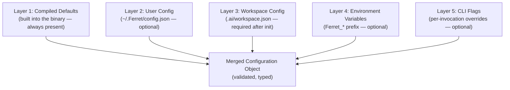
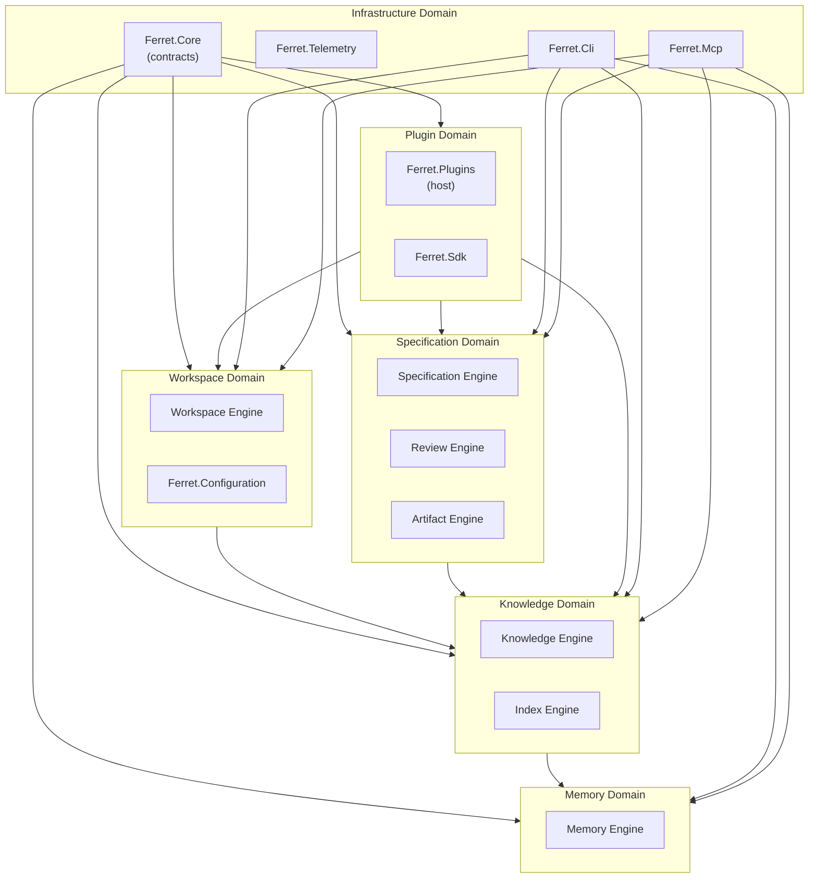

# Architecture Improvements Implementation Plan

> **For agentic workers:** REQUIRED SUB-SKILL: Use superpowers:subagent-driven-development (recommended) or superpowers:executing-plans to implement this plan task-by-task. Steps use checkbox (`- [ ]`) syntax for tracking.

**Goal:** Apply six pre-identified architecture critique fixes (CR-023 through CR-028) and the domain architecture recommendation to existing documents before writing more architecture content.

**Architecture:** Pure documentation work — no source code involved. Changes touch the `docs/000-Overview/`, `docs/001-Product/`, and `docs/002-Architecture/` directories. New ARCH-013 and ARCH-014 documents are created; ARCH-011 is promoted from "planned" to a real document. ARCH-001 gains three new sections.

**Tech Stack:** Markdown, Mermaid diagrams, git.

## Global Constraints

- All document IDs must be stable once set — they are referenced by other documents.
- New document IDs follow established series: ARCH-NNN (architecture), VISION-001, MISSION-001, PRINCIPLES-001, GLOSSARY-001 (overview series).
- Every new ARCH document must follow the ARCH-TEMPLATE-001 format (header table, sections, Design Rationale block per section, traceability footer).
- No document may reference DOC-001, DOC-002, DOC-003, or DOC-004 after these tasks complete.
- ARCH-011 covers Configuration only. Telemetry becomes ARCH-015.
- README index must stay consistent with actual files on disk.

---

## File Map

**Create:**
- `docs/002-Architecture/ARCH-011.md` — Configuration Architecture (canonical source, extracted/expanded from ARCH-001 §18)
- `docs/002-Architecture/ARCH-013.md` — Event Architecture (all domain events, schemas, delivery guarantees)
- `docs/002-Architecture/ARCH-014.md` — Platform Error Model (exception hierarchy, error codes, propagation rules)

**Modify:**
- `docs/000-Overview/Vision.md` — Document ID: `DOC-001` → `VISION-001`
- `docs/000-Overview/Mission.md` — Document ID: `DOC-002` → `MISSION-001`
- `docs/000-Overview/Principles.md` — Document ID: `DOC-003` → `PRINCIPLES-001`
- `docs/000-Overview/Glossary.md` — Document ID: `DOC-004` → `GLOSSARY-001`
- `docs/002-Architecture/ARCH-001.md` — Fix DOC-xxx refs; add §7.3 Capability Matrix; add §8.6 Fitness Functions; add §24 Domain Architecture; update §18 to reference ARCH-011
- `docs/001-Product/PRD-001.md` — Fix DOC-xxx refs in traceability footer and body text
- `docs/002-Architecture/ARCH-003.md` — Add reference to ARCH-011 in configuration section
- `docs/002-Architecture/README.md` — Update index: add ARCH-011, ARCH-013, ARCH-014; split ARCH-011/ARCH-015; update ARCH-001 description

---

## Task 1: Fix Document IDs in 000-Overview and update all references (CR-023)

**Files:**
- Modify: `docs/000-Overview/Vision.md`
- Modify: `docs/000-Overview/Mission.md`
- Modify: `docs/000-Overview/Principles.md`
- Modify: `docs/000-Overview/Glossary.md`
- Modify: `docs/002-Architecture/ARCH-001.md`
- Modify: `docs/001-Product/PRD-001.md`

**Interfaces:**
- Produces: Stable IDs VISION-001, MISSION-001, PRINCIPLES-001, GLOSSARY-001 used by all subsequent tasks

- [ ] **Step 1: Update Vision.md Document ID**

In `docs/000-Overview/Vision.md`, change the header table field:
```
| **Document ID** | DOC-001 |
```
to:
```
| **Document ID** | VISION-001 |
```

- [ ] **Step 2: Update Mission.md Document ID**

In `docs/000-Overview/Mission.md`, change:
```
| **Document ID** | DOC-002 |
```
to:
```
| **Document ID** | MISSION-001 |
```

- [ ] **Step 3: Update Principles.md Document ID**

In `docs/000-Overview/Principles.md`, change:
```
| **Document ID** | DOC-003 |
```
to:
```
| **Document ID** | PRINCIPLES-001 |
```

- [ ] **Step 4: Update Glossary.md Document ID**

In `docs/000-Overview/Glossary.md`, change:
```
| **Document ID** | DOC-004 |
```
to:
```
| **Document ID** | GLOSSARY-001 |
```

- [ ] **Step 5: Fix ARCH-001 Input Documents table (lines 52-55)**

Replace the Input Documents table in `docs/002-Architecture/ARCH-001.md`:
```markdown
| Vision | DOC-001, `docs/000-Overview/Vision.md` |
| Mission | DOC-002, `docs/000-Overview/Mission.md` |
| Engineering Principles | DOC-003, `docs/000-Overview/Principles.md` |
| Glossary | DOC-004, `docs/000-Overview/Glossary.md` |
```
with:
```markdown
| Vision | VISION-001, `docs/000-Overview/Vision.md` |
| Mission | MISSION-001, `docs/000-Overview/Mission.md` |
| Engineering Principles | PRINCIPLES-001, `docs/000-Overview/Principles.md` |
| Glossary | GLOSSARY-001, `docs/000-Overview/Glossary.md` |
```

- [ ] **Step 6: Fix ARCH-001 §2 inline DOC-003 reference (line 76)**

Change:
```
the engineering principles in DOC-003 into architectural concerns.
```
to:
```
the engineering principles in PRINCIPLES-001 into architectural concerns.
```

- [ ] **Step 7: Fix ARCH-001 §3 Architecture Principles table (lines 102-120)**

Change the table header sentence:
```
These principles are the architectural expression of DOC-003.
```
to:
```
These principles are the architectural expression of PRINCIPLES-001.
```

Then replace all 15 `DOC-003 §N` references in the table with `PRINCIPLES-001 §N`:
```
| **AI Agnostic** (PRINCIPLES-001 §1) | ...
| **Specification Driven** (PRINCIPLES-001 §2) | ...
| **Plugin First** (PRINCIPLES-001 §3) | ...
| **Repository Local Knowledge** (PRINCIPLES-001 §4) | ...
| **Deterministic Behaviour** (PRINCIPLES-001 §5) | ...
| **Incremental Indexing** (PRINCIPLES-001 §6) | ...
| **Traceability** (PRINCIPLES-001 §7) | ...
| **Human Review** (PRINCIPLES-001 §8) | ...
| **Documentation First** (PRINCIPLES-001 §9) | ...
| **Testability** (PRINCIPLES-001 §10) | ...
| **Extensibility** (PRINCIPLES-001 §11) | ...
| **Performance** (PRINCIPLES-001 §12) | ...
| **Security** (PRINCIPLES-001 §13) | ...
| **Simplicity** (PRINCIPLES-001 §14) | ...
| **Observability** (PRINCIPLES-001 §15) | ...
```

- [ ] **Step 8: Fix ARCH-001 §16.3 Specification Types table (lines 1189-1192)**

Replace the DOC-001 through DOC-004 rows:
```markdown
| **Vision** | `docs/000-Overview/Vision.md` | DOC-001 | Root — all others derive from it |
| **Mission** | `docs/000-Overview/Mission.md` | DOC-002 | Operationalises DOC-001 |
| **Principles** | `docs/000-Overview/Principles.md` | DOC-003 | Constrains all design decisions |
| **Glossary** | `docs/000-Overview/Glossary.md` | DOC-004 | Terms used in all other documents |
```
with:
```markdown
| **Vision** | `docs/000-Overview/Vision.md` | VISION-001 | Root — all others derive from it |
| **Mission** | `docs/000-Overview/Mission.md` | MISSION-001 | Operationalises VISION-001 |
| **Principles** | `docs/000-Overview/Principles.md` | PRINCIPLES-001 | Constrains all design decisions |
| **Glossary** | `docs/000-Overview/Glossary.md` | GLOSSARY-001 | Terms used in all other documents |
```

- [ ] **Step 9: Fix ARCH-001 §23 Future Directions reference (line 1936)**

Change:
```
with the long-term vision in DOC-001 and would not require
```
to:
```
with the long-term vision in VISION-001 and would not require
```

- [ ] **Step 10: Fix ARCH-001 Traceability footer table (lines 2019-2022)**

Replace:
```markdown
| Vision (DOC-001) | Long-term context for all architectural decisions in this document |
| Mission (DOC-002) | Success criteria and deployment goals this architecture must satisfy |
| Engineering Principles (DOC-003) | Constraints that produced the architectural decisions in §9 |
| Glossary (DOC-004) | Canonical definitions for all terms used in this document |
```
with:
```markdown
| Vision (VISION-001) | Long-term context for all architectural decisions in this document |
| Mission (MISSION-001) | Success criteria and deployment goals this architecture must satisfy |
| Engineering Principles (PRINCIPLES-001) | Constraints that produced the architectural decisions in §9 |
| Glossary (GLOSSARY-001) | Canonical definitions for all terms used in this document |
```

- [ ] **Step 11: Fix PRD-001 references**

In `docs/001-Product/PRD-001.md`, apply these replacements throughout:
- `DOC-001` → `VISION-001`
- `DOC-002` → `MISSION-001`
- `DOC-003` → `PRINCIPLES-001`
- `DOC-004` → `GLOSSARY-001`

Note: Some references are inline prose ("see DOC-001") and some are in the traceability footer table. Update all occurrences.

- [ ] **Step 12: Verify no DOC-00x references remain**

Run: `grep -rn "DOC-00[1-4]" docs/`

Expected: zero results

- [ ] **Step 13: Commit**

```bash
git add docs/000-Overview/Vision.md docs/000-Overview/Mission.md docs/000-Overview/Principles.md docs/000-Overview/Glossary.md docs/002-Architecture/ARCH-001.md docs/001-Product/PRD-001.md
git commit -m "docs: rename DOC-001..004 to semantic IDs (VISION-001, MISSION-001, PRINCIPLES-001, GLOSSARY-001)"
```

---

## Task 2: Add Engine Capability Matrix to ARCH-001 (CR-024)

**Files:**
- Modify: `docs/002-Architecture/ARCH-001.md` — add new §7.3

**Interfaces:**
- Consumes: Engine definitions from §7.2 (Workspace, Knowledge, Index, Artifact, Memory, Specification, Review engines)
- Produces: §7.3 Capability Matrix section, referenced by future per-engine ARCH documents

- [ ] **Step 1: Add §7.3 after the Review Engine block in ARCH-001**

Locate the end of the Review Engine block in §7.2 (after the Review Engine extension points paragraph). Insert the following section immediately after `---` that closes the Review Engine block and before `## 8. Dependency Rules`:

```markdown
### 7.3 Engine Capability Matrix

This matrix provides a consolidated view of each engine's storage interactions and event participation. It is the authoritative reference for inter-engine coupling analysis. Per-engine ARCH documents expand on each row.

| Engine | Reads | Writes | Publishes Events | Consumes Events |
|---|---|---|---|---|
| **Workspace** | `.ai/workspace.json`, `.ai/state.json`, index manifest | `.ai/workspace.json`, `.ai/state.json` | `WorkspaceInitialized`, `WorkspaceUpgraded` | `PluginLoaded`, `PluginFailed` |
| **Knowledge** | Knowledge index (nodes, edges), session memory | — (read-only query engine) | `ContextAssembled` | `IndexUpdated`, `MemoryUpdated` |
| **Index** | Repository file system, index manifest | Knowledge index (staging → active), index manifest | `IndexUpdated`, `IndexBuildCompleted` | `WorkspaceInitialized` |
| **Artifact** | Artefact metadata, review records | Artefact provenance metadata, audit log | `ArtifactCommitted` | `ReviewCompleted` |
| **Memory** | `.ai/session.md`, `.ai/memory/` | `.ai/session.md`, `.ai/memory/` | `MemoryUpdated` | `WorkspaceInitialized` |
| **Specification** | Knowledge index (specification nodes), work item tracker (via plugin) | Knowledge index (specification nodes), specification documents | `SpecificationApproved`, `SpecificationTransitioned` | — |
| **Review** | Knowledge index (context), specification nodes, review documents | Review documents, finding records | `ReviewCompleted`, `FindingDispositioned` | `ContextAssembled` |

**Reading the matrix:**
- **Reads** — storage areas or external systems the engine queries during normal operation.
- **Writes** — storage areas the engine mutates. An engine should only write to areas it owns.
- **Publishes** — domain events this engine raises when its state changes. See ARCH-013 for full event schemas.
- **Consumes** — domain events this engine subscribes to. An engine reacts to these without calling the source engine directly.

**Design rule:** An engine that appears only in "Publishes" for a given storage area owns that area. No other engine writes to that area directly. Violations of ownership boundaries are forbidden dependencies (see §8.3).
```

- [ ] **Step 2: Verify section renders correctly**

Read the modified ARCH-001.md section and confirm:
- Table has 7 engine rows (Workspace, Knowledge, Index, Artifact, Memory, Specification, Review)
- All four columns populated for every row
- "Design rule" paragraph present and references ARCH-013 and §8.3

- [ ] **Step 3: Commit**

```bash
git add docs/002-Architecture/ARCH-001.md
git commit -m "docs(ARCH-001): add §7.3 Engine Capability Matrix (CR-024)"
```

---

## Task 3: Add Architecture Fitness Functions to ARCH-001 (CR-025)

**Files:**
- Modify: `docs/002-Architecture/ARCH-001.md` — add new §8.6

**Interfaces:**
- Consumes: Dependency rules from §8.2 and §8.3
- Produces: §8.6 Fitness Functions section with CI-verifiable rules

- [ ] **Step 1: Add §8.6 after §8.5 Design Rationale in the Dependency Rules section**

Locate the end of §8.5 (ends with the "Future Considerations" line about distributed execution). Insert after that paragraph:

```markdown
### 8.6 Architecture Fitness Functions

Fitness functions are automated checks that verify the architecture's structural health as the codebase grows. Each function maps to a CI gate that fails the build on violation. They are the machine-enforced complement to the textual rules in §8.3.

| Fitness Function | Tool | Trigger | What It Checks |
|---|---|---|---|
| No circular project references | `dotnet build` (MSBuild) | Every PR | No project reference creates a dependency cycle |
| Core has zero dependencies | `dotnet list reference` + script | Every PR | `Ferret.Core.csproj` has zero `<ProjectReference>` elements |
| Plugins reference only Core | Custom Roslyn analyser | Every PR | Plugin assemblies import only `Ferret.Core` or `Ferret.Sdk`; no reference to `Ferret.Runtime`, `Ferret.Cli`, `Ferret.Mcp`, or `Ferret.Plugins` |
| No Runtime → CLI reference | `dotnet list reference` + script | Every PR | `Ferret.Runtime.csproj` has no `<ProjectReference>` to `Ferret.Cli` or `Ferret.Mcp` |
| No lateral engine dependencies | Custom Roslyn analyser | Every PR | No type in one engine namespace directly instantiates a type in another engine namespace |
| No direct plugin type references | Custom Roslyn analyser | Every PR | No platform module imports an assembly that is loaded as a plugin at runtime |

**Enforcement approach:** The first two rules are enforced by the standard .NET build system. The remaining rules require a lightweight Roslyn analyser or a build script that inspects the compiled output. The analyser is delivered as part of the `Ferret.Build` project (planned for Sprint 1). Until the analyser exists, these rules are enforced by code review.

**Adding a new fitness function:** When a new dependency rule is added to §8.3, a corresponding fitness function must be added to this table and the Roslyn analyser updated before the rule is considered enforced.
```

- [ ] **Step 2: Verify section is consistent with §8.3**

Cross-check: every "Forbidden Dependency" row in §8.3 must map to at least one fitness function in the new table. Count:
- Core → any platform module → "Core has zero dependencies" ✓
- Runtime → CLI → "No Runtime → CLI reference" ✓
- Runtime → Mcp → covered by "No Runtime → CLI reference" (same script checks both)
- Runtime → Plugins → covered by "No lateral engine dependencies" (different mechanism — add explicit row if needed)
- Any module → plugin assembly → "No direct plugin type references" ✓
- Any plugin → Runtime/CLI/Mcp → "Plugins reference only Core" ✓
- Horizontal engine → engine → "No lateral engine dependencies" ✓

- [ ] **Step 3: Commit**

```bash
git add docs/002-Architecture/ARCH-001.md
git commit -m "docs(ARCH-001): add §8.6 Architecture Fitness Functions (CR-025)"
```

---

## Task 4: Create ARCH-013 — Event Architecture (CR-026)

**Files:**
- Create: `docs/002-Architecture/ARCH-013.md`

**Interfaces:**
- Consumes: Engine capability matrix from Task 2 (§7.3), engine definitions from §7.2
- Produces: Canonical event catalogue referenced by all engine ARCH documents and the capability matrix

- [ ] **Step 1: Create ARCH-013.md**

Create `docs/002-Architecture/ARCH-013.md` with the following content:

```markdown
# ARCH-013 — Event Architecture

| Field | Value |
|---|---|
| **Document ID** | ARCH-013 |
| **Version** | 1.0 |
| **Status** | Draft |
| **Owner** | Ferret Project |
| **Author** | Ferret Core Team |
| **Review Status** | Pending Architecture Review |
| **Last Updated** | 2026-06-27 |
| **Parent Architecture** | ARCH-001 §7.3 — Engine Capability Matrix |

---

## Overview

Domain events are the mechanism by which engines communicate state changes without calling each other directly. Every engine that changes state publishes a domain event. Every engine that reacts to another engine's state change subscribes to that event. No engine calls another engine's concrete implementation.

This document is the canonical catalogue of all platform domain events. It defines the event schema, the publisher, the intended consumers, and the delivery guarantee for each event. Individual engine architecture documents (ARCH-003 through ARCH-010) reference events defined here.

---

## 1. Event Delivery Model

### 1.1 In-Process Event Bus

Domain events are delivered in-process through a typed event bus defined in `Ferret.Core`. The event bus is synchronous within a single engine operation and does not guarantee ordering across concurrent operations.



### 1.2 Delivery Guarantees

| Guarantee | Value |
|---|---|
| **Ordering** | Events from a single publisher are delivered in publish order. Cross-publisher ordering is undefined. |
| **Durability** | Events are in-memory only. A process restart does not replay events. State reconstruction is performed by reading the knowledge store, not by replaying events. |
| **Isolation** | A handler exception does not prevent other handlers from receiving the event. The exception is caught, logged, and does not propagate to the publisher. |
| **Transactionality** | Events are not transactional with storage writes. An event may be raised before its associated write is durable. Handlers that depend on storage consistency must re-read from the store. |

### 1.3 Event Base Schema

Every domain event carries these base fields, defined in `Ferret.Core.Events.DomainEvent`:

| Field | Type | Description |
|---|---|---|
| `EventId` | `Guid` | Unique identifier for this event occurrence |
| `OccurredAt` | `DateTimeOffset` | UTC timestamp when the event was raised |
| `CorrelationId` | `string` | Propagated from the triggering CLI invocation or MCP call |
| `Source` | `string` | Engine or component that raised the event (e.g., `"WorkspaceEngine"`) |

---

## 2. Event Catalogue

### 2.1 Workspace Events

---

#### WorkspaceInitialized

**Publisher:** Workspace Engine
**Consumers:** Index Engine (triggers initial manifest creation), Memory Engine (creates initial session record)

**Raised when:** `Ferret init` completes successfully and the `.ai/` directory structure has been created for the first time.

**Schema:**
```
WorkspaceInitialized : DomainEvent {
    WorkspaceRoot   : string        // absolute path to the repository root
    SchemaVersion   : string        // workspace schema version written (e.g. "1.0")
    ConfigPath      : string        // path to the workspace.json created
}
```

**Not raised when:** `Ferret init` is run on an already-initialised workspace (use `WorkspaceRepaired` instead, once defined).

---

#### WorkspaceUpgraded

**Publisher:** Workspace Engine
**Consumers:** Index Engine (triggers index migration if schema changed)

**Raised when:** `Ferret workspace upgrade` completes a schema migration from a prior workspace version to the current version.

**Schema:**
```
WorkspaceUpgraded : DomainEvent {
    WorkspaceRoot       : string    // absolute path to the repository root
    PreviousVersion     : string    // schema version before upgrade
    CurrentVersion      : string    // schema version after upgrade
    MigrationSteps      : string[]  // ordered list of migration step identifiers applied
}
```

---

### 2.2 Index Events

---

#### IndexBuildCompleted

**Publisher:** Index Engine
**Consumers:** Knowledge Engine (refreshes state hash), Workspace Engine (updates health status)

**Raised when:** A full `Ferret index build` operation completes, whether all files were processed or some files failed parsing.

**Schema:**
```
IndexBuildCompleted : DomainEvent {
    WorkspaceRoot       : string    // absolute path to the repository root
    FilesProcessed      : int       // count of files successfully indexed
    FilesFailed         : int       // count of files that failed during parsing
    DurationMs          : long      // elapsed time in milliseconds
    NewStateHash        : string    // knowledge state hash after the build
}
```

---

#### IndexUpdated

**Publisher:** Index Engine
**Consumers:** Knowledge Engine (refreshes state hash and cached query results)

**Raised when:** An incremental `Ferret index update` operation completes with at least one file changed.

**Not raised when:** The incremental update detects no file changes (nothing to report).

**Schema:**
```
IndexUpdated : DomainEvent {
    WorkspaceRoot       : string    // absolute path to the repository root
    FilesAdded          : int       // count of newly indexed files
    FilesModified       : int       // count of re-indexed files
    FilesRemoved        : int       // count of files removed from the index
    NewStateHash        : string    // knowledge state hash after the update
}
```

---

#### RepositoryIndexed

**Publisher:** Index Engine
**Consumers:** Knowledge Engine (signals context is ready for assembly)

**Raised when:** Any index operation (build or update) results in a consistent, queryable index state. This is the "index is ready" signal consumed by context assembly.

**Schema:**
```
RepositoryIndexed : DomainEvent {
    WorkspaceRoot   : string        // absolute path to the repository root
    StateHash       : string        // current knowledge state hash
    IndexedAt       : DateTimeOffset // timestamp the index reached this state
}
```

---

### 2.3 Knowledge Events

---

#### ContextAssembled

**Publisher:** Knowledge Engine
**Consumers:** Review Engine (uses assembled context to generate findings)

**Raised when:** A context assembly request completes and a token-bounded context is ready for an AI interaction.

**Schema:**
```
ContextAssembled : DomainEvent {
    RequestId           : string    // correlation ID for the context request
    TokensUsed          : int       // total tokens in the assembled context
    TokenBudget         : int       // original token budget for the request
    SourcesIncluded     : string[]  // categories included (e.g. "symbols", "specs", "memory")
    KnowledgeStateHash  : string    // knowledge state hash at assembly time
}
```

---

#### KnowledgeUpdated

**Publisher:** Knowledge Engine
**Consumers:** Memory Engine (updates session record to reflect knowledge state change)

**Raised when:** The Knowledge Engine detects that the underlying knowledge state hash has changed (typically after receiving `IndexUpdated`).

**Schema:**
```
KnowledgeUpdated : DomainEvent {
    WorkspaceRoot   : string        // absolute path to the repository root
    PreviousHash    : string        // state hash before the change
    CurrentHash     : string        // state hash after the change
}
```

---

### 2.4 Memory Events

---

#### MemoryUpdated

**Publisher:** Memory Engine
**Consumers:** Knowledge Engine (invalidates cached session contributions to context assembly)

**Raised when:** The session record or repository memory is written (decision recorded, working set updated, session saved).

**Schema:**
```
MemoryUpdated : DomainEvent {
    WorkspaceRoot   : string        // absolute path to the repository root
    UpdateType      : string        // "Session" | "RepositoryMemory" | "WorkingSet"
    EntryId         : string?       // identifier of the specific entry updated (if applicable)
}
```

---

### 2.5 Plugin Events

---

#### PluginLoaded

**Publisher:** Plugin Host (`Ferret.Plugins`)
**Consumers:** Workspace Engine (updates plugin health status in workspace health report)

**Raised when:** A plugin transitions to the `Active` state (see ARCH-007 §Plugin Lifecycle).

**Schema:**
```
PluginLoaded : DomainEvent {
    PluginId        : string        // reverse-domain plugin identifier from manifest
    PluginVersion   : string        // SemVer version from manifest
    Interfaces      : string[]      // interface qualified names this plugin implements
}
```

---

#### PluginFailed

**Publisher:** Plugin Host (`Ferret.Plugins`)
**Consumers:** Workspace Engine (marks plugin as Failed in health report), Telemetry (emits error metric)

**Raised when:** A plugin transitions to the `Failed` state due to an unhandled exception during execution. Not raised for a plugin that fails activation (which results in `Rejected` state, not `Failed`).

**Schema:**
```
PluginFailed : DomainEvent {
    PluginId        : string        // reverse-domain plugin identifier
    PluginVersion   : string        // SemVer version
    FailureReason   : string        // exception type name
    OperationName   : string        // the plugin operation that threw (e.g. "IParser.ParseAsync")
}
```

---

### 2.6 Specification Events

---

#### SpecificationApproved

**Publisher:** Specification Engine
**Consumers:** Knowledge Engine (writes `Specification` node to the knowledge graph), Review Engine (gates on approval before certain review types)

**Raised when:** A specification transitions to the `Approved` state through the platform's approval workflow.

**Schema:**
```
SpecificationApproved : DomainEvent {
    SpecificationId     : string    // e.g. "SP-042"
    SpecificationTitle  : string    // human-readable title
    ApproverId          : string    // user identity of the approver
    ApprovedAt          : DateTimeOffset
}
```

---

#### SpecificationTransitioned

**Publisher:** Specification Engine
**Consumers:** Work Item Publisher plugins (notify external trackers of state changes)

**Raised when:** A specification transitions between any lifecycle states (Draft → Review, Review → Approved, Approved → InDevelopment, etc.).

**Schema:**
```
SpecificationTransitioned : DomainEvent {
    SpecificationId     : string    // e.g. "SP-042"
    FromState           : string    // previous state name
    ToState             : string    // new state name
    ActorId             : string    // user identity that triggered the transition
}
```

---

### 2.7 Review Events

---

#### ReviewCompleted

**Publisher:** Review Engine
**Consumers:** Artifact Engine (signals that an artefact may be committed)

**Raised when:** A review reaches the `Approved` state — all Critical and High findings are `Resolved` and the reviewer has explicitly approved.

**Schema:**
```
ReviewCompleted : DomainEvent {
    ReviewId            : string    // e.g. "AR-001", "CR-042"
    ReviewType          : string    // "Architecture" | "Specification" | "Code" | "AI"
    ReviewerId          : string    // user identity of the approving reviewer
    FindingsTotal       : int       // total number of findings in the review
    FindingsResolved    : int       // count of findings in Resolved state
    FindingsDeferred    : int       // count of findings in Deferred state
}
```

---

#### FindingDispositioned

**Publisher:** Review Engine
**Consumers:** Artifact Engine (tracks finding history for traceability)

**Raised when:** A human reviewer transitions a finding from `Proposed` to any of `Accepted`, `Resolved`, `Rejected`, or `Deferred`.

**Schema:**
```
FindingDispositioned : DomainEvent {
    ReviewId        : string        // parent review identifier
    FindingId       : string        // unique finding identifier within the review
    Severity        : string        // "Critical" | "High" | "Medium" | "Low" | "Observation"
    FromState       : string        // previous finding state
    ToState         : string        // new finding state
    ReviewerId      : string        // user identity of the reviewer
}
```

---

### 2.8 Artifact Events

---

#### ArtifactCommitted

**Publisher:** Artifact Engine
**Consumers:** Audit log (append-only write), Review Engine (confirms artefact lifecycle complete)

**Raised when:** An AI-generated artefact is marked as committed — it has a complete review record and its provenance metadata has been written to the knowledge store.

**Schema:**
```
ArtifactCommitted : DomainEvent {
    ArtifactId          : string    // unique artefact identifier
    InteractionId       : string    // interaction ID linking to AI invocation
    ModelId             : string    // model identifier used to generate the artefact
    UserId              : string    // user identity that accepted the artefact
    KnowledgeStateHash  : string    // knowledge state at the time of generation
    ReviewId            : string    // completed review that approved this artefact
}
```

---

## 3. Event Registration

Engines register event handlers in the composition root (the DI registration phase). Event handler registration follows this pattern:

```
services.AddEventHandler<WorkspaceInitialized, IndexEngine>();
services.AddEventHandler<IndexUpdated, KnowledgeEngine>();
services.AddEventHandler<ReviewCompleted, ArtifactEngine>();
// ...
```

No engine registers its own event handlers. The composition root owns the wiring. This makes the full event subscription graph visible in one place.

---

## 4. Adding New Events

When a new engine capability produces a state change that other engines react to:

1. Define the event in `Ferret.Core.Events` with the schema following the pattern in §2.
2. Add the event to §2 of this document with publisher, consumers, trigger, and full schema.
3. Update the Capability Matrix in ARCH-001 §7.3.
4. Update the per-engine ARCH document to reference the new event in its Publishes / Consumes sections.
5. Register the handler in the composition root.

New events must not carry mutable objects or references to engine state. All event fields are value types or immutable records.

---

## 5. Design Rationale

The in-process event bus model was chosen over direct engine-to-engine calls and over a durable message queue.

**Why not direct calls?** Direct calls between engines create compile-time coupling and make testing require real engine instances. The event bus allows any engine to be tested with a test double for its event subscriptions.

**Why not a durable message queue?** The platform's primary deployment is a local CLI process. A durable queue adds infrastructure (persistence, ordering guarantees) that is unnecessary for local use and would make the default deployment significantly more complex. If the platform later supports distributed deployment, the event bus interface can be backed by a durable queue without changing the engine code.

**Trade-offs:** The in-process model loses events on process restart. This is acceptable because the platform reconstructs its view of state from the knowledge store on startup, not from event replay.

---

## Traceability

| Input Document | Role |
|---|---|
| ARCH-001 §7.3 | Engine Capability Matrix — source for publisher/consumer columns |
| ARCH-001 §8.4 | Engine-to-engine communication rules that this document formalises |
| PRINCIPLES-001 §5 | Deterministic Behaviour principle — drives the in-process delivery model |
```

- [ ] **Step 2: Verify document completeness**

Check that ARCH-013.md contains:
- Header table with Document ID, Version, Status, Owner, Author
- All event categories: Workspace, Index, Knowledge, Memory, Plugin, Specification, Review, Artifact
- Each event has: Publisher, Consumers, Raised when, Schema
- Events match what was listed in the capability matrix (Task 2)

- [ ] **Step 3: Commit**

```bash
git add docs/002-Architecture/ARCH-013.md
git commit -m "docs: add ARCH-013 — Event Architecture with full domain event catalogue (CR-026)"
```

---

## Task 5: Create ARCH-011 — Configuration Architecture (CR-027)

**Files:**
- Create: `docs/002-Architecture/ARCH-011.md`
- Modify: `docs/002-Architecture/ARCH-001.md` — update §18 to summarise and defer to ARCH-011
- Modify: `docs/002-Architecture/ARCH-003.md` — add reference to ARCH-011

**Interfaces:**
- Consumes: Configuration content currently in ARCH-001 §18
- Produces: Standalone ARCH-011.md as canonical configuration reference

- [ ] **Step 1: Create ARCH-011.md**

Create `docs/002-Architecture/ARCH-011.md` with expanded configuration content:

```markdown
# ARCH-011 — Configuration Architecture

| Field | Value |
|---|---|
| **Document ID** | ARCH-011 |
| **Version** | 1.0 |
| **Status** | Draft |
| **Owner** | Ferret Project |
| **Author** | Ferret Core Team |
| **Review Status** | Pending Architecture Review |
| **Last Updated** | 2026-06-27 |
| **Parent Architecture** | ARCH-001 §18 — Configuration Architecture (summary) |

---

## Overview

This document is the canonical source for the Ferret configuration model. It defines every configuration source, the merge precedence rules, the full workspace configuration schema, secret resolution, validation behaviour, and the configuration module's extension points.

All other ARCH documents reference this document for configuration details. They do not re-define configuration concepts; they reference the relevant sections here.

---

## 1. Configuration Sources and Precedence

Configuration is assembled from five layers at every platform startup. Higher-numbered layers override lower-numbered layers for any given field. A field absent in a higher layer retains the value from the highest lower layer where it appears.



### 1.1 Layer Definitions

| Layer | Location | Scope | Owner |
|---|---|---|---|
| Compiled Defaults | Binary | All workspaces, all users | Platform team |
| User Config | `~/.Ferret/config.json` | All workspaces for this user | Individual developer |
| Workspace Config | `.ai/workspace.json` | This workspace, all users | Team (version-controlled) |
| Environment Variables | Process environment | This invocation | CI/CD pipeline or shell |
| CLI Flags | Command arguments | This invocation | Developer (ad-hoc) |

### 1.2 Merge Semantics

- **Scalar fields** (string, number, boolean): higher-layer value replaces lower-layer value entirely.
- **Object fields** (nested config sections): merged recursively. A sub-field in a lower layer that is absent in a higher layer is preserved.
- **Array fields** (include/exclude lists, plugin lists): higher-layer value replaces the entire array. Arrays are not merged element-by-element.
- **Null in higher layer**: treated as "absent" — the lower-layer value is kept. To explicitly clear an array, use an empty array `[]`.

### 1.3 Environment Variable Mapping

Environment variables with the `Ferret_` prefix map to configuration fields using `__` as the hierarchy separator:

| Environment Variable | Mapped Field |
|---|---|
| `Ferret_LOG__LEVEL` | `log.level` |
| `Ferret_INDEX__THREADS` | `index.threads` |
| `Ferret_MODEL__PROVIDER` | `model.provider` |
| `Ferret_TELEMETRY__ENDPOINT` | `telemetry.endpoint` |

Environment variable names are case-insensitive on Windows and case-sensitive on Linux/macOS.

---

## 2. Workspace Configuration Schema

The workspace configuration schema is versioned JSON Schema (Draft 7+). The schema file is distributed at `schemas/workspace-config.v1.json` and is referenced from `workspace.json` via a `$schema` field.

### 2.1 Top-Level Structure

```json
{
  "$schema": "https://Ferret.dev/schemas/workspace-config.v1.json",
  "schemaVersion": "1.0",
  "workspace": { ... },
  "index": { ... },
  "knowledge": { ... },
  "memory": { ... },
  "plugins": [ ... ],
  "model": { ... },
  "security": { ... },
  "telemetry": { ... },
  "integrations": { ... }
}
```

### 2.2 workspace Section

| Field | Type | Default | Description |
|---|---|---|---|
| `id` | string | (git remote URL hash) | Unique workspace identifier |
| `name` | string | (directory name) | Human-readable workspace name |
| `version` | string | "1.0" | Workspace schema version |
| `description` | string | "" | Optional description for team documentation |

### 2.3 index Section

| Field | Type | Default | Description |
|---|---|---|---|
| `threads` | int | (CPU count / 2) | Parser thread pool size |
| `include` | string[] | `["**/*"]` | Glob patterns for files to index |
| `exclude` | string[] | (see §3 defaults) | Glob patterns for files to exclude |
| `maxFileSizeKb` | int | 512 | Files larger than this are skipped |
| `compactAfterBuilds` | int | 10 | Trigger compaction after N full builds |

### 2.4 knowledge Section

| Field | Type | Default | Description |
|---|---|---|---|
| `defaultTokenBudget` | int | 32000 | Default token budget for context assembly |
| `contextProfiles` | object | `{}` | Named context profiles with per-category budgets |
| `storageProvider` | string | (embedded file store) | Plugin ID of the active storage provider |

### 2.5 memory Section

| Field | Type | Default | Description |
|---|---|---|---|
| `sessionAutoSave` | bool | true | Automatically save session on every operation |
| `sessionMaxSizeKb` | int | 50 | Trigger auto-summarisation when session exceeds this |
| `keepSnapshotDays` | int | 30 | Retain context snapshots for this many days |

### 2.6 plugins Array

Each entry in the `plugins` array declares a plugin to load:

```json
{
  "id": "com.example.my-parser",
  "version": "^1.2",
  "source": "local",
  "path": "./plugins/my-parser",
  "config": { ... }
}
```

| Field | Type | Required | Description |
|---|---|---|---|
| `id` | string | Yes | Reverse-domain plugin identifier (matches manifest) |
| `version` | string | Yes | SemVer range (e.g. `"^1.2"`, `"1.2.3"`) |
| `source` | enum | Yes | `"local"` \| `"registry"` \| `"embedded"` |
| `path` | string | If local | Relative or absolute path to plugin directory |
| `config` | object | No | Plugin-specific configuration object (passed to plugin on activation) |

### 2.7 security Section

| Field | Type | Default | Description |
|---|---|---|---|
| `sensitivePatterns` | string[] | `[]` | Additional glob patterns for sensitive file exclusion (additive to built-in defaults) |
| `accessControl` | object | `{}` | User/group → permission mappings |
| `requirePluginSignature` | bool | false | Reject plugins without a valid signature (deferred — not enforced in 1.0) |

### 2.8 telemetry Section

| Field | Type | Default | Description |
|---|---|---|---|
| `logLevel` | enum | `"Warning"` | Minimum log level: `Trace` \| `Debug` \| `Information` \| `Warning` \| `Error` \| `Critical` |
| `fileLogPath` | string | null | Path for file log output (null = disabled) |
| `otlpEndpoint` | string | null | OpenTelemetry collector endpoint (null = disabled) |
| `metricsEnabled` | bool | true | Enable metrics emission |

---

## 3. Secret Resolution

Configuration values that reference secrets must use environment variable syntax: `"${ENV_VAR_NAME}"`. The Configuration module resolves these at startup before validation.

**Resolution order:**
1. Check the active `ISecretProvider` plugins (if any are configured).
2. Fall back to the process environment variable named by the reference.
3. If neither resolves the reference, configuration validation fails with a diagnostic naming the unresolved field.

**Forbidden:** Storing credentials, API keys, or tokens as literal values in `workspace.json`, `config.json`, or any configuration file that is version-controlled.

**Example:**
```json
{
  "model": {
    "provider": "com.anthropic.claude",
    "config": {
      "apiKey": "${ANTHROPIC_API_KEY}"
    }
  }
}
```

---

## 4. Validation

After merging all layers and resolving secrets, the Configuration module validates the merged object against the JSON Schema. Validation runs once at startup and is not repeated unless configuration is reloaded.

**Validation errors** surface as structured diagnostics:

```
Configuration error: index.threads must be >= 1 (received: 0)
  → .ai/workspace.json, field "index.threads"
```

Each diagnostic includes: the constraint violated, the field path, the source layer where the value was set.

**Validation failures are fatal.** The platform does not start if configuration validation fails. This is intentional — an invalid configuration is a configuration that may produce unpredictable behaviour.

---

## 5. Extension Points

### 5.1 Secret Provider Plugins

`ISecretProvider` plugins resolve `"${REFERENCE}"` values from sources other than environment variables. Examples: HashiCorp Vault, AWS Secrets Manager, Azure Key Vault.

Secret providers are activated before the remainder of configuration is validated, so their resolved values participate in schema validation normally.

### 5.2 Configuration Source Plugins

A future extension point (`IConfigurationSource`) would allow a plugin to contribute a new configuration layer (e.g., a remote configuration server). This is not part of version 1.0.

---

## 6. Design Rationale

The five-layer model follows the de facto standard for developer tools operating in multiple contexts. The team controls the workspace layer (version-controlled); the individual controls the user layer; CI controls environment variables; nothing needs code changes to adapt the platform to a new deployment context.

**Why not a single config file?** A single file cannot serve both "team-shared defaults" (workspace.json) and "user-local overrides" (config.json) without one overwriting the other in version control.

**Why strict validation on startup?** A platform that starts with invalid configuration silently produces wrong results. Failing fast with a clear diagnostic is always preferable to debugging mysterious behaviour later.

**Trade-offs:** Debugging unexpected values requires checking all five layers. The `Ferret diagnostics` command shows the resolved configuration (with secrets redacted) to help with this.

---

## Traceability

| Input Document | Role |
|---|---|
| ARCH-001 §18 | Summary of this document's content at the system architecture level |
| PRINCIPLES-001 §4 | Repository Local Knowledge — drives workspace.json being version-controlled |
| PRINCIPLES-001 §13 | Security — drives secret resolution model |
| PRD-001 §10 | Workspace requirements that shape the configuration schema |
```

- [ ] **Step 2: Update ARCH-001 §18 to reference ARCH-011**

In `docs/002-Architecture/ARCH-001.md`, replace the content of §18 Configuration Architecture (the detailed content currently at lines 1308-1358) with a summary that defers to ARCH-011:

```markdown
## 18. Configuration Architecture

### 18.1 Summary

This section provides an overview of the configuration model. The full schema definition, merge semantics, secret resolution model, and extension points are defined in **ARCH-011 — Configuration Architecture**, which is the canonical reference. Module-level ARCH documents reference ARCH-011 directly.

### 18.2 Configuration Sources and Precedence

Configuration is assembled from five layers at every platform startup. Higher-numbered layers override lower-numbered layers for any given field:

| Layer | Source | Scope |
|---|---|---|
| 1 | Compiled defaults | All workspaces, all users |
| 2 | `~/.Ferret/config.json` | All workspaces for this user |
| 3 | `.ai/workspace.json` | This workspace, all users (version-controlled) |
| 4 | `Ferret_*` environment variables | This invocation |
| 5 | CLI flags | This invocation |

### 18.3 Key Constraints

**Secret resolution:** Configuration values that reference credentials must use `"${ENV_VAR_NAME}"` syntax. Literal secrets in version-controlled files are forbidden.

**Validation is fatal:** The platform does not start if configuration validation fails. Every configuration error surfaces as a structured diagnostic identifying the field, the constraint, and the source layer.

**Extension:** Secret provider plugins (`ISecretProvider`) resolve secret references from sources other than environment variables (e.g., secret managers). See ARCH-011 §5 for extension points.

### 18.4 Design Rationale

See **ARCH-011 §6** for the full rationale. The five-layer model allows the team to share workspace defaults through version control while individuals and CI pipelines override specific values without touching shared files.
```

- [ ] **Step 3: Add ARCH-011 reference to ARCH-003 configuration section**

In `docs/002-Architecture/ARCH-003.md`, find the section where configuration loading is described. After the first mention of configuration loading, add:

```markdown
> **Configuration details:** The full configuration schema, merge semantics, and secret resolution model are defined in **ARCH-011 — Configuration Architecture**. This document focuses on how the Workspace Engine participates in configuration loading, not on the configuration model itself.
```

- [ ] **Step 4: Commit**

```bash
git add docs/002-Architecture/ARCH-011.md docs/002-Architecture/ARCH-001.md docs/002-Architecture/ARCH-003.md
git commit -m "docs: add ARCH-011 — Configuration Architecture; refactor ARCH-001 §18 to reference it (CR-027)"
```

---

## Task 6: Create ARCH-014 — Platform Error Model (CR-028)

**Files:**
- Create: `docs/002-Architecture/ARCH-014.md`

**Interfaces:**
- Consumes: Module definitions from ARCH-001 §7; engine definitions from §7.2
- Produces: Canonical exception hierarchy referenced by all module ARCH documents

- [ ] **Step 1: Create ARCH-014.md**

Create `docs/002-Architecture/ARCH-014.md` with the following content:

```markdown
# ARCH-014 — Platform Error Model

| Field | Value |
|---|---|
| **Document ID** | ARCH-014 |
| **Version** | 1.0 |
| **Status** | Draft |
| **Owner** | Ferret Project |
| **Author** | Ferret Core Team |
| **Review Status** | Pending Architecture Review |
| **Last Updated** | 2026-06-27 |
| **Parent Architecture** | ARCH-001 §10 — Cross-Cutting Concerns |

---

## Overview

The Platform Error Model defines the exception hierarchy used across all Ferret modules. Consistent exception types prevent every module from inventing its own error types and ensure that callers (the Application Layer, CLI entry point, and MCP handler) can handle errors predictably.

All exceptions defined here are declared in `Ferret.Core.Errors`. Engines throw them; application layer handlers catch them and translate them into user-facing messages or exit codes.

---

## 1. Exception Hierarchy

```
FerretException                    // base for all platform exceptions
├── ValidationException             // input or state fails a validation rule
│   ├── SpecificationValidationException
│   └── WorkspaceValidationException
├── ConfigurationException          // configuration is invalid or missing
│   └── SecretResolutionException   // a ${ENV_VAR} reference could not be resolved
├── WorkspaceException              // workspace operation failed
│   ├── WorkspaceNotInitializedException
│   └── WorkspaceUpgradeException
├── IndexException                  // index pipeline failed
│   ├── IndexCorruptionException
│   └── IndexMigrationException
├── KnowledgeException              // knowledge query or context assembly failed
│   └── ContextBudgetExceededException
├── PluginException                 // plugin lifecycle or execution failed
│   ├── PluginActivationException
│   ├── PermissionDeniedException   // plugin requested a capability it did not declare
│   └── PluginContractException     // plugin violated its declared interface contract
├── SecurityException               // security policy violation
│   └── SensitiveFileViolationException
├── ReviewException                 // review lifecycle failure
│   └── ReviewGateException         // attempted to bypass the review gate
└── ArtifactException               // artefact provenance failure
    └── ProvenanceIncompleteException // artefact lacks required provenance fields
```

---

## 2. Exception Definitions

### FerretException

```
FerretException : Exception {
    ErrorCode       : string        // machine-readable error code (see §3)
    Guidance        : string        // actionable message for the developer or operator
    CorrelationId   : string?       // propagated from the triggering operation (if available)
}
```

Base class for all platform exceptions. Never throw `FerretException` directly — always throw a specific subclass.

---

### ValidationException

**Thrown by:** All engines, before committing a state transition that would violate a domain rule.

**Caught by:** Application Layer handlers — translate to structured validation error output.

```
ValidationException : FerretException {
    Field           : string        // dotted path to the field that failed (e.g. "spec.acceptanceCriteria")
    Constraint      : string        // human-readable description of the constraint
    ActualValue     : string?       // the value that was provided (redacted if sensitive)
}
```

#### SpecificationValidationException

Thrown when a specification fails completeness validation before submission for review.

```
SpecificationValidationException : ValidationException {
    SpecificationId : string
    FailedChecks    : string[]      // list of validation rule identifiers that failed
}
```

#### WorkspaceValidationException

Thrown when workspace configuration fails schema validation.

```
WorkspaceValidationException : ValidationException {
    SourceLayer     : string        // "WorkspaceConfig" | "UserConfig" | "EnvironmentVariable" | "CliFlag"
    SchemaPath      : string        // JSON Pointer path to the failing field
}
```

---

### ConfigurationException

**Thrown by:** `Ferret.Configuration` during startup configuration load.

**Caught by:** Composition root — terminates startup with a structured error diagnostic.

```
ConfigurationException : FerretException {
    SourceLayer     : string        // layer where the invalid value was found
    FieldPath       : string        // dotted field path
}
```

#### SecretResolutionException

Thrown when a `"${ENV_VAR}"` reference cannot be resolved.

```
SecretResolutionException : ConfigurationException {
    ReferenceName   : string        // the environment variable name that was not found
    FieldPath       : string        // the configuration field containing the unresolved reference
}
```

---

### WorkspaceException

**Thrown by:** Workspace Engine.

**Caught by:** CLI command handlers — translate to workspace error messages with remediation steps.

```
WorkspaceException : FerretException {
    WorkspaceRoot   : string?       // path to the workspace root (if determined)
}
```

#### WorkspaceNotInitializedException

Thrown when a workspace operation is attempted on a directory that has not been initialised with `Ferret init`.

#### WorkspaceUpgradeException

Thrown when a schema migration step fails. Includes the migration step identifier and the underlying cause.

```
WorkspaceUpgradeException : WorkspaceException {
    MigrationStep   : string        // identifier of the migration step that failed
    FromVersion     : string        // schema version before the failed step
}
```

---

### IndexException

**Thrown by:** Index Engine.

**Caught by:** Application Layer index handlers — log, report, and (where possible) continue.

#### IndexCorruptionException

Thrown when the index is detected to be in an inconsistent state that cannot be repaired incrementally. Resolution: `Ferret index build --full`.

#### IndexMigrationException

Thrown when an index schema migration fails during `Ferret workspace upgrade`.

---

### KnowledgeException

**Thrown by:** Knowledge Engine.

**Caught by:** Application Layer knowledge handlers and MCP tool handlers.

#### ContextBudgetExceededException

Thrown when a context assembly request cannot fit any useful content within the requested token budget. Callers should increase the budget or narrow the query scope.

```
ContextBudgetExceededException : KnowledgeException {
    RequestedBudget : int
    MinimumRequired : int           // minimum tokens needed for the smallest valid context
}
```

---

### PluginException

**Thrown by:** Plugin Host (`Ferret.Plugins`).

**Caught by:** Plugin Host itself for `PluginActivationException` (deactivates the plugin); Application Layer for others.

#### PluginActivationException

Thrown when a plugin's activation entry point throws. The plugin transitions to `Rejected` state.

```
PluginActivationException : PluginException {
    PluginId        : string
    PluginVersion   : string
    InnerException  : Exception     // the exception from the plugin's entry point
}
```

#### PermissionDeniedException

Thrown when a plugin calls an `IPluginContext` method for a capability it did not declare in its manifest.

```
PermissionDeniedException : PluginException {
    PluginId            : string
    RequestedPermission : string    // the permission namespace that was denied
    Operation           : string    // the specific operation that was blocked
}
```

#### PluginContractException

Thrown when a plugin's return value violates the interface contract (e.g., null where non-null is required, or a type mismatch).

---

### SecurityException

**Thrown by:** Any engine that enforces a security policy.

**Caught by:** Application Layer — surfaced as a security error with no sensitive detail leaked to the caller.

#### SensitiveFileViolationException

Thrown when a file matching a sensitive exclusion pattern is detected in a context that would expose its content (e.g., a parser result that escaped the exclusion guard).

---

### ReviewException

**Thrown by:** Review Engine.

#### ReviewGateException

Thrown when the Artifact Engine detects an attempt to mark an artefact as committed without a completed review record. This is the structural enforcement of AG-009.

---

### ArtifactException

**Thrown by:** Artifact Engine.

#### ProvenanceIncompleteException

Thrown when an artefact record is missing one or more required provenance fields (model ID, user ID, knowledge state hash, interaction ID).

---

## 3. Error Codes

Every `FerretException` carries a machine-readable `ErrorCode` string. Error codes are stable within a major version and are used by CI pipelines and tooling to identify specific failure modes.

| Error Code | Exception Type | Description |
|---|---|---|
| `AISP-001` | `WorkspaceNotInitializedException` | Workspace not initialised |
| `AISP-002` | `WorkspaceUpgradeException` | Schema migration failed |
| `AISP-003` | `ConfigurationException` | Configuration invalid |
| `AISP-004` | `SecretResolutionException` | Unresolved secret reference |
| `AISP-005` | `ValidationException` | Input validation failed |
| `AISP-006` | `SpecificationValidationException` | Specification completeness check failed |
| `AISP-007` | `IndexCorruptionException` | Index corruption detected |
| `AISP-008` | `IndexMigrationException` | Index migration failed |
| `AISP-009` | `PermissionDeniedException` | Plugin permission denied |
| `AISP-010` | `PluginActivationException` | Plugin activation failed |
| `AISP-011` | `PluginContractException` | Plugin contract violated |
| `AISP-012` | `ReviewGateException` | Review gate enforced |
| `AISP-013` | `ContextBudgetExceededException` | Context budget insufficient |
| `AISP-014` | `SensitiveFileViolationException` | Sensitive file exclusion violation |
| `AISP-015` | `ProvenanceIncompleteException` | Artefact provenance incomplete |

---

## 4. Exception Propagation Rules

1. **Engines throw; handlers translate.** An engine throws a specific exception. The Application Layer handler catches it and translates it to a user-facing message or structured error response. The engine never formats user-facing messages.

2. **Platform exceptions only.** Engines do not let infrastructure exceptions (I/O, network, JSON parse errors) propagate to the Application Layer. Infrastructure exceptions are caught, wrapped in the appropriate `FerretException` subclass, and then thrown.

3. **Plugin exceptions are isolated.** A plugin exception is caught by the Plugin Host. If the plugin is in active operation, it transitions to `Failed` and the `PluginFailed` event is raised (see ARCH-013 §2.5). The exception does not propagate to the engine that invoked the plugin.

4. **Log before re-throw.** Every catch-and-rethrow in an engine logs the original exception at Error level before wrapping. This preserves the full stack trace in telemetry.

5. **No information leakage.** Exception messages must not include file contents, credential values, or user data. `SensitiveFileViolationException` includes only the file path pattern that was violated, not the content.

---

## 5. Design Rationale

A shared exception hierarchy prevents the common anti-pattern where every module defines its own `MyModuleException` base class that the Application Layer cannot handle generically. The hierarchy in §1 is intentionally narrow — the Application Layer handles six to eight distinct exception types and does not need to know about every possible failure mode in every engine.

**Why in `Ferret.Core`?** The exception types must be in Core because engines (which depend only on Core) need to throw them, and the Application Layer (which depends on Runtime and Core) needs to catch them. Placing them in Runtime would prevent Core-only tests from using them.

**Trade-offs:** A global exception hierarchy means it must be forward-compatible. New exception types can be added freely within a major version. Removing or renaming exception types in a minor version would break catch blocks in plugins.

---

## Traceability

| Input Document | Role |
|---|---|
| ARCH-001 §10 | Cross-cutting concerns that place exception handling in the Application Layer |
| ARCH-001 §11.5 | Plugin permission model — source of `PermissionDeniedException` |
| ARCH-001 §9 | AG-009 (Human Review Cannot Be Bypassed) — source of `ReviewGateException` |
| PRINCIPLES-001 §14 | Simplicity — drives keeping the hierarchy narrow |
```

- [ ] **Step 2: Verify exception hierarchy completeness**

Check that every exception class mentioned in the hierarchy (§1) has a definition in §2, and that the error code table (§3) has an entry for every leaf exception class.

- [ ] **Step 3: Commit**

```bash
git add docs/002-Architecture/ARCH-014.md
git commit -m "docs: add ARCH-014 — Platform Error Model with exception hierarchy and error codes (CR-028)"
```

---

## Task 7: Add Domain Architecture section to ARCH-001 (Domain Recommendation)

**Files:**
- Modify: `docs/002-Architecture/ARCH-001.md` — add §24 Domain Architecture

**Interfaces:**
- Consumes: Module definitions from §7, engine definitions from §7.2
- Produces: §24 that provides a domain-based lens over the module structure, making it clear how to scale to multiple repositories

- [ ] **Step 1: Read the end of ARCH-001 to find the right insertion point**

Read `docs/002-Architecture/ARCH-001.md` from offset 1900 onward to identify the last numbered section and the traceability footer location.

- [ ] **Step 2: Add §24 Domain Architecture before the Traceability footer**

Insert the following section immediately before the `## Traceability` section at the end of ARCH-001:

```markdown
## 24. Domain Architecture

### 24.1 Purpose

The preceding sections describe the platform's architecture in terms of modules and layers. This section provides a complementary view: the same components grouped by **domain**. The domain view is the right lens for understanding platform evolution, for planning a potential multi-repository deployment, and for ensuring that module boundaries do not inadvertently cross domain boundaries.

### 24.2 Domain Map

The platform is organised into six domains. Each domain has a clear owner, a stable set of responsibilities, and a set of modules that belong to it. A module belongs to exactly one domain.

| Domain | Modules | Core Responsibility |
|---|---|---|
| **Workspace Domain** | `WorkspaceEngine` (within Runtime), `Ferret.Configuration` | Repository lifecycle, configuration assembly, health reporting, upgrade management |
| **Knowledge Domain** | `KnowledgeEngine`, `IndexEngine` (within Runtime), `Ferret.Plugins` (parser plugins) | Building, maintaining, and querying the knowledge graph |
| **Memory Domain** | `MemoryEngine` (within Runtime) | Session state, repository memory, working sets, context snapshots |
| **Specification Domain** | `SpecificationEngine`, `ReviewEngine`, `ArtifactEngine` (within Runtime) | Specification lifecycle, review workflow, artefact provenance, human review gate |
| **Plugin Domain** | `Ferret.Plugins`, `Ferret.Sdk` | Plugin host, lifecycle, permissions, SDK for plugin authors |
| **Infrastructure Domain** | `Ferret.Core`, `Ferret.Telemetry`, `Ferret.Mcp`, `Ferret.Cli` | Shared contracts, observability, entry points |

### 24.3 Domain Dependency Rules

In addition to the module-level dependency rules in §8, the following domain-level rules apply:

| Rule | Rationale |
|---|---|
| Workspace Domain must not depend on Specification Domain | Workspace management is independent of the specification workflow |
| Knowledge Domain must not depend on Memory Domain directly | Knowledge queries use the event bus to receive memory contributions, not direct calls |
| Specification Domain consumes Knowledge Domain via events | Specification approval writes to the knowledge graph; it does not call Knowledge Engine directly |
| Plugin Domain provides capabilities; it does not orchestrate | Plugin Domain modules are consumed by other domains through injected interfaces; they do not initiate workflows |

### 24.4 Domain Diagram



### 24.5 Scaling Across Repositories

If Ferret is later deployed as a multi-repository platform, the domain groupings become natural service or process boundaries:

- **Workspace + Knowledge + Memory** → a repository-scoped service (one instance per repository)
- **Specification Domain** → a team-scoped service (shared across repositories)
- **Plugin Domain** → a shared plugin host that serves all repository-scoped instances
- **Infrastructure Domain** → cross-cutting (deployed alongside every service)

This factoring requires no module changes — only new composition roots and transport adapters in the Infrastructure Domain. All domain logic remains unchanged because it depends only on interfaces, not on deployment topology.

### 24.6 Design Rationale

The domain view complements the module view by making long-term evolution explicit. A module-only view makes it easy to miss cross-domain coupling early, when it is cheap to fix. The domain diagram surfaces coupling that does not yet violate module rules but would create friction in a distributed deployment.

**Benefits:** Domain boundaries create natural team ownership boundaries; potential multi-repository deployment is visible as an architectural intent rather than a surprise migration; new modules are easier to place correctly.

**Trade-offs:** Maintaining two views (module and domain) requires discipline to keep them consistent.
```

- [ ] **Step 3: Verify §24 content**

Read the newly added section and confirm:
- Domain table has 6 rows with all engines and modules assigned
- Domain dependency rules table is present
- Mermaid diagram compiles (check syntax — no unclosed subgraphs)
- §24.5 covers multi-repository scaling

- [ ] **Step 4: Commit**

```bash
git add docs/002-Architecture/ARCH-001.md
git commit -m "docs(ARCH-001): add §24 Domain Architecture — domain-based view of platform structure"
```

---

## Task 8: Update README Index

**Files:**
- Modify: `docs/002-Architecture/README.md`

- [ ] **Step 1: Update the Index table**

Replace the current Index table in `docs/002-Architecture/README.md` with the updated version that reflects the new documents and the split of ARCH-011:

```markdown
| Document | ID | Description | Status |
|---|---|---|---|
| [ARCH-TEMPLATE-001 — Architecture Document Standard](ARCH-TEMPLATE-001.md) | ARCH-TEMPLATE-001 | Required sections, metadata, diagram conventions, review checklist, quality gates | Accepted |
| [ARCH-001 — Overall System Architecture](ARCH-001.md) | ARCH-001 | Platform architecture: layers, modules, dependency rules, domain view, fitness functions, capability matrix | Draft |
| ARCH-002 — Ferret.Core Architecture | ARCH-002 | Core module: interfaces, value objects, domain events, extension points | Planned |
| [ARCH-003 — Workspace Architecture](ARCH-003.md) | ARCH-003 | Workspace Engine: components, data flows, configuration reference, error handling | Draft |
| ARCH-004 — Knowledge Architecture | ARCH-004 | Knowledge Engine: graph model, query model, context assembly internals | Planned |
| ARCH-005 — Index Architecture | ARCH-005 | Index Engine: pipeline, change detection, atomicity, parser dispatch | Planned |
| ARCH-006 — Memory Architecture | ARCH-006 | Memory Engine: session state, repository memory, working sets | Planned |
| ARCH-007 — Plugin Architecture | ARCH-007 | Plugin Host: lifecycle, isolation, permissions, SDK, registry | Planned |
| ARCH-008 — Review & Specification Architecture | ARCH-008 | Review Engine + Specification Engine: lifecycle, finding model, approval gates | Planned |
| ARCH-009 — CLI Architecture | ARCH-009 | CLI: command hierarchy, output formats, exit codes, shell completion | Planned |
| ARCH-010 — MCP Architecture | ARCH-010 | MCP Server + Client: tools, resources, transports, protocol versioning | Planned |
| [ARCH-011 — Configuration Architecture](ARCH-011.md) | ARCH-011 | Configuration: sources, precedence, schema, secret resolution, validation | Draft |
| ARCH-012 — Security Architecture | ARCH-012 | Security model: trust boundaries, plugin sandbox, audit, sensitive data | Planned |
| [ARCH-013 — Event Architecture](ARCH-013.md) | ARCH-013 | Domain events: full catalogue, schemas, delivery model, publisher/consumer map | Draft |
| [ARCH-014 — Platform Error Model](ARCH-014.md) | ARCH-014 | Exception hierarchy, error codes, propagation rules | Draft |
| ARCH-015 — Telemetry Architecture | ARCH-015 | Structured logging, distributed tracing, metrics, exporters | Planned |
| [Overview](overview.md) | — | Placeholder — superseded by ARCH-001 | Superseded |
```

- [ ] **Step 2: Verify consistency**

Check that every file referenced in the table actually exists on disk:
- ARCH-TEMPLATE-001.md ✓ (pre-existing)
- ARCH-001.md ✓ (pre-existing, modified)
- ARCH-003.md ✓ (pre-existing, modified)
- ARCH-011.md ✓ (created in Task 5)
- ARCH-013.md ✓ (created in Task 4)
- ARCH-014.md ✓ (created in Task 6)
- overview.md ✓ (pre-existing)

All "Planned" entries have no link — confirm no `.md` link is added for them.

- [ ] **Step 3: Commit**

```bash
git add docs/002-Architecture/README.md
git commit -m "docs(architecture): update README index — add ARCH-011, ARCH-013, ARCH-014, ARCH-015; update ARCH-001 description"
```

---

## Self-Review

### Spec Coverage Check

| Critique Item | Addressed By |
|---|---|
| CR-023 — Remove DOC-00x references | Task 1 (all 5 files updated; grep verification step) |
| CR-024 — Capability Matrix | Task 2 (ARCH-001 §7.3) |
| CR-025 — Fitness Functions | Task 3 (ARCH-001 §8.6) |
| CR-026 — Domain Events / ARCH-013 | Task 4 (ARCH-013.md created with full catalogue) |
| CR-027 — ARCH-011 Configuration Architecture | Task 5 (ARCH-011.md created; ARCH-001 §18 refactored) |
| CR-028 — ARCH-014 Error Model | Task 6 (ARCH-014.md created with hierarchy and error codes) |
| Domain Architecture recommendation | Task 7 (ARCH-001 §24 with domain map, rules, diagram) |
| README index consistency | Task 8 |

### Placeholder Scan

No "TBD" or "TODO" markers appear in the plan steps. All schema fields, table rows, and code blocks contain actual content.

### Type Consistency

- Document IDs introduced: VISION-001, MISSION-001, PRINCIPLES-001, GLOSSARY-001, ARCH-011, ARCH-013, ARCH-014 — used consistently across tasks.
- Event names match between the capability matrix (Task 2) and ARCH-013 (Task 4).
- Exception names match between the hierarchy tree (§1) and the definitions (§2) and error code table (§3) in ARCH-014.
- "ARCH-015 — Telemetry Architecture" introduced in the README index (Task 8) is consistent with the split of the former ARCH-011 "Telemetry & Configuration".
