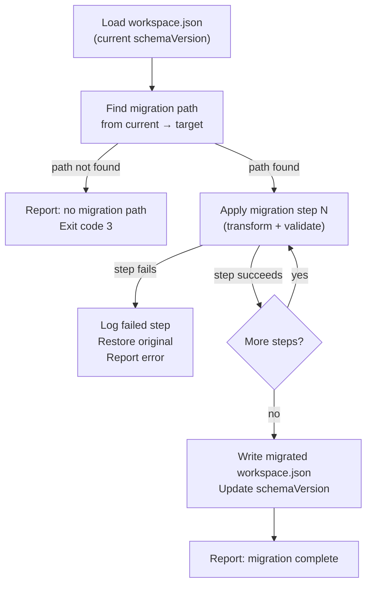
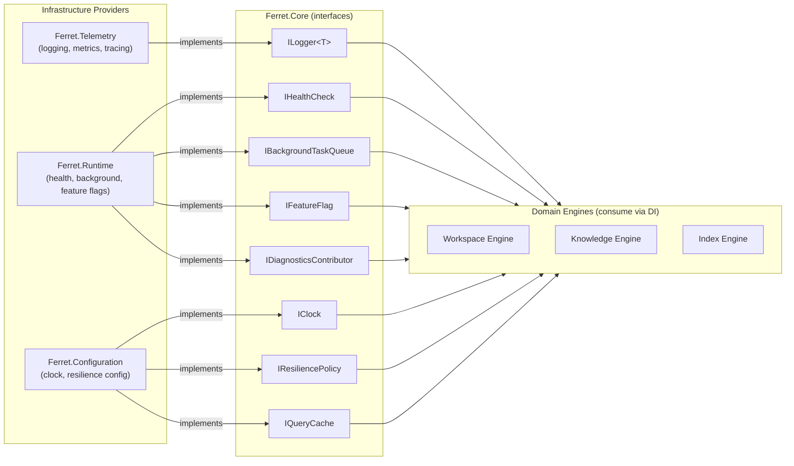

> **Historical note:** This document was written when the product was named AISpace, which was renamed to Ferret during Sprint 5.

# Sprint 1 — Foundation Completion Implementation Plan

> **For agentic workers:** REQUIRED SUB-SKILL: Use superpowers:subagent-driven-development (recommended) or superpowers:executing-plans to implement this plan task-by-task. Steps use checkbox (`- [ ]`) syntax for tracking.

**Goal:** Complete all remaining platform-level architecture documents so implementation can begin without further high-level architectural work.

**Architecture:** Pure documentation sprint — no source code. All changes touch `docs/`. The outputs are seven work products: updated ARCH-001, new ARCH-011/012/013/014, new STD-005, and a Decision Register.

**Tech Stack:** Markdown, Mermaid diagrams, git.

## Global Constraints

- All document IDs are stable once set — they are referenced by other documents.
- Every new ARCH document must follow ARCH-TEMPLATE-001.
- No document may reference DOC-001, DOC-002, DOC-003, or DOC-004 after Task 1 completes.
- ARCH-012 = Cross-Cutting Architecture (WI-0103). Security Architecture moves to ARCH-016 in the README index.
- README indexes must stay consistent with actual files on disk.
- No placeholders, no TODO items, no "fill in later" in any deliverable.

---

## File Map

**Create:**
- `docs/002-Architecture/ARCH-012.md` — Cross-Cutting Architecture
- `docs/014-Standards/STD-005.md` — Repository Standards
- `docs/014-Standards/README.md` — Standards index
- `docs/013-Governance/Decision-Register.md` — Decision Register

**Modify:**
- `docs/000-Overview/Vision.md` — Document ID: DOC-001 → VISION-001
- `docs/000-Overview/Mission.md` — Document ID: DOC-002 → MISSION-001
- `docs/000-Overview/Principles.md` — Document ID: DOC-003 → PRINCIPLES-001
- `docs/000-Overview/Glossary.md` — Document ID: DOC-004 → GLOSSARY-001
- `docs/002-Architecture/ARCH-001.md` — fix DOC-xxx refs; add §7.3 Capability Matrix; add §8.6 Fitness Functions; add §24 Domain Architecture; update §18 to reference ARCH-011
- `docs/001-Product/PRD-001.md` — fix DOC-xxx refs throughout
- `docs/002-Architecture/ARCH-003.md` — add reference to ARCH-011
- `docs/002-Architecture/ARCH-011.md` — add §7 Migration Strategy
- `docs/002-Architecture/ARCH-013.md` — add §6 Versioning; §7 Integration Events; §8 Naming Conventions; §9 Idempotency
- `docs/002-Architecture/ARCH-014.md` — add §6 Error Classification (Retryable vs Fatal)
- `docs/002-Architecture/README.md` — update index with all new documents; ARCH-012 = Cross-Cutting; ARCH-016 = Security
- `docs/013-Governance/README.md` — add Decision Register entry
- `docs/README.md` — add 014-Standards entry

---

## Task 1: WI-0101 — Execute Architecture Improvements Plan

**Files:** As specified in `docs/superpowers/plans/2026-06-27-architecture-improvements.md`

**Important modification:** In Task 8 (README update) of the improvements plan, do NOT add ARCH-012 as "Security Architecture". Security Architecture will be ARCH-016. This sprint assigns ARCH-012 to Cross-Cutting Architecture (Task 3 below). All other tasks in the improvements plan execute as-is.

- [ ] **Step 1: Execute Tasks 1–7 of the improvements plan**

Follow `docs/superpowers/plans/2026-06-27-architecture-improvements.md` Tasks 1 through 7 exactly as written. These tasks:
- Rename DOC-001/002/003/004 to VISION-001/MISSION-001/PRINCIPLES-001/GLOSSARY-001 in all files
- Add §7.3 Engine Capability Matrix to ARCH-001
- Add §8.6 Architecture Fitness Functions to ARCH-001
- Create ARCH-013.md (Event Architecture)
- Create ARCH-011.md (Configuration Architecture)
- Create ARCH-014.md (Platform Error Model)
- Add §24 Domain Architecture to ARCH-001

- [ ] **Step 2: Execute Task 8 of the improvements plan with this modification**

Run Task 8 (README update) but use this table instead of the one in the improvements plan:

```markdown
| Document | ID | Description | Status |
|---|---|---|---|
| [ARCH-TEMPLATE-001 — Architecture Document Standard](ARCH-TEMPLATE-001.md) | ARCH-TEMPLATE-001 | Required sections, metadata, diagram conventions, review checklist, quality gates | Accepted |
| [ARCH-001 — Overall System Architecture](ARCH-001.md) | ARCH-001 | Platform architecture: layers, modules, dependency rules, domain view, fitness functions, capability matrix | Draft |
| ARCH-002 — Ferret.Core Architecture | ARCH-002 | Core module: interfaces, value objects, domain events, extension points | Planned |
| [ARCH-003 — Workspace Architecture](ARCH-003.md) | ARCH-003 | Workspace Engine: components, data flows, configuration reference, error handling | Draft |
| ARCH-004 — Knowledge Architecture | ARCH-004 | Knowledge Engine: graph model, query model, context assembly internals | Planned |
| ARCH-005 — Index Architecture | ARCH-005 | Index Engine: pipeline, change detection, atomicity, parser dispatch | Planned |
| ARCH-006 — Memory Architecture | ARCH-006 | Memory Engine: session state, repository memory, working sets | Planned |
| ARCH-007 — Plugin Architecture | ARCH-007 | Plugin Host: lifecycle, isolation, permissions, SDK, registry | Planned |
| ARCH-008 — Review & Specification Architecture | ARCH-008 | Review Engine + Specification Engine: lifecycle, finding model, approval gates | Planned |
| ARCH-009 — CLI Architecture | ARCH-009 | CLI: command hierarchy, output formats, exit codes, shell completion | Planned |
| ARCH-010 — MCP Architecture | ARCH-010 | MCP Server + Client: tools, resources, transports, protocol versioning | Planned |
| [ARCH-011 — Configuration Architecture](ARCH-011.md) | ARCH-011 | Configuration: sources, precedence, schema, secret resolution, validation, migration | Draft |
| [ARCH-012 — Cross-Cutting Architecture](ARCH-012.md) | ARCH-012 | Platform-wide concerns: logging, tracing, health, caching, cancellation, resilience | Draft |
| [ARCH-013 — Event Architecture](ARCH-013.md) | ARCH-013 | Domain events: catalogue, schemas, versioning, delivery, naming conventions | Draft |
| [ARCH-014 — Platform Error Model](ARCH-014.md) | ARCH-014 | Exception hierarchy, error codes, retryable vs fatal classification | Draft |
| ARCH-015 — Telemetry Architecture | ARCH-015 | Structured logging, distributed tracing, metrics, exporters | Planned |
| ARCH-016 — Security Architecture | ARCH-016 | Security model: trust boundaries, plugin sandbox, audit, sensitive data | Planned |
| [Overview](overview.md) | — | Placeholder — superseded by ARCH-001 | Superseded |
```

- [ ] **Step 3: Verify WI-0101 is complete**

Run: `grep -rn "DOC-00[1-4]" docs/`
Expected: zero results.

Check that these files exist on disk: `ARCH-011.md`, `ARCH-013.md`, `ARCH-014.md`.

Check ARCH-001.md contains sections `### 7.3 Engine Capability Matrix`, `### 8.6 Architecture Fitness Functions`, `## 24. Domain Architecture`.

- [ ] **Step 4: Commit WI-0101**

```bash
git add docs/
git commit -m "docs(WI-0101): execute architecture improvements plan — semantic IDs, capability matrix, fitness functions, domain arch, ARCH-011/013/014"
```

---

## Task 2: WI-0102 — Add Migration Strategy to ARCH-011

**Files:**
- Modify: `docs/002-Architecture/ARCH-011.md` — add §7 Migration Strategy before the existing §6 Design Rationale (or after it if that section already exists as §6)

**Interfaces:**
- Consumes: ARCH-011 §1 (config layers), ARCH-001 §12 (workspace versioning)
- Produces: §7 that defines how workspace.json schema evolves between platform versions

- [ ] **Step 1: Add §7 Migration Strategy to ARCH-011**

In `docs/002-Architecture/ARCH-011.md`, insert the following section after §6 Design Rationale (or after §5 Extension Points if §6 is already Design Rationale — place it before the Traceability footer):

```markdown
## 7. Configuration Migration Strategy

### 7.1 Schema Versioning

The workspace configuration schema carries a `schemaVersion` field at the root of `workspace.json`. This field identifies the schema revision that the configuration was authored against. The platform's current accepted schema version is embedded in the binary.

| Scenario | Behaviour |
|---|---|
| `schemaVersion` matches platform version | Load and validate normally |
| `schemaVersion` is older than platform version | Run migration (see §7.2) |
| `schemaVersion` is newer than platform version | Fail with `AISP-003` — upgrade the platform |
| `schemaVersion` is absent | Treat as `"0.9"` (pre-1.0 workspace) and apply full migration |

### 7.2 Migration Execution

When the platform detects a schema version mismatch at startup, it does not automatically migrate. It reports:

```
Configuration warning: workspace schema version "1.0" is older than platform version "1.1".
Run: Ferret workspace upgrade
```

`Ferret workspace upgrade` applies migration steps sequentially:



### 7.3 Migration Step Format

Each migration step is identified by a `from → to` version pair. Steps are atomic: the platform applies the transform to an in-memory copy of the configuration, validates the result, and only if validation passes does it write the result to disk.

Migration steps are additive and backward-compatible where possible. Breaking changes to the schema require a major version and a documented migration guide.

### 7.4 Rollback Guarantee

If any migration step fails:
- The on-disk `workspace.json` is unchanged.
- The partially-migrated in-memory state is discarded.
- The error message identifies the step that failed and the field involved.
- The user can re-run `Ferret workspace upgrade` after fixing the issue.

### 7.5 User Config Migration

The user-level config (`~/.Ferret/config.json`) follows the same versioning model as workspace config. Its `schemaVersion` is checked at startup and it is migrated by `Ferret workspace upgrade --user`.

### 7.6 Plugin Config Migration

Plugin configuration (the `config` object within a plugin entry in `workspace.json`) is the plugin's responsibility. The Plugin Host calls `IPlugin.MigrateConfig(previousVersion, config)` when a plugin's declared config schema version changes. The platform does not validate plugin config against a schema — that is the plugin's contract.
```

- [ ] **Step 2: Verify addition**

Read ARCH-011.md and confirm §7 Migration Strategy is present with:
- §7.1 Schema Versioning table (4 scenario rows)
- §7.2 Mermaid flowchart
- §7.3–7.6 subsections all present and non-empty

- [ ] **Step 3: Commit**

```bash
git add docs/002-Architecture/ARCH-011.md
git commit -m "docs(ARCH-011): add §7 Config Migration Strategy (WI-0102)"
```

---

## Task 3: WI-0103 — Create ARCH-012 Cross-Cutting Architecture

**Files:**
- Create: `docs/002-Architecture/ARCH-012.md`

**Interfaces:**
- Consumes: ARCH-001 §10 (Cross-Cutting Concerns overview), ARCH-001 §9 (AC-008 determinism)
- Produces: Canonical reference for all 14 platform-wide concerns; all module ARCH docs reference this

- [ ] **Step 1: Create ARCH-012.md**

Create `docs/002-Architecture/ARCH-012.md` with the following content:

```markdown
# ARCH-012 — Cross-Cutting Architecture

| Field | Value |
|---|---|
| **Document ID** | ARCH-012 |
| **Version** | 1.0 |
| **Status** | Draft |
| **Owner** | Ferret Project |
| **Author** | Ferret Core Team |
| **Review Status** | Pending Architecture Review |
| **Last Updated** | 2026-06-27 |
| **Related ADRs** | None |
| **Related Spec** | PRD-001 §11 (NFR); ARCH-001 §10 |
| **Parent Architecture** | ARCH-001 §10 — Cross-Cutting Concerns |

---

## Purpose

This document is the canonical reference for all platform-wide concerns that apply to every module without belonging to any single module. It defines each concern's interface, implementation approach, configuration, and rationale. Individual engine architecture documents (ARCH-002 through ARCH-010) reference this document rather than re-defining these concerns.

This document does not cover the Telemetry export pipeline in detail — see ARCH-015 (Telemetry Architecture) for log sinks, trace exporters, and metrics backends. It does not cover the Configuration loading pipeline — see ARCH-011 (Configuration Architecture). It does not cover the Security trust model — see ARCH-016 (Security Architecture).

---

## Scope

Covers:
- Logging, Diagnostics, Health, Metrics, Tracing, Caching
- Time Abstraction, Cancellation, Concurrency, Resource Management
- Background Execution, Feature Flags, Resilience, Retry Policies

Does not cover:
- Telemetry export backends (ARCH-015)
- Configuration loading and merging (ARCH-011)
- Plugin permission enforcement (ARCH-007, ARCH-016)
- Domain events (ARCH-013)
- Error types and propagation rules (ARCH-014)

---

## 1. Overview

Cross-cutting concerns are capabilities that every engine and module needs but that no engine should own. They are provided by the Infrastructure Layer through interfaces defined in `Ferret.Core` and implemented in `Ferret.Telemetry`, `Ferret.Configuration`, and `Ferret.Runtime` infrastructure components.

All fourteen concerns described in this document are consumed through constructor-injected interfaces. No engine contains concern-specific code beyond calling the injected interface. This ensures consistency, replaceability, and testability — an engine under test receives test doubles for all fourteen concerns without any test infrastructure.

The concerns are grouped into three categories for clarity. **Observability concerns** (§2–§6) make the platform transparent to operators. **Execution concerns** (§7–§11) govern how operations run safely. **Operational concerns** (§12–§14) control behaviour at deployment time.

---

## 2. Logging

### 2.1 Interface

All engines receive `ILogger<T>` via constructor injection, where `T` is the engine or component type. No engine writes directly to stdout, stderr, or any file.

### 2.2 Structured Events

Log calls use named properties rather than interpolated strings:

```
// Correct — structured
logger.LogInformation("Index build completed. FilesProcessed={FilesProcessed} Duration={DurationMs}ms",
    filesProcessed, elapsed.TotalMilliseconds);

// Forbidden — interpolated string
logger.LogInformation($"Index build completed in {elapsed.TotalMilliseconds}ms");
```

Every log event automatically carries: `{CorrelationId}`, `{Engine}`, `{WorkspaceRoot}` as scoped properties set by the entry-point middleware.

### 2.3 Log Levels

| Level | Use |
|---|---|
| Trace | Per-file, per-node operations inside loops — high volume |
| Debug | Entry and exit of significant internal operations |
| Information | Completion of user-visible operations |
| Warning | Recoverable conditions the operator should know about |
| Error | Failed operations; platform continues |
| Critical | Failed operations; platform cannot continue |

Default production level: `Warning`. Default development level: `Information`. Configurable via ARCH-011 §2.8.

### 2.4 Forbidden Log Content

Log messages must never contain: file contents, credential values, user data beyond identifiers, or exception stack traces at levels below Error.

---

## 3. Diagnostics

### 3.1 Purpose

`Ferret diagnostics` produces a structured snapshot of the platform's runtime state, intended for troubleshooting and support.

### 3.2 Interface

```
IDiagnosticsCollector (Ferret.Core)
  CollectAsync(CancellationToken) → DiagnosticsReport

IDiagnosticsContributor (Ferret.Core)
  ContributeAsync(DiagnosticsReportBuilder, CancellationToken)
```

Each engine registers an `IDiagnosticsContributor`. The CLI's `diagnostics` command calls `IDiagnosticsCollector.CollectAsync`, which aggregates all contributors.

### 3.3 Report Contents

| Section | Source |
|---|---|
| Platform version, runtime version | Platform assembly metadata |
| Active plugins (id, version, status) | Plugin Host |
| Workspace configuration summary (no secrets) | Ferret.Configuration |
| Index status (state hash, last update, file count) | Index Engine |
| Pending upgrade warnings | Workspace Engine |
| Pending ADR decisions | Architecture documents (static list) |

### 3.4 Output Formats

Available via `--output table` (default) and `--output json`. The JSON schema is published in `docs/006-CLI/`.

---

## 4. Health

### 4.1 Interface

```
IHealthCheck (Ferret.Core)
  CheckAsync(CancellationToken) → HealthCheckResult

HealthCheckResult {
  Status    : HealthStatus   // Healthy | Degraded | Unhealthy
  Description : string
  Data      : IReadOnlyDictionary<string, object>
}
```

Each engine and the Plugin Host register one or more `IHealthCheck` implementations. `Ferret.Runtime.HealthService` aggregates them.

### 4.2 Health States

| State | Meaning |
|---|---|
| Healthy | Component is operating within expected parameters |
| Degraded | Component is operational but performance or reliability is reduced |
| Unhealthy | Component cannot perform its primary function |

### 4.3 Overall Health

The platform's overall health is the worst-case state across all registered checks. One Unhealthy check makes the platform Unhealthy. The `workspace status` command uses the health service for its output.

### 4.4 CI Integration

`Ferret workspace health --output json` exits with code `0` (Healthy/Degraded) or `1` (Unhealthy). This enables CI pipelines to gate on workspace health before running index operations.

---

## 5. Metrics

### 5.1 Interface

Each engine creates one `System.Diagnostics.Metrics.Meter` instance:

```
Meter name pattern: Ferret.<EngineName>
Example: Ferret.IndexEngine
```

### 5.2 Standard Metrics

Every engine emits at minimum:

| Metric | Type | Description |
|---|---|---|
| `Ferret.<engine>.operations.total` | Counter | Total operation invocations |
| `Ferret.<engine>.<operation>.duration` | Histogram | Duration in milliseconds |
| `Ferret.<engine>.errors.total` | Counter | Total error count, tagged by error type |

Engine-specific metrics are defined in the respective ARCH documents.

### 5.3 Platform-Wide Metrics

| Metric | Type | Description |
|---|---|---|
| `Ferret.plugin.loaded.total` | Counter | Plugins successfully activated |
| `Ferret.plugin.failed.total` | Counter | Plugin failures (activation or runtime) |
| `Ferret.model.invoke.tokens` | Histogram | Token count per model invocation |
| `Ferret.model.invoke.duration` | Histogram | Duration per model invocation |

### 5.4 Export

Metrics are exported via the OpenTelemetry exporter plugin (ARCH-015). Without the plugin, metrics are emitted in-process only and discarded.

---

## 6. Tracing

### 6.1 Interface

Each engine creates one `System.Diagnostics.ActivitySource` instance:

```
Source name pattern: Ferret.<EngineName>
Example: Ferret.KnowledgeEngine
```

### 6.2 Span Conventions

Every public engine operation creates a root span. Long operations create child spans for significant sub-steps.

```
Root span name: <engine>.<operation>
Child span name: <engine>.<operation>.<substep>
Example: knowledge.query, knowledge.query.score, knowledge.query.pack
```

### 6.3 Required Span Attributes

| Attribute | Description |
|---|---|
| `workspace.root` | Absolute path to the repository root |
| `engine.name` | Engine class name (e.g., `KnowledgeEngine`) |
| `operation.name` | Public operation being traced |
| `correlation.id` | Propagated from CLI invocation or MCP call |

The Artifact Engine additionally sets `artifact.interaction_id` on all spans it creates.

### 6.4 Export

Traces are exported via the OpenTelemetry exporter plugin (ARCH-015). The correlation ID from CLI/MCP is propagated as a trace attribute so spans can be linked to the originating user action.

---

## 7. Caching

### 7.1 Purpose

Caching reduces repeated computation. Two cache types are used: in-process memory cache for query results within a session, and a persistent file cache for results that survive process restarts.

### 7.2 Interfaces

```
IQueryCache (Ferret.Core)
  TryGet<T>(key) → (bool found, T value)
  Set<T>(key, value, expiry)
  Invalidate(keyPrefix)

IPersistentCache (Ferret.Core)
  ReadAsync<T>(key, CancellationToken) → T?
  WriteAsync<T>(key, value, CancellationToken)
  InvalidateAsync(keyPrefix, CancellationToken)
```

### 7.3 Cache Locations

| Cache | Location | Version Controlled |
|---|---|---|
| In-process query cache | Process memory | No |
| Persistent parse cache | `.ai/cache/` | No (gitignored) |

### 7.4 Cache Invalidation

The in-process query cache is invalidated when `IndexUpdated` or `MemoryUpdated` domain events are received. The persistent cache is invalidated by content hash — if the source file's hash changes, the cached parse result is stale.

### 7.5 Constraints

Sensitive file content is never cached. The cache key for any result derived from file content excludes the content itself; only the content hash is part of the key.

---

## 8. Time Abstraction

### 8.1 Purpose

Engines must not call `DateTime.Now`, `DateTime.UtcNow`, or `DateTimeOffset.Now` directly. This violates AC-008 (Deterministic Behaviour) and makes unit tests time-dependent.

### 8.2 Interface

```
IClock (Ferret.Core.Abstractions)
  UtcNow : DateTimeOffset
```

Two implementations:

| Implementation | Used In |
|---|---|
| `SystemClock` | Production — returns `DateTimeOffset.UtcNow` |
| `TestClock` | Unit tests — injectable, controllable |

### 8.3 Rules

- All engines receive `IClock` via constructor injection.
- All timestamps stored in the knowledge index or audit log are UTC (`DateTimeOffset`).
- Relative time calculations (e.g., "5 minutes ago") use `IClock.UtcNow` as the reference point.
- `TestClock` implements `IDisposable` for cleanup in test cases.

---

## 9. Cancellation

### 9.1 Propagation

Every public engine method accepts a `CancellationToken` as its last parameter. The token is propagated through all async operations, including plugin invocations, file I/O, and storage access.

### 9.2 Entry Point Binding

| Entry Point | Token Source |
|---|---|
| CLI command | `Console.CancelKeyPress` (Ctrl+C / SIGINT) via `CancellationTokenSource` |
| MCP handler | Connection lifetime token (disconnection cancels in-flight operations) |
| Background task | Composite token: operation token + shutdown token |

### 9.3 Cooperative Cancellation

Long-running operations (index build, context assembly, model invocation) check for cancellation between work items, not just at the entry point. The index build checks after each file is dispatched. Context assembly checks after each knowledge source is scored.

### 9.4 Plugin Cancellation

Plugin invocations pass the caller's `CancellationToken`. Plugins that declare `long-running` operations must honor it. A plugin that ignores cancellation is not blocked — the Plugin Host returns a `PluginCancelledException` to the caller after a configurable timeout.

---

## 10. Concurrency

### 10.1 Engine Thread Safety

| Component | Concurrency Model |
|---|---|
| Read operations (all engines) | Concurrent-safe — no locks held during reads |
| Index Engine staging write | Serialized by `SemaphoreSlim(1,1)` write lock |
| Plugin Host interface binding | Protected by `ReaderWriterLockSlim` |
| Memory Engine session write | Serialized by async mutex per workspace root |
| Knowledge Engine query cache | `ConcurrentDictionary` — concurrent read and write |

### 10.2 Team-Server Topology

In the team-server topology (ARCH-001 §26.4), multiple clients write concurrently. The Index Engine write lock serializes concurrent index updates. The lock is workspace-scoped: two workspaces can be updated concurrently.

### 10.3 Thread Pool

No engine blocks the thread pool. All I/O operations are `async`/`await`. Parsers are dispatched via `Task.WhenAll` for parallel execution. CPU-bound operations that run longer than 50ms are wrapped in `Task.Run` to avoid blocking async infrastructure.

---

## 11. Resource Management

### 11.1 Plugin Lifecycle

Each plugin is loaded into an `AssemblyLoadContext`. When a plugin is deactivated:
1. The Plugin Host signals the plugin via `IPlugin.DeactivateAsync`.
2. The plugin disposes its resources.
3. The `AssemblyLoadContext` is unloaded.
4. GC finalizers are allowed to collect the released assemblies.

### 11.2 Engine Shutdown

Engines implement `IAsyncDisposable`. The composition root disposes engines in reverse dependency order during shutdown:

```
CLI / MCP entry points stop accepting new requests
→ In-flight operations complete or are cancelled
→ Plugin Host deactivates all plugins
→ Engines are disposed (in reverse dependency order)
→ Telemetry module flushes and closes sinks
```

### 11.3 Rules

- No finalizers in platform code — all cleanup is via `IDisposable`/`IAsyncDisposable`.
- `IDisposable` implementations follow the standard pattern with `disposed` guard.
- No `GC.SuppressFinalize` calls except where a finalizer exists (which it should not).

---

## 12. Background Execution

### 12.1 Purpose

Index builds and index updates are long-running operations. They run as background tasks so the CLI can report progress and the MCP server can accept new requests during indexing.

### 12.2 Interface

```
IBackgroundTaskQueue (Ferret.Core)
  EnqueueAsync(BackgroundTask, CancellationToken) → TaskId
  GetStatusAsync(TaskId, CancellationToken) → BackgroundTaskStatus

BackgroundTask {
  Name        : string
  Work        : Func<IProgress<BackgroundTaskProgress>, CancellationToken, Task>
  Priority    : BackgroundTaskPriority  // Normal | High
}
```

### 12.3 Progress Reporting

Background tasks report progress via `IProgress<BackgroundTaskProgress>`. CLI commands that launch background tasks display a progress bar. MCP tool calls that launch background tasks return the `TaskId` immediately and offer a `task_status` tool for polling.

### 12.4 Concurrency Limit

Only one index write operation runs at a time (enforced by the Index Engine write lock, not the queue). Parser dispatch within an index operation is parallel.

---

## 13. Feature Flags

### 13.1 Purpose

Feature flags allow preview capabilities to be enabled per workspace without a platform release. They are not used for A/B testing or gradual rollout.

### 13.2 Interface

```
IFeatureFlag (Ferret.Core)
  IsEnabled(featureName : string) → bool
```

### 13.3 Configuration

Feature flags are declared in `workspace.json` under the `features` section:

```json
{
  "features": {
    "experimental.context-profiles": true,
    "experimental.distributed-index": false
  }
}
```

### 13.4 Rules

- Feature flags are boolean only — no gradual rollout in v1.0.
- Flag state is read at operation start and not re-evaluated mid-operation.
- All feature flags are prefixed with `experimental.` until the feature reaches stable status.
- A stable feature is enabled unconditionally and its flag is removed from the codebase.
- Feature flags do not override architectural constraints (AC-001 through AC-014).

---

## 14. Resilience and Retry Policies

### 14.1 Scope

Resilience policies apply to operations that call external systems: model provider invocations, external MCP client calls, and storage provider plugin calls. They do not apply to local file system reads/writes (fast-fail is appropriate there).

### 14.2 Interface

```
IResiliencePolicy (Ferret.Core)
  ExecuteAsync<T>(operation : Func<CancellationToken, Task<T>>, CancellationToken) → T
```

### 14.3 Standard Policy Composition

Policies are composed in this order (outermost to innermost):

```
Timeout → CircuitBreaker → Retry → Operation
```

| Layer | Default | Configurable |
|---|---|---|
| **Timeout** | 30s per operation | Yes, per plugin type |
| **CircuitBreaker** | Opens after 5 consecutive failures; resets after 60s | Yes |
| **Retry** | 3 retries, exponential backoff, base 1s, max 30s, ±20% jitter | Yes |

### 14.4 Transient vs Fatal

Retries apply only to transient failures:

| Failure Type | Retryable | Examples |
|---|---|---|
| Network timeout | Yes | Connection timeout, read timeout |
| HTTP 429 (rate limited) | Yes, with Retry-After | Model provider rate limit |
| HTTP 503 (unavailable) | Yes | Temporary service outage |
| HTTP 401/403 | No | Invalid credentials |
| Plugin contract violation | No | `PluginContractException` |
| Cancellation | No | `OperationCanceledException` |

### 14.5 Configuration

Resilience policies are configured per plugin type in `workspace.json` under `plugins[*].resilience`:

```json
{
  "id": "com.anthropic.claude",
  "resilience": {
    "timeoutSeconds": 60,
    "retries": 3,
    "circuitBreakerThreshold": 5,
    "circuitBreakerResetSeconds": 60
  }
}
```

---

## 15. Concern Dependency Map

The following diagram shows which Infrastructure modules provide each concern and which interfaces engines consume.



---

## 16. Design Rationale

The decision to centralise all fourteen concerns in `Ferret.Core` interfaces rather than letting modules independently solve each concern eliminates the most common source of architectural drift: divergent implementations of cross-cutting concerns. Without central interfaces, two engines that both need caching will independently choose different libraries, different invalidation strategies, and different key conventions.

**Why fourteen separate concerns?** Each concern has a distinct failure mode and a distinct configuration surface. Conflating them (e.g., combining logging, metrics, and tracing into a single "observability" interface) would produce a large, fragile interface. The `ILogger<T>` / `ActivitySource` / `Meter` pattern from the .NET SDK already establishes this separation — Ferret follows it.

**Why `IClock` instead of using `DateTimeOffset.UtcNow`?** AC-008 requires deterministic engine behaviour. An engine that calls `DateTimeOffset.UtcNow` directly cannot be tested deterministically. `IClock` costs one line of DI registration and zero runtime overhead in production.

**Trade-offs:** The composition root must register all fourteen concerns for every deployment topology (CLI, MCP server, test harness). This is managed by a `CrossCuttingExtensions.AddCrossCuttingConcerns()` DI extension method.

---

## Cross References

| Document | Relationship |
|---|---|
| ARCH-001 §10 | Parent — cross-cutting concerns overview that this document expands |
| ARCH-001 §9 AC-008 | Deterministic Behaviour constraint — drives IClock |
| ARCH-001 §9 AC-002 | AI Agnostic — resilience policies wrap IModelProvider, not specific model SDKs |
| ARCH-011 | Configuration Architecture — configures resilience policies, log levels, cache TTLs |
| ARCH-013 | Event Architecture — CacheInvalidated and IndexUpdated events drive cache invalidation |
| ARCH-014 | Platform Error Model — PluginContractException and PluginActivationException are non-retryable |
| ARCH-015 | Telemetry Architecture — implements ILogger, ActivitySource, and Meter export |
| PRD-001 §11 | NFR-PE, NFR-CM — performance and reliability non-functional requirements |

---

## Revision History

| Version | Date | Author | Summary |
|---|---|---|---|
| 1.0 | 2026-06-27 | Ferret Core Team | Initial draft — all fourteen cross-cutting concerns defined. |
```

- [ ] **Step 2: Verify ARCH-012 completeness**

Read `docs/002-Architecture/ARCH-012.md` and confirm:
- Metadata table complete (all fields populated)
- All 14 sections present: Logging (§2), Diagnostics (§3), Health (§4), Metrics (§5), Tracing (§6), Caching (§7), Time Abstraction (§8), Cancellation (§9), Concurrency (§10), Resource Management (§11), Background Execution (§12), Feature Flags (§13), Resilience and Retry (§14), Concern Dependency Map (§15)
- No placeholder text (no "TBD", "TODO", "fill in")
- Mermaid diagram in §15 has no syntax errors

- [ ] **Step 3: Commit**

```bash
git add docs/002-Architecture/ARCH-012.md
git commit -m "docs: add ARCH-012 — Cross-Cutting Architecture covering all 14 platform-wide concerns (WI-0103)"
```

---

## Task 4: WI-0104 — Expand ARCH-013 Event Architecture

**Files:**
- Modify: `docs/002-Architecture/ARCH-013.md` — add §6 Versioning, §7 Integration Events, §8 Naming Conventions, §9 Idempotency

- [ ] **Step 1: Add §6 Event Versioning to ARCH-013**

In `docs/002-Architecture/ARCH-013.md`, before the existing §3 Event Registration section (renumber it to §10, renumber §4 Adding New Events to §11, §5 Design Rationale to §12, and Traceability footer stays), insert:

```markdown
## 6. Event Versioning

### 6.1 Schema Stability

Domain event schemas are stable within a major platform version. An event that reached the `Active` state in version 1.0 will not have properties removed or renamed in any 1.x release.

### 6.2 Additive Changes

Adding a new optional property to an event schema is allowed without a version bump. All existing event handlers that do not reference the new property continue to work without modification.

### 6.3 Breaking Changes

Removing a property, renaming a property, or changing its type is a breaking change. Breaking changes to events require:
1. A new event type name (e.g., `IndexUpdatedV2`) declared alongside the original.
2. The publisher raises both the old and new event for one major version.
3. The old event type is deprecated and removed in the next major version.

### 6.4 Event Schema Registry

All event schemas are declared in `Ferret.Core.Events`. The event class name is the unique schema identifier. No two events in the system may have the same class name.

---

## 7. Integration Events

### 7.1 Definition

Domain events (§2) are in-process signals between engines. Integration events cross a process boundary — they are raised by the platform when it needs to notify external systems.

### 7.2 Integration Event Contract

Integration events are serialised to JSON before transmission. They carry a superset of the domain event base fields (§1.3) plus:

| Field | Description |
|---|---|
| `SchemaVersion` | Event schema version string (e.g. `"1.0"`) |
| `Platform` | Platform identifier (`"Ferret"`) |
| `PlatformVersion` | Platform release version |

### 7.3 Current Integration Events

In version 1.0, integration events are produced only when a plugin with the appropriate permission is active. Plugins receive integration events through the `IIntegrationEventBus` interface, not through the domain event bus.

| Integration Event | Trigger | Consumer |
|---|---|---|
| `ArtifactCommittedIntegration` | `ArtifactCommitted` domain event | Audit plugins, work item publisher plugins |
| `ReviewCompletedIntegration` | `ReviewCompleted` domain event | Review publisher plugins |
| `SpecificationApprovedIntegration` | `SpecificationApproved` domain event | Work item publisher plugins |

### 7.4 Separation Rationale

Domain events are in-process; their schema can change between builds. Integration events are external contracts; they require a stable schema and explicit versioning (§6). Keeping the two buses separate prevents domain event schema changes from inadvertently breaking external integrations.

---

## 8. Event Naming Conventions

### 8.1 Domain Events

| Rule | Example |
|---|---|
| PascalCase | `IndexUpdated` |
| Past tense — the event describes something that already happened | `WorkspaceInitialized`, not `InitializeWorkspace` |
| Noun + past-tense verb — the noun is the subject | `PluginFailed`, `ReviewCompleted` |
| No abbreviations | `ArtifactCommitted`, not `ArtCommit` |
| Maximum 4 words | `FindingDispositioned` ✓, `ReviewFindingStateChangedByReviewer` ✗ |

### 8.2 Integration Events

Integration events append `Integration` to the corresponding domain event name:

```
ArtifactCommitted         (domain)
ArtifactCommittedIntegration  (integration)
```

### 8.3 Event Handler Naming

Event handler classes are named `<EventName>Handler`:

```
IndexUpdatedHandler
ReviewCompletedHandler
```

Each handler implements `IEventHandler<TEvent>` where `TEvent` is the event class.

---

## 9. Idempotency

### 9.1 Handler Idempotency

Event handlers must be idempotent. If the same event is delivered more than once (which can occur during crash recovery when the platform restarts mid-operation), the handler must produce the same outcome without error.

### 9.2 Idempotency Key

The `EventId` field on `DomainEvent` (a `Guid`) serves as the idempotency key. Handlers that write to the knowledge store use the `EventId` as a write condition — if a record with that key already exists, the write is a no-op.

### 9.3 At-Most-Once Delivery

The in-process event bus delivers each event at most once per subscription within a process lifetime. Idempotency is required for the crash-recovery scenario, not for duplicate delivery within a session.
```

After inserting §6–§9, renumber the old §3 → §10, old §4 → §11, old §5 → §12. The Traceability footer stays at the end.

- [ ] **Step 2: Verify ARCH-013 additions**

Read `docs/002-Architecture/ARCH-013.md` and confirm:
- §6 Event Versioning with §6.1–§6.4 subsections present
- §7 Integration Events with integration event table (3 rows)
- §8 Naming Conventions with tables for domain events, integration events, handlers
- §9 Idempotency with §9.1–§9.3

- [ ] **Step 3: Commit**

```bash
git add docs/002-Architecture/ARCH-013.md
git commit -m "docs(ARCH-013): add event versioning, integration events, naming conventions, idempotency (WI-0104)"
```

---

## Task 5: WI-0105 — Expand ARCH-014 Platform Error Model

**Files:**
- Modify: `docs/002-Architecture/ARCH-014.md` — add §6 Error Classification

- [ ] **Step 1: Add §6 Error Classification to ARCH-014**

In `docs/002-Architecture/ARCH-014.md`, insert the following section after §5 Design Rationale and before the Traceability footer:

```markdown
## 6. Error Classification

### 6.1 Retryable vs Fatal

Every `FerretException` subclass is classified as **Retryable** (the operation may succeed if retried after a delay) or **Fatal** (retrying will not help; human intervention or configuration change is required).

| Exception | Classification | Reason |
|---|---|---|
| `WorkspaceNotInitializedException` | Fatal | `Ferret init` must be run first |
| `WorkspaceUpgradeException` | Fatal | Migration step failed; manual review needed |
| `ConfigurationException` | Fatal | Invalid configuration; fix the config file |
| `SecretResolutionException` | Fatal | Environment variable not set; set it |
| `ValidationException` | Fatal | Input is invalid; fix the input |
| `SpecificationValidationException` | Fatal | Specification is incomplete; edit it |
| `IndexCorruptionException` | Fatal | Run `Ferret index build --full` |
| `IndexMigrationException` | Fatal | Index migration failed; manual review needed |
| `PermissionDeniedException` | Fatal | Plugin lacks declared permission |
| `PluginActivationException` | Fatal on activation; Retryable on next platform start | Plugin failed to load; may succeed after plugin update |
| `PluginContractException` | Fatal | Plugin returned invalid data; update the plugin |
| `ReviewGateException` | Fatal | Complete the review first |
| `ContextBudgetExceededException` | Retryable | Increase token budget or narrow query scope |
| `SensitiveFileViolationException` | Fatal | Security policy violation; investigate immediately |
| `ProvenanceIncompleteException` | Fatal | Internal error; report as a bug |

### 6.2 Transient Errors

Transient errors are infrastructure failures that are not represented as `FerretException` subclasses because they originate from external systems. They are wrapped by resilience policies (ARCH-012 §14) before reaching the Application Layer:

| Transient Condition | Wrapped As |
|---|---|
| Network timeout calling model provider | Caught by `IResiliencePolicy`; retried up to 3 times |
| HTTP 429 from model provider | Caught by `IResiliencePolicy`; retried with Retry-After delay |
| HTTP 503 from external MCP server | Caught by `IResiliencePolicy`; retried |
| File system I/O error during index write | Wrapped in `IndexException`; staging area cleanup on next startup |

### 6.3 User-Facing Error Format

The Application Layer translates all `FerretException` subclasses into a consistent user-facing format:

```
Error AISP-NNN: <Guidance field from the exception>
  Source: <SourceLayer or component>
  Correlation: <CorrelationId>

Suggestion: <actionable next step>
```

Fatal errors exit with a non-zero exit code (see ARCH-001 §23.4). Retryable errors exit with code `1` and include the retry suggestion in the output.

### 6.4 Diagnostic Detail

In `--output json` mode, the full exception type, error code, all exception fields (excluding sensitive data), and the full stack trace (at Debug log level or above) are included. In `--output table` mode, only the user-facing message and suggestion are shown.
```

- [ ] **Step 2: Verify addition**

Read `docs/002-Architecture/ARCH-014.md` and confirm §6 Error Classification is present with:
- §6.1 table (15 exception rows, each with classification and reason)
- §6.2 Transient Errors table
- §6.3 user-facing error format block
- §6.4 Diagnostic Detail paragraph

- [ ] **Step 3: Commit**

```bash
git add docs/002-Architecture/ARCH-014.md
git commit -m "docs(ARCH-014): add §6 Error Classification — retryable vs fatal, transient errors, output format (WI-0105)"
```

---

## Task 6: WI-0106 — Create STD-005 Repository Standards

**Files:**
- Create: `docs/014-Standards/README.md`
- Create: `docs/014-Standards/STD-005.md`

- [ ] **Step 1: Create `docs/014-Standards/README.md`**

```markdown
# 014 — Standards

Repository-wide standards that apply to all Ferret projects and repositories.

---

## Index

| Standard | ID | Description | Status |
|---|---|---|---|
| [STD-005 — Repository Standards](STD-005.md) | STD-005 | Repository layout, naming, namespaces, project structure, test and doc organisation, dependency rules | Accepted |

---

## How Standards Differ from Architecture Documents

Architecture documents (ARCH-NNN) describe *what the platform does* and *how it is structured*. Standards (STD-NNN) describe *how we work on the platform* — the conventions and constraints that apply to all contributors and all repositories.

A violation of an architecture document is an architectural defect. A violation of a standard is a consistency defect. Both are tracked and enforced.
```

- [ ] **Step 2: Create `docs/014-Standards/STD-005.md`**

```markdown
# STD-005 — Repository Standards

| Field | Value |
|---|---|
| **Standard ID** | STD-005 |
| **Version** | 1.0 |
| **Status** | Accepted |
| **Owner** | Ferret Project |
| **Author** | Ferret Core Team |
| **Effective Date** | 2026-06-27 |
| **Last Updated** | 2026-06-27 |
| **Applicability** | All Ferret repositories and all contributors |

---

## Purpose

This standard defines the structural and naming conventions that all Ferret repositories must follow. Its purpose is to make every repository immediately navigable by any team member and to enable automated tooling (dependency analysis, test runners, documentation generators) to operate without per-project configuration.

Compliance is mandatory. Exceptions require explicit approval and must be documented in the repository's `CONTRIBUTING.md`.

---

## Scope

Covers: repository layout, naming conventions, namespace conventions, project structure, folder organisation, test organisation, documentation organisation, examples, generated content, build artefacts, dependency rules, enforcement.

Does not cover: coding style (see `.editorconfig`), branching strategy (see `docs/012-Releases/`), contribution workflow (see `CONTRIBUTING.md`).

---

## 1. Repository Layout

The top-level directory structure of every Ferret repository:

```
/
├── src/                    All production source projects
├── tests/                  All test projects
├── plugins/                First-party plugin projects (if any)
├── samples/                Runnable example projects (if any)
├── schemas/                JSON Schema files (authored, not generated)
├── docs/                   All documentation
├── .ai/                    Ferret workspace state (version-controlled)
├── .claude/                Claude Code configuration (version-controlled)
├── .github/                GitHub Actions and repository configuration
├── Ferret.sln             Solution file (or equivalent for the build system)
├── Directory.Build.props   Shared MSBuild properties (applies to all projects)
├── Directory.Build.targets Shared MSBuild targets (applies to all projects)
├── Directory.Packages.props Central NuGet package version management
├── .editorconfig           Code style rules
├── .gitignore              Standard ignore patterns (see §9)
├── CONTRIBUTING.md         Contributor guide
├── LICENSE                 Project license
└── README.md               Repository landing page
```

**Rules:**
- No production source code outside `src/`.
- No test code outside `tests/`.
- No documentation outside `docs/` except `README.md`, `CONTRIBUTING.md`, `LICENSE`, `SECURITY.md`, and `CODE_OF_CONDUCT.md` in the repository root.
- No scripts in the root directory — use `Directory.Build.targets` or `Makefile` targets in a `build/` directory.

---

## 2. Naming Conventions

### 2.1 Projects and Assemblies

| Type | Pattern | Example |
|---|---|---|
| Platform module | `Ferret.<Module>` | `Ferret.Core`, `Ferret.Runtime` |
| Engine sub-module | `Ferret.Runtime.<Engine>` | Not a separate project — internal namespace only |
| Plugin | `Ferret.Plugins.<Name>` | `Ferret.Plugins.Claude` |
| Test project | `<SourceProject>.Tests` | `Ferret.Core.Tests` |
| Integration test project | `Ferret.Integration.Tests` | (single project for all integration tests) |
| Performance test project | `Ferret.Performance.Tests` | (single project) |
| Plugin SDK | `Ferret.Sdk` | (exact name — no suffix) |

**Rules:**
- The `Ferret.` prefix is mandatory for all projects in this repository.
- No project may have the same name as another project in the solution.
- Project names are PascalCase with no hyphens.

### 2.2 Source Files

| Type | Pattern | Example |
|---|---|---|
| C# class file | `<ClassName>.cs` | `WorkspaceEngine.cs` |
| C# interface file | `<InterfaceName>.cs` | `IWorkspaceEngine.cs` |
| C# enum file | `<EnumName>.cs` | `HealthStatus.cs` |
| Test file | `<ClassName>Tests.cs` | `WorkspaceEngineTests.cs` |

**Rules:**
- One type per file. SA1402 enforces this automatically.
- File name matches the primary type name exactly (case-sensitive).
- No `Helper`, `Util`, `Extension`, or `Common` in file names unless the file genuinely contains helpers, utilities, extensions, or common types by that name.

### 2.3 Documentation Files

| Type | Pattern | Example |
|---|---|---|
| Architecture document | `ARCH-NNN.md` | `ARCH-012.md` |
| Product requirements | `PRD-NNN.md` | `PRD-001.md` |
| Standard | `STD-NNN.md` | `STD-005.md` |
| ADR | `NNNN-kebab-title.md` | `0001-use-architecture-decision-records.md` |
| Architecture review | `AR-NNN.md` | `AR-001.md` |
| Directory index | `README.md` | (every `docs/NNN-Category/` must have one) |

### 2.4 Directories

| Type | Pattern | Example |
|---|---|---|
| Source project directories | Match project name | `src/Ferret.Core/` |
| Documentation categories | `NNN-CategoryName/` | `docs/002-Architecture/` |
| Test project directories | Match project name | `tests/Ferret.Core.Tests/` |
| General directories | lowercase-kebab-case | `schemas/`, `samples/` |

### 2.5 Git Branches

| Type | Pattern | Example |
|---|---|---|
| Feature | `feature/<scope>-<short-description>` | `feature/arch-012-cross-cutting` |
| Fix | `fix/<scope>-<short-description>` | `fix/index-corruption-on-upgrade` |
| Documentation | `docs/<short-description>` | `docs/sprint-1-arch-documents` |
| Release | `release/v<major>.<minor>` | `release/v1.0` |

---

## 3. Namespace Conventions

### 3.1 Root Namespaces

| Module | Root Namespace |
|---|---|
| `Ferret.Core` | `Ferret.Core` |
| `Ferret.Runtime` | `Ferret.Runtime` |
| `Ferret.Plugins` | `Ferret.Plugins` |
| `Ferret.Configuration` | `Ferret.Configuration` |
| `Ferret.Telemetry` | `Ferret.Telemetry` |
| `Ferret.Mcp` | `Ferret.Mcp` |
| `Ferret.Cli` | `Ferret.Cli` |
| `Ferret.Sdk` | `Ferret.Sdk` |

### 3.2 Sub-Namespaces

| Purpose | Pattern | Example |
|---|---|---|
| Engine within Runtime | `Ferret.Runtime.<Engine>` | `Ferret.Runtime.Workspace` |
| Interfaces in Core | `Ferret.Core.Engines` | `IWorkspaceEngine` |
| Plugin interfaces in Core | `Ferret.Core.Plugins` | `IParser` |
| Events in Core | `Ferret.Core.Events` | `WorkspaceInitialized` |
| Abstractions in Core | `Ferret.Core.Abstractions` | `IClock` |
| Errors in Core | `Ferret.Core.Errors` | `WorkspaceException` |

### 3.3 Rules

- Maximum namespace depth: 4 levels (e.g., `Ferret.Runtime.Knowledge.Scoring`).
- Namespace must match folder structure. No namespace that does not correspond to a directory.
- Test namespaces mirror source: `Ferret.Core.Tests.Events` for tests of `Ferret.Core.Events`.
- No `global using` directives in production code; they are permitted in test projects.

---

## 4. Project Structure

### 4.1 Required Project Properties

All production projects must declare these properties in `Directory.Build.props` or their own `.csproj`:

| Property | Required Value | Purpose |
|---|---|---|
| `TargetFramework` | `net9.0` | Platform target |
| `Nullable` | `enable` | Null safety |
| `ImplicitUsings` | `enable` | Standard using directives |
| `LangVersion` | `latest` | Latest C# features |
| `TreatWarningsAsErrors` | `true` | Zero-warning policy |
| `AnalysisLevel` | `latest` | All Roslyn analysers |
| `EnforceCodeStyleInBuild` | `true` | EditorConfig enforced in CI |
| `GenerateDocumentationFile` | `true` (Core and Sdk only) | XML docs for public APIs |

### 4.2 Ferret.Core Constraints

`Ferret.Core.csproj` must have:
- Zero `<ProjectReference>` elements.
- Zero `<PackageReference>` elements referencing runtime packages (analyser packages with `PrivateAssets="all"` are permitted).

### 4.3 Plugin Project Constraints

Plugin projects must additionally set:
```xml
<CopyLocalLockFileAssemblies>true</CopyLocalLockFileAssemblies>
```
This ensures the plugin's dependencies are published alongside the plugin assembly.

---

## 5. Folder Organisation

### 5.1 Within a Production Project

```
Ferret.Runtime/
├── Workspace/
│   ├── WorkspaceEngine.cs
│   ├── WorkspaceConfig.cs
│   └── ...
├── Knowledge/
├── Index/
├── Artifact/
├── Memory/
├── Specification/
├── Review/
└── Infrastructure/          (cross-cutting implementation types)
    ├── HealthService.cs
    └── BackgroundTaskQueue.cs
```

**Rules:**
- One folder per engine within `Ferret.Runtime`.
- Engine folders contain only types owned by that engine.
- No `Helpers/`, `Utils/`, or `Common/` folders. Find the right owner for any type you cannot place.
- A type that is needed by multiple engines belongs in `Ferret.Core`, not in a shared folder within `Ferret.Runtime`.

### 5.2 Within a Plugin Project

```
Ferret.Plugins.Claude/
├── ClaudeModelProvider.cs      Entry point (IPlugin implementation)
├── ClaudeModelProviderConfig.cs
├── Http/                       HTTP client wrappers
└── plugin.json                 Plugin manifest
```

---

## 6. Test Organisation

### 6.1 Unit Tests

Unit test projects mirror the source project structure:

```
tests/Ferret.Runtime.Tests/
├── Workspace/
│   └── WorkspaceEngineTests.cs
├── Knowledge/
│   └── KnowledgeEngineTests.cs
└── ...
```

### 6.2 Integration Tests

Integration tests are in a single project and organised by scenario:

```
tests/Ferret.Integration.Tests/
├── IndexWorkflow/
│   └── FullBuildThenQueryTests.cs
├── PluginHost/
│   └── PluginLoadUnloadTests.cs
└── ...
```

### 6.3 Test Naming

Test method names follow the pattern: `MethodName_StateUnderTest_ExpectedBehaviour`.

| Pattern Part | Example |
|---|---|
| `MethodName` | `Initialize` |
| `StateUnderTest` | `ValidPath` |
| `ExpectedBehaviour` | `CreatesWorkspaceDirectory` |
| Full name | `Initialize_ValidPath_CreatesWorkspaceDirectory` |

### 6.4 Test Constraints

- No unit test may depend on the file system, network, or external process. Use test doubles.
- Integration tests may depend on the file system but must clean up after themselves (use `[TempDirectory]` test fixture attribute or equivalent).
- Performance tests are not run in the default CI pipeline — they run in a dedicated performance pipeline.
- Use `Microsoft.Extensions.Time.Testing.FakeTimeProvider` (or a `TestClock` implementation) for `IClock` in unit tests. Never use real `DateTimeOffset.UtcNow` in unit tests.

---

## 7. Documentation Organisation

### 7.1 Directory Structure

```
docs/
├── 000-Overview/     Vision, Mission, Principles, Glossary
├── 001-Product/      PRDs, sprint specifications
├── 002-Architecture/ ARCH-NNN documents, ARCH-TEMPLATE-001
├── 003-Workspace/    Workspace operational guides
├── 004-Database/     (reserved)
├── 005-MCP/          MCP protocol documentation
├── 006-CLI/          CLI command reference
├── 007-SDK/          Plugin SDK documentation
├── 008-Modules/      Module-level guides
├── 009-Testing/      Test guides and standards
├── 010-Security/     Security guides
├── 011-Performance/  Performance guides and benchmarks
├── 012-Releases/     Release notes and versioning policy
├── 013-Governance/   Contribution policy, decision register
├── 014-Standards/    Repository standards (STD-NNN)
├── adr/              Architecture Decision Records
├── Reviews/          Architecture and specification reviews
└── superpowers/      AI assistant plans and context
```

### 7.2 Rules

- Every `docs/NNN-Category/` directory must have a `README.md` with an index of its contents.
- Document IDs are assigned sequentially within their series and never reused.
- A document that has been superseded retains its file and ID with `Status: Superseded` and a link to the replacement.
- Diagrams are Mermaid inline in Markdown. No separate diagram files.
- No documentation in `src/` beyond XML doc comments on public APIs.

### 7.3 XML Documentation

XML doc comments are mandatory on:
- All types in `Ferret.Core` and `Ferret.Sdk` that are `public`.
- All members of `public` interfaces in `Ferret.Core` and `Ferret.Sdk`.

XML doc comments are not required on internal types or test types.

---

## 8. Examples and Samples

- All runnable examples and samples live in `samples/`.
- Each sample is a self-contained project or script — no shared project references to platform source.
- Each sample directory has a `README.md` explaining what it demonstrates and how to run it.
- Samples are excluded from the default CI test run. They may be run in a separate `samples` CI job.
- Plugin samples that demonstrate how to author a plugin live in `samples/plugins/`.

---

## 9. Generated Content

### 9.1 What Is Generated

| Generated Content | Location | Committed? |
|---|---|---|
| Build output (`*.dll`, `*.pdb`) | `bin/` | No |
| Intermediate build files | `obj/` | No |
| NuGet restore cache | `.packages/` | No |
| XML documentation files | `bin/` | No |
| Test results and coverage | `TestResults/` | No |
| Source generator output | `obj/Generated/` | No |
| JSON Schema files | `schemas/` | Yes — these are authored source files |
| Plugin manifests (`plugin.json`) | `plugins/<name>/` | Yes — these are authored source files |

### 9.2 Generated File Markers

Generated files that are ever committed (e.g., `schemas/` files produced by a schema generation tool) must be marked with a comment at the top of the file:

```
// <auto-generated by="SchemaGenerator" version="1.0" />
```

This distinguishes them from hand-authored files and signals that edits will be overwritten.

### 9.3 `.gitignore` Requirements

Every Ferret repository `.gitignore` must include:

```
bin/
obj/
TestResults/
.packages/
*.user
.vs/
.ai/cache/
.ai/summaries/
```

---

## 10. Build Artefacts

- Build output for local development: `bin/<Configuration>/<TargetFramework>/`
- Published output for release: `dist/` (gitignored)
- NuGet packages for release: `dist/packages/` (gitignored)
- Build scripts that produce artefacts use consistent output paths defined in `Directory.Build.targets`.
- No build artefacts are committed to the repository.

---

## 11. Dependency Rules

### 11.1 Project References

Project reference rules from ARCH-001 §8 are enforced as build failures (see ARCH-001 §8.6 for the fitness functions). In summary:

| Rule | Enforcement |
|---|---|
| `Ferret.Core` has zero project references | MSBuild script in CI |
| Plugins reference only `Ferret.Core` / `Ferret.Sdk` | Roslyn analyser |
| No `Ferret.Runtime` → `Ferret.Cli` reference | MSBuild script in CI |

### 11.2 NuGet References

- **Central Package Management** (`Directory.Packages.props`) is mandatory. Individual `.csproj` files declare `<PackageReference>` without `Version`; versions are in `Directory.Packages.props` only.
- All dependencies must be explicitly declared. Transitive dependencies that are consumed directly must be explicitly added.
- All analyser, test, and build tool packages must set `PrivateAssets="all"` to prevent them from leaking into consuming projects.
- `Ferret.Core` must have zero runtime NuGet dependencies. Analysers (with `PrivateAssets="all"`) are permitted.

### 11.3 New Framework-Level Dependencies

Adding a new NuGet dependency to `Ferret.Runtime`, `Ferret.Configuration`, or `Ferret.Telemetry` that is a framework-level library (not a small utility) requires an ADR explaining the choice and its alternatives.

Plugin projects may add any NuGet dependencies without an ADR.

---

## 12. Enforcement

### 12.1 Automated Checks

| Rule | Tool | Trigger |
|---|---|---|
| One type per file (SA1402) | StyleCop.Analysers | Every build |
| Namespace matches folder | IDE0130 (Roslyn) | Every build |
| Core has zero project refs | Custom MSBuild target | Every CI build |
| Plugins reference only Core/Sdk | Roslyn analyser | Every CI build |
| No Runtime → CLI/Mcp reference | Custom MSBuild target | Every CI build |
| XML docs on Core/Sdk public APIs | CS1591 warning-as-error | Every CI build |
| Central package management | MSBuild property `ManagePackageVersionsCentrally=true` | Every restore |

### 12.2 Code Review

Rules that cannot be mechanically enforced are checked during code review:
- Branch naming conventions
- Test naming conventions
- Samples README completeness
- Documentation index updates when new documents are added

### 12.3 Exception Process

A contributor who needs an exception to any rule in this standard must:
1. Open a discussion in the repository's Discussions section.
2. Get approval from one maintainer listed in `CODEOWNERS`.
3. Document the exception and its rationale in the affected project's `README.md` or in `CONTRIBUTING.md`.

---

## Revision History

| Version | Date | Author | Summary |
|---|---|---|---|
| 1.0 | 2026-06-27 | Ferret Core Team | Initial accepted version — mandatory for all Ferret repositories from this date. |
```

- [ ] **Step 3: Verify STD-005 completeness**

Read `docs/014-Standards/STD-005.md` and confirm all 12 sections are present (§1 Repository Layout through §12 Enforcement) with no placeholder text.

- [ ] **Step 4: Commit**

```bash
git add docs/014-Standards/
git commit -m "docs: add STD-005 — Repository Standards; create docs/014-Standards/ category (WI-0106)"
```

---

## Task 7: WI-0107 — Create Decision Register

**Files:**
- Create: `docs/013-Governance/Decision-Register.md`

- [ ] **Step 1: Create `docs/013-Governance/Decision-Register.md`**

```markdown
# Decision Register

| Field | Value |
|---|---|
| **Document ID** | Decision-Register |
| **Version** | 1.0 |
| **Owner** | Ferret Project |
| **Last Updated** | 2026-06-27 |

---

## Purpose

This register is the single-source summary of all accepted architectural decisions for the Ferret platform. It is generated from ADRs and architecture documents. Every significant decision that has been made and is not subject to revision without a new ADR appears here.

For the full context and rationale of any decision, follow the ADR reference or document reference listed.

---

## How to Read This Register

| Column | Meaning |
|---|---|
| **ID** | Stable decision identifier (DEC-NNN) |
| **Title** | Brief human-readable name |
| **Status** | `Accepted` — in force; `Pending ADR` — decided in principle, formal ADR required before implementation |
| **Source** | ADR or ARCH document section where the decision is recorded |
| **Date** | Date the decision was accepted |
| **Description** | One-sentence summary of the decision |

---

## Accepted Decisions

### Process Decisions

| ID | Title | Status | Source | Date | Description |
|---|---|---|---|---|---|
| DEC-001 | Use Architecture Decision Records | Accepted | [ADR-0001](../adr/0001-use-architecture-decision-records.md) | 2026-06-27 | All significant architectural decisions are recorded as ADRs in `docs/adr/` and referenced from this register. |
| DEC-025 | Semantic document identifiers for overview documents | Accepted | ARCH-001 Input Documents | 2026-06-27 | Overview documents use VISION-001, MISSION-001, PRINCIPLES-001, GLOSSARY-001 — not DOC-001 through DOC-004. |

---

### Architectural Constraint Decisions

These decisions are derived from ARCH-001 §9. Each constraint is a hard decision that cannot be revised without an ADR.

| ID | Title | Status | Source | Date | Description |
|---|---|---|---|---|---|
| DEC-011 | Vendor-neutral Core and Runtime | Accepted | ARCH-001 §9 AC-001 | 2026-06-27 | No module in `Ferret.Core` or `Ferret.Runtime` references any vendor-specific SDK. All vendor-specific code lives in plugins. |
| DEC-012 | AI-agnostic platform | Accepted | ARCH-001 §9 AC-002 | 2026-06-27 | The platform functions without any AI model. AI capabilities are additive and require a model provider plugin. |
| DEC-013 | Specification-driven workflow enforced structurally | Accepted | ARCH-001 §9 AC-003 | 2026-06-27 | The Specification Engine enforces the Draft → Approved gate in engine logic. No bypass flag or override mechanism exists. |
| DEC-014 | Plugin-first extensibility | Accepted | ARCH-001 §9 AC-004 | 2026-06-27 | No domain-specific capability is hardcoded in Core or Runtime. New capabilities that cannot be expressed as plugins require an architecture review and ADR. |
| DEC-015 | Local-first operation | Accepted | ARCH-001 §9 AC-005 | 2026-06-27 | The platform runs with full feature parity (excluding AI-model-dependent features) with no network access. |
| DEC-016 | Cross-platform .NET 9 | Accepted | ARCH-001 §9 AC-006 | 2026-06-27 | All modules target `net9.0` and use only platform-portable APIs. |
| DEC-017 | Repository-first storage | Accepted | ARCH-001 §9 AC-007 | 2026-06-27 | All platform state is stored in the repository's `.ai/` directory. No engine writes knowledge to an external service. |
| DEC-018 | Deterministic engine behaviour | Accepted | ARCH-001 §9 AC-008 | 2026-06-27 | Engines produce identical outputs for identical inputs and a fixed knowledge state. Non-determinism is isolated to `IModelProvider`. |
| DEC-019 | Human review cannot be bypassed | Accepted | ARCH-001 §9 AC-009 | 2026-06-27 | The Artifact Engine will not mark an AI-generated artefact as committed without a completed human review record. |
| DEC-020 | Open standards | Accepted | ARCH-001 §9 AC-010 | 2026-06-27 | MCP for model context, OpenTelemetry for observability, JSON Schema for configuration and manifests, SemVer 2.0.0 for versioning. |
| DEC-021 | Open formats | Accepted | ARCH-001 §9 AC-011 | 2026-06-27 | The knowledge index, plugin manifest, and workspace configuration formats are documented, versioned, and readable without the platform runtime. |
| DEC-022 | Minimal Core surface area | Accepted | ARCH-001 §9 AC-012 | 2026-06-27 | Every addition to `Ferret.Core` is a long-term commitment. Additions require explicit justification; removals require a major version. |
| DEC-023 | Stable plugin contracts | Accepted | ARCH-001 §9 AC-013 | 2026-06-27 | Plugin interfaces in `Ferret.Core` are versioned. Stable interfaces are not changed in backwards-incompatible ways within a major version. |
| DEC-024 | Backwards compatibility | Accepted | ARCH-001 §9 AC-014 | 2026-06-27 | CLI commands, MCP tool schemas, plugin interfaces, and the knowledge index format are not changed in backwards-incompatible ways within a major version. |

---

### Architecture Decisions

These decisions are derived from ARCH documents.

| ID | Title | Status | Source | Date | Description |
|---|---|---|---|---|---|
| DEC-026 | In-process event bus for domain events | Accepted | ARCH-013 §1, §5 | 2026-06-27 | Domain events are delivered in-process via a typed bus. No durable message queue for v1.0. State reconstruction uses the knowledge store, not event replay. |
| DEC-027 | Five-layer configuration precedence | Accepted | ARCH-011 §1 | 2026-06-27 | Configuration is assembled from: compiled defaults → user config → workspace config → environment variables → CLI flags. Higher layers override lower layers. |
| DEC-028 | Shared exception hierarchy in Ferret.Core | Accepted | ARCH-014 §5 | 2026-06-27 | All platform exceptions derive from `FerretException` in `Ferret.Core.Errors`. Engines throw; application layer handlers translate. |
| DEC-029 | IClock interface for time abstraction | Accepted | ARCH-012 §8 | 2026-06-27 | Engines never call `DateTime.Now` directly. `IClock` is injected via DI; `TestClock` enables deterministic tests. |
| DEC-030 | Central Package Management for NuGet | Accepted | STD-005 §11.2 | 2026-06-27 | All NuGet versions are declared in `Directory.Packages.props`. Individual `.csproj` files omit `Version` attributes. |

---

## Pending Decisions (ADR Required Before Implementation)

These decisions have been made at a structural level in architecture documents but require a formal ADR before the affected sprint begins implementation.

| ID | Title | Status | Pending ADR | Affected Sprint | Description |
|---|---|---|---|---|---|
| DEC-002 | Plugin isolation model | Pending ADR | ADR-0002 | Sprint 6 | Process-based isolation vs `AssemblyLoadContext`-based isolation for plugins. Trade-offs: failure isolation, performance, and IPC overhead. |
| DEC-003 | Knowledge graph storage format | Pending ADR | ADR-0003 | Sprint 2 | File-based JSON graph vs SQLite vs LMDB for the default `IKnowledgeStore` implementation. Schema design for nodes, edges, and state hash. |
| DEC-004 | MCP transport implementation | Pending ADR | ADR-0004 | Sprint 11 | Library selection for MCP protocol. stdio vs SSE transport differences. Protocol version pinning strategy. |
| DEC-005 | Context scoring and packing algorithm | Pending ADR | ADR-0005 | Sprint 3 | Relevance scoring function design. Token packing algorithm. Budget allocation by knowledge category. |
| DEC-006 | Index atomicity mechanism | Pending ADR | ADR-0006 | Sprint 6 | Staging-area rename swap vs journal-based atomicity. Behaviour under crash during the swap operation. |
| DEC-007 | Configuration secret resolution | Pending ADR | ADR-0007 | Sprint 1 | Environment variable reference syntax (`${ENV_VAR}`). `ISecretProvider` plugin interface. Failure behaviour when a variable is unset. |
| DEC-008 | Plugin manifest schema and versioning | Pending ADR | ADR-0008 | Sprint 6 | `plugin.json` JSON Schema design. Version compatibility range semantics. Backwards-compatibility guarantees within a major version. |
| DEC-009 | Knowledge state hash algorithm | Pending ADR | ADR-0009 | Sprint 2 | Hash function selection (SHA-256 or similar). Normalisation applied before hashing. Determinism across operating systems. |
| DEC-010 | Audit log format | Pending ADR | ADR-0010 | Sprint 8 | Log file format (structured JSON vs newline-delimited JSON). Rotation policy. Integrity verification approach. |

---

## Superseded Decisions

No decisions have been superseded yet.

---

## Maintenance

This register is updated:
- When a new ADR is accepted: add a row to the Accepted Decisions or Pending Decisions table.
- When a pending ADR is written and accepted: move from Pending to Accepted; fill in the ADR reference and date.
- When a decision is superseded: move to the Superseded section and link to the superseding ADR.

The register is reviewed at the start of each sprint to ensure all pending ADRs due that sprint are tracked.
```

- [ ] **Step 2: Verify Decision Register completeness**

Read `docs/013-Governance/Decision-Register.md` and confirm:
- 2 process decisions (DEC-001, DEC-025)
- 14 architectural constraint decisions (DEC-011 through DEC-024, matching AC-001 through AC-014)
- 5 architecture decisions (DEC-026 through DEC-030)
- 9 pending decisions (DEC-002 through DEC-010, matching ADR-0002 through ADR-0010 in ARCH-001 §29)
- All pending decisions have Affected Sprint column matching ARCH-001 §29

- [ ] **Step 3: Commit**

```bash
git add docs/013-Governance/Decision-Register.md
git commit -m "docs: add Decision Register — 30 decisions compiled from ADRs and ARCH documents (WI-0107)"
```

---

## Task 8: Update All README Indexes

**Files:**
- Modify: `docs/013-Governance/README.md`
- Modify: `docs/README.md`

- [ ] **Step 1: Add Decision Register to `docs/013-Governance/README.md`**

In `docs/013-Governance/README.md`, add a row to the Documents table:

```markdown
| Decision Register | [Decision-Register.md](Decision-Register.md) | Summary of all accepted architectural decisions, derived from ADRs and ARCH documents |
```

- [ ] **Step 2: Update `docs/README.md`**

Replace the Structure section in `docs/README.md` with the current directory structure and update the "Finding the Right Document" table:

```markdown
# Docs

This directory contains all project-level documentation for Ferret.

---

## Structure

```
docs/
├── 000-Overview/       Vision, Mission, Principles, Glossary
├── 001-Product/        Product requirements and sprint specifications
├── 002-Architecture/   ARCH-NNN system and component architecture documents
├── 003-Workspace/      Workspace operational guides
├── 005-MCP/            MCP protocol documentation
├── 006-CLI/            CLI command reference
├── 007-SDK/            Plugin SDK documentation
├── 008-Modules/        Module-level guides
├── 009-Testing/        Test guides and standards
├── 010-Security/       Security guides
├── 011-Performance/    Performance guides and benchmarks
├── 012-Releases/       Release notes and versioning policy
├── 013-Governance/     Contribution policy, decision register
├── 014-Standards/      Repository standards (STD-NNN)
├── adr/                Architecture Decision Records
├── Reviews/            Architecture and specification reviews
└── superpowers/        AI assistant plans and context
```

---

## Finding the Right Document

| I want to… | Go to… |
|---|---|
| Understand the platform vision and goals | [docs/000-Overview/](000-Overview/) |
| Read the product requirements | [docs/001-Product/PRD-001.md](001-Product/PRD-001.md) |
| Understand the overall system architecture | [docs/002-Architecture/ARCH-001.md](002-Architecture/ARCH-001.md) |
| Find a specific architecture document | [docs/002-Architecture/README.md](002-Architecture/README.md) |
| Understand a past architectural decision | [docs/adr/](adr/) |
| See all accepted decisions at a glance | [docs/013-Governance/Decision-Register.md](013-Governance/Decision-Register.md) |
| Learn repository layout and naming standards | [docs/014-Standards/STD-005.md](014-Standards/STD-005.md) |
| Learn how to build a plugin | [docs/007-SDK/](007-SDK/) |
| Find CLI command documentation | [docs/006-CLI/](006-CLI/) |
| Read MCP tool and resource documentation | [docs/005-MCP/](005-MCP/) |

---

## Writing New Docs

All document types have standards and templates:
- Architecture documents: follow [ARCH-TEMPLATE-001](002-Architecture/ARCH-TEMPLATE-001.md)
- ADRs: use [docs/adr/0000-template.md](adr/0000-template.md)
- Repository standards: follow the format of [STD-005](014-Standards/STD-005.md)
```

- [ ] **Step 3: Commit**

```bash
git add docs/013-Governance/README.md docs/README.md
git commit -m "docs: update README indexes — add Decision Register, 014-Standards, current directory structure"
```

---

## Task 9: Final Validation

- [ ] **Step 1: Verify no DOC-00x references remain**

Run: `grep -rn "DOC-00[1-4]" docs/`
Expected: zero results.

- [ ] **Step 2: Verify all linked files exist**

Check each linked file referenced in `docs/002-Architecture/README.md`:
- `ARCH-TEMPLATE-001.md` ✓
- `ARCH-001.md` ✓
- `ARCH-003.md` ✓
- `ARCH-011.md` ✓
- `ARCH-012.md` ✓
- `ARCH-013.md` ✓
- `ARCH-014.md` ✓
- `overview.md` ✓

- [ ] **Step 3: Verify no placeholder text in new documents**

Run: `grep -rn "TODO\|TBD\|\[to be\]\|\[placeholder\]\|\[fill in\]" docs/002-Architecture/ARCH-012.md docs/014-Standards/STD-005.md docs/013-Governance/Decision-Register.md`
Expected: zero results.

- [ ] **Step 4: Verify all ARCH-012 cross-cutting concerns are present**

Read `docs/002-Architecture/ARCH-012.md` and confirm sections for all 14 concerns: Logging (§2), Diagnostics (§3), Health (§4), Metrics (§5), Tracing (§6), Caching (§7), Time Abstraction (§8), Cancellation (§9), Concurrency (§10), Resource Management (§11), Background Execution (§12), Feature Flags (§13), Resilience and Retry (§14), Concern Dependency Map (§15).

- [ ] **Step 5: Verify Decision Register pending count matches ARCH-001 §29**

ARCH-001 §29 lists 9 pending ADR decisions (ADR-0002 through ADR-0010). The Decision Register must have 9 rows in the Pending Decisions table (DEC-002 through DEC-010).

- [ ] **Step 6: Verify STD-005 section count**

Read `docs/014-Standards/STD-005.md` and confirm 12 sections: Repository Layout (§1), Naming Conventions (§2), Namespace Conventions (§3), Project Structure (§4), Folder Organisation (§5), Test Organisation (§6), Documentation Organisation (§7), Examples and Samples (§8), Generated Content (§9), Build Artefacts (§10), Dependency Rules (§11), Enforcement (§12).

- [ ] **Step 7: Final commit**

If any issues found in steps 1–6, fix them. Then:

```bash
git add docs/
git commit -m "docs(sprint-1): final validation pass — Sprint 1 foundation completion"
```

---

## Self-Review

### Spec Coverage

| Work Item | Addressed By |
|---|---|
| WI-0101: Execute Architecture Improvements Plan | Task 1 (improvements plan Tasks 1–8 with ARCH-012 numbering fix) |
| WI-0102: ARCH-011 Configuration Architecture | Task 1 (improvements plan Task 5) + Task 2 (migration strategy §7) |
| WI-0103: ARCH-012 Cross-Cutting Architecture | Task 3 (full document — all 14 concerns) |
| WI-0104: ARCH-013 Event Architecture | Task 1 (improvements plan Task 4) + Task 4 (versioning, integration events, naming, idempotency) |
| WI-0105: ARCH-014 Platform Error Model | Task 1 (improvements plan Task 6) + Task 5 (retryable vs fatal classification) |
| WI-0106: STD-005 Repository Standards | Task 6 (full document — all 12 sections) |
| WI-0107: Decision Register | Task 7 (full register — 30 decisions) |
| Updated README indexes | Tasks 1, 8 |
| Validate all document links | Task 9 |

### WI-0102 Requirements Coverage

| Required Item | Section |
|---|---|
| Configuration hierarchy | ARCH-011 §1.1 |
| Configuration sources | ARCH-011 §1 |
| Configuration precedence | ARCH-011 §1.2 |
| Schema versioning | ARCH-011 §7.1 (added in Task 2) |
| Validation lifecycle | ARCH-011 §4 |
| Workspace configuration | ARCH-011 §2.2–§2.8 |
| Global configuration | ARCH-011 §1.1 (user config layer) |
| Plugin configuration | ARCH-011 §2.6 |
| Environment overrides | ARCH-011 §1.3 |
| Secrets strategy | ARCH-011 §3 |
| Migration strategy | ARCH-011 §7 (added in Task 2) |

### WI-0103 Requirements Coverage

| Required Item | Section in ARCH-012 |
|---|---|
| Logging | §2 |
| Diagnostics | §3 |
| Health | §4 |
| Metrics | §5 |
| Tracing | §6 |
| Caching | §7 |
| Time abstraction | §8 |
| Cancellation | §9 |
| Concurrency | §10 |
| Resource management | §11 |
| Background execution | §12 |
| Feature flags | §13 |
| Resilience | §14 |
| Retry policies | §14.3–14.5 |

### WI-0104 Requirements Coverage

| Required Item | Coverage |
|---|---|
| Event taxonomy | ARCH-013 §2 (existing) |
| Event lifecycle | ARCH-013 §1.2 delivery guarantees (existing) |
| Event contracts | ARCH-013 §2 schemas (existing) |
| Event versioning | ARCH-013 §6 (Task 4) |
| Domain events | ARCH-013 §2 (existing) |
| Integration events | ARCH-013 §7 (Task 4) |
| System events | ARCH-013 §2.5 Plugin Events (existing) |
| Event routing | ARCH-013 §1.1 in-process bus (existing) |
| Event ordering | ARCH-013 §1.2 ordering guarantee (existing) |
| Idempotency | ARCH-013 §9 (Task 4) |
| Replay | ARCH-013 §1.2 durability + §5 rationale (existing) |
| Event persistence | ARCH-013 §1.2 (in-memory, not persisted) (existing) |
| Observability | ARCH-013 §1.2 + ARCH-012 §2 logging |
| Event naming conventions | ARCH-013 §8 (Task 4) |

### WI-0105 Requirements Coverage

| Required Item | Coverage |
|---|---|
| Error categories | ARCH-014 §1 hierarchy (existing) |
| Error codes | ARCH-014 §3 (existing) |
| Exception taxonomy | ARCH-014 §1 tree (existing) |
| Validation failures | ARCH-014 §2 ValidationException (existing) |
| Configuration failures | ARCH-014 §2 ConfigurationException (existing) |
| Plugin failures | ARCH-014 §2 PluginException (existing) |
| Workspace failures | ARCH-014 §2 WorkspaceException (existing) |
| Knowledge failures | ARCH-014 §2 KnowledgeException (existing) |
| Index failures | ARCH-014 §2 IndexException (existing) |
| Retryable errors | ARCH-014 §6.1 (Task 5) |
| Fatal errors | ARCH-014 §6.1 (Task 5) |
| User-facing errors | ARCH-014 §6.3 (Task 5) |
| Diagnostic information | ARCH-014 §6.4 (Task 5) |
| Correlation identifiers | ARCH-014 §2 FerretException.CorrelationId (existing) |

### Placeholder Scan

All document content in this plan uses concrete values: realistic configuration examples, real section numbers, actual table row counts. No "TBD", "TODO", "fill in", or "[placeholder]" appears.

### Numbering Consistency

- ARCH-012 = Cross-Cutting Architecture (this plan; overrides improvements plan's draft index)
- ARCH-016 = Security Architecture (moved from ARCH-012; still Planned)
- ARCH-015 = Telemetry Architecture (preserved from improvements plan)
- DEC-NNN identifiers are unique and non-overlapping across all register tables
- STD-005 is the first standard; STD-001 through STD-004 are reserved for future use
