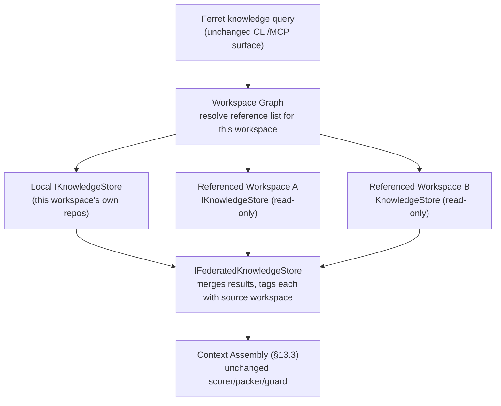

# 01 — Architecture Overview

**Status:** Ready for implementation (subject to ADR-0026, ADR-0027 sign-off)
**Extends:** ARCH-001 §7 (Core Modules), §27.2 (Multi-Repository Federation), §30 (Domain Architecture)

## 1. What's Being Added

Three new capabilities sit on top of the existing platform. Nothing below replaces an existing engine; each item names the ARCH-001 section it extends.

| New capability | Extends | New module |
|---|---|---|
| Workspace graph (multi-repo + docs + refs in one workspace) | §12 Workspace Architecture | `Ferret.Workspace.Graph` |
| Federated knowledge query (query spans referenced workspaces) | §13 Knowledge Architecture, §27.2 | `Ferret.Knowledge.Federation` |
| Usage ledger + analytics | §21 Telemetry Architecture | `Ferret.Telemetry.Ledger`, `Ferret.Analytics` |

## 2. Module View

```
Ferret.Workspace.Graph        depends on: Ferret.Core, Ferret.Configuration
                               (owns: workspace registry, reference list, manifest schema)

Ferret.Knowledge.Federation   depends on: Ferret.Core, Ferret.Workspace.Graph
                               implements: IFederatedKnowledgeStore (ARCH-001 §27.2)
                               (fans a query out across the IKnowledgeStore of every
                               referenced workspace; does not own any index data itself)

Ferret.Telemetry.Ledger       depends on: Ferret.Core, Ferret.Telemetry
                               (adds an append-only event sink alongside the existing
                               Console/File/OTEL sinks in §21.3 — same pipeline, new sink)

Ferret.Analytics              depends on: Ferret.Telemetry.Ledger
                               (read-only aggregation layer; never writes to the ledger)
```

Dependency direction matches ARCH-001 §8's rule: new modules depend inward on Core, nothing in Core depends outward on them. `Ferret.Knowledge.Federation` depends on `Ferret.Workspace.Graph` (it needs the reference list to know which stores to fan out to) but the reverse is not true — the workspace graph has no knowledge-query logic in it.

## 3. How a Federated Query Actually Runs



The existing CLI/MCP query surface (§13.5, §22.3) does not change. `IFederatedKnowledgeStore` implements the same shape as `IKnowledgeStore`; callers above the storage abstraction cannot tell the difference between a local query and a federated one. This is why 12-API.md adds almost no new query API — federation is a storage-layer concern, not an API-layer one.

## 4. What Is Genuinely New (not just an extension)

Two things have no existing ARCH-001 hook and need their own decisions:

1. **Where does the workspace-of-repos boundary live on disk/registry?** Today `.ai/workspace.json` is scoped to one repo checkout. A workspace that spans repos needs a manifest that is *not* inside any single repo. → ADR-0026, 13-Storage.md.
2. **Sharing a workspace with other people/roles.** Nothing in ARCH-001 or FUTURE-002 defines this below the V3 "Ferret Hub" level. → ADR-0029, `Future/Deferred-Scope.md` for what's cut from v1.

Everything else (federation query shape, incremental indexing, caching, telemetry) is an extension of a section that already exists and already anticipated this direction (ARCH-001 §27.1: *"identifies architectural directions that are not in scope for version 1.0 but ... would not require architectural redesign"*).

## 5. Decision Log

| Decision | Outcome |
|---|---|
| Federation is implemented as a storage-layer abstraction (`IFederatedKnowledgeStore`), not a new query API | Ready — directly specified in ARCH-001 §27.2 |
| New modules follow existing dependency-direction rule (§8); no exceptions | Ready |
| Usage ledger is a new sink on the existing telemetry pipeline, not a parallel telemetry system | Ready |
| Workspace registry location and reference-resolution strategy | Requires Founder decision — ADR-0026, ADR-0027 |
