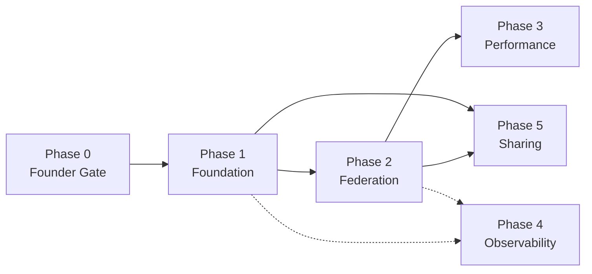

# 15 — Execution Plan

**Status:** Ready for implementation, gated on Phase 0 closing
**Purpose:** ordering, dependencies, critical path, and quick wins for the Workspace Intelligence Platform milestone — the "in what order will we build it" answer for the whole doc set

## 1. Phases

| Phase | Delivers | Docs | Depends on |
|---|---|---|---|
| **0 — Founder Gate** | ADR-0026 (registry model) decided — this is the only decision that blocks Phase 1 start. ADR-0029 (sharing scope) must close before Phase 5 start, not before Phase 1. ADR-0027 is already Accepted; ADR-0028 (retention) is no longer a Founder gate at all (downgraded 2026-07-05, ships as a configurable default). | 13, ADR/ | — |
| **1 — Foundation** | `IWorkspaceRegistry`, `Ferret.Workspace.Graph`, manifest schema, auto-migration wrapper, `workspace create/add-repo/list` commands | 02, 12, 13, 14 | Phase 0 |
| **2 — Federation** | `IFederatedKnowledgeStore`, `Ferret.Knowledge.Federation`, `add-reference/remove-reference`, cycle detection, pinning, knowledge-graph additions | 03, 04 | Phase 1 |
| **3 — Performance** | Cross-workspace invalidation, 3-layer cache, Scope Classifier + Compressor in Context Assembly | 05, 06, 07 | Phase 2 |
| **4 — Observability** | New telemetry metrics + Ledger sink, Analytics aggregates, Developer/Workspace dashboards | 08, 09, 10, 11 | Metric plumbing can start alongside Phase 2; meaningful dashboards need Phase 2 live |
| **5 — Sharing** | Role model enforcement, `workspace share`, permission checks on reference resolution | 02 §3, 03 §4, ADR-0029 | Phase 1 (manifest), Phase 2 (permission check sits in the federation query path) |

## 2. Dependency Graph

Solid arrow = hard blocker. Dotted = soft dependency (plumbing can start early; correctness needs the upstream phase).

## 3. Critical Path

Phase 0 → Phase 1 → Phase 2 → Phase 3. This is the sequence that determines when the milestone's headline claim (00-Vision.md: repo boundaries invisible, token cost near-flat under federation) is actually demonstrable. Phases 4 and 5 run alongside Phase 3 without extending the critical path, as long as they don't compete for the same engineers as Phase 3.

## 4. Quick Wins

- **Phase 1 alone ships visible value before federation exists.** `Ferret workspace create` / `add-repo` / `list` gives multi-repo grouping and the migration wrapper (14) immediately, with zero risk to existing single-repo behavior. This should ship as soon as it's done, not held for Phase 2.
- **Migration (14) is near-free.** Auto-wrapping existing workspaces requires no user action and should land with Phase 1, not as a separate release.

## 5. What Blocks Starting Phase 1

Only ADR-0026. Everything else Phase 1 needs (`schemaVersion` upgrade mechanism, `.ai/` storage conventions) already exists in ARCH-001. This is why Phase 0 is a single decision, not a design phase — the design work is what this doc set already did.

## 6. Recommended First Slice

Phase 1 alone (registry + CLI bookkeeping) doesn't exercise the milestone's central architectural bet — nothing queries across a reference until Phase 2 exists. `Backlog/backlog.md` "Vertical Slice" section defines a thin cut across Phase 1 + a minimal subset of Phase 2 (skipping pinning, caching, and optimization) as the first thing to actually dogfood, ahead of completing either phase fully.

## 7. Decision Log

| Decision | Outcome |
|---|---|
| Phase ordering: Foundation → Federation → Performance, with Observability/Sharing parallel to Performance | Ready for implementation |
| Phase 1 ships independently before Phase 2 completes | Ready for implementation |
| Starting Phase 1 requires only ADR-0026 closed | Ready — this is the single gate |
| ADR-0029 is a real decision but does not block Phase 1 — only Phase 5 | Ready — clarified in 2026-07-05 review |
| First dogfooding target is the vertical slice (§6), not full Phase 1 or full Phase 2 completion | Ready — see Backlog |
