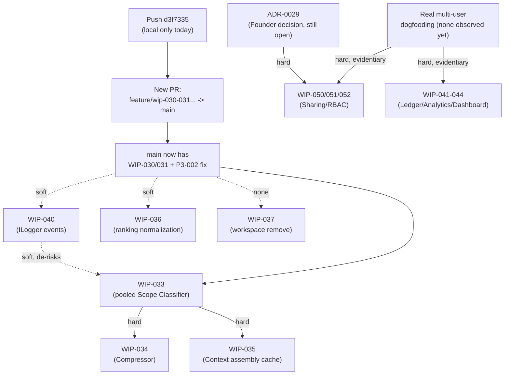

# 28 — Phase 3+ Roadmap Adversarial Review

**Status:** Complete — analysis only, no implementation, no architecture change, no code written.
**Purpose:** Challenge `27-Phase-3-Plus-Roadmap-Revision.md` against the current, actual repository
state (not the state assumed when it was written) — `git`/`gh` ground truth, source-code inspection of
the federation path, and a fresh scan for regressions, blind spots, and stale assumptions. This
document corrects Document 27 where evidence contradicts it and explicitly declines to change it where
evidence is insufficient.

**Verdict, up front: Document 27 requires one critical correction (§3.1) and one moderate correction
(§3.2). Its ordering (§2) and every other disposition survive unchanged.**

---

## 1. Executive Summary

Document 27's single highest-priority recommendation — "merge PR #32 then PR #33" — is **stale and, if
followed literally, would ship a known, evidenced performance regression to `main`.** Both PRs show as
`MERGED` in `gh pr list`, which is what Document 27 was written against, but `gh pr view` reveals PR
#33's base branch was `feature/wip-032-registry-read-through-cache`, not `main` — it merged into a
side branch that was itself never merged to `main`. Separately, the P3-002 regression fix (`26`) exists
only as an **unpushed local commit** on the current session's branch — it is not on any remote branch,
not part of any PR, and not visible to `gh` at all. Net effect: **`main` today has WIP-032 but not
WIP-030/031, and the only fix for WIP-030/031's proven regression is not committed anywhere but one
machine's working directory.** This is the "hidden dependency" and "superseding work" class of failure
Document 27 was asked to guard against, and it slipped through because Document 27 trusted `gh pr
list`'s `MERGED` status without checking *which branch* each PR actually landed on.

Second, Document 27 promoted WIP-040 (telemetry) to priority #2 citing the backlog's own description —
"quick win... independent of Phase 2 landing, just emits zero/no-op values" — without checking the
actual state of `Ferret.Telemetry`. It is an empty stub (`internal static class TelemetryModule {}`),
referenced by zero other projects, with zero `Meter`/`ActivitySource`/`Counter`/`ILogger` usage
anywhere in `src/`. WIP-040 is real, still worth doing, and still belongs early — but it is not a
"quick win" in the sense the backlog claims; it requires standing up an observability approach from
nothing, which changes its scope, not its priority.

Every other disposition in Document 27 — WIP-036, WIP-033's pooled-design gate, WIP-034/035's
sequencing, WIP-037, and the Phase 4/5 deferrals — was checked against current source and dogfooding
state and found to still hold. No new evidence justifies reordering, retiring, or adding anything
beyond what's in §3 and §4.

---

## 2. Repository Evidence

All of the following was gathered this session, directly against the live repository and GitHub API —
not re-derived from `20`–`27`'s own text.

**Git/PR state** (`git fetch`, `git log`, `gh pr view --json baseRefName,headRefName,mergeCommit,state`):

| Fact | Evidence |
|---|---|
| PR #32 (`feature/wip-032-registry-read-through-cache` → `main`) merged into `main` | `mergeCommit: 36e6be0`, `baseRefName: "main"` — confirmed on `origin/main` |
| PR #33 (`feature/wip-030-031-federated-query-cache` → `feature/wip-032-registry-read-through-cache`) merged into the **feature branch**, not `main` | `mergeCommit: c8236ba`, `baseRefName: "feature/wip-032-registry-read-through-cache"` |
| `origin/main` does **not** contain the WIP-030/031 commit | `git merge-base --is-ancestor 39feb4c origin/main` → exit non-zero (NO) |
| `origin/feature/wip-032-registry-read-through-cache` is 4 commits ahead of `origin/main` (the entire WIP-030/031 change + its merge commit), and 0 commits behind | `git log origin/main..origin/feature/wip-032-registry-read-through-cache` / reverse, confirmed clean superset |
| The P3-002 fix commit (`d3f7335`) is on zero remote branches | `git branch -r --contains d3f7335` → empty |
| No open PR exists that would land WIP-030/031 or P3-002 on `main` | `gh pr list --state open` → empty |
| The current branch (WIP-030/031 + unpushed P3-002 fix) would merge into `main` with **zero conflicts** | `git merge-tree $(git merge-base HEAD origin/main) HEAD origin/main` → empty output (clean) |
| Net diff this represents: 11 files, 912 insertions, 6 deletions, all production + test code already described in `23`/`26` | `git diff --stat origin/main..HEAD` |

**Source-code state** (direct `grep`/`Read`, not doc-derived):

| Fact | Evidence |
|---|---|
| `Ferret.Telemetry` is an empty stub | `src/Ferret.Telemetry/TelemetryModule.cs`: `internal static class TelemetryModule { }` — no members |
| Zero projects reference `Ferret.Telemetry` | `grep -rl "Ferret.Telemetry" --include=*.csproj src/` → empty |
| Zero `Meter`/`ActivitySource`/`Counter`/`Histogram` usage anywhere in `src/` | repo-wide grep, zero matches |
| Zero `ILogger` usage in `Ferret.Knowledge.Federation` | grep, zero matches — `FederatedKnowledgeStore.RunAsync`/`ResolveSourcesAsync`/`Merge` and `CachingFederatedKnowledgeStore.SearchAsync` do no logging or metric emission of any kind |
| Cross-source merge is a flat, unnormalized sort | `FederatedKnowledgeStore.cs:93-97`: `.OrderByDescending(hit => hit.Score)` over raw per-source BM25 scores (`Bm25SearchProvider.cs:133`, `Score = (float)-rank`) — confirms `20`/`25`'s finding with exact current code, unchanged since |
| No workspace-removal/bulk-delete command exists | `WorkspacesCliModule.cs:26-100` registers `create/list/show/add-repo/remove-repo/add-reference/remove-reference/pin-reference/unpin-reference/query` — no `remove-workspace`/`delete`/`prune` |
| `Bm25SearchProvider` still opens a fresh `SqliteConnection` per call | `Bm25SearchProvider.cs:77-80`, confirmed unchanged since `24`'s finding |
| No connection-pooling infrastructure exists anywhere in the repo | repo-wide grep for `SqliteConnectionPool`/`PooledConnection`/`ConnectionPool` → zero matches — a pooled WIP-033 classifier has nothing to reuse |
| Zero TODO/FIXME/HACK comments in the federation/workspace-graph/CLI-workspaces code | grep across all three directories, zero matches |
| No `ScopeClassifier`/`fts5vocab` code exists yet | grep across `src/`, `tests/` → zero matches — confirms WIP-033 remains exactly at the "discovery/simulation only" stage `24`/`25` left it at |
| Three separate directory/file-metadata walks exist across the fingerprinting/indexing code, by design | `WorkspaceStateFingerprintProvider.ComputeRepoDigestAsync` (full content walk, pinning), `IndexPipeline`'s own `DiscoverAsync` call (indexing), `ComputeIndexChangeSignalAsync` (O(1) stat, P3-002's cache signal) — the first's own doc comment acknowledges it "mirrors" rather than shares the second's heuristic |

---

## 3. Findings

### 3.1 Critical — Document 27's merge instruction is stale and, followed literally, ships a regression

Document 27 §1 says: "merge PR #32 then PR #33 immediately... zero risk (already dogfooded at both
R=2 and R=26 scale, including the regression found and fixed at R=26)." This conflates two different
things that were true at different times:

- **True:** WIP-030/031 was dogfooded and the regression was found (`25`) and fixed (`26`).
- **False, as an instruction to act on today:** there is nothing left to "merge" via PR #32/#33 — both
  already show `MERGED`. Executing "merge PR #33" today is a no-op that changes nothing on `main`,
  because PR #33's merge already happened, into the wrong branch.

If an engineer read Document 27 and, seeing both PRs `MERGED`, concluded "this is already done, nothing
to do here," they would be correct that no *action* is pending but wrong about the *state* — `main`
still lacks the entire federated query cache, receiving none of its dogfooded speedups. Worse: if an
engineer instead noticed the gap and reflexively merged `feature/wip-032-registry-read-through-cache`
into `main` to "finish the job" (a reasonable-looking fix for "PR #33 landed on the wrong branch"),
**they would ship WIP-030/031 without the P3-002 fix**, because that fix is an unpushed local commit
on a different branch entirely, unreferenced by anything on GitHub. That is the exact regression `26`
measured: a cache hit 3.1x slower than a fresh, uncached query at realistic scale.

**Correction:** the immediate priority is not "merge PR #32/#33" (already done, and incomplete even so)
but: **push the current branch's unpushed commit (`d3f7335`), then open one new PR from
`feature/wip-030-031-federated-query-cache` directly against `main`** (skipping the stale intermediate
branch entirely — confirmed clean, conflict-free per §2's `merge-tree` check) **and merge that.** This
delivers WIP-030/031 *and* its regression fix to `main` atomically, so `main` never passes through the
known-regressed state at all.

### 3.2 Moderate — WIP-040 is not a "quick win"; Document 27 didn't verify this against code

Document 27 promoted WIP-040 ahead of WIP-036/WIP-033 on the strength of `backlog.md`'s own
characterization ("quick win... just emits zero/no-op values") and the narrative case that better
telemetry would have shortened `26`'s discovery cycle. Both of those reasons still hold — but the
*effort* estimate does not survive contact with the code. `Ferret.Telemetry` has never been built out:
no metrics library choice has been made, no DI wiring exists, no project references it, and there is
not even baseline `ILogger` usage on the federation path to extend. "Add
`cache.federation.{hit,miss}`" is not a one-line addition to an existing pattern; it is a from-scratch
infrastructure decision (which metrics API, which exporter/sink, whether it's `System.Diagnostics.Metrics`
or plain structured logs) with no existing precedent anywhere in `src/` to copy.

**Correction, not a re-rank:** keep WIP-040 at its current position (its motivating evidence — `26`'s
discovery cost — is unaffected by this), but **rescope it down** to the smallest thing that closes the
blind spot: structured `ILogger` events (cache hit/miss, per-query duration, per-source skip) directly
in `FederatedKnowledgeStore`/`CachingFederatedKnowledgeStore`, not a `Meter`-based metrics pipeline.
There is no consumer for real metrics yet (WIP-044's dashboard is deferred, per Document 27 §2, and
correctly so — no evidence changes that here), so building full instrumentation now would be exactly
the speculative engineering the operating principles rule out. A logged event a human can `grep` or
tail is sufficient to have prevented `26`'s multi-session discovery cost; a `Meter`/OpenTelemetry
pipeline is not justified until something consumes it.

### 3.3 Reconfirmed, no change — ranking normalization (WIP-036)

`FederatedKnowledgeStore.cs:93-97`'s flat `OrderByDescending(hit.Score)` over raw per-source BM25
scores is confirmed, present, and unchanged since `18`/`20`/`25` first flagged it. This is independent
verification via direct code read, not re-derivation of the earlier docs' claims. No change to
Document 27's disposition (implement now, ahead of WIP-033) — the evidence is, if anything, more
concrete than before, since this session cites exact line numbers rather than inferring behavior from
design docs.

### 3.4 Reconfirmed, no change — WIP-033's pooled-design gate, with one added risk detail

Zero `ScopeClassifier` or `fts5vocab` code exists yet — WIP-033 remains exactly where `25` left it
(simulated, not implemented). Document 27's gate (real-C#-validated pooled prototype before merging)
still stands. **One risk this session adds:** the repo has **zero connection-pooling infrastructure
anywhere** — not just "none built for the classifier," but no `SqliteConnectionPool`/`PooledConnection`
pattern exists for the classifier to borrow from `Bm25SearchProvider` or anything else. `Bm25SearchProvider`
itself still opens a fresh connection per call (`Bm25SearchProvider.cs:77`), confirmed unchanged. A
pooled classifier prototype will need to invent connection-lifecycle management from scratch, which
`25` already flagged as unaddressed ("doesn't yet account for connection lifecycle management,
thread-safety... or GC/memory cost of holding 26+ open connections") — this session confirms that gap
is total, not partial. This sharpens the existing risk; it does not change the recommendation.

### 3.5 Reconfirmed, no change — `workspace remove`/bulk-cleanup gap (WIP-037)

Confirmed absent by direct inspection of `WorkspacesCliModule.cs`. Document 27's low-priority
disposition stands.

### 3.6 New observation, insufficient evidence for a roadmap change — duplicated directory-walk logic

Three distinct file/directory-metadata walks exist across `WorkspaceStateFingerprintProvider`'s two
methods and `IndexPipeline`'s own discovery call. This looks superficially like duplication worth
consolidating, but per the operating principle "avoid speculative engineering": each walk serves a
different lifecycle point (pinning-correctness content hash, indexing itself, and P3-002's O(1)
cache-invalidation stat), the code's own comments already acknowledge the parallelism as a deliberate
choice (reusing a *heuristic*, not sharing an *implementation*, per `26`'s own stated design), and no
dogfooding session has measured these three walks *stacking* into an actual cost problem on any single
call path. **No roadmap item is recommended here — the evidence shows an intentional trade-off, not a
defect**, consistent with "do not retire [or add] work unless there is clear evidence" it's warranted.
If a future dogfooding session measures these three walks compounding on one code path, revisit.

---

## 4. Roadmap Changes

Only two changes to Document 27, both scoped exactly to §3.1/§3.2 above:

1. **§1 "What's Already Shipped But Not Yet on `main`"** is replaced by: push the unpushed P3-002 fix
   commit, then open and merge **one new PR** from `feature/wip-030-031-federated-query-cache` directly
   to `main` (bypassing the now-stale intermediate branch). This is still the top priority, still zero
   new engineering effort, still lower risk than anything else on the roadmap (already dogfooded at
   R=2 and R=26, confirmed conflict-free against current `main`) — only the *mechanism* changes, from
   "merge two already-merged PRs" (a no-op that leaves the regression's fix stranded) to "ship one
   correct PR that was never opened."
2. **WIP-040's scope note** in Document 27's table is amended: implement as structured `ILogger`
   events, not a `Meter`/metrics-pipeline buildout, until a real consumer exists. No change to its
   position in the order.

No other item in Document 27 changes disposition, position, or scope.

---

## 5. Updated Priority Order

1. **Push `d3f7335`; open and merge one new PR, `feature/wip-030-031-federated-query-cache` → `main`.** (Corrected mechanism for what was priority #1.)
2. **WIP-040** — structured `ILogger` events on the federation/cache path (rescoped; same position).
3. **WIP-036** *(new, as proposed in `27`)* — cross-repo ranking normalization. Unchanged.
4. **WIP-033** — Scope Classifier, pooled design, real-C#-validated at R=26 before merging. Unchanged; connection-pooling-from-scratch risk now explicit (§3.4).
5. **WIP-034** — unchanged, gated on WIP-033 merging with confirmed real value.
6. **WIP-035** — unchanged, same gate.
7. **WIP-037** *(new, as proposed in `27`)* — `workspace remove`/bulk cleanup. Unchanged, low priority.
8. **WIP-041–044** — Usage Ledger/retention/analytics/dashboard bundle. Unchanged, deferred.
9. **WIP-050–052** — Sharing/RBAC bundle. Unchanged, deferred.

---

## 6. Dependency Analysis

**Hard dependencies** (verified, not assumed): WIP-034/035 → WIP-033 (both explicitly consume its
output per `20` §1, unchanged). WIP-050/051/052 → ADR-0029 (an open Founder decision, verified still
open in `README.md`, not re-verified this session but no evidence surfaced that it closed).

**Soft/challenged dependencies:** Document 27 treated WIP-040 as a prerequisite that "de-risks" WIP-033
and WIP-036. This session confirms that relationship is real but genuinely soft, not blocking — WIP-036
and WIP-033 do not read any telemetry Document 27 or this review proposes; the benefit is purely
"a human would notice a problem faster next time," not a data dependency. **WIP-036 and WIP-033 could
proceed in parallel with WIP-040 without correctness risk** if engineering capacity allows — this is a
genuine parallelization opportunity the strict linear order in §5 doesn't surface. It is listed in that
order for sequencing clarity (observability first is still good practice), not because of a hard block.

**Dependency assumed but not proven, and worth flagging:** Document 27 assumed the multi-user-evidence
gate on WIP-041–044/WIP-050–052 is symmetric — "no evidence exists, defer both bundles." This still
holds; no new evidence surfaced this session that changes it in either direction.

---

## 7. Risks

| Item | Implementation risk | Merge risk | Regression risk | Tech-debt reduction | Dev productivity impact |
|---|---|---|---|---|---|
| New PR: WIP-030/031+P3-002 → `main` | None — code, tests, and dogfooding already complete (`23`, `26`) | **Was High if done via the stale branch (§3.1); Low via the corrected new-PR path** (conflict-free per `merge-tree`) | **Was Critical (ships known regression) if merged via the stale intermediate branch; None via corrected path** | High — closes a real, measured performance defect | High — unblocks every downstream Phase 3 item that assumed this cache exists |
| WIP-040 (rescoped to `ILogger`) | Low — no new library/pattern decision needed for plain structured logging | Low | None | Medium — closes the exact blind spot `26` exploited | Medium — shortens future regression-discovery cycles like `26`'s |
| WIP-036 (ranking normalization) | Medium — normalization strategy choice (z-score vs. min-max vs. rank-based) is unexplored in any doc | Low | Low if regression-tested against existing `Merge` test suite | Medium — fixes a live, confirmed quality defect | Medium — improves answer quality for real multi-source queries today |
| WIP-033 (pooled Scope Classifier) | **High** — connection pooling must be built from scratch (§3.4), no precedent anywhere in repo; accuracy tuning (doc-frequency threshold) unvalidated at production scale | Medium — new project surface area in `Ferret.Knowledge.Federation` | Medium — a wrong pooling implementation could introduce thread-safety bugs under concurrent MCP-server queries | Low (net-new capability, not debt reduction) | High, but only once implemented — currently zero productivity impact since nothing consumes it |
| WIP-034/035 | Unknown — no design work has started | N/A yet | N/A yet | N/A | None yet — correctly deferred |
| WIP-037 (workspace remove) | Low — mirrors existing `remove-repo`/`remove-reference` shape | Low | Low | Low | Low-medium — mainly benefits future dogfooding sessions, confirmed by `22`/`23`/`25`'s own cleanup notes |
| WIP-041–044 / WIP-050–052 | Unassessed — correctly deferred pending evidence | N/A | N/A | N/A | None — no usage pattern exists yet to improve |

---

## 8. Recommendation

Execute §4's two changes. Do not otherwise alter Document 27. Specifically:

1. Treat "merge PR #32/#33" as **done-but-incomplete**, not done. The actual next action is pushing
   `d3f7335` and opening a fresh PR straight to `main` — this is still the single highest-priority,
   lowest-risk, zero-new-engineering item on the roadmap, it just needs the corrected mechanism.
2. Scope WIP-040 to structured logging, not a metrics pipeline, when it's picked up. Its position in
   the order is unaffected.
3. Everything else in Document 27 — the WIP-036 promotion, the WIP-033 pooled-design gate, WIP-034/035's
   sequencing, WIP-037, and the Phase 4/Phase 5 deferrals — is reconfirmed by this session's direct
   code and `git`/`gh` inspection and should proceed exactly as Document 27 describes.

---

## 9. Final Verdict

**Document 27 does not remain correct as literally written** — its top-priority action item, if
followed at face value against current `gh` state, is a no-op that leaves a proven regression's fix
stranded off any branch GitHub knows about, and its WIP-040 effort estimate was taken from the backlog
without verification against actual code. Both are corrected in §3–§5 above. **Every other finding,
disposition, and ordering decision in Document 27 was checked against fresh repository evidence this
session and holds.** This document does not replace Document 27; it amends it at exactly the two points
where evidence diverged from what Document 27 assumed.
