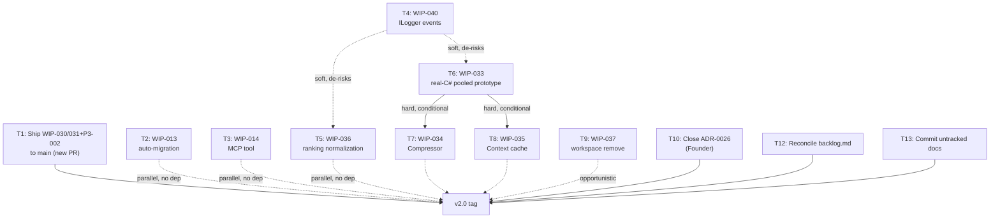

# 29 — Ferret v2 Release Master Plan

**Status:** Complete — planning only. No implementation, no architecture change, no code written.
**Purpose:** Convert every accepted finding in Documents 00–28 (plus the four ADRs, `Backlog/backlog.md`,
and `Future/Deferred-Scope.md`) into a single executable plan from today to the Ferret v2.0 release tag.
This document does not re-review, re-prioritize, or reopen anything `20`–`28` already settled — it
sequences and gates what they already decided.

**A note on scope, requested explicitly by the Founder before this document was written:** the release
brief that produced this document named nine prior reviews as "completed and accepted": Architecture
reviews, Discovery reviews, Roadmap reviews, Adversarial reviews, Execution Readiness Review, Governance
Consistency Audit, Knowledge Preservation Audit, Competitive Readiness Audit, and a Release Candidate
Risk & Assumption Validation Review. A repository-wide search (case-insensitive, exact terms and close
synonyms) found only four of the nine as actual documents:

| Named review | Repository document |
|---|---|
| Architecture reviews | `01-Architecture.md`, `18-Engineering-Analysis-Sprint-1.md` |
| Discovery reviews | `24-WIP-033-Scope-Classifier-Discovery.md` |
| Roadmap reviews | `27-Phase-3-Plus-Roadmap-Revision.md` |
| Adversarial reviews | `28-Phase-3-Plus-Roadmap-Adversarial-Review.md` |
| Execution Readiness Review | **Not found in this repository.** |
| Governance Consistency Audit | **Not found in this repository.** ADR-0025 covers a governance-reconciliation topic, but for a different, already-closed program (the earlier "Ferret V2 architecture baseline," PR #11) — not this milestone. |
| Knowledge Preservation Audit | **Not found in this repository.** |
| Competitive Readiness Audit | **Not found in this repository.** `docs/001-Product/COMPETITIVE-001.md` exists but is not a review of this milestone and is not cited here for that reason. |
| Release Candidate Risk & Assumption Validation Review | **Not found in this repository.** `28` performs the same *function* — it checks Document 27's claims against live `git`/`gh` ground truth and corrects two stale ones — and is cited below wherever that function is needed, under its own name, not the missing title. |

Per the Founder's direction: this plan uses only repository-backed evidence (`00`–`28`, the four ADRs,
the backlog, and current repository state). Where one of the five missing reviews would normally be
cited, that gap is stated plainly rather than filled with an invented document.

---

## 1. Executive Summary

The Workspace Intelligence Platform (the Founder's "Ferret v2.0") is **substantially built and partly
shipped**, not at the start of execution:

- **Phases 0–2 (Foundation, vertical slice, hardening): done and on `main`.** WIP-010–012, WIP-SLICE-1/2,
  WIP-020–023, and Stabilization Sprint 1 all merged via PR #29 and PR #31 (verified via `gh pr list`
  this session). 1,466 tests passing per `19`.
- **Phase 3 (Context Optimization prerequisites): partially on `main`, one item stranded off it.**
  P3-001 and WIP-032 are merged to `main` (PR #32). **WIP-030/031 and its P3-002 regression fix are
  not** — PR #33 merged into the *feature branch*, not `main` (confirmed live this session:
  `gh pr view 33` shows `baseRefName: feature/wip-032-registry-read-through-cache`; the P3-002 fix
  commit `d3f7335` exists only on the local `feature/wip-030-031-federated-query-cache` branch and is on
  zero remote branches). This is exactly the failure `28` documented and corrected — it still holds true
  as of this session's independent re-check.
- **WIP-033 (Scope Classifier) is discovery-only** — proven accurate and cheap in a pooled-connection
  shape, but only simulated in Python; no real C# implementation exists, and the repo has zero
  connection-pooling infrastructure for it to build on (`28` §2, §3.4).
- **WIP-034/035 have not started** and are gated on WIP-033 actually merging and showing real, not
  simulated, value.
- **Phase 4 (Usage Ledger/Analytics/Dashboard) and Phase 5 (Sharing/RBAC) are correctly deferred**, not
  started, and — per `27` §2 — should stay deferred for v2.0: no dogfooding session to date has produced
  the multi-user evidence either bundle's own deferral condition requires.
- **Two Founder governance gates remain open**, independent of the code state: ADR-0026 (workspace
  registry model) is fully specified but its own status field still reads "Proposed — finalized for
  Founder approval," and `Backlog/backlog.md`'s WIP-001 ("Close ADR-0026") is still unchecked, even
  though the design it gates has already been implemented and merged to `main`. ADR-0029 (v1 sharing
  scope) is "Proposed — requires Founder decision" and blocks only Phase 5, which is out of v2.0 scope
  regardless (see §3, §8).

**The critical path to a v2.0 tag is short and almost entirely already-built work waiting to be
correctly merged, plus a small, well-evidenced set of quick wins and one gated implementation item
(WIP-033).** Phase 4/5 are explicitly out of v2.0 scope. The single administrative item outside the code
path — closing ADR-0026 — should happen before the tag regardless of the fact that its design has
already shipped, for the same reason ADR-0025 gives: a governance decision should be recorded even when
(especially when) the work it governs proceeded ahead of it.

---

## 2. Remaining Engineering Work

| # | Task | Reason it exists | Dependency | Effort | Release criticality | Owner |
|---|---|---|---|---|---|---|
| T1 | Push commit `d3f7335`; open a new PR `feature/wip-030-031-federated-query-cache` → `main` directly (bypassing the stale intermediate branch); merge it | PR #33 landed on the wrong base branch; `main` is missing WIP-030/031 and its regression fix (`28` §3.1, re-confirmed live this session) | None — code, tests, dogfooding all already complete (`23`, `26`); confirmed conflict-free against `main` (`28` §2, `merge-tree`) | S | **Blocking — v2.0** | Engineering |
| T2 | WIP-013: auto-migration wrapper for existing single-repo `.ai/workspace.json` | Backlog quick win, never implemented (`Backlog/backlog.md`, still unchecked) | WIP-010, WIP-011 (done) | S | v2.0 | Engineering |
| T3 | WIP-014: MCP `workspace_list` tool | Backlog item, never implemented | WIP-012 (done) | S | v2.0 | Engineering |
| T4 | WIP-040: structured `ILogger` events on the federation/cache path (cache hit/miss, per-query duration, per-source skip) | `26`'s regression was found only via a dedicated dogfooding sprint because no telemetry existed on this path; `28` §3.2 rescoped this from a `Meter`/OpenTelemetry buildout (no consumer exists yet) to plain structured logging | None blocking; softly de-risks WIP-033/WIP-036 (`28` §6) | S–M (no existing pattern to extend from — `28` §3.2) | v2.0 | Engineering |
| T5 | WIP-036 *(new, proposed in `27`, unchanged by `28`)*: cross-repo BM25 ranking normalization in `FederatedKnowledgeStore.Merge` | Confirmed live quality defect at `dogfood-hub` R=26 scale: flat `OrderByDescending` over uncalibrated per-source scores favors large corpora over more-relevant small ones (`18`, `20`, `27`, re-confirmed at `FederatedKnowledgeStore.cs:93-97` by `28`) | None | M — normalization strategy (z-score/min-max/rank-based) unexplored in any doc (`28` §7) | v2.0 | Engineering |
| T6 | WIP-033: pooled-connection Scope Classifier, implemented and validated in real C# against `dogfood-hub` (R=26) before merge | `24` proved the naive shape isn't a net win at scale; `25` showed a pooled shape is, but only via Python simulation; `27`/`28` both gate real implementation on a real-C# re-validation, not simulation | Ideally after T4 (soft, not hard — `28` §6) | **High** — no connection-pooling infrastructure exists anywhere in the repo for this to reuse (`28` §2, §3.4); must be built from scratch | v2.0, conditional (see §3, §4 Gate D) | Engineering |
| T7 | WIP-034: Compressor | Strictly consumes WIP-033's output; `20` §1 calls it "low standalone value" without WIP-033 | Hard dependency: WIP-033 merged **and** its real (non-simulated) value confirmed | Unassessed — no design work started (`28` §7) | v2.1 candidate unless T6 lands early and cleanly (see §8) | Engineering |
| T8 | WIP-035: Context assembly cache | Cache key depends on WIP-033's scope-classified workspace set (`20` §1) | Same hard dependency as T7 | Unassessed | v2.1 candidate, same condition as T7 | Engineering |
| T9 | WIP-037 *(new, proposed in `27`, unchanged by `28`)*: `workspace remove`/bulk-cleanup command | Real, repeated dogfooding friction — 25+ throwaway workspace entries left permanently registered with no way to remove them (`22`, `23`, `25`) | None; mirrors existing `remove-repo`/`remove-reference` shape | S | v2.0, opportunistic — do not let it preempt T5/T6 | Engineering |
| T10 | Close ADR-0026: Founder-attributed Accept/override decision, recorded in the ADR and reflected in `Backlog/backlog.md` WIP-001 | ADR-0026's own status field still reads "Proposed"; WIP-001 is the literal Phase 0 gate and is still unchecked, despite the design already being implemented and merged (`README.md`, backlog) | None | S (decision, not engineering) | **Blocking — governance gate, v2.0** | Founder |
| T11 | Decide ADR-0029 (v1 sharing scope): Accept the four-role model or override | Still "Proposed — requires Founder decision"; gates only Phase 5 | None | S (decision) | Not required for v2.0 (blocks only Phase 5/WIP-050-052, out of v2.0 scope per §8) | Founder |
| T12 | Reconcile `Backlog/backlog.md` checkboxes for WIP-021/022/023/030/031/032 (docs `22`/`23`/`26` show them implemented; the backlog file itself still shows several unchecked) | Backlog is the project's own source of truth for status; letting it drift risks a repeat of `28`'s core lesson — trusting a status field instead of checking ground truth | None | S | v2.0 (documentation gate, §5) | Documentation |
| T13 | Commit the currently-untracked working-tree docs (`24`, `25`, `27`, `28`, this document, and `docs/archive/superpowers/plans/2026-07-05-wip-032-registry-read-through-cache.md`) to a branch and land them on `main` | These are accepted, cited-as-authoritative documents that exist only as untracked working-tree files today — the exact risk ADR-0025 flags (loss on machine failure/`git clean`, no remote backup) | None | S | v2.0 (documentation gate, §5) | Documentation |
| T14 | Update `README.md`'s decision table once ADR-0026/ADR-0029 close | Table currently shows both as open; should reflect Founder decisions once made | T10, T11 | S | v2.0 | Documentation |

**Not on this list, and intentionally so:** WIP-041–044 (Usage Ledger/Analytics/Dashboard) and
WIP-002/WIP-050–052 (Sharing/RBAC). Both bundles are correctly deferred per `27` §2 pending multi-user
dogfooding evidence that does not exist and that nothing in this plan produces — see §8 for where they
land instead.

---

## 3. Critical Path

**Blocking tasks (must complete before tag):** T1 (code), T10 (governance), T12/T13 (documentation
integrity). None of these have open design questions or unresolved dependencies — T1 is confirmed
conflict-free, T10 is a pure decision with no remaining design work (ADR-0026's own status line), T12/T13
are mechanical.

**Parallelizable work:** T2, T3, T4, T5, T9 have no dependencies on each other or on T1/T6 and can run in
any order or concurrently. T4 (telemetry) is recommended first among them only because it softly de-risks
T5 and T6 — not because anything blocks on it (`28` §6 is explicit that this is a sequencing preference,
not a hard gate).

**Conditionally blocking:** T6 gates T7/T8. This is a hard dependency (`20` §1, unchanged by `27`/`28`).
T6 itself carries the plan's only **High** implementation-risk rating (`28` §7) because it requires
building connection-pooling infrastructure that doesn't exist anywhere in the repo. If T6 is not both
merged and evidenced as a real (non-simulated) win within the v2.0 window, T7/T8 move to v2.1 — see §8.

**Merge order:** T1 first (unblocks nothing downstream but removes the one known regression-risk from
`main`; every other task should be built against a `main` that already includes it). T2/T3/T4/T5/T9 in
any order after that. T6 only after a throwaway/TDD prototype re-validates `25`'s pooled-design numbers
in real C# against `dogfood-hub` at R=26 — per `27`/`28`, this validation happens *before* merge, not
after.

**Testing order:** Full `dotnet test src/Ferret.sln --configuration Release` after every merge to `main`
(baseline: 1,466 passing per `19`, zero regressions expected). WIP-033 additionally requires its own
R=26 dogfooding re-run before merge (§4 Gate D), not just unit tests.

**Release gates:** see §4.

---

## 4. Release Gates

Each gate is a binary, checkable condition — no judgment calls at tag time.

| Gate | Condition | How to check |
|---|---|---|
| **A — Phase 3 shipped set on `main`** | `main` contains WIP-030/031 and the P3-002 fix | `git merge-base --is-ancestor d3f7335 origin/main` (or the equivalent commit after T1's new PR) exits 0 |
| **B — Implementation complete** | T1–T5, T9 merged to `main`; T6 either merged or explicitly deferred (no "in progress" state at tag time) | Each corresponding WIP ticket checked off in `Backlog/backlog.md` (post-T12) |
| **C — Tests passing** | `dotnet test src/Ferret.sln --configuration Release` — 0 failed, 0 regressions vs. the 1,466-test baseline (`19`) | CI run on the release commit |
| **D — CI green** | `.github/workflows/ci.yml` passes on the exact commit being tagged | GitHub Actions run status |
| **E — WIP-033 real-value gate resolved, either direction** | Either (a) a real-C# pooled prototype re-validates `25`'s numbers at R=26 scale and merges, or (b) it is explicitly deferred to v2.1 in `Backlog/backlog.md` — not left ambiguous | Prototype benchmark output (if a) or an explicit backlog entry (if b) |
| **F — Governance gates closed** | ADR-0026 status = Accepted, with a Founder-attributed decision recorded; `Backlog/backlog.md` WIP-001 checked | ADR-0026 file's status field; backlog checkbox |
| **G — Documentation synchronized** | T12, T13, T14 complete | `git log` shows the untracked docs committed; backlog checkboxes match shipped state; README decision table current |
| **H — Dogfooding complete** | One final dogfooding pass on the exact `main` state slated for tag, at ≥R=26 scale, with zero new Critical/High findings | Session log, same format as `17`/`25` |
| **I — Release notes drafted** | CHANGELOG/release notes entry exists summarizing what v2.0 ships | File present in the release PR |

**v2.0 does not require:** ADR-0029 closure (blocks only Phase 5, out of scope — §8), or any Phase 4/5
evidence (Usage Ledger, Analytics, Dashboard, Sharing/RBAC) — none of it is in this release.

---

## 5. Validation Plan

**Mandatory before v2.0 (Gate H, and folded into Gate E):**

1. **Re-run `28`'s ground-truth method immediately before tagging**, not just once at plan-writing time.
   `28`'s core lesson is that `gh pr list`'s `MERGED` status alone is not sufficient evidence of *where*
   something merged — re-check `gh pr view --json baseRefName,mergeCommit` and
   `git merge-base --is-ancestor` for every task in §2 right before cutting the tag, not only for T1.
2. **If T6 (WIP-033) ships, re-validate its real-C# benchmark against `dogfood-hub` at R=26** — not the
   Python simulation from `24`, and not the R=1–2 scale that every session before `25` used. This is the
   explicit, unresolved condition `27`/`28` both impose and neither considers optional.
3. **One final dogfooding smoke pass** (Gate H) on the release candidate commit, at ≥R=26 scale, covering
   at minimum: a federated query spanning 2+ workspaces, a cache hit/miss cycle on the corrected
   WIP-030/031 path, and (if shipped) WIP-033/036/037's user-facing surface.

**Recommended before v2.1 (not a v2.0 blocker):**

4. **A genuine multi-user dogfooding session.** Every deferral of Phase 4/5 (`27` §2, `Deferred-Scope.md`)
   cites the absence of multi-user evidence as the reason. Nothing in this plan produces that evidence —
   it requires an actual second user, which is outside engineering's control to schedule. Flagging it
   here as the single precondition that would change Phase 4/5's status is the correct release-planning
   action; running it is not.
5. **Confirm WIP-034/035's "real value" empirically** once WIP-033 has shipped and accumulated real
   (non-simulated) usage, before starting either.

**Post-release monitoring:**

6. **Watch T4's structured `ILogger` events** (cache hit/miss ratio, per-query duration, per-source skip)
   in real usage after v2.0 ships. Their entire purpose, per `28` §3.2, is to make a repeat of `26`'s
   regression (a cache hit slower than a miss) visible from normal usage instead of requiring a
   dedicated multi-session dogfooding sprint to discover — that only pays off if someone actually looks
   at them post-release.

---

## 6. Documentation Tasks

| Task | File(s) | Trigger |
|---|---|---|
| Reconcile backlog checkboxes (T12) | `Backlog/backlog.md` | Before tag — Gate G |
| Commit untracked accepted docs (T13) | `24`, `25`, `27`, `28`, this document (`29`), `docs/archive/superpowers/plans/2026-07-05-wip-032-registry-read-through-cache.md` | Before tag — Gate G |
| Update decision table (T14) | `README.md` §"Every Open Decision, In One Place" | After T10 (and T11, if decided) |
| Record ADR-0026 Founder decision | `ADR/0026-workspace-registry-model.md` status field | At T10 |
| Record ADR-0029 Founder decision, if made | `ADR/0029-v1-sharing-permission-scope.md` status field | At T11, optional for v2.0 |
| Release notes / CHANGELOG entry for v2.0 | Repository release-notes location (pattern: `release/v0.16.0-prep`-style PR used for the last tag) | Gate I, immediately before tagging |
| Note WIP-033 disposition (shipped or deferred) | `Backlog/backlog.md` | At Gate E, whichever branch is taken |

No README/architecture-doc rewrites are needed beyond the decision-table row updates — `01`–`14`'s
design content is unaffected by anything in this plan (per the Founder's constraint against
re-architecting).

---

## 7. Release Checklist

Executable without reading any prior document.

1. [ ] **Push `d3f7335`** on `feature/wip-030-031-federated-query-cache`.
2. [ ] **Open a new PR**: `feature/wip-030-031-federated-query-cache` → `main` (do **not** re-target the
   stale `feature/wip-032-registry-read-through-cache` branch). Confirm `git merge-tree` shows no
   conflicts before opening.
3. [ ] **Merge that PR.** This is T1 / Gate A.
4. [ ] Implement and merge T2 (WIP-013), T3 (WIP-014) — each independently, each with its own passing
   test run.
5. [ ] Implement and merge T4 (WIP-040, structured `ILogger` events only — no `Meter`/OpenTelemetry
   buildout).
6. [ ] Implement and merge T5 (WIP-036, ranking normalization) — pick a normalization strategy
   (z-score, min-max, or rank-based; none is pre-selected by any prior doc) and regression-test against
   `FederatedKnowledgeStore.Merge`'s existing test suite.
7. [ ] Implement and merge T9 (WIP-037, `workspace remove`) — opportunistically, not blocking anything
   else.
8. [ ] **Build the WIP-033 real-C# pooled prototype** as a throwaway/TDD spike; re-run `25`'s R=26
   `dogfood-hub` benchmark against it.
   - If it confirms a real win at that scale: merge it (T6), then start T7/T8 (WIP-034/035).
   - If it does not, or if it isn't ready in time: mark WIP-033 (and therefore WIP-034/035) explicitly
     deferred to v2.1 in `Backlog/backlog.md`. Either outcome satisfies Gate E — an unresolved "still
     investigating" state does not.
9. [ ] **Get the Founder's ADR-0026 decision** (T10): Accept the identity-based local registry as
   specified, or override. Record it in the ADR and check off `Backlog/backlog.md` WIP-001.
10. [ ] (Optional for v2.0) Get the Founder's ADR-0029 decision (T11) if there is appetite to also close
    out the Phase 5 gate now — not required to tag v2.0.
11. [ ] **Reconcile `Backlog/backlog.md`** checkboxes against actual shipped state (T12).
12. [ ] **Commit and land the currently-untracked docs** (`24`, `25`, `27`, `28`, `29`, and the WIP-032
    plan doc) on `main` (T13).
13. [ ] **Update `README.md`'s decision table** to reflect closed ADRs (T14).
14. [ ] **Run the full test suite** on the final `main` commit: `dotnet test src/Ferret.sln
    --configuration Release`. Confirm 0 failed, no regression against the 1,466-test baseline. (Gate C)
15. [ ] **Confirm CI is green** on that exact commit (`.github/workflows/ci.yml`). (Gate D)
16. [ ] **Re-run `28`'s ground-truth check** on the final state: for every merged PR in this checklist,
    confirm via `gh pr view --json baseRefName,mergeCommit` that it landed where intended, and via
    `git merge-base --is-ancestor` that every commit this plan depends on is actually an ancestor of the
    commit being tagged. (Validation Plan §5.1)
17. [ ] **Run one final dogfooding smoke pass** at ≥R=26 scale against the release candidate commit.
    (Gate H)
18. [ ] **Write the release notes / CHANGELOG entry** for v2.0. (Gate I)
19. [ ] **Tag the release** (`v2.0.0`, following the existing tag pattern — `v0.16.0`, `v0.15.0`, etc.)
    and run whatever the existing `release.yml`/`npm-publish.yml` workflows do for a tagged release, same
    as the last tagged release.
20. [ ] **Ship.**

---

## 8. Post-Release Roadmap

Only items already present in `Backlog/backlog.md` or `Future/Deferred-Scope.md`. No new items.

### v2.0 — must ship

- T1: WIP-030/031 + P3-002 fix landed on `main`
- T2: WIP-013 (auto-migration wrapper)
- T3: WIP-014 (MCP `workspace_list`)
- T4: WIP-040, rescoped (structured `ILogger` events)
- T5: WIP-036 (cross-repo ranking normalization)
- T9: WIP-037 (`workspace remove`/bulk cleanup)
- T10: ADR-0026 Founder decision, recorded
- T12/T13/T14: documentation reconciliation
- T6 (WIP-033): included **only if** its real-C# prototype validates at R=26 before the tag; otherwise
  moves to v2.1 per Gate E's explicit either/or

### v2.1 — should ship next

- WIP-033 (Scope Classifier), if not already shipped in v2.0
- WIP-034 (Compressor) and WIP-035 (Context assembly cache), once WIP-033 has merged and shown real
  (non-simulated) value
- Cross-reference conflict resolution (automatic) — `03` §4, explicitly "not resolved automatically in
  v1," listed in `Deferred-Scope.md`
- ADR-0029 Founder decision, if not already made in v2.0 (does not block v2.0, but should not be left
  indefinitely open either)
- WIP-041–044 (Usage Ledger, retention default, analytics rollups, dashboard CLI) — **only if** real
  multi-user usage evidence has materialized by then; otherwise this bundle moves to v3 unchanged, per
  `27` §2's own deferral condition, which this plan does not alter

### v3 — strategic future

All items already named in `Future/Deferred-Scope.md`, unchanged:

- Full five-role sharing model (adds the AI Agent role) + invitation flows beyond direct user-ID grants
  + audit history — WIP-050/051/052 and successors, gated on ADR-0029 **and** real multi-user/org demand
- Organization-level / cross-org sharing
- Cost/billing infrastructure (dollar-based reporting), gated on FUTURE-002 Q2
- Ferret Hub / cloud sync
- Enterprise scale beyond current targets (100K repos/workspaces)
- Semantic/vector retrieval layer for the Context Optimization Engine (`05`, explicitly deferred to
  FUTURE-002 §22, "keyword-first, semantic second")

---

## 9. Final Go/No-Go Criteria

**Go** requires all of Gates A–G and I from §4, plus Gate H's dogfooding pass showing zero new
Critical/High findings. Gate E must be resolved in *either* direction (WIP-033 shipped-and-validated, or
explicitly deferred) — it cannot be left ambiguous at tag time.

**No-Go** if any of the following hold at the planned tag time:

- `main` still lacks WIP-030/031 or the P3-002 fix (Gate A unmet) — this is the one regression this
  entire plan exists to prevent shipping silently, per `28`'s finding.
- Any test regression against the 1,466-test baseline, or CI red on the release commit (Gates C/D).
- WIP-033 is merged but its real-C# benchmark was never re-validated at R=26 scale (Gate E's condition
  (a) requires the validation, not just the merge).
- ADR-0026 is still "Proposed" with `Backlog/backlog.md` WIP-001 unchecked (Gate F) — the code may
  already be shipped, but tagging a release without ever closing the gate its own backlog says gates
  Phase 1 repeats exactly the pattern ADR-0025 was written to prevent.
- The final `28`-style ground-truth re-check (Checklist step 16) surfaces another "merged into the wrong
  branch" or equivalent discrepancy that hasn't been corrected.

**Explicitly not a No-Go condition:** absence of Phase 4 (Usage Ledger/Analytics/Dashboard) or Phase 5
(Sharing/RBAC). Both are correctly out of v2.0 scope per `27` §2, and no review accepted by this
milestone has ever made either a v2.0 requirement.
