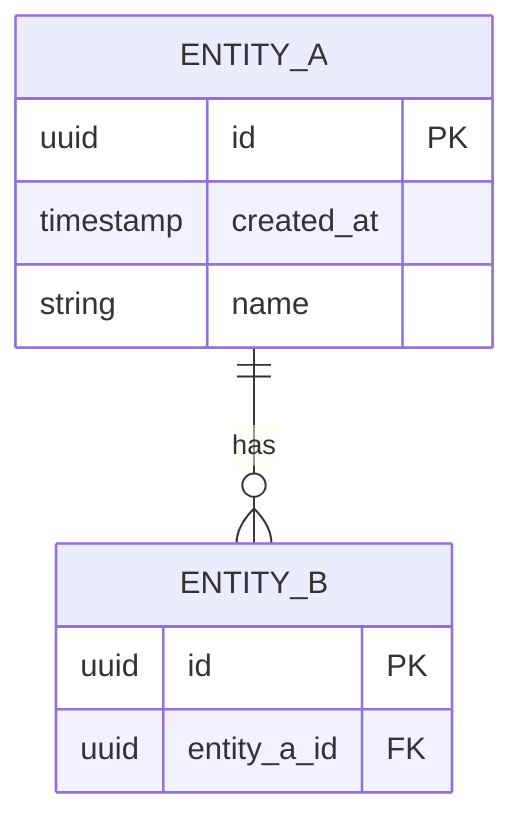

# Database Schema — [Schema / Domain Name]

| Field | Value |
|---|---|
| **Status** | Draft \| Review \| Accepted |
| **Version** | 0.1 |
| **Database** | PostgreSQL \| SQLite \| … |
| **Schema** | `public` |
| **Author** | [name] |
| **Date** | YYYY-MM-DD |

---

## Overview

<!--
What data does this schema store, and which domain does it own?
-->

## Entity-Relationship Diagram



---

## Tables

### `table_name`

**Purpose:** [one sentence]

| Column | Type | Nullable | Default | Description |
|---|---|---|---|---|
| `id` | `uuid` | No | `gen_random_uuid()` | Primary key |
| `created_at` | `timestamptz` | No | `now()` | Row creation timestamp |
| `updated_at` | `timestamptz` | No | `now()` | Last update timestamp |

**Indexes**

| Name | Columns | Type | Purpose |
|---|---|---|---|
| `pk_table_name` | `id` | Primary | PK |

**Foreign Keys**

| Column | References | On Delete |
|---|---|---|
| | | |

---

## Migrations

Migrations are managed by EF Core / Flyway / Liquibase (TBD — see ADR-XXXX).

```sql
-- Migration: YYYYMMDD_001_create_table_name.sql
CREATE TABLE table_name (
    id          UUID PRIMARY KEY DEFAULT gen_random_uuid(),
    created_at  TIMESTAMPTZ NOT NULL DEFAULT now(),
    updated_at  TIMESTAMPTZ NOT NULL DEFAULT now()
);
```

---

## Data Retention

| Table | Retention | Policy |
|---|---|---|
| | | |

---

_Template version: 1.0 — stored in `/templates/database.md`_
